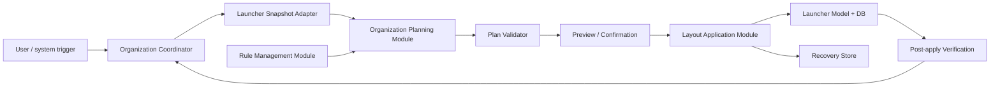
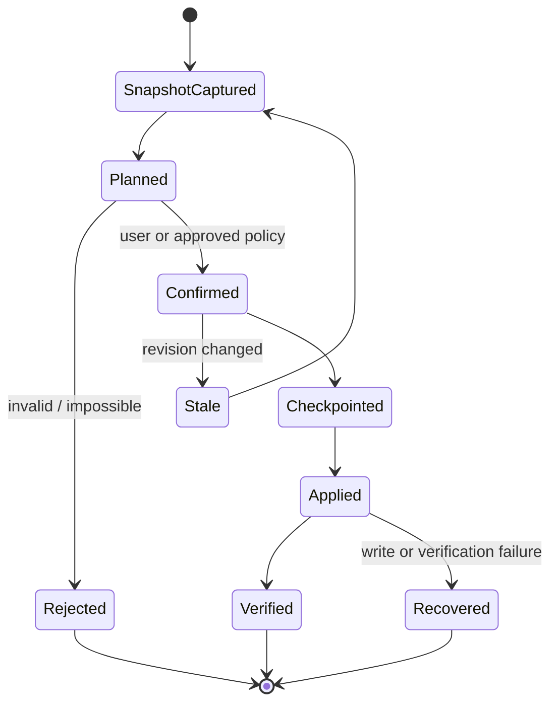

# NunuLauncher System Design

> Status: Proposed
> Updated: 2026-08-14
> Scope: 目標設計。baselineは `v15.0.0-beta3.0` のcommit `505dbc40e6154c05158b5d0271c45f6a885a411b` に固定済み。Deck layoutは[ADR-0002](./docs/adr/0002-replace-deck-layout.md)でreplaceを採用した。正確なplatform seamは関連Issueで確定する。

## 1. Design goals

- ユーザーのホームレイアウトを失わないことを、配置品質より優先する。
- 同じsnapshotと整理ルールから同じplanを生成する。
- 計算とDB更新を分離し、Android frameworkなしで主要な振る舞いを検証できるようにする。
- Lawnchair/Launcher3への変更点を少数のseamへ局所化する。
- 通常runはオフラインで完結し、分類理由と配置理由を説明できるようにする。

## 2. Current facts and assumptions

### Confirmed against Lawnchair 15 Beta 3 source

- 2026-08-09時点で `15-beta` とtag `v15.0.0-beta3.0` はcommit `505dbc40e6154c05158b5d0271c45f6a885a411b` を指す。
- `app.lawnchair.deck.LawndeckManager` と `AddFoldersWithItemsTask` が既に存在し、全アプリのfolder分類、layout切替時のDB複製、新規アプリのfolder追加を行う。
- package追加は `ModelLauncherCallbacks.onPackageAdded` から `PackageUpdatedTask(OP_ADD)` へ渡る。初期案の `PackageInstalledTask` というhook pointは15系に存在しない。
- Lawnchairの手動バックアップはXMLではない。DB・設定・Protobuf metadata等を含むZIPである。
- NunuLauncherは [Lawnchairのfork](https://github.com/nunu1733/NunuLauncher) であり、`main` のproduct baselineは `v15.0.0-beta3.0` のcommit `505dbc40e6154c05158b5d0271c45f6a885a411b` である。

### Design gate status

設計gateとその正本の対応は [§11 のDesign gates表](#11-design-gates) を参照する。承認状態は各正本の記載に従い、本書では管理しない。研究提案は `docs/product/` 、ADRと `specs/` 、未起票提案は [docs/project/seed-backlog.md](./docs/project/seed-backlog.md) を正本とする。未承認の判断を実装で固定しない。

## 3. System context



## 4. Modules and interfaces

### 4.1 Organization Planning module

このmoduleがプロジェクトの中心となる深いmoduleである。外部interfaceは1つに保ち、Kotlinのfunctional interfaceとして契約とconcrete implementationを分離する。

```kotlin
fun interface OrganizationPlanner {
    fun plan(input: OrganizationInput): PlanningResult
}
```

`OrganizationInput` はlayout snapshot、device capabilities、整理ルール、分類と頻度のsignal、run modeを含む。`PlanningResult` はplan、理由、警告、適用不能理由を返す。interfaceへAndroid class、SQLite row、UI stateを露出しない。

実装の内側に次を隠す。

- category assignmentの優先順位とfallback
- locked placementと占有領域のconstraint解決
- page、region、cell、folder、Dockの割当
- overflowと未配置アイテムの処理
- 決定性を保つtie-break
- planの自己検証と説明情報生成

入力不足や制約違反を勝手に補正せず、diagnosticとして返す。計画module自体はI/Oを行わない。

### 4.2 Layout Application module

検証済みplanを現在layoutへ適用する深いmoduleである。

```text
apply(ValidatedLayoutPlan) -> ApplyResult
recover(RecoveryRequest) -> RecoveryResult
```

このmoduleの実装は、revision再確認、recovery point作成、transactional write、memory model/UI bind、適用後検証を隠す。Launcher DBはlocal-substitutable dependencyとして扱い、production adapterとtest databaseで同じinterfaceを検証する。

### 4.3 Rule Management module

version付き整理ルールの読込、validation、migration、exportを担当する。ファイル構文はこのmoduleのimplementation detailとし、計画moduleはtyped modelだけを受け取る。XML、JSONなどの選定はIssueで決める。

### 4.4 Launcher Integration

Lawnchair/Launcher3のeventとmodelをproject固有moduleへ接続するadapter群である。

- snapshot adapter: platform modelをdomain snapshotへ変換する。
- package event adapter: package追加とupdateを区別し、user/profileを保持する。
- model write adapter: validated planをLauncher model threadとDB transactionへ渡す。
- UI adapter: 手動run、onboarding、確認、結果、復旧を表示する。

15系の調査対象は、既存 `app.lawnchair.deck`、`ModelLauncherCallbacks`、`PackageUpdatedTask`、`ModelWriter`、`ModelDbController`、backup/restore実装である。既存Deck layoutと競合する二重hookは作らない。

## 5. Core invariants

planと適用結果は以下を常に満たす。

1. **Conservation**: 入力の各配置アイテムは保持、移動、明示的削除のいずれか1つに対応する。
2. **No overlap**: 同じcontainer内で占有セルが重ならない。
3. **In bounds**: placementとspanが対象device profileに収まる。
4. **Referential integrity**: folder等のcontainer参照先が存在し、循環しない。
5. **Lock preservation**: locked placementとその占有領域を変更しない。
6. **Profile isolation**: personal/work/private等のprofile identityを混同しない。
7. **Determinism**: 同じ入力からbyte-equivalentなcanonical planを得る。
8. **Idempotence**: plan適用後に同じ全体整理を行っても変更planを生成しない。
9. **Convergence**: 増分配置後の状態は、同じruleによる次回全体整理と不必要に振動しない。
10. **Atomicity**: 適用は全成功または変更なしとなる。
11. **Recoverability**: 成功した適用も、保持期間内は直前のrecovery pointへ戻せる。

## 6. Organization run



自動triggerであってもこの状態遷移を短絡しない。全体整理を無確認で行えるか、新規アプリだけを自動適用するかは別々のpolicyとして [docs/product/organization-run-ux.md](./docs/product/organization-run-ux.md) が提案し [Issue #4](https://github.com/nunu1733/NunuLauncher/issues/4) が追跡する。適用と復旧の契約は [spec 13](./specs/13-safe-layout-application/spec.md) が正本である。増分配置は [Issue #55](https://github.com/nunu1733/NunuLauncher/issues/55) で追跡する。

## 7. Data ownership and persistence

- Launcher DBが現在のホームレイアウトの正本である。
- 整理ルール、category override、recovery metadataにはownershipとmigration方針を別途定義する。
- lock stateは各Launcher layout DBの`favorites`行が専用のtri-state columnで所有する。transaction、backup/restore、schema migration、grid migration、未知状態のfail-closed規則は[ADR-0004](./docs/adr/0004-organizer-lock-persistence.md)を正本とする。
- planはrevisionを持つ一時artifactであり、古いsnapshotへ適用できない。
- recovery pointは一般的なexport backupと分け、アプリ内で原子的に復旧できる。storageは[ADR-0003](./docs/adr/0003-organizer-recovery-point-storage.md)で決定済みである。

## 8. Error model

少なくとも次を区別し、ユーザー向けmessageと診断情報を持たせる。

- invalid rules
- insufficient capacity
- unsupported item or profile
- stale snapshot
- checkpoint failure
- transactional write failure
- post-apply invariant failure
- permission or signal unavailable

signalがないことは原則として失敗ではない。頻度情報がない場合のdeterministic fallbackを整理ルールに明記する。

## 9. Target source layout

[ADR-0002](./docs/adr/0002-replace-deck-layout.md)に従い、Deck layoutと並行する新規runtime hookは追加せず、organizerを次の論理構成で新設する。既存Deck runtimeの退役とpreference移行は [Issue #56](https://github.com/nunu1733/NunuLauncher/issues/56) / [Issue #57](https://github.com/nunu1733/NunuLauncher/issues/57) で追跡する。

```text
lawnchair/src/app/lawnchair/organizer/
├── planning/       # pure domain model and planning implementation
├── application/    # validated plan application and recovery
├── rules/          # typed rules, validation, migration and file I/O
├── integration/    # Lawnchair/Launcher3 adapters and triggers
└── ui/             # preview, confirmation, result and recovery UI
```

package数をこの図に合わせること自体を目的にしない。interfaceを深く保ち、変更のlocalityが高まる分割だけを採用する。platform source側には最小のbridgeを置く。テスト配置は上流のconvention確認後に決める。

## 10. Verification architecture

- Planning contract tests: fixture corpusでplanとdiagnosticを検証する。
- Property tests: overlap、bounds、conservation、lock、determinism、idempotenceを多数の生成layoutで検証する。
- Application contract tests: test DBでtransaction、failure injection、rollback、stale revisionを検証する。
- Upstream integration tests: package event、model reload、backup/restore、grid migration、process restartを検証する。
- UI tests: preview/confirmation/recoveryとaccessibilityを検証する。

詳細は [docs/engineering/quality-strategy.md](./docs/engineering/quality-strategy.md) を参照する。

## 11. Design gates

設計gateとその正本の対応は次の表の通りである。承認状態は各正本の記載に従い、本書では管理しない。

| Gate | Source of truth |
|---|---|
| 1. 対象集合と既存itemの保持規則 | planner契約の対象membership、保持優先、disposition: [spec 10](./specs/10-pure-organization-planning/spec.md)、[spec 12](./specs/12-deterministic-full-layout-planner-v1/spec.md)。platform capture policyの提案: [Issue #3](https://github.com/nunu1733/NunuLauncher/issues/3) / [item-preservation-policy](./docs/product/item-preservation-policy.md) |
| 2. trigger、確認、recoveryのUX | 適用と復旧の契約: [spec 13](./specs/13-safe-layout-application/spec.md)、[ADR-0003](./docs/adr/0003-organizer-recovery-point-storage.md)。triggerと確認のUX提案: [Issue #4](https://github.com/nunu1733/NunuLauncher/issues/4) / [organization-run-ux](./docs/product/organization-run-ux.md) |
| 3. lock対象とfolder内への伝播 | [ADR-0004](./docs/adr/0004-organizer-lock-persistence.md) / [Issue #23](https://github.com/nunu1733/NunuLauncher/issues/23) |
| 4. grid非依存の配置policy v1 | [spec 12](./specs/12-deterministic-full-layout-planner-v1/spec.md) (元提案: [Issue #5](https://github.com/nunu1733/NunuLauncher/issues/5) / [layout-strategy-v1](./docs/product/layout-strategy-v1.md)) |
| 5. category taxonomyと分類source | planner側のtaxonomy契約、signal source、category resolution: [spec 10](./specs/10-pure-organization-planning/spec.md)、[spec 12](./specs/12-deterministic-full-layout-planner-v1/spec.md)。adapter側の分類source提案: [Issue #6](https://github.com/nunu1733/NunuLauncher/issues/6) / [category-taxonomy-v1](./docs/product/category-taxonomy-v1.md) |
| 6. 整理ルールのfile formatとversioning | 正本なし (D-009)。未起票proposalは [docs/project/seed-backlog.md](./docs/project/seed-backlog.md) を参照 |

正本が存在しない、または正本が提案どまりの判断を実装で固定しない。gateの変更は、正本となるADR/spec/Issue側から行う。
