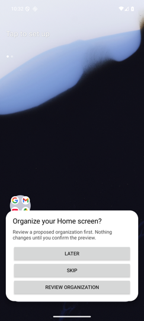
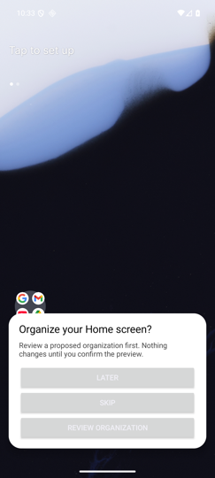
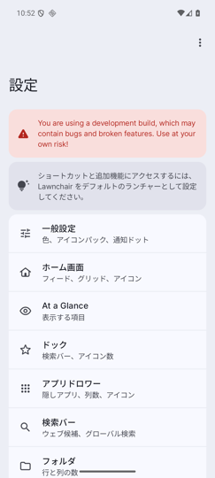
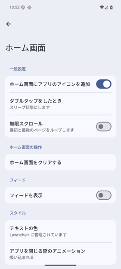
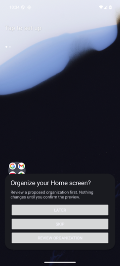

# Issue #123 organizer UI convergence — surface mapping and visual evidence

> Status: Executed（2026-08-26〜27にmapping・capture・CI検証完了。画像は本docと同一dir配下でreview可能）
> Recorded: 2026-08-27
> Spec: [specs/123-organizer-ui-convergence/spec.md](../../../specs/123-organizer-ui-convergence/spec.md)（AC-1〜AC-9のevidence正本）
> Baseline for comparison: `505dbc40e6154c05158b5d0271c45f6a885a411b` (Lawnchair `v15.0.0-beta3.0`)
> After-captures: PR headのAPK（`4f98120` + popup token微修正、`8104ce2` tree相当）
> Before-captures: `5b9ad9fa`（実装開始直前commit）からbuildしたdebug APK
> Capture runtime: 専用AVD `issue142_api36`（`emulator-5654`, Android 16 / API 36, 1080x2400 @ 420dpi,
> portrait, cold boot）。並行作業セッションの `nunu_qpr2_api36_1` インスタンスとは分離した。
> Locale: per-app locale（`cmd locale set-app-locales`、install後設定が必須）。
> appearance: `cmd uimode night yes/no`。font scale: `settings put system font_scale 2.0`。
> onboarding popupはuninstall→install毎にfresh install provenanceで表示させた。
> 画像は540px幅へ縮小して保存（元解像度1080x2400のcaptureを同梱）。

## AC-1 — Surface → Lawnchair reference mapping

| # | Nunu surface | 主要file | 参照したLawnchair/Launcher3 pattern | 判定と根拠 |
|---|---|---|---|---|
| 1 | Onboarding proposal popup | `lawnchair/src/app/lawnchair/organizer/ui/OrganizationOnboardingProposal.kt` | Activity theme解決（`Theme.Lawnchair` → AppCompat DayNight、`values-night` の `android:colorBackground`）、`Themes.getAttrColor`、`R.dimen.default_dialog_corner_radius`、`R.dimen.deep_shortcuts_elevation`（ArrowPopupと同一token）、M3 `titleLarge`(22sp)=全settings画面のTopAppBar title | **収束実施**。`Color.WHITE/BLACK/DKGRAY`・独自24dp角丸・elevation 8dp・title 20spを除去し、theme色＋dialog角丸token＋popup elevation token＋titleLarge相当へ置換。View hostingと #137 focus/touch-mode semanticsは不変。残存値の正当化は下記「残存presentation」表 |
| 2 | Manual organization画面 | `ui/preferences/destinations/ManualOrganizationPreferences.kt` | `PreferenceScaffold` + `PreferenceLazyColumn` + `ClickablePreference`（既存使用）、placement lock画面と同一のbodyMedium+16dp情報テキスト | **収束実施**。explainer・status・summary・safe terminalをbodyMedium+padding へ統一。liveRegion/focus semantics、state machine呼び出しは不変 |
| 3 | Placement lock管理/review画面 | `ui/preferences/destinations/PlacementLockPreferences.kt` | `PreferenceTemplate.endWidget` のtext widget慣習、M3 `AlertDialog`（上流 `PermissionDialog` 等と同構成） | **収束実施**。row description・StateBadge読み上げをformat resource化。badgeのlabelMedium text表現は #38の「state is always shown as text, never color alone」要件により維持 |
| 4 | Placement lock popup entry | `ui/popup/OrganizerLockShortcut.kt` | Launcher3 `SystemShortcut` + platform `AlertDialog.Builder`（上流 `LawnchairShortcut.kt` と同一pattern） | **変更不要**。上流launcher conventionに既に整合。全文言resource由来 |
| 5 | Category override authoring | `ui/preferences/destinations/CategoryOverridePreferences.kt` | 上流app list行 `AppItem.kt`（icon 30dp / verticalPadding 12dp = 本surfaceと同一値） | **収束実施**。description・contentDescriptionをformat resource化。サイズはAppItem convention一致につき維持 |
| 6 | Organizer diagnostics/export画面 | `OrganizerDiagnosticsPreferences.kt`, `organizer/diagnostics/export/ExportUi.kt` | 兄弟organizer画面のbodyMedium+16dp情報テキスト、`ClickablePreference`、#67契約 | **収束実施**。SAF既定file名を `translatable="false"` resource化。export control/SAF flowは #67のまま不変 |
| 7 | HomeScreen設定entries ×4 | `HomeScreenPreferences.kt` | 上流 `NavigationActionPreference` | **変更不要**。上流componentのみ |

### 残存presentationと目的（AC-2）

| 残存値/表現 | 参照 | 理由 |
|---|---|---|
| popup padding `20/16dp`、summary `8/12dp`、margin `32/16dp` | View worldに等価token不存在（`popup_margin`=2dpはArrowPopup子要素用で別role） | M3 bottom-sheet類のpadding構造に対応。View用tokenがLawnchair/Launcher3に存在しないため値を保持し、ここに目的付きで記録 |
| action button = theme `Button` + `MATCH_PARENT`縦積み | `?android:attr/buttonStyle`（AppCompat DayNight theme解決） | View worldにおけるtheme整合button規約。dialog/bottom-sheetの縦積みaction配置に対応 |
| onboarding popupがView実装（非Compose） | `AbstractFloatingView` hosting | #137で確定したfocus/touch-mode traversalがView実装に紐づく。behavior非変更のため移植しない |
| lock状態をtext badgeで表示 | #38要件 | color-only禁止のため |
| lock dialog bodyの完成文改行連結 | `LockChangeDialog` / `OrganizerLockShortcut` | 各部品が独立した完全文であり文法の跨りがない（文の並置）。AC-4の「文構造をKotlinで生成しない」対象外 |

## Before / reference / after（AC-8必須セット、onboarding popup）

実装前（`5b9ad9fa`）→ Lawnchair参照（周辺UI）→ 実装後（本PR）:

| | 画像 |
|---|---|
| **Before (en light)** |  |
| **Before (en dark) — 欠陥: 白背景固定** |  |
| **Lawnchair参照: dashboard (ja light)** |  |
| **Lawnchair参照: home settings (ja light)** |  |
| **After (en light)** |  |
| **After (en dark) — theme追従** |  |

Before(en dark)の白背景・実装後のdark追従がAC-3の直接証拠である。reference 2枚は同一テーマ解決（`?android:colorBackground`）に基づく周辺Lawnchair UIであり、after popupが同一の背景色系・dialog角丸に揃っていることを示す。

## AC-8 — Capture matrix（実行結果）

font scale 200%は既存回帰testと同一条件。セルは画像へのlink（`after/`）、`(auto)`は既存automated testで担保することを示す。

| Surface | en light | en dark | ja light | ja dark | en-XA | 200% (ja) |
|---|---|---|---|---|---|---|
| Onboarding popup | [light](issue-123/after/onboarding-en-light.png) | [dark](issue-123/after/onboarding-en-dark.png) | [light](issue-123/after/onboarding-ja-light.png) | [dark](issue-123/after/onboarding-ja-dark.png) | [en-XA](issue-123/after/onboarding-enxa-light.png) | [200%](issue-123/after/onboarding-ja-light-200pct.png) |
| Manual org idle | [light](issue-123/after/manual-org-idle-en-light.png) | [dark](issue-123/after/manual-org-idle-en-dark.png) | [light](issue-123/after/manual-org-idle-ja-light.png) | [dark](issue-123/after/manual-org-idle-ja-dark.png) | [en-XA](issue-123/after/manual-org-idle-enxa-light.png) | [200%](issue-123/after/manual-org-idle-ja-200pct.png) |
| Manual org preview | [light](issue-123/after/manual-org-preview-en-light.png) | (auto)¹ | − | − | [en-XA preview+cancel](issue-123/after/manual-org-preview-enxa-light.png) | [200% preview](issue-123/after/manual-org-preview-ja-200pct.png) |
| Manual org preview cancel後 | − | − | − | − | [after cancel](issue-123/after/manual-org-after-cancel-enxa-light.png) | − |
| Applied/recovery² | − | − | − | − | − | [recovery-failed terminal](issue-123/after/manual-org-terminal-recoveryfailed-ja-200pct.png) |
| Placement lock管理 | [light](issue-123/after/placement-locks-en-light.png) | − | [light](issue-123/after/placement-locks-ja-light.png) | − | − | − |
| Category override | [light](issue-123/after/category-overrides-en-light.png) | − | [light](issue-123/after/category-overrides-ja-light.png) | − | − | − |
| Diagnostics/export | [light](issue-123/after/diagnostics-en-light.png) | − | [light](issue-123/after/diagnostics-ja-light.png) | − | − | − |

1. en dark previewはautomated testが担保: `ManualOrganizationPreferencesInstrumentationTest.previewRemainsReadableAtTwoHundredPercentFontScale` / `previewRendersScopeReasonWarningAndNoWriteBeforeConfirmation`（CI `organizer-instrumentation-issue52-tests` lane, run 32973322535でgreen）。
2. **recoveryのvisual evidenceについて**: 本AVD（AOSP image）では適用が `RecoveryFailed` terminal（「自動復旧を検証できませんでした」）で終了し、成功適用後のrecovery previewを表示できなかった。これは #104期に記録されたAOSP emulator imageでのmodel検証制約と同型であり、本PRが変更していない適用/recovery pathの環境依存である。生産equivalentのrecovery flow（capture→apply→verification→recovery）はCI lane `organizer-instrumentation-issue52-tests` の `ManualOrganizationProductionE2EInstrumentationTest.manualRunUsesProductionCaptureApplyVerificationAndRecovery` が毎回実行・greenであり、recovery preview state機械はJVM `RecoveryPreviewContractTest` が担保する。terminal state（recovery失敗時のsafety messaging + diagnostics導線）の200%表示は上記captureのとおり。

### 観察結果

- **AC-3 (light/dark)**: popup背景・文字が `?android:colorBackground`/textPrimary/textSecondary解決で正しく追従（before dark欠陥がafter darkで解消）。
- **AC-6 (ja fallbackなし)**: ja列の全captureでorganizer文言が日本語resource由来。format resource合成文（「ホーム画面 1」「個人用 · 自動カテゴリを使用中」等）も日本語で正しく描画。
- **AC-7 (en-XA)**: popup・idle・preview・cancel後の全captureで全organizer文言がpseudo展開（素通しraw文字列なし）。拡張後もApply/Cancel等のcritical actionがviewport内で到達可能（preview capture参照）。
- **200% font scale (ja)**: popupの全buttonがviewport内（UI dumpでbounds確認）。previewはスクロール1回で「確認した整理を適用」「キャンセル」が到達可能。

### 取得手順（再現用）

1. `emulator -avd issue142_api36 -port 5654 -no-window -no-snapshot`（API 36, 420dpi）
2. `adb install -r <debug.apk>`（popup evidenceはuninstall→installでfresh provenance）
3. locale: **install後に** `adb shell cmd locale set-app-locales app.lawnchair.debug --locales ja`（en-XA/en）。install前に設定すると消える
4. appearance: `adb shell cmd uimode night yes|no`（app再起動後に反映）
5. font scale: `adb shell settings put system font_scale 2.0`
6. popup: launcher起動→15s待機。設定画面: `am start -n app.lawnchair.debug/app.lawnchair.ui.preferences.PreferenceActivity` →「ホーム画面」→ Layout group
7. capture: `adb exec-out screencap -p`、UI確認: `uiautomator dump`

## Localization coverage check（AC-5 oracle実行結果）

- 検証集合 `required = active/user-visible/translatableなNunu organizer default resource`:
  - baseline差分: `lawnchair/res` 168名 + root `res` 54名 = 222名（うちdead 5名を実装で削除）
  - 新規format resource 6名（複合文移行）+ `translatable="false"` 1名（export既定file名）
- 機械確認script（name集合抽出→`required ⊆ values-ja names`、placeholder `%N$X` 一致比較）:
  required **223名**すべてja被覆、placeholder不一致**0件**。

## CI verification (AC-9)

Source head `4f98120743` の PR [#154](https://github.com/nunu1733/NunuLauncher/pull/154) で全job pass、
merge gate `final-status` green（run: https://github.com/nunu1733/NunuLauncher/actions/runs/32973322535）:
`validate-repo-contract` / `check-style` / `build-debug-apk` / `organizer-unit-tests` /
`organizer-instrumentation-{api35,db-migration,issue52,issue53,issue99,shared-writer}-tests`。
既存accessibility/behavior regressionはすべて無編集でpassした。

## Findings

- 初回調査でroot `res/values/strings.xml` 側の #99カテゴリ文字列54名の取りこぼしが判明（spec Problem事実1を訂正済み）。
- Category overrideの30dp/12dp指定は上流 `AppItem.kt` と同一valueであり、独自conventionではなかった（変更せず記録）。
- capture実行中に、裸Text情報行が画面左端（x=0）で描画されるconvention乖離を発見し、`4f98120743` で16dp paddingへ修正。
- per-app localeはpackage再installでクリアされる（手順書に反映済み）。
- 本AVDでは適用が `RecoveryFailed` terminalとなる環境制約を確認（上記recovery節のとおり、CI production E2E testとterminal state captureで代替担保）。
