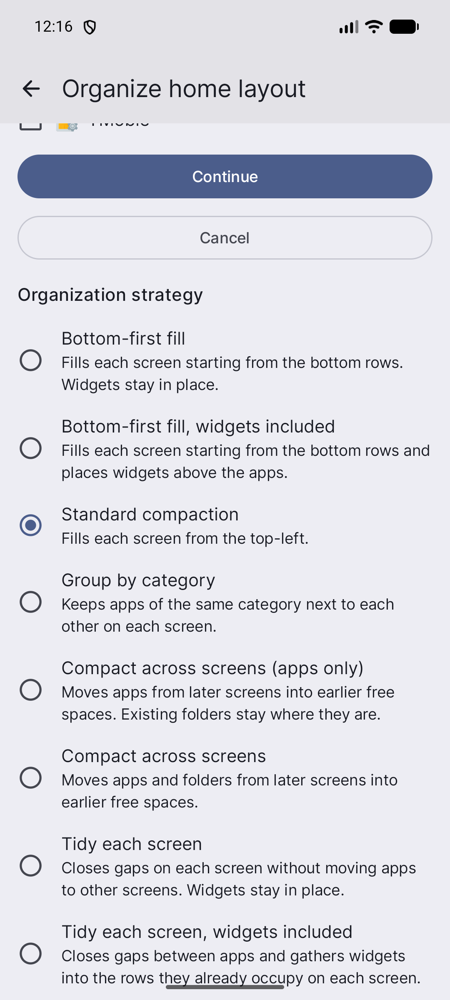
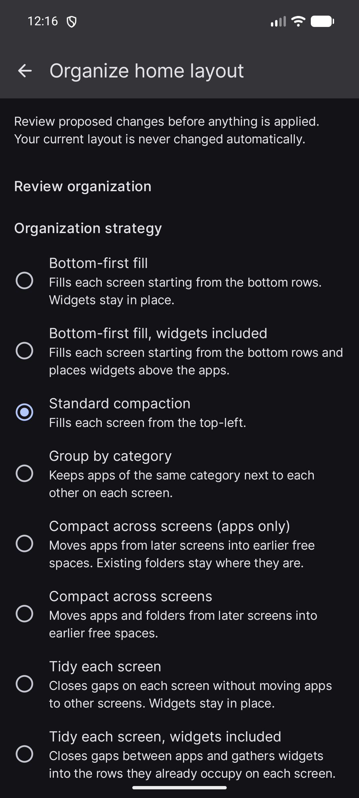
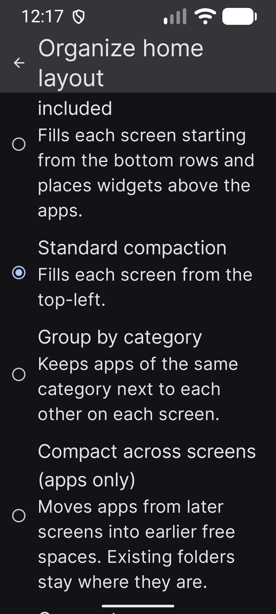

# Issue #283: strategy picker evidence

> Status: observed
> Capture date: 2026-09-13 JST
> Source revision: `c66d0ee1793d582b3d8d9cf431c3dfbed3656168`
> Evidence capture source revision: `0dc7d2b6763bed9a64e67d7dd4a52e0325d8ffd3` (the current PR head adds documentation only)

- Issue: https://github.com/nunu1733/NunuLauncher/issues/283
- Device: API 36 Android emulator, `issue142_api36`, 1080x2400
- Locale: en
- Capture provenance: local debug APK built from the source revision above; screenshots are repository-retained evidence
- Physical-device verification build: [Build release APK run 34738876141, job 103675041637](https://github.com/nunu1733/NunuLauncher/actions/runs/34738876141/job/103675041637), source revision `0dc7d2b6763bed9a64e67d7dd4a52e0325d8ffd3`
- Privacy: synthetic emulator contents only; no personal account or device data is shown

## AC-3 / AC-7: light and dark visual distinction

The selected `Standard compaction` row shows a radio ring with a filled center. The other rows show empty rings. The distinction remains visible in both themes and is not dependent on selected-row background or text color.

### Light theme, 100% font scale

- Theme: light
- Font scale: 1.0
- Selected row: `Standard compaction`

### Dark theme, 100% font scale

- Theme: dark
- Font scale: 1.0
- Selected row: `Standard compaction`

## AC-5: 200% font scale

- Theme: dark
- Font scale: 2.0
- The captured rows wrap onto multiple lines without visible overlap between the radio indicator and text, and without clipping within the visible row bounds.
- This is a scrolled representative frame, not evidence that every row is simultaneously visible. The focused instrumentation test scrolls each of the eight strategy names into view and asserts display at `fontScale = 2f`.

## Accessibility and deterministic checks

The focused instrumentation test verifies that the picker has eight parent-row click targets and selectable targets, all with `Role.RadioButton`, and that the visual-only child radio does not add an independent selectable or focus target. Parent-row selection movement, single-selection uniqueness, default-as-effective, fail-closed, and re-selection no-op are covered by the same suite.

## AC-4: Physical-device TalkBack verification

The owner manually verified the review-requested TalkBack behavior on a physical device using the release APK from [run 34738876141, job 103675041637](https://github.com/nunu1733/NunuLauncher/actions/runs/34738876141/job/103675041637) at source revision `0dc7d2b6763bed9a64e67d7dd4a52e0325d8ffd3`.

- Each strategy was announced as one logical item containing its name, description, and selected state.
- The child visual-only radio did not receive independent accessibility focus or cause a duplicate announcement.
- Result: PASS for AC-4.
- The physical device model and OS build were not included in the provided report and are intentionally not inferred here.

## Executed local commands

- `./gradlew spotlessCheck` -> PASS
- `./gradlew assembleLawnWithQuickstepGithubDebug` -> PASS
- `./gradlew testLawnWithQuickstepGithubDebugUnitTest --tests 'app.lawnchair.organizer.*'` -> PASS
- `./gradlew connectedLawnWithQuickstepGithubDebugAndroidTest -Pandroid.testInstrumentationRunnerArguments.class=app.lawnchair.organizer.ui.StrategyPickerInstrumentationTest` -> PASS on `issue142_api36` and `nunu_qpr2_api36_1`; 11/11 tests on each emulator
