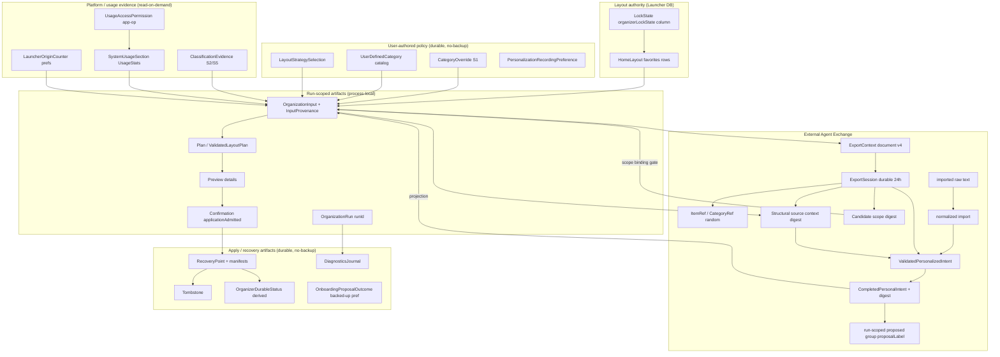
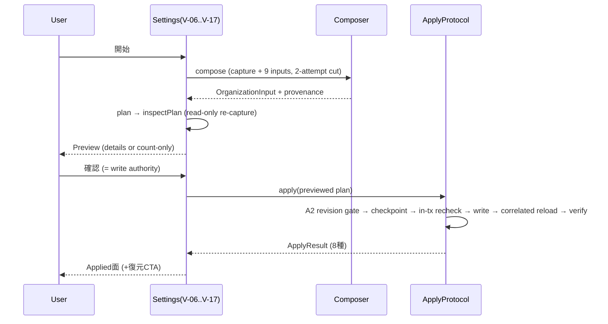
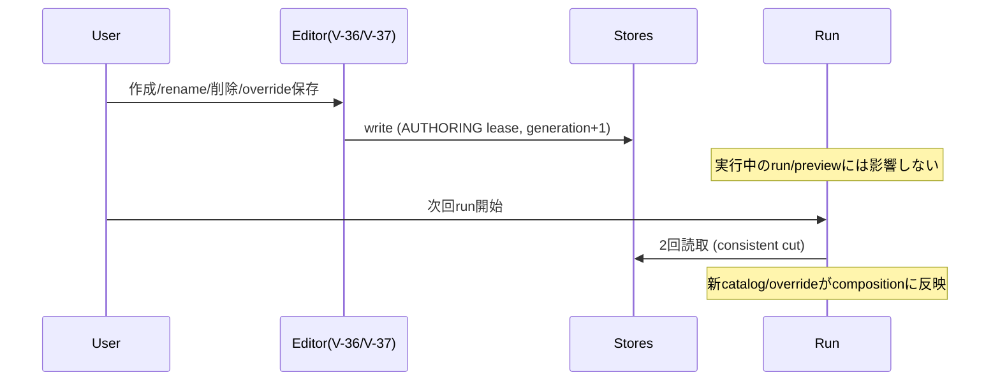
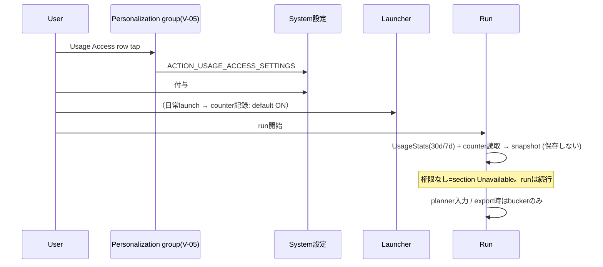
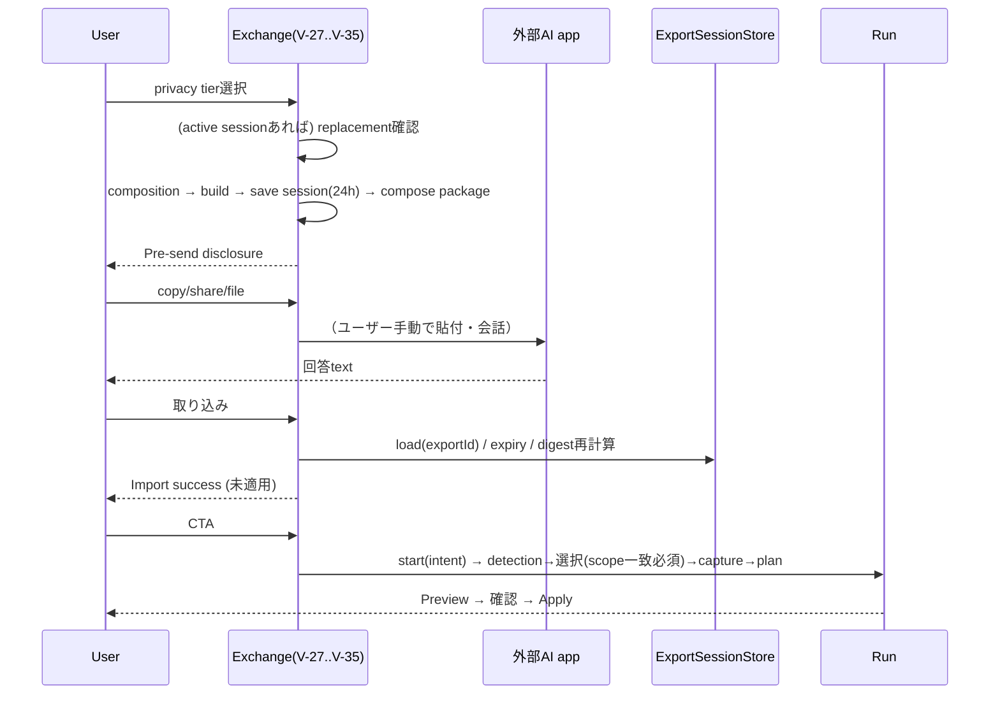

# Organizer AS-IS UX / data flow audit (Phase A: #357–#360)

> Status: draft (Phase A fact finding。TO-BE decision は #361、既存正本の disposition は #362 が所有する)
> Audit date: 2026-09-18
> Audited HEAD: `b728ed4d9f30ee797f6e086da110fdc86215da92` (main, clean tree)
> Parent: #356
> Inputs: #357 (View inventory / user journey), #358 (logical ER / ownership / lifetime), #359 (data timing / disclosure / freshness), #360 (integrated state model)
> Method: production code（organizer module, settings UI, launcher hooks）をmain上で直接実読し、accepted spec / ADR / product docs / owner Issue の「意図」と「実装の実態」を突き合わせた。test期待値からの逆算は補助にのみ使用し、production implementation を正として確認した。

---

## 1. Executive summary

現状のOrganizerは、**契約の正確さ**（revision gate、zero-write失敗、fail-closed、typed failure）の水準が非常に高い一方、**ユーザーから見た情報設計**が契約の追加に合わせて積み重なった結果、次の構造的性質を持つ。

1. **1つの画面が3つの役割を担っている**。`ManualOrganizationPreferences`（1,751行）は (a) 1回の整理runの実行面（約20状態のstate machine）、(b) 恒常設定面（strategy picker、durable status）、(c) External Agent Exchangeという独立サブシステム（7畳面・独自の失敗分類20種）を同一のLazyColumnに抱える。run中に変更できないcategory/lock/personalization設定は別画面（Home Screen設定）にあり、run中からは到達できない（Backでrunを破棄するしかない）。
2. **データ確定タイミングが6箇所に分散し、それぞれ別のUIタイミングで発生する**。(1) 恒常設定の保存、(2) AIへのexport（privacy tier選択→pre-send disclosure）、(3) AI回答のimport（validation成功＝取り込み済み・未適用）、(4) run接続（CTA押下 / attach）、(5) canonical `OrganizationInput`のcapture（run開始ごとに全policy sourceを二重読み取りのconsistent cutで再構成）、(6) apply authority（preview確認・revision gate）。それぞれの間で「何が確定していて何がまだ変わるか」をユーザーが推論する材料はUI上に ほぼ存在しない。
3. **同一概念のrepresentationが多く、UIをまたいで意味が変わる**。categoryは4表現（built-in `CategoryId` / `UserCategoryId` (UUID) / 表示名 / export-scoped random ref）を持ち、identityと表示名が分離している。Back/Cancel/Discard/Dismiss/Later/Skipは画面ごとに異なる意味を持つ。busy/frozenも「arbiter busy」「import attempt」「lease」「writer busy」と複数の調停が別々のUI無効化として現れる。
4. **安全性に必要な複雑さと、偶然の複雑さが混在している**。revision再確認・recovery checkpoint・atomic write・scope binding gate・pre-send disclosureは安全性に直結する。一方で、reconciliation decision tableの三重実装、閉域語彙サイズ1の`RecoveryPreviewSummary`、export文書内のusage重複、未到達の`LOCAL_FULL` tier、未使用の`Trigger.INCREMENTAL_PROPOSAL`、exchange失敗20種のraw UI提示などは安全要件からは直接派生しない（§11）。

Phase Aの結論として、#361は「run実行面・恒常設定面・AI交換面の分離」「データ確定タイミングの統合 or just-in-time化」「Back/破棄語彙の統一」「hidden lifetime（export session 24h・pending intentのprocess-local性）の可視化」を主要な設計論点として比較検討できる状態にある。本書はAS-ISの事実モデルであり、TO-BE案の確定は行わない。

主要findingsの要約は §10（横断）、severity分類は §10.11、spec/実装差分は §12、#361への入力は §13。

---

## 2. Scope / inspected sources

### 2.1 Production code（実読。pathはrepo root相応）

Manual run / organizer UI:

- `lawnchair/src/app/lawnchair/ui/preferences/destinations/ManualOrganizationPreferences.kt`（全1,751行）
- `lawnchair/src/app/lawnchair/organizer/ui/ManualOrganizationRun.kt`（全1,344行）
- `lawnchair/src/app/lawnchair/organizer/ui/OrganizationOnboardingProposal.kt`（全608行）
- `lawnchair/src/app/lawnchair/organizer/ui/MissingAppSelectionScreen.kt`（全310行）
- `lawnchair/src/app/lawnchair/organizer/ui/exchange/ExchangeFlowUi.kt`（全1,860行）
- `lawnchair/src/app/lawnchair/organizer/integration/exchange/ExchangeFlowController.kt`（全198行）
- `lawnchair/src/app/lawnchair/ui/preferences/destinations/HomeScreenPreferences.kt`（全334行）
- `lawnchair/src/app/lawnchair/ui/preferences/navigation/PreferenceNavigation.kt` / `PreferenceRoutes.kt`
- `lawnchair/src/app/lawnchair/ui/preferences/destinations/CategoryOverridePreferences.kt` / `CustomCategoryPreferences.kt` / `PlacementLockPreferences.kt` / `OrganizerDiagnosticsPreferences.kt`
- `lawnchair/src/app/lawnchair/ui/popup/OrganizerLockShortcut.kt`（workspace長押しpopup入口）

Data / application layer（監査sweepで全file実読、file:lineは本文中に引用）:

- `organizer/rules/*`（CategoryOverrideStore, LayoutStrategySelectionStore, UserDefinedCategoryStore, PolicyModels, BuiltInOrganizerPolicyBundleSource）
- `organizer/personalization/*`（ContextExportBuilder/Codec/Models, ExportSessionStore, IntentCodec/Validator/Models/Completion/Identity/PlannerAdapter, PersonalizationSignal*, RandomIdAllocator, SourceContextIdentity, SystemUsageAggregator, CandidateScopeIdentity）
- `organizer/personalization/exchange/*`（ExchangeContract, ExchangeGenerationGate, ExchangeImportPipeline, ImportNormalizer, IntentImportParser, ScopeBindingGate, SessionExportReconstructor, ExchangePackageComposer, ExchangeImportSummary）
- `organizer/integration/*`（OrganizationInputComposer, ProductionOrganizationInputComposer, CompositionModels, AndroidExportSessionStore, Android*SignalSource, LauncherOrigin*, MissingAppCandidateSource, UsageAccess, AndroidCandidatePorts, FullTargetSetMaterializer）
- `organizer/application/*`（ApplyProtocol, RecoveryProtocol, RecoveryPreviewProtocol, PlanPreviewProtocol, ReadinessGate, RestartReconciler, LifecycleReconciler/State, OrganizerDurableStatusDeriver, RecoveryStore群, RevisionCalculator, Results）
- `organizer/locks/*`、`organizer/diagnostics/*`
- `LawnchairLauncher.kt`（onboarding/recorder hook）、`LawnchairApp.kt`（startup reconciliation）

### 2.2 Specs / ADRs / docs / issues

- specs: 13, 38, 52, 53, 83, 84, 99, 182, 194, 195, 203, 204, 205, 210, 228, 230(参照), 231, 232, 271, 283, 327, 328, 329, 330, 331, 332, 336, 337, 348
- ADR: 0003, 0004, 0007, 0012
- docs: `docs/product/{organization-run-ux,requirements,product-brief,layout-strategy-v1,category-taxonomy-v1}.md`, `docs/project/seed-backlog.md`, `CONTEXT.md`, `DESIGN.md`, `AGENTS.md`
- Issues: #4 #38 #52 #53 #83 #84 #99 #182 #203 #204 #205 #228 #327 #328 #329 #330 #331 #332 #336 #337 #348 #356 #357 #358 #359 #360（body実読。#356–#360以外のcommentsは、decisionがspec本文に引用されているものに依拠した個別読みと、issue body読みの混合。未読commentがあることは制限事項として §14 に記録）

### 2.3 制限事項（推測で補わなかった点）

- 実機によるUI操作の動作確認は行っていない（code実読 + instrumentation testの存在確認まで）。表示結果の「見た目」に関する主張はcodeとstring resourceに基づく。
- issue commentsの全文読みは #356–#360 のみ。owner issue のcomment中の経緯で本書の記述と食い違うものがあれば、それは本書の見落としの可能性がある。
- Lawnchair 16系列の変更は対象外（main baselineはLawnchair 15 beta 3系）。

---

## 3. AS-IS user journey（end-to-end）

### 3.1 普通のmanual organization（AIなし・候補追加なし）

1. 設定 → Home screen → General group「Organize home layout」row（`HomeScreenPreferences.kt:105-109`）→ `HomeScreenManualOrganization(MANUAL)` route。
2. Idle面：durable status row（restorable / restored-or-expired / unresolved+診断）＋「Start」。start押下 → run lease（`OrganizationOperationLease.Kind.RUN`）取得 → `State.CandidateDetection`（missing-app検出、zero-write）。
3. 検出成功 → `State.Selecting`（候補0件でも表示され「続行」で全件整理）。何も選ばず「続行」→ `State.Capturing` → composition（layout capture + 9 policy input のconsistent cut）→ `State.Planning` → planner。
4. 変更有り → `inspectPlan`（read-only preview seam）→ `State.Preview`。decision pair（確認/キャンセル）が冒頭、以下に件数header + 具体的変更list（移動/新規folder/新規page/保持/警告group、5行で折りたたみ）。
5. 「確認」→ `State.Applying`。この間の「Cancel」はcheckpoint前のみ有効（`applicationAdmitted`フラグ、`ManualOrganizationRun.kt:816-847`）。A2 revision gate → checkpoint（recovery point作成）→ in-transaction再確認 → write → 相関reload → 検証 → `State.Applied`。
6. `Applied`面は`ApplyResult`8種の文言＋完了形件数。`Applied`成功時のみ「復元」CTA → `State.InspectingRecovery` → `State.RecoveryPreview`（復元確認、apply履歴行）→ 確認で `State.Recovering` → `State.RecoveryResultState`。

User-visible摩擦: 最初に必ずmissing-app選択面を通る（全件整理しかしないユーザーにも「続行」押下が1回増える）。strategyはこの画面の下部で常に変更できる（run中の変更はpreview破棄+再run、§12 D-6参照）。

### 3.2 onboarding → review

1. fresh install（provenance `FRESH_INSTALL`判定: `firstInstallTime == lastUpdateTime`）でlauncher resume + workspace bind後、dragLayer上にfloating proposal（`OrganizationOnboardingProposal.kt:237-248`）。restore/upgrade/unknownは出ない（fail-closed）。
2. 「後で」= 当process内抑止 + `DEFERRED`記録（backup対象pref）+ 6秒のre-entry hint（設定経路を案内）。次のcold startで再表示可。
3. 「スキップ」= `SKIPPED`永続（以降自動再表示なし）。
4. 「確認」= coordinator.start(ONBOARDING_PROPOSAL) が`Started`を返した場合のみ`REVIEWED`記録し、`HomeScreenManualOrganization(ONBOARDING)` intentで設定画面へ。Busyならボタン復帰（retry可）。

### 3.3 categoryを編集してから整理

1. Home screen → Layout group → Category overrides（app毎にS1 override）と Custom categories（create/rename/delete）は別々の下位画面（`HomeScreenPreferences.kt:179-190`）。
2. 編集は恒常storeへ即時保存（`AUTHORING` lease取得、run稼働中は`OrganizationRunActive`で拒否）。
3. 整理runは開始のたびにoverride store・user catalogを**2回ずつ**読み（consistent cut A/E1/B/E2、`OrganizationInputComposer.kt:284-417`）、active catalogを構成してplanner入力にする。「次回のfresh compositionにのみ効く」——実行中のrun/previewには反映されない。

User-visible摩擦: run中にcategoryを変えたくなったら、runを破棄して（Back）設定階層を2–3層戻り、編集して、再度入り直す必要がある。

### 3.4 usage personalizationを有効化して整理

1. Home screen → Personalization group（`HomeScreenPreferences.kt:206-238`）: 「launcher-origin記録」toggle（default ON、OFFで記録停止+カウンタ消去）と「Usage Access」row（付与状態表示 + 押下で`ACTION_USAGE_ACCESS_SETTINGS`へjump）。
2. 権限はsystem設定側で付与。戻るとON_RESUMEで状態表示が更新。
3. 整理run開始時（compositionごと）にUsageStatsからrolling 30d/7dを読み（`AndroidSystemUsageSignalReader.kt`）、launcher-origin counter（`organizer_launcher_origin_v1` prefs）と合わせてbucket化した`PersonalizationSignalSnapshot`を都度構成。権限なし→該当sectionが`Unavailable`になるだけでrunは普通に成功（`NotReady`にはならない）。

### 3.5 External Agent export → AI → import → preview → apply（idle entry）

1. Idle面最下部「Organize with an external AI」entry（`exchangeFlowItems`、strategy pickerより下）。capability説明（AIは直接ホームを変えない、会話は外部app内、やり取りは1往復）を常時表示。
2. 「開く」→ privacy tier選択（redacted / labels込み）。既存active sessionがある場合はreplacement確認（既存exchange宛の回答が以降import不可になる破壊的操作である旨）。
3. 生成 → pre-send disclosure（生成済みpackage全文 + tier別説明 + copy/share/save-file）。送信前に閉じればsessionをinvalidate。送信後の「閉じる」ではsessionは生存。
4. ユーザーは外部AI appで自由に会話（instructionはinterview-first: 2–4問→方針要約→了承→fenced json 1個）。
5. 戻って「取り込む」→ clipboard/file/手動paste → envelope 1MiB gate → normalizer（marker / fenced json / standalone json）→ framing → codec → session照合（exportId一致・TTL 24h・structural digest一致）→ validator（14 class）→ 成功なら**取り込み成功状態**（件数summary・未適用である旨・CTA/破棄）。
6. CTA「この提案で続ける」→ 新規run開始（intentを乗せてdetection→選択へ）。この間、idle start rowとstrategy pickerはfreeze（import attempt/continuation中）。
7. 以降は通常run（選択scopeはexport scopeと完全一致が要求される。違えば`SCOPE_MISMATCH`）→ preview → 確認 → apply。AIの判断は常にpreferenceとしてplanner経由で、配置の最終決定はplanner。

### 3.6 run-in exchange（選択途中でAIに相談）

1. `State.Selecting`面にscoped exchange entry。選択はexchange step中freeze（`editsEnabled = !exchangeBusy`）。
2. export scope = frozen選択（既存配置 + 選択候補）。候補は`subject: CANDIDATE`として同じ乱数refで広告。
3. import成功 → CTA「選択に戻って整理を完了」→ `attachIntent`（同一runへsingle-shot接続）。confirmSelection時の早期set等価gate + composition後のprojection digest gate（`ScopeBindingGate`）で`SCOPE_MISMATCH`（zero-write、選択面が再び開き再export案内）。

### 3.7 stale発生

- preview前にlayoutが変わった: `State.Stale(DETECTED_BEFORE_REVIEW)`（「準備中にレイアウトが変更された」旨 + 再取得CTA）。
- 確認押下時にlayoutが変わった: applyのA2 gateが`STALE_REVISION`を返し `State.Stale(APPLY_BLOCKED)`（「この提案は適用されなかった。今回の試行は現在のホーム画面を変更していない」+ 起因detail + 再取得CTA）。
- export後にlayout/lock/availability/分類が変わった: import時点で`CONTEXT_STALE`。候補のavailability/分類が変わればscope gateで`SCOPE_MISMATCH`（PROJECTION_MISMATCH）。
- strategy変更は**staleを起こさない**（capture revisionのみがstale正本）。代わりにUIがrun dismiss + 再startで対処する（§12 D-6）。

### 3.8 recovery

1. `Applied`成功面の「復元」→ inspect（read-only、writer lease配下）→ `RecoveryPreview`（効果説明は閉域語彙、apply履歴行、revision条件付き）→ 確認でone-shot token消費 → restore → `RecoveryResultState`。
2. 画面を離れる/processが死ぬとrun coordinatorの`lastVerifiedApply`（process-local）は失われ、**同一process内の`Applied`面からしかrecovery entryへ戻れない**。再訪時はIdle面のdurable status row（`ORGANIZED_RESTORABLE`等の表示のみ、restore操作は付かない = spec 271の明示的follow-up）。
3. recovery pointは検証済み24h・最大3点。tombstone 24h。

### 3.9 importを途中破棄

- 取り込み成功状態で「破棄して閉じる」（追加確認なし）またはBack（確認dialog）→ pending intent破棄（zero-write）。**export sessionはinvalidateされない**ため、依頼が有効な間は同じ回答textを再取り込みできる。
- CTA処理中（`continuing`）はdiscardもBackも不受理。

### 3.10 run中に別設定を変更しようとする

- category override / custom category編集: `AUTHORING` leaseがrunと排他 → 編集画面は`OrganizationRunActive`を表示して拒否（`CategoryOverridePreferences.kt:175-179`）。ただしその編集画面へ行くにはBackでrunを破棄する必要がある（設定階層を離れる = dismiss）。
- strategy選択: run中でもpickerは有効。commitすると**run dismiss + 同一triggerで再start**（previewは無条件で捨てる、確認なし）。
- lock編集（workspace長押し / lock画面）: lock書込みは`LayoutWriteCoordinator` leaseでrunと書込み排他。run中のcaptureを古くするため実質stale要因。
- personalization recording toggle / Usage Access: いつでも変更可。次回compositionから効く。

---

## 4. View inventory（#357）

「1 Kotlin class = 1 View」とは扱わず、ユーザー認識上の状態・目的が変わる面を分離して数える。全部で **40 view**（launcherワークスペース上2、Home Screen設定3 group面、manual組織画面のrun状態20＋strategy picker、exchange sub-flow 7、authoring画面群5、lock dialog 1、diagnostics 1）。

略称: **Host** = production実装。**Owner** = 現在のowner issue/spec。

### 4.1 Master table（View ID / purpose / host / owner / entry / CTA / next）

| View ID | user-visible purpose | production host | owning issue/spec | entry points | primary CTA | secondary CTA | next states |
|---|---|---|---|---|---|---|---|
| V-01 Onboarding proposal | 初回インストール時に整理提案を受け取る | `OrganizationOnboardingProposalView`（launcher dragLayer floating, `OrganizationOnboardingProposal.kt:266-441`） | #53 / spec 53 | fresh install + resume + workspace bound + 他floatingなし + 当process未表示 | 「整理内容を確認」 | 「後で」「スキップ」 | Review→V-06(ONBOARDING)、Later/Skip→閉じる |
| V-02 Re-entry hint | 「後で」直後に再入場経路を知らせる（6秒） | `OrganizationOnboardingReentryHint`（floating） | #232 / spec 232 | V-01「後で」のみ | なし（閲覧のみ） | なし | timeout/Back/外tapで消える |
| V-03 Home settings: General | 整理への恒常入口 | `HomeScreenPreferences.kt:85-110` | #232 | 設定→Home screen | row tap | — | V-06 |
| V-04 Home settings: Layout group | lock/診断/category系への入口（Grid等の非organizer行を含む） | `HomeScreenPreferences.kt:159-201` | #38/#99/#336/#138 | 設定→Home screen | 各row tap | — | V-36/37/38/40 |
| V-05 Home settings: Personalization group | 記録toggleとUsage Access状態 | `HomeScreenPreferences.kt:206-238` | #203 / spec 203 | 設定→Home screen | Usage Access row tap（system設定へ） | 記録toggle | （system設定へ遷移） |
| V-06 Idle / Cancelled | 整理の開始・前回結果の確認 | `ManualOrganizationPreferences.kt:330-372` | #52/#271 | V-03/V-01 Review/各種終了状態 | 「開始」 | （durable status rows、診断row） | V-07 |
| V-07 Capturing | 準備中であることを伝える | 同 `:375-381` | #52 | start/再取得 | — | — | V-08→V-09 または V-10 |
| V-08 CandidateDetection | 未配置app検出中 | 同 `:383-391` | #228 | start | — | — | V-09 または（検出不能）V-07直行 |
| V-09 Selecting | 対象候補の明示選択 | `MissingAppSelectionScreen.kt` + host `:393-445` | #228/#331 | V-08後 | 「続行」 | 「全て選択」「全て解除」検索、Cancel、scoped exchange entry（V-28） | V-07→V-10、Cancel→V-06、SCOPE_MISMATCHで再表示 |
| V-10 Planning | 計画計算中 | host `:447-453` | #52 | — | — | — | V-11〜V-17 |
| V-11 InputUnavailable | 入力が揃わない（model loading / source異常） | host `:455-471` | #83/#172 | — | 「再試行」 | — | 再start→V-07 |
| V-12 ScopeMismatchFailed | runが選択面を開けないままscope違反 | host `:473-486` | #331 D-5 | — | 「再試行」（実質再export） | — | 再start |
| V-13 CandidateResolutionFailed | 選択候補が解決不能に | host `:488-501` | #228 | — | 「再試行」（再検出） | — | 再start |
| V-14 PlanningRejected | 計画不能/不可能 + 理由件数 | host `:503-524` | #52 | — | 「再試行」 | — | 再start |
| V-15 NoChanges | 変更なし（zero-write） | host `:526-536` | #52 | — | 「もう一度整理」 | — | 再start |
| V-16 Preview (count-only) | 件数のみのpreview（環境失敗fallback） | host `:546-565` | #194/#195 D1 | — | 「確認」（degraded注意書き付きで確認可） | Cancel | V-19 / V-06 |
| V-17 Preview (concrete) | 具体的変更一覧の確認 = 適用権限の付与点 | host `:566-583` + `previewDetailsItems` | #194/#195/#52/#209 | — | 「確認」 | Cancel、group毎展開 | V-19 / V-06 |
| V-18 PreviewUnavailable | Add件を含むrunで具体preview不可 | host `:585-614` | #228 AC-14 | — | 「プレビューを再試行」 | Cancel | V-16/17へ or V-06 |
| V-19 Applying | 適用実行中（非キャンセル区間あり） | host `:616-626` | #52/#13 | — | — | 「チェックポイント前にキャンセル」 | V-20/V-21/V-15 |
| V-20 Stale | 提案が現layoutに適用不能になった | host `:628-660` | #210 | — | 「再取得して新しい提案」 | — | 再start→V-07 |
| V-21 Applied result | 適用結果（8種） | host `:662-714` | #52/#231/#13 | — | 成功時「復元」 / それ以外「もう一度整理」 | safe terminal時「診断を開く」 | V-22 / 再start / V-06 |
| V-22 InspectingRecovery | 復元point検査中 | host `:716-722` | #84 | V-21「復元」 | — | — | V-23 |
| V-23 RecoveryPreview | 復元内容確認（revision条件付き） | host `:724-761` | #84/#230 | — | 「復元を確認」 | Cancel | V-24 |
| V-24 Recovering | 復元実行中 | host `:763-769` | #13 | — | — | — | V-25 |
| V-25 RecoveryResultState | 復元結果（5種） | host `:771-802` | #13 | — | 「もう一度整理」 | safe terminal「診断を開く」 | 再start / V-06 |
| V-26 Strategy picker | 整理方針の恒常選択 | host `:804-810, 933-1000` | #182/#283/#328 | 常時（run状態の下） | radio選択（＝store書込＋run再start） | — | 選択でrun dismiss+再start |
| V-27 Exchange entry (idle) | AI整理の開始/取り込み | `ExchangeEntryRow`（`ExchangeFlowUi.kt:1021-1051`） | #205/#327 | V-06面の最下部 | 「作成/開く」「取り込む」 | — | V-29 / V-33 |
| V-28 Exchange scoped entry (run-in) | 選択scopeを凍結してAIに相談 | `ExchangeScopedEntryRow`（`:1103-1133`） | #331 | V-09面 | 「開く」「取り込む」 | — | V-29 / V-33 |
| V-29 Privacy selection | 送出tierの選択 | `ExchangePrivacySelection`（`:1135-1197`） | #205 | V-27/28「開く」 | 「生成」 | Cancel | V-30（置換確認時）→V-31 |
| V-30 Replacement confirm | 既存exchangeの無効化承認 | `ExchangeReplacementConfirm`（`:1199-1229`） | #205 AC-13 | active session存在時の生成 | 「置換」 | 「やめる」 | V-31 / close |
| V-31 Generating | package生成中 | `:955-966` | #205 | — | — | — | V-32 / 失敗status→V-29 |
| V-32 Disclosure | 送信前確認（package全文 + transport） | `ExchangeDisclosure`（`:1231-1319`） | #205/#204 | — | 「コピー」「共有」「ファイルに保存」 | pre-send「キャンセル」/送信後「閉じる」 | close（sessionは送信後生存） |
| V-33 Import input | AI回答の取り込み | `ExchangeImportField`（`:1330-1441`） | #332/#329/#205 | V-27/28「取り込む」 | 「クリップボードから」「ファイルから」 | 手動paste（折りたたみ）、「取り込む」実行 | V-34 / V-35 |
| V-34 Import outcome (failure) | typed失敗（20種）+ 認識事実 | `ExchangeImportOutcome`（`:1638-1724`） | #205/#329/#204/#331/#337 | — | 「再試行」 | raw text展開 | V-33 |
| V-35 Import success | 取り込み済み・未適用の中間状態 | `ExchangeImportSuccess`（`:1502-1636`） | #328/#337 | — | CTA（idle:「この提案で続ける」/run-in:「選択に戻る」） | 「破棄して閉じる」 | run接続→V-09 / 破棄→close |
| V-36 Category override editor | app毎の分類手動指定 | `CategoryOverridePreferences.kt` | #99 | V-04 row | 「保存」 | 「自動分類を使う」 | 一覧へ戻る |
| V-37 Custom categories | ユーザー定義categoryの作成/名称変更/削除 | `CustomCategoryPreferences.kt` | #336 | V-04 row | create/rename/delete | （削除は割当件数を表示して確認） | 一覧へ戻る |
| V-38 Placement locks screen | lock一覧とUNKNOWN一括レビュー | `PlacementLockPreferences.kt` | #38/#211/#287 | V-04 row | 個別dialog/一括レビュー | — | 一覧更新 |
| V-39 Lock dialog (workspace) | 長押し popupからのlock付与 | `OrganizerLockShortcut.PlacementLock`（AlertDialog） | #38 | workspace/hotseat長押し（app/deep shortcutのみ） | dialog確認ボタン | — | popup閉じる |
| V-40 Organizer diagnostics | 診断journalの手動export | `OrganizerDiagnosticsPreferences.kt` + `ExportUi.kt` | #67/#138/#288 | V-04 row / safe terminal row | SAF保存 | — | （file picker） |

### 4.2 Mutation / authority semantics

| View ID | persistent mutation | run/session mutation | acquired authority / consent |
|---|---|---|---|
| V-01 | `ORGANIZATION_PROPOSAL_OUTCOME`（SKIPPED/DEFERRED/REVIEWED、backed-up pref） | run admission（ONBOARDING trigger、Busyなら記録しない） | なし（確認はrun開始のみ） |
| V-02 | なし | なし | なし |
| V-03/04/05 | なし（導線） | なし | V-05はUsage Accessの**状態表示**とsystem設定への遷移のみ（app内で権限を取らない） |
| V-06 | なし | run開始（RUN lease） | なし |
| V-09 | なし（選択はprocess-local） | scope確定（`confirmSelection`） | なし |
| V-16/V-17 | なし | apply authorityの付与（in-memory confirmation、`applicationAdmitted`） | **書込み権限の確定点** |
| V-19 | favorites全件（atomic tx） | — | checkpoint作成 |
| V-21 | （適用済み） | recovery preview要求（RECOVERY lease） | なし |
| V-23 | favorites復元（atomic tx） | — | one-shot `RecoveryPreviewConfirmation` token |
| V-26 | `organizer_strategy_selection/selection-v1`（AtomicFile） | run dismiss + 再start | なし |
| V-29/30 | （生成後）`organizer_personalization_export_session_v2.json`（単一active） | — | **外部送出の同意点はV-32**（tier選択はその前段） |
| V-32 | なし（transportのみ） | session invalidate（pre-send cancel時） | **pre-send disclosure = 外部開示の同意点** |
| V-33/34 | なし（zero-write） | import attempt token発行 | なし |
| V-35 | なし | run接続（start/attach、single-flight） | なし（適用権限はV-17で別途） |
| V-36 | `organizer_category_overrides/snapshot-v1` | — | AUTHORING lease |
| V-37 | `organizer_user_categories/catalog-v1`（+override削除プロトコル） | — | AUTHORING lease |
| V-38/39 | `favorites.organizerLockState`（tri-state列のみ） | — | `UserReviewedIntent`（確認dialogが供給） |
| V-40 | なし（SAF書き出しのみ） | — | SAF URI grant（1回限り） |

### 4.3 Back / dismiss / lifecycle semantics（概要。詳細は §9 matrix）

| View ID | system Back | explicit close/dismiss | Activity recreation | process death |
|---|---|---|---|---|
| V-01 | defer（`handleClose`で未resolveならDEFERRED） | 「後で」=defer / 「スキップ」=skip | 表示は再現しない（presentation claimはprocess単位） | DEFERREDなら次cold startで再表示 |
| V-06〜V-25 | `dismiss()`（apply適用中のみBack不逮捕→閉じられない）。cancelと同じ「run破棄」 | Cancel系ボタン | run stateはprocess-local singletonなので保持（同一processのactivity再生成なら継続） | **run/preview/recovery entryは全て失われる**（runはdurableでない。適用中はdurable lifecycleがresume/rollbackを完了） |
| V-26〜V-35 | 画面Backは上位（run dismiss）へ。V-35のみ専用handler（discard確認） | close/import破棄 | exchange holderはscreen-local（activity再生成で閉じる） | **pending intent・attempt token消失**。export sessionはdurable（24h）なので再import可 |
| V-36〜V-40 | 通常の設定navigation（上へ） | — | 編集途中の未保存選択（V-36のpendingCategory等）は保持されない | 同左 |

### 4.4 Observed UX problems（view単位。severityは §10 で集約）

- V-06/V-26/V-27: 「開始」「strategy」「AI入口」が同一面に常に並ぶ。run実行中もstrategy pickerが有効で、選択commitが**確認なしでpreviewを破棄してrunを再startする**（`ManualOrganizationPreferences.kt:131-134` の `restartRun`）。
- V-09: 全件整理しかしないユーザーにも毎回選択面を通る。「続行」の他、候補0件でも面が出る。
- V-21→V-23: recoveryへの入口が「適用直後の同一process」のみ。durable status row（V-06）は表示のみで操作が付かない（spec 271の明示defer）。
- V-27/V-28: entryが画面最下部（strategy pickerの下）。idle entryは「AIなし」と同じ操作面の末尾にあり、独立サブシステム感が強い。
- V-29/V-30: active sessionの存在（前回生成から24h以内）は、**次に生成しようとするまでUIから知る方法がない**。replacement確認で初めて知らされる。
- V-32: package全文（最大256KiB、scroll 240dp）を人間が審査するのは実際上困難。tier説明と「外部へ出る情報の種別」の説明はあるが、内容審査は形式的。
- V-34: 20種のtyped失敗文言がほぼそのまま技術分類として表示される（framing/schema/expiry/digest/scope等）。再試行と再exportの指南はあるが、失敗名自体の理解コストが高い。
- V-35: 「破棄」はsessionを無効化しない（仕様どおり）が、「破棄したのに同じ回答を再取り込みできる」挙動はUIに説明されていない（stringは案内文のみ）。
- V-36/V-37: run稼働中に開くと`OrganizationRunActive`で拒否されるが、この画面へ至るには既にrunをBack破棄している必要があるため、実際にはこの拒否は「別process/別surfaceからの操作」向けで、通常導線ではまず遭遇しない。
- V-05: Usage Accessの要求が「整理したい」という目的発生とは無関係のタイミング（設定閲覧時）に提示される。rationale文言はある。

---

## 5. Logical ER（#358）

DB table / classではなくlogical entity / artifactとして整理する。mermaidは依存関係（データがどこから来て、何が何を読むか）。

### 5.1 Logical dependency graph



### 5.2 Entity table（authority / persistence / identity / lifetime / mutation / stale / exposure）

表記: persistence = **D**(durable app-private) / **DB**(Launcher favorites) / **S**(app-private session) / **P**(process-local) / **R**(run-local) / **C**(derived, 再計算) / **M**(in-memory immutable)。

| entity | authority / source of truth | persistence | identity type | creation | read/snapshot timing | mutation owner | invalidation / stale | user visibility | external exposure | backup | recovery relationship |
|---|---|---|---|---|---|---|---|---|---|---|---|
| HomeLayout | Launcher DB `favorites` | DB | row id（内部`ItemId`はcapture由来の文字列） | ユーザー操作/restore/apply | run開始時のcanonical capture（compose毎に1回） | launcher本体 / apply module（lease下） | revision digest変化＝全run stale | ホーム画面そのもの | exportでは構造のみ（ref経由） | launcher backupの対象（organizer列を含む） | RecoveryPointの復元対象 |
| LockState | `favorites.organizerLockState` tri-state | DB | row単位 | schema 33 upgrade時は全行UNKNOWN | capture内 | V-38/V-39（確認dialog経由のみ） | capture後の変更はstale要因 | lock管理画面・長押しdialog | exportではlocked flag（ref経由） | backup対象 | apply/復元で保存・復元される |
| BuiltInCategory | bundle `organization-policy-v2.6` | M | `CategoryId`（stable） | compile時 | composition毎 | なし（immutable） | なし | category選択肢の一部 | taxonomyIdとして全tierで出る | n/a | なし |
| UserDefinedCategory | `UserDefinedCategoryStore`（`organizer_user_categories/catalog-v1` AtomicFile） | D | `UserCategoryId` UUID v4（stable local opaque） | V-37 create | composition毎2回（cut内） | V-37（AUTHORING lease） | 削除→`UNKNOWN_CATEGORY_REF`（import時）/ dangling override→NotReady | V-37一覧、override選択肢（「Custom」表示） | 表示名はlabel tierのみ。IDは絶対に出ない | **backup除外** | なし（run外entity） |
| ActiveCategoryCatalog | bundle + user catalogの合成 | C | content-addressed（catalog digest） | composition毎 | run開始時 | （派生） | 元storeの変更で次回compositionから変化 | 間接（分類結果） | refとしてadvertise | n/a | なし |
| CategoryOverride | `CategoryOverrideStore`（`snapshot-v1` + legacy prefs） | D | key `(package, profile)` / 値は`CategoryIdentity` | V-36保存時 | composition毎2回 | V-36（lease） | generation+digest。解決分類が変わるとexport文書のstructural digestも変化 | V-36一覧 | 出ない（digestのみ） | **backup除外** | なし |
| LayoutStrategySelection | `LayoutStrategySelectionStore`（`selection-v1`） | D | `(schema, generation, sha256(strategyId))` | V-26選択commit | composition毎2回 + picker表示時 | V-26（write-time catalog検証） | generation+1。読取失敗=Unreadable（fallbackなし） | V-26 radio | 出ない | **backup除外** | なし |
| PersonalizationRecordingPreference | `PreferenceManager2` key `organizer_personalization_recording`（default ON） | D（prefs2） | key固定 | toggle時 | `Launcher.logAppLaunch`毎 | V-05 toggle | OFFでcounter即消去 | V-05 | 出ない | （prefs2のbackup方針依存） | なし |
| UsageAccessPermission | system app-op `PACKAGE_USAGE_STATS` | system | — | system設定 | composition毎 + V-05 resume毎 | system設定のみ（app内からは付与不可） | revoke→次回captureでsection Unavailable（失敗ではない） | V-05状態表示 | 出ない | n/a | なし |
| LauncherOriginSignal | `organizer_launcher_origin_v1` prefs（`profile\|package` → `count:epochDay`） | D | key=(profile, package) | launch観測（`LawnchairLauncher.kt:523-525`） | composition読取 | recorder / V-05 clear | clear/offで消滅 | bucket化された序数のみが使われる | bucket（0-4/0-3）のみ。count/日時は出ない | **backup除外** | なし |
| UsageSignal / PersonalizationSignalSnapshot | UsageStatsManager読取+bucket化 | C（保存しない） | content digest（schema `personalization-signals-v1`） | composition毎に再構成 | composition毎1回（cut外・failure≠NotReady） | なし（読取専用） | 常に新規。stale概念なし | 直接は見えない | bucket値がexport文書へ | n/a | なし |
| TargetSet / CandidateSelection | capture +検出の合成 | R | `scopeComposedTargetsIdentity` digest | `FullTargetSetMaterializer` | run開始時 | V-09確定 | 選択後のlayout/候補変化→`CANDIDATE_SELECTION_STALE` / `SCOPE_MISMATCH` | V-09選択肢 | 候補は`subject:CANDIDATE`でexport | n/a | なし |
| MissingAppCandidate | 検出（launchable − represented） | C | `AppKey(component, profile)` stable | V-08検出時 | 選択面/再検出 | なし | 毎検出で新規 | V-09行 | ref経由（raw identityは出ない） | n/a | なし |
| ExportContext (document) | 生成時のcompositionからbuild | P（保存しない。textとしてtransportされるのみ） | `exportId`（random 128bit）+ per-export refs | V-31生成 | 生成時1回（immutable） | なし | 生成後不変。session破棄で無効 | V-32全文表示 | **ここが外部出る唯一のartifact**（tier別） | 出た先の管理はlauncher外 | なし |
| ExportSession | `AndroidExportSessionStore`（`organizer_personalization_export_session_v2.json`、単一record） | S→D（app-private durable, TTL 24h） | `exportId` | V-31生成成功直後save | import時 `load(exportId)` / 生成gate `active(now)` | save（新規で旧session置換）/ invalidate（pre-send cancel） | 新save・invalidate・24h経過 | **ユーザーには見えない**（replacement確認で存在が示されるのみ） | 出ない（ref対応表は内部） | **backup除外** | なし |
| ItemRef / CategoryRef | session内の対応表 | S | SecureRandom 128bit Base64url（export毎に新規） | export生成毎 | import/検証時 | なし | 次exportで全て無効 | export文書内のopaque id | export文書に現れる | n/a | なし |
| Structural source context digest | `SourceContextIdentity`（layout+targets+解決分類の正規行） | S（session内） | sha256 | export生成時 | **import時再計算** | なし | layout/lock/availability/kind/page/reservation/role/解決分類の任何変更で不一致→`CONTEXT_STALE` | 見えない（失敗文言として現れる） | 出ない | n/a | なし |
| Candidate scope digest | `CandidateScopeIdentity` | S | sha256 | export生成時 | attach時（scope binding gate） | なし | 候補のidentity/availability/解決分類変更→`SCOPE_MISMATCH(PROJECTION_MISMATCH)` | 見えない | 出ない | n/a | なし |
| imported raw text | （AI回答） | P（outcome面の1 fieldのみ・ephemeral） | なし | V-33受領 | 即pipelineへ | なし | 画面閉鎖で消滅 | V-34折りたたみ表示 | 入力は外部由来 | 保存しない | なし |
| normalized import | `ImportNormalizer`通過後 | P | なし | import時 | codecへ | なし | — | 認識framing種別のみ表示 | 再送出なし | n/a | なし |
| ValidatedPersonalizedIntent | validator通過後の意図 | P（pending slot） | `IntentIdentity`（completed表現のsha256） | import成功時 | CTA（run接続）時 | なし | 新import/discard/入力変更で無効 | V-35件数summary | 出ない（入力だったものの内部表現） | 保存しない | なし |
| CompletedPersonalIntent | validator内のcompleterが構成 | C | 同上（identity算出基準） | import成功時 | summary/planner投影 | なし | — | no-judgment合算件数のみ | 出ない | n/a | なし |
| run-scoped proposed group | `proposalLabel` | R | label（#336名規則の値域） | import時 | planner（canonical系executoryのみ） | 昇格（V-35/事後面）でのみUDへ | run終了で消滅（catalog不変） | V-35「提案グループ」件数 | label textとしてexport文書に入り得る | n/a | なし |
| OrganizationRun | `ManualOrganizationRun` | P（singleton） | `RunId`（run毎新規） | start時 | 状態観測 | coordinatorのみ | dismiss/cancel/終了 | 状態文言群 | 出ない（journalはcountsのみ） | 保存しない | run自体は復元しない（適用中のみdurable lifecycleが引き継ぐ） |
| OrganizationInput + provenance | composerの合成結果 | R | 9つの`PolicyInputIdentity`（revision/rules/taxonomy/signals/targets/bundle/selection/personalization/intent） | composition時 | planner/preview/apply | なし | capture revision変化でplanごと無効 | 間接（scope/strategy行） | exportの元 | n/a | なし |
| Plan / ValidatedLayoutPlan | planner結果 / materializer結果 | P/R | sourceRevision + plan内容 | planning時 | preview/confirm | なし | revision不一致で適用不能 | previewの根拠 | 出ない | n/a | 適用の入力 |
| Preview details | `inspectPlan`がread-only再captureでmaterialize | P（`State.Preview`内） | なし | preview時 | V-16/V-17表示 | なし | 環境失敗→count-only fallback / Add run→不可確認 | V-16/V-17 | 出ない | n/a | なし |
| Confirmation / write authority | `applicationAdmitted` in-memory flag | P | なし | V-17「確認」 | apply protocol | coordinatorのみ | apply開始で確定、永続しない | 「確認」ボタン | 出ない | n/a | checkpoint直前にある唯一のuser gate |
| ApplyResult | apply protocol出力 | P | なし | apply完了時 | V-21 | なし | — | 8種文言+完了形件数 | 出ない（journalはcounts） | n/a | pointId相関でrecoveryへ |
| RecoveryPoint | `organizer_recovery.db`（record + chunked manifests + tombstone） | D（private DB, WAL/FULL） | `pointId` + 10状態lifecycle | checkpoint時 | 復元時 / durable status導出 | protocolのみ | 24h / 3点上限 / tombstone 24h | V-06 status row / V-23 | 出ない | **backup除外** | それ自体が復元機構 |
| OrganizerDurableStatus | `OrganizerDurableStatusDeriver`（record+tombstoneから導出） | C（保存しない） | 5値閉域 | 読取毎 | Idle/Cancelled面とreadiness遷移毎 | なし | 対象recordに追従（長生きしない） | V-06 row | 出ない | n/a | 表示専用（restore操作なし） |
| DiagnosticsJournal | `filesDir/organizer_diagnostics/*.journal` | D | runId/pointId（32hex制限） | run/apply/recovery event毎 | export時（user起動SAF） | appendのみ（retention 10run/7d/512KiB） | retention消化 | V-40経由のfileのみ | **exportはuser明示操作のみ**。個人情報なし（redaction契約） | journal自体はbackup対象外（export fileはuser管理） | safe terminalの調査経路 |
| OnboardingProposalOutcome | `LauncherPrefs` `launcher.organization_proposal_outcome` | D（**backedUpItem**） | enum name | V-01操作時 | 起動適性判定 | proposalのみ | — | 出ない（挙動として現れる） | 出ない | **backup対象**（restore機構と協調: `ORGANIZATION_PROPOSAL_RESTORE_SEEN`） | なし |

### 5.3 区別すべきrepresentation対（#358要件）

| 対 | 関係 | 観察 |
|---|---|---|
| category identity vs 表示名 | identityは`CategoryIdentity`（built-in値 or `u:<uuid>`）。表示名はpresentation | 常に分離されている。renameはplan byte不変（同一composition内）。**維持すべきinvariant** |
| local stable identity vs export-scoped ref | refはexport毎SecureRandomで新規。対応表はsessionのみ | unlinkability設計。ref→identity逆算不可。**維持すべき** |
| ExportSession vs exported document | documentはimmutable text（session外へ出る）。sessionは対応表+durability | documentは保存されない。process deathを跨ぐのはsessionのみ。**維持すべき** |
| ExportSession vs imported intent | intentはsessionを検証材料とする別artifact。pending intentはprocess-local | intentのlifetimeがsession(24h)より短い（画面を閉じたら消える）。**ユーザーには両方「一時的」に見えない**（§10 F-05） |
| imported intent vs OrganizationRun | 接続はCTA/attachで明示。runはintentを再構成した新規`OrganizationInput`として消費 | intentはrunに「載る」だけでrunの状態ではない。**維持すべき**（preview/confirm必須の根拠） |
| live settings vs OrganizationInput snapshot | snapshotはcomposition時に確定。以後の設定変更はrunに影響しない | strategyのみ例外的に「変更→run再start」でUIが上書きする（§12 D-6）。**一貫性の例外** |
| Plan vs Preview | planは実行可能artifact（coordinator private）。previewはread-only再captureによる表示投影 | confirmは「previewed plan object」をそのまま適用（TOCTOU gateはA2）。**維持すべき** |
| Preview vs confirmation authority | previewは情報。authorityはV-17押下のin-memory flag | 分離されている。**維持すべき** |
| RecoveryPoint vs 一般backup | recovery pointはapp内原子復元専用・24h・backup除外。launcher backupは別機構 | 二つの「バックアップ」が別物である旨はUIに明示なし（§10 F-05） |
| diagnostics vs user-facing state | journalはcounts/enumのみ（redaction契約）。user向け状態はtyped result文言 | 分離されている。ただし失敗文言が技術語彙をそのまま使う（V-34） |

「同じ概念が複数representationを持つ理由」が説明できないもの: **該当なし**。ただし `LOCAL_FULL` tier（builder上は`EXTERNAL_WITH_LABELS`と同一扱い、UIから到達不能）はrepresentationとして存在理由が現状薄い（§12 D-2）。

---

## 6. Data ownership / lifetime 分類（#358）

### 6.1 persistence class別一覧

- **durable, backup対象**: `favorites`（layout+lock列）、`launcher.organization_proposal_outcome`。
- **durable, app-private, backup除外**（全て`noBackupFilesDir`またはallowlist外）: category overrides（AtomicFile + legacy prefs）、user-defined categories、strategy selection、export session（単一record, TTL 24h）、recovery DB（record/chunk/tombstone）、diagnostics journal、launcher-origin counter prefs。
- **durable（prefs2経由）**: personalization recording toggle（default ON）。
- **process-local / run-local**: run coordinator状態一式（`RunId`, pending plan, previewed plan, `applicationAdmitted`, `lastVerifiedApply`, `appliedPoint`）、missing-app選択、import attempt token / pending validated intent、import raw text、ExchangeScreen状態、recovery preview confirmation token registry（IdentityHashMap）、`InspectionSnapshotFence`（fileはdurableでも認可はprocess-local）。
- **derived / 再計算**: personalization signal snapshot、active category catalog、organizer durable status、preview details、detection cut、structural digests（検証時に再計算）。

### 6.2 mutation path map（全恒常store）

| store | writer UI | seam | 排他 |
|---|---|---|---|
| favorites（organizer書込） | なし（run経由のみ） | `LayoutWriteCoordinator` lease + in-tx precondition | writer間排他 |
| organizerLockState | V-38/V-39 | `LockStateDbAdapter`（lease + in-tx reread） | 同上 |
| category overrides | V-36 | `CategoryOverrideStore.mutate`（optimistic identity） | AUTHORING lease |
| user categories | V-37 | `UserDefinedCategoryStore`（override削除はV-37→override storeの2段階protocol） | AUTHORING lease |
| strategy selection | V-26 | `StrategyWriteArbiter` → store.select | arbiter single-flight + import/CTA gate |
| export session | exchange controller | store.save/invalidate | single-active（saveが旧を置換） |
| recovery DB | apply/recovery protocol | module RunMutex + lease | 排他 |
| journal | protocol/coordinator | append-only | — |
| onboarding outcome | V-01 | LauncherPrefs | — |

### 6.3 所有と画面境界の不整合（finding seed）

- runに影響する入力（category/lock/personalization）の**所有画面**はHome Screen配下、**消費時点**はrun composition。run中の変更経路は（lockのworkspace dialogを除き）存在しないか lease拒否。
- strategyのみ、所有がrun画面内にあり、run中変更が「dismiss+再start」という特例挙動を持つ（他の設定は「次回compositionで効く」）。
- ExportSessionの所有はexchange subsystemだが、その存在（24hの有効性）は replacement確認という破壊的操作の確認文でしかUIに現れない。

---

## 7. Data timing / disclosure / freshness matrix（#359）

### 7.1 Matrix

| data | authoritative source | user action | capture/read timing | snapshot owner | scope | retention | external disclosure | privacy tier | freshness dependency | stale outcome | remedy | next recapture point | user-visible explanation |
|---|---|---|---|---|---|---|---|---|---|---|---|---|---|
| home layout | favorites | （日常操作） | run composition / export生成 / import検証時の再capture | run: composition / exchange: session digest | run / session | — | 構造+label（tier別） | redacted=構造のみ | 任何構造変更 | `Stale` / `CONTEXT_STALE` | 再run / 再export | run面・import失敗文言である程度説明可 |
| device/grid/profile | capture由来 | grid設定変更 | composition | 同上 | run | — | grid寸法（非識別） | 全tier | grid/profile変更 | revision/digest変化 | 再run | 説明なし（失敗文言のみ） |
| locks | lock列 | V-38/V-39 | capture | 同上 | run | — | locked flag | 全tier | lock変更 | stale | 再run | previewの保持理由行で説明可 |
| category catalog | bundle+UD store | V-37 | composition毎2回 | run | run | — | ref+kind+taxonomyId(+名) | 名はlabel tierのみ | 削除→import不可 | `UNKNOWN_CATEGORY_REF` | 再export | V-34失敗文言 |
| category overrides | override store | V-36 | composition毎2回 | run | run | durable | 出ない | — | 変更=解決分類変化→digest変化 | `CONTEXT_STALE`（export側） | 再export | **説明困難**（§7.4 E-3） |
| strategy | selection store | V-26 | composition毎2回 + picker表示 | run | run | durable | 出ない | — | run中変更はUIでrun再start（staleではなくdismiss） | — | — | 挙動として示されるが事前説明なし |
| missing-app selection | （選択state） | V-09 | 検出は面open時、選択はprocess-local | run | run | 選択は非永続 | 候補はexportでsubject:CANDIDATE | ref経由 | layout/候補変化 | `CANDIDATE_SELECTION_STALE` / scope gate | 再検出 / 再export | 一部（retry文言） |
| personalization recording | prefs2 | V-05 toggle | launch毎（記録側） | — | global | toggle OFFで消去 | bucket値のみ | — | — | — | — | toggle説明文あり |
| launcher-origin signal | counter prefs | （暗黙: launch） | composition読取 | run | run | clearまで | bucket | 全tier（bucketのみ） | — | なし（failではない） | — | 説明なし（暗黙収集。V-05 descriptionのみ） |
| usage signal | UsageStats | V-05（権限付与はsystem設定） | composition毎読取 | run | run | 保存しない | bucket | 全tier | 権限revoke | section Unavailable（run続行） | 権限再付与 | V-05 rationale |
| Usage Access | app-op | system設定 | composition/表示時 | — | global | — | 出ない | — | — | — | — | V-05で常時 |
| export privacy tier | — | V-29選択 | 生成時に固定 | session | session | 24h | **文書全体の内容を決定** | それ自体 | mode変更=再生成（disclosureやり直し） | — | 再生成 | V-29/V-32説明あり |
| labels/category名 | capture/UD store | — | 生成時 | document | session | 文書出た先 | label tierのみ出る | `EXTERNAL_WITH_LABELS` | — | — | — | warning文あり |
| ExportSession | — | （生成が暗黙に作成） | save時 | store | global単一 | **24h** | 出ない | — | 新save/invalidate/TTL | `SESSION_EXPIRED`（既存宛回答がimport不可） | 再生成→再依頼 | **TTLはUIに表示されない**（§7.4 E-2） |
| AI imported intent | AI回答 | V-33貼付 | import時 | pending slot（process） | attempt | 画面を閉じるまで | （入力） | — | 入力変更/新import | attempt無効（落ちるだけ） | 再import（session生存なら可） | V-35「未適用」文言 |
| run-scoped proposed group | intent内label | （AIが提案） | import時 | run | run | run限り | label text | label tier | run終了で消滅 | — | — | V-35件数（「提案グループ」） |
| plan / preview | planner / inspectPlan | — | planning/preview時 | run | run | run限り | 出ない | — | revision変化 | `Stale` | 再run | V-20で説明可 |
| confirmation | — | V-17押下 | 押下時 | in-memory | run | applyまで | 出ない | — | — | — | — | ボタンとして自明 |
| recovery metadata | protocol | — | checkpoint時 | recovery DB | point | 24h/3点 | 出ない | — | revision（復元は確認時revisionに条件付き） | `NotRestorable(STALE_REVISION/EXPIRED)` | （新しい整理） | V-23条件付き表示 |

### 7.2 Sequence diagrams

#### Manual



#### Category authoring → next run



#### Usage personalization



#### External Agent（idle entry・全体）



#### Stale比較

| 変更 (export/capture後) | 実行中run preview | confirm/apply | import (session検証) | scope binding | 備考 |
|---|---|---|---|---|---|
| layout変更 | `Stale(DETECTED_BEFORE_REVIEW)` | `Stale(APPLY_BLOCKED)` | `CONTEXT_STALE` | — | revision/digestが正本 |
| category rename | 影響なし（同一composition内は不変） | 影響なし | **通る**（名は再構成時に現行名） | 通る | identity不変のため |
| category削除 | 次回compositionで`UNKNOWN_CATEGORY_REF`系/NotReady | — | `UNKNOWN_CATEGORY_REF`（advertise消失） | 通る（分類digestに依存） | 割当済みはoverrides-first protocolで通常起きない |
| override変更 | 影響なし | 影響なし | `CONTEXT_STALE`（解決分類がdigest入力） | `SCOPE_MISMATCH(PROJECTION_MISMATCH)` の可能性 | §7.4 E-3 |
| strategy変更 | **run dismiss+再start**（UI挙動。staleではない） | — | 影響なし（strategyはexportされない） | 影響なし | §12 D-6 |
| 候補変更（uninstall等） | `CANDIDATE_SELECTION_STALE`/検出変化 | `CANDIDATE_UNAVAILABLE` | `CONTEXT_STALE`（availability入力） | `CANDIDATE_UNRESOLVED` | |
| Usage Access revoke | 影響なし（failではない） | 影響なし | 影響なし（signalはdigest除外） | 影響なし | 設計どおり |

### 7.3 permissionとdata readの分離

- Usage Access: V-05は「権限の状態表示とsystem設定への遷移」のみ。実際のdata readはcomposition時（権限があれば）。disclosureはexport時。3者が別時点・別画面。
- launcher-origin記録: toggle ONが「収集の同意」、内容は暗黙launch観測、開示はexport bucketのみ。toggle文言に説明あり。

### 7.4 「このタイミングで要求する理由を一般ユーザーに説明できるか」

説明困難なものをfindingとして列挙する（#361入力）。

- **E-1 (Significant)**: Usage Access要求が目的発生（整理run/AI export）と無関係な設定閲覧時点に常駐する。rationale文言は「なぜ必要か」を説明するが「なぜ**今**」を説明しない。
- **E-2 (Significant)**: ExportSessionの24h TTLと単一active制約が、replacement確認（破壊的操作の確認）として初めて現れる。事前に「有効な依頼が残っている」ことを見せる面がない。
- **E-3 (Significant)**: 「export後にoverrideを1件変えただけで回答が`CONTEXT_STALE`で全持ち帰り不可」は、digest設計上正しいが、変更が「外部に出た文書の有効性」に結びつくことをユーザーが予見する手段がない。
- **E-4 (Significant)**: run-in exchange後のprocess deathで「全く同じ候補集合を再選択しないと`SCOPE_MISMATCH`」（件数hintのみ、自動選択なし）。完全一致要求は安全性上正しいが、差分1件が失敗する理由の説明が困難。
- **E-5 (Local)**: pre-send disclosureの全文審査は実際上不可能（最大256KiB）。同意の実質はtier選択にあり、disclosureは「見せること」自体が目的化している面がある。
- **E-6 (Local)**: `PROJECTION_MISMATCH`（候補の分類が変わった）は原因がユーザー可視でないため、再export案内以外に説明のしようがない。
- **E-7 (Significant)**: run中のstrategy選択が「確認なしで提案破棄+再開」になることは、操作時点に予告がない（pickerは常時有効に見える）。

---

## 8. Integrated state / transition model（#360）

### 8.1 User-visible graph（主要遷移のみ。全状態は §4）

```mermaid
stateDiagram-v2
    direction LR
    [*] --> Idle: 設定/提案経由で入場
    Idle --> CandidateDetection: 開始 (RUN lease)
    CandidateDetection --> Selecting: 検出成功
    CandidateDetection --> Capturing: 検出不可(全件整理へ)
    Selecting --> Capturing: 続行 (scope確定)
    Selecting --> Selecting: SCOPE_MISMATCHで再表示
    Selecting --> Cancelled: Cancel/Back
    Capturing --> Planning
    Capturing --> InputUnavailable: NotReady
    Planning --> Preview: details/count-only
    Planning --> PreviewUnavailable: Add run + 環境失敗
    Planning --> PlanningRejected
    Planning --> NoChanges
    Preview --> Applying: 確認 (authority)
    Preview --> Cancelled: Cancel
    Preview --> Stale: 検出(DETECTED_BEFORE_REVIEW)
    PreviewUnavailable --> Preview: 再試行
    Applying --> Applied: 8種結果
    Applying --> Stale: A2 (APPLY_BLOCKED)
    Applying --> Cancelled: checkpoint前cancelのみ
    Applied --> InspectingRecovery: 復元 (RECOVERY lease)
    InspectingRecovery --> RecoveryPreview
    RecoveryPreview --> Recovering: 確認 (one-shot token)
    RecoveryPreview --> Applied/Idle: Cancel
    Recovering --> RecoveryResultState
    Stale --> CandidateDetection: 再取得 (=再start)
    Idle --> ExchangePrivacy: AI開く (exchange sub-flow)
    Selecting --> ExchangePrivacy: run-in開く (選択freeze)
    ExchangePrivacy --> ExchangeGenerating --> ExchangeDisclosure --> (外部AI) --> ExchangeImport
    ExchangeImport --> ImportSuccess: 検証通過
    ImportSuccess --> CandidateDetection: CTA (intent付与新規run)
    ImportSuccess --> Selecting: run-in attach
    ImportSuccess --> Closed: 破棄 (session生存)
    ExchangeImport --> ImportOutcome: typed失敗 (20種)
```

### 8.2 Internal authority / gate overlay

| gate | 種類 | scope | UIへの現れ方 |
|---|---|---|---|
| `OrganizationOperationLease` (RUN/RECOVERY/AUTHORING) | process-local mutex | run開始・復元・authoring相互排他 | Busy文言（onboarding retry可、authoring拒否） |
| `RunMutex` + writer lease (`LayoutWriteCoordinator`) | protocol排他 | apply/recovery/preview/lock書込 | `WriterBusy`/`ConcurrentRun` 文言 |
| `runId` | run identity | run全程・journal相関 | 表示なし（journal内のみ） |
| export `exportId` | session identity | 生成→import | export文書内・`EXPORT_MISMATCH`文言 |
| import attempt token | process-local単調 | validation〜CTA settle | start row/pickerのfreeze、Back不逮捕 |
| `StrategyWriteArbiter` (Idle→Writing→RestartReserved→Restarting) | 書込single-flight + restart抑止 | strategy書込 vs import/CTA | picker無効化+freeze理由live region |
| structural digest / revision gate | 内容一致検証 | preview/apply(A2/A5)/import/復元 | `Stale` / `CONTEXT_STALE` |
| candidate scope identity (set等価+projection digest) | fail-closed検証 | confirmSelection/composition | `SCOPE_MISMATCH`（17種目の統一失敗） |
| checkpoint (recovery point) | durable保存 | A4 | 「チェックポイント前にキャンセル」文言のみ |
| apply authority (`applicationAdmitted`) | in-memory確定 | A5〜A8 | Back不逮捕（`ApplicationInProgress`） |
| recovery confirmation token | one-shot opaque | V-23→confirm | 「復元を確認」 |
| readiness gate (IDLE→RECONCILING→READY/FAILED) | 起動時調停 | 全seam | checking row / 再試行文言 |

### 8.3 重複/分散している「busy」の管理

busy系状態は少なくとも5系統ある: (1) run lease Busy、(2) apply中の`ApplicationInProgress`、(3) preview/importでの`WriterBusy`/`Concurrent`、(4) arbiter busy（strategy書込/restart中）、(5) import attempt/continuation active。それぞれ正しい理由があるが、ユーザーには「何かが忙しい」が別文言・別無効化として現れる（§10 F-04）。

---

## 9. Back / cancel / re-entry matrix（#360）

| 状態/面 | system Back | explicit Cancel | Close/Dismiss | Later/Skip | Retry | 画面外navigation | Activity recreation | process death |
|---|---|---|---|---|---|---|---|---|
| V-01 proposal | defer扱い（未resolve→DEFERRED） | — | 後で=defer | 後で/スキップ | — | 外tapはclose(=defer) | 再表示されない（process単位claim） | DEFERREDなら次cold start再表示 |
| V-06 Idle | 上位設定へ | — | — | — | — | 通常nav | 状態保持（singleton） | durable statusは再導出。checking row→確定 |
| V-09 Selecting | run dismiss（選択破棄） | 選択破棄 | — | — | — | run dismiss | 選択はprocess-local保持 | **選択消失**（意図的に非永続） |
| V-16/V-17 Preview | run cancel（zero-write） | 同左 | — | — | — | 同左 | 保持 | preview消失（runごと） |
| V-19 Applying | **不逮捕**（`ApplicationInProgress`） | checkpoint前のみ有効 | — | — | — | — | 保持 | durable lifecycleがresume/rollbackを完了。run状態は失われる |
| V-20 Stale | run終了済→Idle扱い | — | — | — | 「再取得」=新規run | — | — | — |
| V-21 Applied | Idle/上位へ | — | — | — | 「もう一度」 | recovery entryを失う | 保持 | **recovery入口消失**（durable statusは表示のみ） |
| V-23 RecoveryPreview | 復元cancel（Applied面へ戻る） | 同左 | — | — | — | lease解放 | 保持 | 消失 |
| V-26 picker (run中) | （run面のBack意味） | — | — | — | — | — | — | — |
| V-29〜V-32 exchange | 上位Back（run dismiss側へ） | V-29 Cancel / V-32 pre-send cancel（session invalidate）/ sent後 close | — | — | — | — | exchange画面は閉じる | disclosure/pending消失。sessionはdurable |
| V-33 import | close（text破棄） | — | close | — | — | — | — | 同上 |
| V-35 import success | **discard確認dialog** | — | 「破棄して閉じる」（確認なし） | — | — | — | — | pending intent消失（session生存→再import可） |
| V-35 continuing中 | **Back無視** | discard不受理 | — | — | — | — | — | — |
| V-36〜V-40 設定下位面 | 上位へ（編集中は破棄） | — | — | — | — | — | 未保存編集消失 | 同左 |

### 9.1 語彙の一貫性評価

「Back」「Cancel」「Discard」「Dismiss」「Later」「Skip」の意味は面ごとに次のように変わる。

- **Cancel**: Selecting/Previewでは「run破棄（zero-write）」。Applyingでは「checkpoint前のみ可」。V-29/V-33では「exchange面を閉じる（sessionは生存）」。V-32では**cancel=未送信session無効化**（送信後はcloseに変わる）。同じ「Cancel」ラベルで (a)何も壊さない中断 (b)不可逆なsession無効化 の両方を指す。
- **Discard**: V-35限定。pending intent破棄（sessionは無効化しない）。「取り消し」とは区別される（未適用のため）——用語としては最も定義が明確。
- **Later（後で）**: V-01限定。process内抑止+次cold start再表示。「Skip」との差（永続 vs 一時）は文言のみで、両者ともproposalを閉じる。
- **Back**: 設定面では「上位へ」、run面では「run破棄」、import successでは「discard確認」、Applying中は「無効」。同一ジェスチャーの意味の揺れが最大の箇所はrun系画面。
- **Dismiss（内部用語）**: run coordinatorでは「cancel相当」。ユーザー向け語彙には出ないが、strategy arbiterのrestartが`coordinator.dismiss()`を呼ぶため、「strategy変更」が結果的に「dismiss」になる（ユーザーには見えない）。

結論: 意味の違い自体は安全性（zero-write vs 破壊的操作）に根拠がある場合が多いが、**ラベルと結果の対応が画面間で学習できない**（§10 F-09）。

---

## 10. Cross-cutting findings

各findingは Fact / Finding / (Hypothesis for #361) の形式。severity: **Structural**（TO-BE設計で必ず扱う）/ **Significant**（旅程を大きく損なう。局所改善も可能）/ **Local**（局所copy/discoverability）。

### F-01 UI concentration（Structural）

- Fact: `ManualOrganizationPreferences.kt` 1,751行が、run状態20面・strategy picker・durable status・exchange sub-flow 7面・arbiter wiring・Back handler 2系統を単一composable内に持つ。run意味を変えるcategory/lock/personalization設定は別画面。
- Finding: 「1回の整理作業」と「恒常設定」と「AI交換」が同一surfaceに混在し、run状態がUI構造を決めている。状態数の増加がそのまま画面バリエーションの増加に直結する。
- Hypothesis for #361: run実行面と恒常設定面（とAI入口）の分離/統合を軸に比較する価値がある（既存のissue本文も同旨の問題提起を含む）。

### F-02 Fragmentation（Structural）

- Fact: 整理に影響する恒常入力は、Home Screen設定の General（run入口）/ Layout（locks, diagnostics, category overrides, custom categories）/ Personalization（記録, Usage Access）/ run画面内（strategy）に分散。run中（Selecting以降）にこれらへ行くにはBackでrunを破棄する必要がある。
- Finding: 「categoryを変えてから整理したい」という1つのtaskが3画面往復になる。runとauthoringの排他（lease）は正しいが、導線がそれを活かしていない。
- Hypothesis for #361: run開始前の「準備面」（authoring系への出口を含む）の検討価値がある。

### F-03 Data timing mismatch（Significant）

- Fact: 確定時点は (1) 設定保存 (2) export生成 (3) import (4) run接続 (5) composition (6) 確認 の6箇所。export→AI会話→importの間にlayout/分類が変わると持ち帰りが`CONTEXT_STALE`で失われる（§7.2）。
- Finding: AI会話という長時間の外部stepが、layout revisionに暗黙に縛られる。失敗は正しくzero-writeだが、いつ失効するかはユーザーから不可視。
- Hypothesis for #361: 「staleの原因別UX投影」「export時間の期待設定（会話中にホームを変えないで、等）」を比較する価値がある。

### F-04 State explosion（Significant）

- Fact: run 20状態 + exchange 7画面 + arbiter 4状態 + lease 3種 + attempt token + busy 5系統（§8.3）。exchange失敗表示20種。
- Finding: 個々のstateは契約上正しいが、表面積が「安全性に必要な組」より大きい。特にimport attemptの生存が idle start row・picker・Back・discard の4箇所の無効化/不逮捕として現れる。
- Hypothesis for #361: 「単一の操作進行中」表現（例: 1つのprogress概念への統合）で削減可能かを検討する価値がある。ただし安全gate（apply中Back不逮捕等）は維持が前提。

### F-05 Hidden lifetime（Significant）

- Fact: ExportSessionはdurable 24h・単一activeだが、存在がreplacement確認でしか見えない。pending intentはprocess-local（画面を閉じると消える）。recovery point 24hは「復元可能」rowとして仅かに見えるのみ。launcher-origin counterは明示clearまで残る。これらはbackup対象外（端末交換で消える）。
- Finding: 「保存されたように見えるが消えるもの」（pending intent）と「見えないが残っているもの」（session/counter）が両方存在する。
- Hypothesis for #361: session/pendingの存在可視化、lifetime表示、(必要なら) session一覧の検討価値がある。

### F-06 Permission timing（Significant）

- Fact: Usage Accessは設定面の常駐row（spec 203 U-2どおり）。run/Exportは権限なしで完全動作する。
- Finding: 要求タイミングと利用タイミングが最遠。（E-1と同根）
- Hypothesis for #361: just-in-time要求（初回composition/export時の文脈付き提案）と常駐entryの比較。

### F-07 AI workflowの見え方（Structural）

- Fact: exchangeはmanual組織画面の最下部entryで、独自の7画面・20失敗種・freeze規則・capability copyを持つ。strategy pickerより下という配置指定（spec 205）がある。
- Finding: 「Organizerの一方法」としてより「AIサブシステム」に見える構造。capability copy（V-27常時表示）は緩和要因だが、失敗分類の専門性がそれを上回る。
- Hypothesis for #361: exchange入口の独立性/統合の両案を比較する価値がある。

### F-08 Persistent authoring vs runの境界（Significant）

- Fact: category/override/lockはrun中の変更がleaseで拒否される（次回compositionで効く）。strategyのみrun中変更が「dismiss+再start」という別挙動。lockのworkspace dialogは書込みleaseで排他。
- Finding: 「run中に変えられるもの/変えられないもの/変えるとrunがやり直るもの」の3分類がUI上予告されない。strategyの特例挙動が唯一の例外になっている。
- Hypothesis for #361: authoring系をrun中一律「次回反映」に寄せるか、strategyも含めて確認付きで扱うかの比較。

### F-09 Back semantics（Significant）

- Fact: §9.1のとおり、同一ラベル（Cancel）がzero-write中断と不可逆session無効化の両方を指す。Backは面ごとに「上位へ/破棄/確認/無効」に変わる。
- Finding: 安全性に根拠のある違いが、学習可能な語彙に整えられていない。
- Hypothesis for #361: 破壊的操作（session無効化/discard）と非破壊中断のラベル分離規約の検討。

### F-10 Rediscoverability（Significant）

- Fact: recovery入口は同一processのApplied面のみ（durable status rowは表示のみ: spec 271の明示defer）。import破棄後の再取り込みは可能だが、その旨は案内文言のみ。onboarding Later後は6秒hint+設定入口（#232で改善済み）。
- Finding: 「後でどこへ戻ればよいか」が部分的にしか解決されていない。特にrecovery。
- Hypothesis for #361: durable status rowからのrestore操作接続（#271 follow-up）をTO-BEで先行検討する価値。

### 10.11 Severity集計

| ID | severity | 一言 |
|---|---|---|
| F-01 | Structural | run/設定/AIの3役割が1画面 |
| F-02 | Structural | 整理に必要な入力が3画面に分散、run中に到達不可 |
| F-07 | Structural | exchangeがサブシステムに見える |
| F-03 | Significant | 6確定時点とAI会話中の暗黙stale |
| F-04 | Significant | state/busy表面積（安全必要分を超える） |
| F-05 | Significant | hidden lifetime（session 24h・pending・counter） |
| F-06 | Significant | Usage Access要求タイミング |
| F-08 | Significant | strategyのみ特例のrun中変更挙動 |
| F-09 | Significant | Cancel/Back語彙の非一貫 |
| F-10 | Significant | recovery/再入場の導線断絶 |
| E-5, E-6, V-09選択面必須通過 等 | Local | copy/discoverability |

---

## 11. Safety-required complexity vs accidental complexity

### 11.1 安全性/privacyに必要と判断できるもの（TO-BEでも維持が前提）

- revision二重確認（A2事前 + A5 in-transaction）と`Stale` typed outcome（spec 13/210）。
- checkpoint → atomic write → 相関reload検証 → recovery可能という適用protocol（spec 13/152）。
- pre-send disclosureとtier分離、export-scoped random ref、逆算不能な対応表のsession保持（spec 204/205）。
- scope binding gateの完全一致検証（fail-closed。spec 331）。
- authoring系とrun/復元の操作排他（lease）。fail-closedなNotReady（empty policy代入なし）。
- one-shot recovery confirmation token、preview seamのread-only契約。
- diagnostics redaction（counts/enumのみ）とuser起動exportのみ。

### 11.2 accidental complexity候補（#361/#362での再検討対象。削除提案ではなく分類）

- reconciliation decision tableが3箇所に重複実装（pure `LifecycleReconciler` / `RestartReconciler` inline / `ApplyProtocol.classify*`）。
- durable status導出のための5-file機構（fence+publisher+reader+codec+classifier）。fileはdurableでも認可がprocess-local。
- `RecoveryPreviewSummary`が閉域語彙サイズ1（定数のみ）で公開seamを通っている。
- export文書内のusage重複（envelope `usageSignals` + item毎`usage`）。
- `LOCAL_FULL` tier: builder上`EXTERNAL_WITH_LABELS`と同一扱いでUIから到達不能。
- `Trigger.INCREMENTAL_PROPOSAL`: production経路から未使用（Option B deferの残滓）。
- exchange失敗20種がtyped分類としてほぼそのままuser copyになっている。
- import attempt tokenの凍結が4箇所のUI無効化として個別実装されている（arbiter導入で構造化されたが、表示面は個別）。
- strategy選択変更時のrun dismiss+再startが、stale機構と並ぶ第三の「run無効化」経路を作っている。

---

## 12. Spec vs implementation discrepancies（Intended / Observed / Impact / Classification）

大半のsurvey項目でspecと実装は一致していた（特に #52/#53/#99/#182/#203/#205/#228/#271/#328/#329/#330/#331/#332/#336/#337/#348 の主要ACはproductionに対応実装を確認）。以下は差分または要注意観察。

> **D-1 strategy picker の runtime catalog数**
> Intended: spec 182のnormative catalogは5 strategy（+命名規約）。
> Observed: production pickerは8 strategy（`ManualOrganizationPreferences.kt:902-911`: V2追加のTIDY_V2/BOTTOM_FIRST_V2/GLOBAL_COMPACT_V2を含む）。
> Impact: なし（拡張はcatalog設計どおり。ADR-0012のversioned追加）。
> Classification: intentional later change（#237/#241等の追加分。spec 182はsnapshot当時の記述）。

> **D-2 `LOCAL_FULL` tier未使用**
> Intended: spec 204は3 tierを定義（LOCAL_FULL/EXTERNAL_REDACTED/EXTERNAL_WITH_LABELS）。
> Observed: UIは2択（redacted/labels）。builderは`LOCAL_FULL`と`EXTERNAL_WITH_LABELS`を同一扱い（`ContextExportBuilder.kt` tier分岐）。local consumerが現状存在しない。
> Impact: tier概念の説明が難しくなる（3つと言われるが2つしか現れない）。
> Classification: intentional（将来のlocal LLM用余地）だが、UI語彙と契約語彙の乖離として#361に申し送り。

> **D-3 run中strategy変更でpreview無条件破棄**
> Intended: spec 182「On a committed change while a run is active, the run is dismissed (pre-checkpoint cancellation writes nothing) and a fresh compose/plan cycle starts」。確認は要求されない。
> Observed: 実装どおり（`restartRun = coordinator.dismiss(); coordinator.start(trigger)`）。
> Impact: ユーザーが何も警告されず確認済み寸前の提案を失う（E-7）。安全性問題ではない（zero-write）。
> Classification:仕様どおり（discrepancyではない）。UX findingとして#361へ。

> **D-4 scoped exchange中のstrategy選択**
> Intended: spec 331は選択面をexchange step中freeze。spec 328のarbiter gateは「import attempt/continuation」を基準にstrategy書込を抑止。
> Observed: scoped **export生成中**（privacy/replacement/generating/disclosing）は選択行はfreezeされるが、strategy pickerは`importAttemptActive`基準のため**有効のまま**。この間にstrategyをcommitすると`restartSuppressed`がfalse（import attempt不-activeのため）で、選択面を持つrunがdismiss+再startされる。importは新runにRUV_IN attemptとして流れ、scope binding gateが最終的に守る。
> Impact: 安全性欠陥なし（zero-write、gateが最終防衛）。ただし「凍結された選択」を持つrunがexchange中表示中に置き換えられるという、ユーザーにとって不可解な中間状態が生じ得る。
> Classification: unclear（spec群のgate定義の隙間。#361でのstate統合の論拠材料）。

> **D-5 onboarding outcome prefがbackup対象**
> Intended: spec 53は「app-private preference store (not DB/recovery/rules)」に保存。backup/restore起動はprovenance判定で不適性化。
> Observed: `OnboardingPrefs.ORGANIZATION_PROPOSAL_OUTCOME`は`backedUpItem`（`OnboardingPrefs.kt:87`）。restore先ではprovenance=RESTOREのため再表示されず、skip/review済み状態が引き継がれる。
> Impact: 仕様意図（restoreでproposalを出さない）と整合。分類上の注意のみ。
> Classification: implementation drift（非破壊的・意図に反しない）。記録として残す。

> **D-6 recovery入口のprocess束縛**
> Intended: spec 271はdurable status表示を追加し、「cold processからのrestore操作」を明示的にnon-goal/follow-upとして分離。
> Observed: 実装どおり（`Applied`面のみrestore entry。status rowは表示のみ）。
> Impact: F-10のとおり。
> Classification:仕様どおり（gapはownerが既知）。

> **D-7 `Trigger.INCREMENTAL_PROPOSAL`未使用**
> Intended: —（Option B deferに伴う将来値）。
> Observed: enumに存在、production emitなし。
> Impact: なし。
> Classification: stale vestige（無害）。

> **D-8 exchange entryの配置**
> Intended: spec 205「entryはrun非active時のみ（V1）」。spec/pr commentで「strategy pickerより下」指定。
> Observed: 実装どおり（idle-like時のみidle entry、Selecting時にscoped entry）。#331のrun-in entryとの二重構造はspec 331追加によるもの。
> Impact: なし。
> Classification:仕様どおり。

> **D-9 exchange失敗表示数**
> Intended: spec 205は失敗表示を「19→20種」と拡張してきた経緯（#329/#331/#337で追加）。
> Observed: 実装どおり（`exchangeContractFailureText` exhaustive 14-class + envelope 4 + normalization 2 = UI上20種）。
> Impact: F-04/F-07のとおり。
> Classification:仕様どおり（表示設計の再検討は#361）。

---

## 13. Inputs / questions for #361（TO-BE比較設計への入力）

1. run実行面・恒常設定面・AI交換面の**情報構造の分離/統合**をどう設計するか（F-01/F-02/F-07）。特に「整理の準備」（category/lock/strategy/usage確認）をrun入口に集約する案 vs 現行分散の比較。
2. **データ確定タイミング**の統合候補: (a) composition時の一括確定（現行）を維持しつつ「何が確定済みか」を見せる、(b) export/選択/compositionの一部を1時点へ集約、(c) just-in-time化（Usage Access等）。各案のstale挙動との整合（F-03/F-06、E-1〜E-4）。
3. **Back/Cancel/Discard語彙規約**: 破壊的操作（session無効化/discard）と非破壊中断のラベル/確認dialog基準（F-09）。
4. **busy/freeze統合**: import attempt・arbiter・lease・writer busyを単一の「操作進行中」モデルへ集約できるか、できないなら表示規約をどう統一するか（F-04）。D-4のgate隙間もここで解消候補。
5. **hidden lifetimeの可視化**: export session（24h・単一active）・pending intent・launcher-origin counter・recovery point残時間。どこまでUIに出すか（F-05）。
6. **recovery再入場**: durable status rowへのrestore操作接続（#271 follow-up）をTO-BEに含めるか（F-10）。
7. **strategyの扱い**: run中変更の現在の特例（dismiss+再start）を維持するか、確認付きにするか、run中無効化するか（F-08、D-3/D-4）。
8. **exchange失敗UX**: 20種のtyped失敗をユーザー行動（再コピー/再生成/再依頼/諦め）へ射影する表示モデル（F-04/F-07）。
9. **missing-app選択面の必須通過**: 全件整理のみのユーザーへの既定フロー（skip可能にする等）の比較（Local）。
10. **pre-send disclosureの実効性**: tier選択を主たる同意とし、disclosureは内容確認（diff/件数）へ寄せる案の比較（E-5）。
11. **`LOCAL_FULL` tier**の扱い（維持/廃止/説明追加）（D-2）。
12. **accidental complexity候補**（§11.2）のうちTO-BE契約更改と一緒に整理できるものの選別（ただし dispositionは #362）。

## 14. Evidence appendix（主要な根拠の索引）

- run state machine: `organizer/ui/ManualOrganizationRun.kt:211-318`（State定義）、`:388-429`（start/intent）、`:438-482`（confirmSelection + 早期scope gate）、`:490-499`（attachIntent）、`:570-732`（composition/planning/SCOPE_MISMATCH復帰）、`:816-922`（cancel/confirm/authority）、`:924-1000`（recovery）、`:1013-1058`（dismiss）。lease: `:1102-1121`。
- 画面ホスト: `ui/preferences/destinations/ManualOrganizationPreferences.kt:96-317`（構成）、`:330-372`（Idle+freeze）、`:393-445`（Selecting+scoped entry）、`:538-614`（Preview 3種）、`:628-714`（Stale/Applied）、`:804-830`（picker/exchange配置）、`:1003-1038`（Back handler）、`StrategyWriteArbiter` wiring `:124-158`。
- exchange: `organizer/ui/exchange/ExchangeFlowUi.kt:87-136`（screen状態）、`:144-159`（gate真理表）、`:217-827`（holder: attempt/CTA/discard）、`:1021-1133`（entry rows）、`:1231-1319`（disclosure）、`:1330-1441`（import入力）、`:1462-1492`（success Back handler）、`:1502-1636`（success面）、`:1780-1860`（失敗文言mapping）。controller: `integration/exchange/ExchangeFlowController.kt:93-171`。
- onboarding: `organizer/ui/OrganizationOnboardingProposal.kt:36-131`（outcome/provenance/controller）、`:237-249`（表示条件）、`:396-401`（Back=defer）、`:412-435`（review）、`:469-608`（hint）。
- 設定: `HomeScreenPreferences.kt:85-110`（General）、`:159-201`（Layout群）、`:206-238`（Personalization）。routes: `navigation/PreferenceRoutes.kt:98-133`、`PreferenceNavigation.kt:116-128`。
- composer/provenance: `integration/OrganizationInputComposer.kt:183-515`（cut二重読み、S1-S5、signal 1回）、`CompositionModels.kt`（provenance 9 identity）。
- store群: `rules/CategoryOverrideStore.kt:499-509`（noBackup AtomicFile+legacy）、`rules/LayoutStrategySelectionStore.kt:252-261`、`rules/UserDefinedCategoryStore.kt:404-428`、`integration/AndroidExportSessionStore.kt:45,164-231`、`integration/LauncherOriginSignalReader.kt:61-79`。
- export/import: `personalization/ContextExportBuilder.kt`（ref割当・tier・PreservedConstraints）、`ContextExportModels.kt:23-64`（schema v4/TTL/tier/限界値）、`personalization/exchange/ImportNormalizer.kt:168-195`、`IntentImportParser.kt`、`ScopeBindingGate.kt:20-53`、`SessionExportReconstructor.kt`、`SourceContextIdentity.kt:35-89`。
- apply/recovery: `application/protocol/ApplyProtocol.kt:47-121`（A0-A2）、`:218-292`（A5/A6/prune）、`RecoveryStore.kt`（chunk/tombstone/lifecycle）、`OrganizerDurableStatusDeriver.kt:40-100`、`RevisionCalculator.kt:34-88`。
- locks: `locks/adapter/LockStateDbAdapter.kt:42-105`、`ui/popup/OrganizerLockShortcut.kt:34-45`（popup対象）。
- strings: `lawnchair/res/values/strings.xml`（organizer系約407項目）/ `values-ja`（426）。preference key: `organizer_personalization_recording`（`PreferenceManager2.kt:275-285`、default ON `config.xml:117`）。
- test（UX挙動のpin）: `tests/unit/.../ui/ManualOrganizationRunTest.kt`、`OrganizationOnboardingProposalTest.kt`、`StrategyWriteArbiterTest.kt`、`exchange/ExchangeFlowStateHolderTest.kt`、instrumentation `ManualOrganizationPreferencesInstrumentationTest.kt`、`ExchangeImportSuccessInstrumentationTest.kt`、`StrategyPickerFreezeInstrumentationTest.kt` ほか（§2.1）。

---

## 15. Phase A acceptance criteria 充足状況（各Issueへの報告要約）

- **#357（View inventory / journey）**: 全user-facing surfaceをproduction codeから列挙（40 view、§4）。entry/exit/Back/mutation/lifetimeを記録（§4.2/4.3/§9）。onboarding→manual→preview/apply/recoveryとexchange flowの横断追跡（§3）。設定側とrunの関係（§6.3）。差分は推測で埋めず明記（§12）。重複・断絶・dead end（§4.4、§10）。**未達**: なし（実機操作確認はscope外と明示）。
- **#358（logical ER / ownership / lifetime）**: 要求entityを全て分類（§5.2）。identity/display/ref/snapshot関係（§5.3）。persistent/session/process/run/derived境界（§6.1）。mutation path owner（§6.2）。OrganizationInputの構成源（§5.2 + composer実装）。ExportSession→Intent→Run→Plan→Apply/Recoveryのlineage（§5.1 graph）。findings（§6.3、§5.3）。**未達**: なし。
- **#359（timing / disclosure / freshness）**: matrix（§7.1）、代表5 sequence（§7.2）、stale原因×対応表（§7.2）、説明困難な取得タイミング（§7.4）、permission/read/disclosure分離（§7.3）。**未達**: なし。
- **#360（統合state model）**: 統合graph（§8.1）+ authority overlay（§8.2）、Back/cancel/matrix（§9）、state duplication/不自然handoff（§8.3、F-04、D-4）、safety由来とUI由来の分離（§11）。**未達**: なし。

各Issueへの個別commentは本書のpathと共に投稿する。TO-BE decision（#361）と既存正本の disposition（#362）は本書では確定しない。
