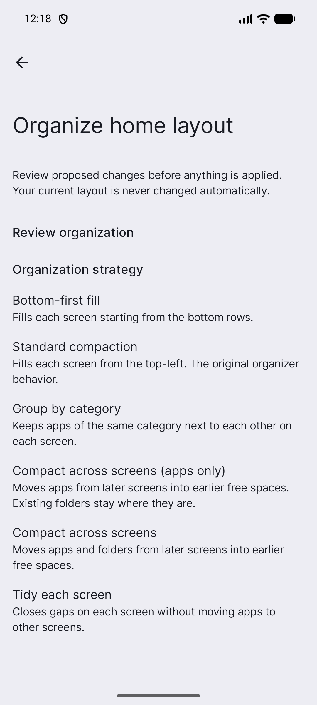
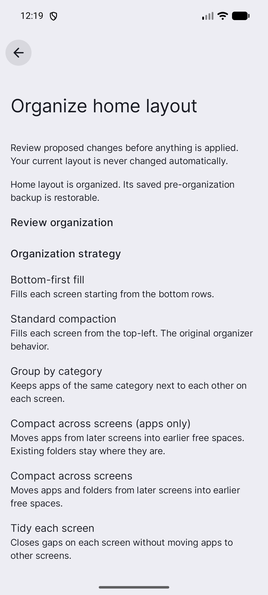

# Independent audit: PR #276 durable organizer status projection for re-opened settings (#271)

> Status: accepted
> Audit date: 2026-09-10

- Auditor: 独立監査セッション (ZCode/GLM general-purpose subagent、実装セッションとは別の作業主体。solo保守の独立session規定に基づく。round 1: `34ca558234…`対象、round 2: `dcc18d053e…`対象 — 両者は別session)
- PR: https://github.com/nunu1733/NunuLauncher/pull/276
- Head SHA: dcc18d053e45f73f62faf42ebd644f8be18ca38c
- CI run: https://github.com/nunu1733/NunuLauncher/actions/runs/34495038063
- Criteria: specs/271-organizer-durable-status-projection/spec.md — DS-AC-01, DS-AC-02, DS-AC-03, DS-AC-04, DS-AC-05, DS-AC-06, DS-AC-07, DS-AC-08, DS-AC-09, DS-AC-10

上記は round 2 (最新) の値。round 1 の対象headは `34ca55823423dcd76c5f3d16953bf319e7acf815`、そのhead上のCI実行は actions/runs/34484392559、round 1 時点のcriteriaは DS-AC-01..08 だった (DS-AC-09/10 はround 2対象commitでspecへ追加)。round 1 の記録は以下に保持する。

## Scope

対象diffは PR #276 の `6b6bf8dd9f..34ca558234` (base `main`)。20 files changed, +1482/-7。

production code の変更は次の 7 file に限定される:

- `lawnchair/src/app/lawnchair/organizer/application/public/OrganizerDurableStatus.kt` (新規: 閉じた enum `NEVER_ORGANIZED` / `ORGANIZED_RESTORABLE` / `UNRESOLVED` / `RESTORED_OR_EXPIRED` / `UNAVAILABLE`)
- `lawnchair/src/app/lawnchair/organizer/application/lifecycle/OrganizerDurableStatusDeriver.kt` (新規: 純粋導出)
- `lawnchair/src/app/lawnchair/organizer/application/protocol/Ports.kt` (`RecoveryStorePort.readInspectionSnapshot()` + `InspectionSnapshotRead` 追加)
- `lawnchair/src/app/lawnchair/organizer/application/store/RecoveryStore.kt` (同port実装)
- `lawnchair/src/app/lawnchair/organizer/application/protocol/LayoutApplicationModule.kt` (`durableOrganizerStatus()`)
- `lawnchair/src/app/lawnchair/organizer/ui/ManualOrganizationRun.kt` (façade `ManualOrganizationApplication` への読み取り専用 delegate 追加)
- `lawnchair/src/app/lawnchair/ui/preferences/destinations/ManualOrganizationPreferences.kt` (Idle/Cancelled での render mapping)

残りは新規/拡張 test (`OrganizerDurableStatusDeriverTest`、`OrganizerDurableStatusInstrumentationTest`、`ManualOrganizationPreferencesInstrumentationTest`、既存 test の façade 実装追加のみ)、EN/ja strings 3 件ずつ、`CONTEXT.md` / `DESIGN.md`、spec/plan。

本PRは `organizer/application/**` (高リスクpath一覧の `lawnchair/src/app/lawnchair/organizer/application/**` に該当) を変更するため、高リスク独立エビデンス契約の適用対象である。監査では次の観点を対象headのdiffと実装に対して独立に確認した:

1. 読み取り専用性: 新規読み取り経路が SQLite open / 書込み / lifecycle遷移 / tombstone purge / journal発行を行わないこと。
2. #89 fence 境界と run-mutex 直列化の維持。
3. deriver の spec 13 retention 語義と plan の導出rule 1–9 の一致。
4. 診断への新規 field / event 追加の不在。
5. projection 型の identity / payload 非漏えい。
6. UI が `ManualOrganizationApplication` façade 経由の閉じた enum のみを読むこと。

### 監査確認結果

**(1) 読み取り専用性 — PASS。** `RecoveryStore.readInspectionSnapshot()` (`RecoveryStore.kt:447-481`) は `snapshotFence.state()` と `snapshotPublisher.reader().read()` のみを通る。`RecoveryInspectionSnapshotReader` は snapshot file の `FileInputStream` 読み取りのみで、SQLite open / probe / write / purge の code path を持たない (source 確認)。`LayoutApplicationModule.durableOrganizerStatus()` (`LayoutApplicationModule.kt:246-278`) は `readInspectionSnapshot()` と `OrganizerDurableStatusDeriver.derive()` のみを呼び、全 failure 経路を `UNAVAILABLE` へ写像し、書込み・発行を行わない。

**(2) #89 fence 境界と run-mutex — PASS。** `readInspectionSnapshot()` は既存 `readInspectionProjection(pointId)` (`RecoveryStore.kt:432-448`) と同一の fence `VALID` + snapshot generation 一致 + 存在しない/stale snapshot は `Unavailable` の pattern そのものである (fence `INCOMPATIBLE` も `Unavailable` へ fail-closed。`InspectionSnapshotRead` には Incompatible variant がなく、spec の fail-closed 語義に合致)。`durableOrganizerStatus()` は module の同一 run mutex (`ordinaryMutex` = apply/recovery protocol と共有の constructor param `mutex`) を `tryAcquire` で非ブロッキング取得し、`finally` で確実に release する。writer 競合は `UNAVAILABLE` (fail-closed)。`readinessGate.runWhenReady(unavailable = ...)` により startup reconciliation 完了前 (`IDLE`/`RECONCILING`/`FAILED`) も fail-closed。

**(3) deriver mapping — PASS。** `OrganizerDurableStatusDeriver.derive()` は plan の導出rule 1–9 と優先順序どおり: (1) 非final lifecycle `{CREATING, READY, APPLYING, COMMITTED_UNVERIFIED, RESTORING}` → `UNRESOLVED`、(2) `CORRUPT`/`INCOMPATIBLE` row → `UNRESOLVED`、(3) `VERIFIED` + checksum 不正 → `UNRESOLVED`、(4) `VERIFIED` かつ `nowMs < createdAtMs + RetentionPolicy.RETENTION_MILLIS` → `ORGANIZED_RESTORABLE`、(5) lapse 後 `VERIFIED` row → `RESTORED_OR_EXPIRED`、(6) `RESTORED`/`EXPIRED` row → `RESTORED_OR_EXPIRED`、(7) retained tombstone `ALREADY_RESTORED`/`EXPIRED` (`expiresAtMs > nowMs`) → `RESTORED_OR_EXPIRED`、(8) retained `CORRUPT`/`INCOMPATIBLE_VERSION` tombstone → `UNRESOLVED`、(9) それ以外 (`PRUNED_UNUSED`/`QUARANTINED` tombstone を含む) → `NEVER_ORGANIZED`。`RetentionPolicy.RETENTION_MILLIS = 86_400_000` (24h, spec 13) を単一sourceとして参照し、literal を複製しない。境界は `nowMs < createdAt + 24h` の排他比較で、`createdAt + 24h` ちょうどでは restorable にならない (DS-AC-04 の語義どおり)。

**(4) 診断 field / event — PASS。** production diff を grep した結果、`RunEvent` / diagnostics / journal への新規 field・phase・発行は存在しない (該当 hit は spec/plan 文書内の記載と既存 test のみ)。

**(5) projection 型の非漏えい — PASS。** `OrganizerDurableStatus` は field を持たない閉じた enum。module 境界を越えるのは enum 値のみで、`DurableRecord`/`DurableTombstone` (pointId / formatVersion を含む snapshot record) は protocol→deriver の内部入力にとどまり、UI / public seam には現れない。

**(6) UI の読み取り経路 — PASS。** UI は `ManualOrganizationRun.readDurableOrganizerStatus()` → `ManualOrganizationApplication` façade → `ProductionManualOrganizationApplication` → module という既存 seam のみを使い、recovery store に直接触れない。render は Idle/Cancelled の場合のみ (`showDurableStatus` を key にした `LaunchedEffect` で状態遷移のたびに再読み取り) で、`ORGANIZED_RESTORABLE` / `RESTORED_OR_EXPIRED` / `UNRESOLVED` のみ行を render し、`NEVER_ORGANIZED` / `UNAVAILABLE` は何も render しない。`UNRESOLVED` は既存 safe-support 行 (`manual_organization_safe_terminal` + diagnostics entry) を再利用。run 中の状態では durable row を render しない。新規文字列は EN/ja 両方に存在する。

## Criteria check

- **DS-AC-01 (PASS)** — `OrganizerDurableStatusInstrumentationTest.verifiedPointIsRestorableAfterProcessDeath` (close/reopen + module-level restart reconciliation 後に `ORGANIZED_RESTORABLE`)。監査セッションで同一 class を emulator 上に独立再実行し 8/8 green。
- **DS-AC-02 (PASS)** — 同 class の `restoredRowPresentsRestoredOrExpiredAfterProcessDeath` (fresh `RESTORED` row) と `expiredRowsEvictedToTombstonesPresentRestoredOrExpired` (eviction 後の `ALREADY_RESTORED`/`EXPIRED` tombstone)。deriver unit test でも両 tombstone reason を直接検証。
- **DS-AC-03 (PASS)** — 同 class の `corruptRowPresentsUnresolvedAfterProcessDeath` / `unreadableVerifiedRowPresentsUnresolvedAfterProcessDeath`; 非final lifecycle と `INCOMPATIBLE` row は deriver unit test (`nonFinalLifecyclesDeriveUnresolved`, `finalCorruptAndIncompatibleRowsDeriveUnresolved`) で網羅。
- **DS-AC-04 (PASS)** — `OrganizerDurableStatusDeriverTest` 16 test: `verifiedAtExactRetentionBoundaryIsNoLongerRestorable` (ちょうど `createdAt + 24h`)、`expiredTombstoneOutsideRetentionDerivesNeverOrganized`、`prunedAndQuarantinedTombstonesDeriveNeverOrganized`、`corruptAndIncompatibleTombstonesDeriveUnresolved`、優先順序 test (`unresolvedRowOutranksARestorableVerifiedRow` 等) を含む。
- **DS-AC-05 (PASS)** — unit: `removingTheRecordInvalidatesTheRestorableProjection`; instrumentation: `prunedCheckpointPresentsNeverOrganized` (record消失後の再導出で restorable にならない) / `unreadableStoreBeforeReconciliationFailsClosed`; UI: `failClosedUnavailableRendersNoDurableRow`。読み取り経路は (1)(2) の確認どおり書込み・journal発行なし。
- **DS-AC-06 (PASS)** — 型は field-free enum (上記 (5))、新規 `RunEvent`/diagnostics 発行なし (上記 (4))、既存 diagnostics 関連 test は diff で触れられていない (façade 実装追加のみ)。
- **DS-AC-07 (PASS)** — `ManualOrganizationPreferencesInstrumentationTest` 38 test (新規 5: `durableRestorableStatusRendersWhileIdle`、`durableUnresolvedStatusRendersSafeSupportGuidance`、`neverOrganizedRendersNoDurableRow`、`failClosedUnavailableRendersNoDurableRow`、`durableStatusIsHiddenWhileARunIsActive`)。監査セッションで独立再実行し 38/38 green。
- **DS-AC-08 (PASS)** — 同一 PR diff に `CONTEXT.md` (「organizer durable status (永続整理状態)」entry)、`DESIGN.md` §4.2 (module が projection seam を所有する旨の1行追記) を含む。

## Executed test surface

監査セッション内で対象 head `34ca55823423dcd76c5f3d16953bf319e7acf815` 上に独立実行:

- `./gradlew spotlessCheck` → BUILD SUCCESSFUL (exit 0)
- `./gradlew testLawnWithQuickstepGithubDebugUnitTest --tests 'app.lawnchair.organizer.*'` (--rerun で強制再実行) → BUILD SUCCESSFUL (exit 0)。result XML: 89 classes / **981 tests / 0 failures / 0 errors / 0 skipped** (新規 `OrganizerDurableStatusDeriverTest` 16 tests を含む)
- 起動済み emulator (`nunu_qpr2_api36_1` API 36、監査セッションは新規起動せず既存 device を使用) 上に:
  - `./gradlew connectedLawnWithQuickstepGithubDebugAndroidTest -Pandroid.testInstrumentationRunnerArguments.class=app.lawnchair.organizer.application.store.OrganizerDurableStatusInstrumentationTest` → **8 tests / 0 failures / 0 errors** (APK build を含め target head 上で成功)
  - `./gradlew connectedLawnWithQuickstepGithubDebugAndroidTest -Pandroid.testInstrumentationRunnerArguments.class=app.lawnchair.organizer.ui.ManualOrganizationPreferencesInstrumentationTest` → **38 tests / 0 failures / 0 errors** (初回試行は test 失敗 0 件のまま BUILD FAILED となった device 側の一過性中断があり、同一 command の再実行で green。test 自体の失敗ではないことを XML で確認)

CI 証拠 (監査実行時点):

- run 34484392559 (CI, `pull_request`, head `34ca558234`): 監査時点で in progress。`check-style` / `organizer-unit-tests` / `build-debug-apk` / `changes` / `validate-repo-contract` は success。instrumentation job 群は pending、`final-status` は未確定。`high-risk-evidence` は本 audit 記録の欠如を理由に fail (本記録の追加がその是正である)。merge operator は同一 commit 上での `CI / final-status` 成功と source job の非skip成功を merge 前に確認すること。

## Findings

- **Blocking: なし。** 監査項目 (1)–(6) と DS-AC-01..08 はすべて対象 head で成立した。
- 参考 (非blocking): spec の frontmatter status は PR head 時点で `accepted` のままである (DS-AC-08 が要求する「status updated in the same PR」の対象を `accepted` への到達と解釈した場合に成立)。workflow の spec status 規則では change を land する PR で `implemented` へ遷移させる先例 (specs/231, specs/89) があるため、merge 時点での `implemented` 遷移を merge operator が確認することが望ましい。
- 参考 (非blocking): deriver の `DurableRecord` は plan の記載より 1 つ多い `updatedAtMs` field を持ち、導出には未使用 (snapshot record からの写像の一貫性のための追加と判断される。境界に影響なし)。
- 未確認範囲: `StrategyPickerInstrumentationTest` / `OrganizerDiagnosticsRouteInstrumentationTest` / `ProductionPublicSeamInstrumentationTest` の instrumentation 再実行は本監査では行っていない (PR 記録の emulator 実行結果と、façade 追加のみの test diff 目視を根拠に扱う)。実機 (物理 device) での process death 再現は未検証 (PR 本文と同様、emulator の close/reopen が restart-equivalent 代理)。

## Overall verdict

**PASS (CI final-status の確定を条件とした承認)** — 対象 head の diff に対し DS-AC-01..08 を独立検証済み。読み取り専用・fail-closed・#89 境界維持・診断不変の主張はいずれも source で成立し、独立再実行 (spotless + 981 unit tests + 46 instrumentation tests) は green。merge gate (`final-status` 成功) と本記録の揃った時点で高リスク独立エビデンス契約を満たす。

## Round 2 (owner review対応の再監査)

> 監査日: 2026-09-10
> 対象head: `dcc18d053e45f73f62faf42ebd644f8be18ca38c` (PR head。round 1 記録commit `51f22c128f` の直後の review-response commit)
> 契約: 同一spec の DS-AC-01..DS-AC-10 (DS-AC-09/10 は対象commitでspec/planへ同時追加)
> 監査主体: round 1 とは別の独立監査session (solo保守の独立session規定に基づく)

### 背景 — owner review の指摘 (state=COMMENTED, 2026-09-10)

1. **[P1] re-read race**: `LaunchedEffect(showDurableStatus)` は boolean key のため、startup reconciliation 中の fail-closed read (`UNAVAILABLE`) が同一Settingsセッションで復帰しない。
2. **[P1] cold settings entry**: exported `PreferenceActivity` が fresh process の最初の Activity になる経路で、`layoutApplicationModule` (lateinit, `onPostInit` で初期化) の未初期化読み取りと、reconciliation 起動条件 (`activity is Launcher`) の未成立が懸念された。
3. **[P2] loading distinct**: 読み込み中が「never organized」と視覚的に区別できない。

worker は head `dcc18d053e…` で対応 ([response comment](https://github.com/nunu1733/NunuLauncher/pull/276#issuecomment-5621070468))。spec/plan も同一commitで DS-AC-09/DS-AC-10 (same-surface recovery / cold-process entry / checking row) へ拡張した。

### Delta scope

`git diff 51f22c128f..dcc18d053e`: 14 files changed, +328/-40。production 5 file:

- `lawnchair/src/app/lawnchair/organizer/application/protocol/ReadinessGate.kt` (observable mirror `stateFlow` 追加)
- `lawnchair/src/app/lawnchair/LawnchairApp.kt` (`ensureOrganizerStartupReconciliation(waitForModel)` 抽出、guard をactivity handlerからappへ移動)
- `lawnchair/src/app/lawnchair/organizer/ui/ManualOrganizationRun.kt` (façade `readinessState` + `ManualOrganizationModule.get` のcold-start安全化)
- `lawnchair/src/app/lawnchair/ui/preferences/destinations/ManualOrganizationPreferences.kt` (effect key へ `readinessState` 追加、checking行)
- `lawnchair/res/{values,values-ja}/strings.xml` (`manual_organization_durable_status_checking` +1 ずつ)

残りは test 7 file (新規test 2件とfakeへの `readinessState` 実装追加のみ) と spec/plan 2 file。読み取りpath本体 (`LayoutApplicationModule.durableOrganizerStatus()`, `RecoveryStore.readInspectionSnapshot()`) はdeltaで不変 (diff 0行) — round 1 の確認結果 (1)(2)(3)(4)(5) は当該headでもbyte-identicalに成立。

### 対応主張のdelta検証 (すべて独立にsource確認)

**(a) ReadinessGate.stateFlow が全遷移を同一lock下でミラー — PASS。** 3箇所のstate変更 (`reconcile` の開始/成功/失敗、`failBeforeReconciliation`) はすべて private `set()` に集約され、`stateRef.set(next)` と `stateMirror.value = next` を write lock 下で同一に行う (`ReadinessGate.kt:70-74`)。`stateRef` はprivateで外部からの直接変更は不可、`runWhenReady` は読み取り専用。StateFlow は conflated のため購読側は常に最新stateを得る。unit test `stateFlowMirrorsEveryGateTransition` が IDLE→RECONCILING→READY の列挙を検証。

**(b) façade `readinessState` とSettings effectのre-key — PASS。** `ManualOrganizationApplication.readinessState: StateFlow<ReadinessGate.State>` → `ProductionManualOrganizationApplication` は `module.readinessGate.stateFlow` を返し、`ManualOrganizationRun.readinessState` がdelegate (`ManualOrganizationRun.kt:79, 116-117, 556-557`)。UI側は `collectAsStateWithLifecycle()` で受けて `LaunchedEffect(showDurableStatus, readinessState)` にre-keyし、gateがterminal stateへ到達すると同一surfaceで `Dispatchers.IO` 再読み取りする (`ManualOrganizationPreferences.kt:106-114`)。navigation不要・timing非依存。

**(c) checking行 — PASS。** Idle/Cancelled branch 内でのみ `if (durableStatus == null) item { ProgressText(manual_organization_durable_status_checking) }` をrenderし (`ManualOrganizationPreferences.kt:207-209`)、active run states (Capturing等) のbranchには存在しないため実行中に決して出ない。読み取りが任意の結果 (UNAVAILABLE / NEVER_ORGANIZED を含む) で確定すれば `durableStatus != null` となりchecking行は消え、fail-closed 2 status は従来どおり無render — loading が「never organized」と混同されず、発明されたstatusも出ない。EN/ja双方に文字列追加。

**(d) `ensureOrganizerStartupReconciliation(waitForModel)` と cold path — PASS。**

- Launcher-resume 経路は `activity is Launcher` で `waitForModel = true` を渡し、挙動は変更前と同一 (guard消費 → model load を最大30s待機 → timeout で `failStartupReconciliation()` = gate FAILED のfail-close → それ以外 `reconcileAtStart()`) (`LawnchairApp.kt:277-282, 134-151`)。
- `waitForModel = false` は `!model.isModelLoaded` のとき `compareAndSet` の**前に** return し、once-guard を未消費のまま残す (`LawnchairApp.kt:130-133`)。よって model 未load の cold settings process で trigger を早期消費して gate を FAILED に毒する経路は存在しない — gate は `IDLE` のまま、`durableOrganizerStatus()` は `runWhenReady` 経由で fail-closed (`UNAVAILABLE`)。その後の Launcher resume が `true` 経路で guard を消費し reconciliation を実行する。
- `ManualOrganizationModule.get` は `app.layoutApplicationModule` を読む前に `LauncherAppState.getInstance(app)` を保証する (`ManualOrganizationRun.kt:134-139`)。`LauncherAppState.INSTANCE` は `MainThreadInitializedObject` で、off-main からは main executor へ submit して待つ (thread-safe)。`onPostInit` → `LawnchairApp.onLauncherAppStateCreated()` → `layoutApplicationModule = LayoutApplicationModule.production(...)` が構築され、値の公開後に hook が走ることを `MainThreadInitializedObject.java:58-70` で確認 (Issue #14 のコメントどおり)。
- model のみ挂在なし確認: `LauncherModel.isModelLoaded()` は `mModelLoaded && mLoaderTask == null && !mModelDestroyed` で、fresh process の settings-only 起動では model は未loadのまま (構築だけではloader開始しない) — `false` 経路が実際にdeferになることを裏付ける。

**(e) 診断・書込み・identity 非漏えい — PASS。** deltaの追加行をgrepした結果、新規 `RunEvent`/journal/diagnostics 発行はなし (`Log.e` は移動した既存timeout経路の1件のみ)。読み取り経路に書込みなし (deltaで読み取りpath本体不変)。新規façade面は field-free の閉じたenum `ReadinessGate.State` (`IDLE/RECONCILING/READY/FAILED`) の `StateFlow` のみで、record payload / revision / digest / item identity を運ばない。

### 冷起動エミュレータエビデンス (DS-AC-10)

workerが取得した cold-process flow の証跡 (emulator `nunu_qpr2_api36_1`) を目視検証し、`docs/assessment/` へ収録した:

- `pr-276-coldpath-fail-closed.png` (12:18): cold process → `am start` でexported PreferenceActivityに `DESTINATION_ROUTE` 直遷移。クラッシュなし、durable status行なし (fail-closed、発明されたstatus行なし)。model未loadのためtriggerはdeferされ、30s後のFAILEDも発生していない (画面に失敗表示がないことと整合)。
- `pr-276-coldpath-restorable.png` (12:19): 同一process内で Launcher resume → reconciliation 完了後の再表示で restorable 行を表示。same-process recovery (DS-AC-09の実機相当面) と一致。
- 監査scopeの明記: 本監査sessionはエミュレータのapp dataを変更しないよう指示されていたため、force-stop → cold-start → resume のシーケンス自体の独立再実行は行っていない。代わりに (i) 2枚の画像の目視検証 (状態・時刻・文言がworkerの説明と一致)、(ii) (d) のwiring source検証、(iii) 同一headでの instrumentation 2件 (`statusRecoversOnTheSameModuleAfterReconciliationCompletes`、`durableStatusRecoversWhenReconciliationCompletesOnTheSameSurface`) により代替検証した。

### 実行した検証 (対象head `dcc18d053e45f73f62faf42ebd644f8be18ca38c` 上、本監査session内)

- `./gradlew spotlessCheck` → BUILD SUCCESSFUL (exit 0)
- `./gradlew testLawnWithQuickstepGithubDebugUnitTest --tests 'app.lawnchair.organizer.*' --rerun` (強制再実行) → BUILD SUCCESSFUL (exit 0)。result XML: 89 classes / **982 tests / 0 failures / 0 errors / 0 skipped** (round 1 の981に `stateFlowMirrorsEveryGateTransition` 追加で+1。`ReadinessGateTest` 14 tests、`ManualOrganizationRunTest` 37 tests)
- 既存起動中の emulator `nunu_qpr2_api36_1` (emulator-5554) を使用 (新規起動・data変更なし):
  - `./gradlew connectedLawnWithQuickstepGithubDebugAndroidTest -Pandroid.testInstrumentationRunnerArguments.class=app.lawnchair.organizer.application.store.OrganizerDurableStatusInstrumentationTest` → **9 tests / 0 failures / 0 errors** (round 1 の8に same-module recovery test 追加で+1)
  - `./gradlew connectedLawnWithQuickstepGithubDebugAndroidTest -Pandroid.testInstrumentationRunnerArguments.class=app.lawnchair.organizer.ui.ManualOrganizationPreferencesInstrumentationTest` → **39 tests / 0 failures / 0 errors** (round 1 の38に same-surface recovery test 追加で+1。flake対象の `changeListTraversalReachesExpandAndReviewActions` を含め全green)

### CI status (監査時点) と merge gate

- run 34495038063 (CI `.github/workflows/ci.yml`, `pull_request`, head `dcc18d053e…`, branch `issue-271-organizer-durable-status-projection`): **completed / conclusion failure**。失敗jobは `organizer-instrumentation-issue52-tests` — `ManualOrganizationPreferencesInstrumentationTest.changeListTraversalReachesExpandAndReviewActions` が `AssertionError: Failed to assert the following: (Focused = 'true')` — と、それを受けて failed となった `final-status`。他の全job (`organizer-unit-tests`, `check-style`, `build-debug-apk`, `validate-repo-contract`, `changes`, instrumentation 6 job中5 job) は success。
- `high-risk-evidence` (run 34495038056, high-risk-gate) は本 round-2 監査記録の欠如を理由に fail — 本記録の追加がその是正である。
- **flake分析 (PR diff に起因しないと判断):** (i) 該当testは本deltaで未変更 (deltaのtest変更は新規2testとfake member追加のみ); (ii) 該当testは Preview 状態のみを走り、checking行は Idle/Cancelled 限定・`readinessState` は既定READYのまま不変のため、deltaが当該testのrender面に到達しない; (iii) 新規testはalphabetical実行順で該当testより後に走り汚染源になり得ない; (iv) 同一headでの同一class独立再実行 39/39 green (本監査)、round-1 head (`34ca558234…`) の同CI job も success; (v) 該当test自体に #209/#209-CI 由来のfocus系CI不安定性への追記修正履歴がある。なお merge ref は main 未変更 (`6b6bf8dd9f`) のため PR head コードそのものを検証している。
- **merge 条件:** 高リスク契約により、merge前に対象head上で `final-status` が成功した CI run と本記録の両方が揃うこと。現状は上記flakeのため未確定 — 失敗jobのre-run (またはworkerによる再発時の対処) で `final-status` を再確立すること。本記録は再確立を条件とした承認である。

### Findings (round 2)

- **Blocking (code): なし。** owner review P1×2 / P2 への対応主張 (a)–(e) はすべて対象headで成立した。
- **Merge gate (条件):** 上記のとおり `final-status` 再確立がmergeの前提。
- 参考 (非blocking): cold settings入口では、初回readが即時に `UNAVAILABLE` へ確定するため checking行は一瞬のみ表示され、model未loadが続く間は durable status 領域は無renderになる (step1 screenshot のとおり)。これは spec の fail-closed 語義・「no invented status」に一致するが、loading表示は「読み取りが結果を知るまで」の表現である点は、将来のUX調整余地として記録する (DS-AC-09 の受入は満たす)。
- 未確認範囲: (i) cold-pathシーケンス本体の独立再実行 (上記の代替検証で扱う、エミュレータdata保護のため); (ii) `StrategyPickerInstrumentationTest` / `OrganizerDiagnosticsRouteInstrumentationTest` / `ProductionPublicSeamInstrumentationTest` の再実行 (deltaはfaçade実装追加のみをdiff目視で確認、round 1と同じ扱い); (iii) 物理deviceでの process death 再現 (round 1と同様、emulatorがrestart-equivalent代理)。

### Round 2 verdict

**PASS (`final-status` 再確立を条件とした承認)** — 対象head `dcc18d053e45f73f62faf42ebd644f8be18ca38c` のdeltaに対し、owner review の P1×2 / P2 への対応を独立検証し、DS-AC-09/DS-AC-10 を含む全criteriaを確認。独立再実行 (spotless + unit 982 + instrumentation 48) は green。merge には (1) 本記録、(2) 対象head上での `final-status` 成功 (flake job の re-run を含む) の揃うことを要求する。
