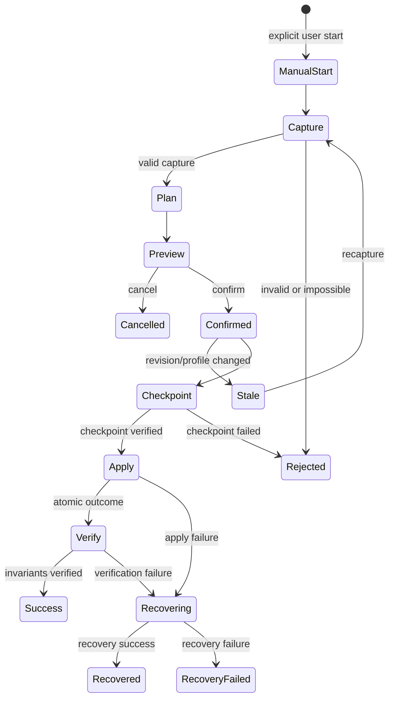
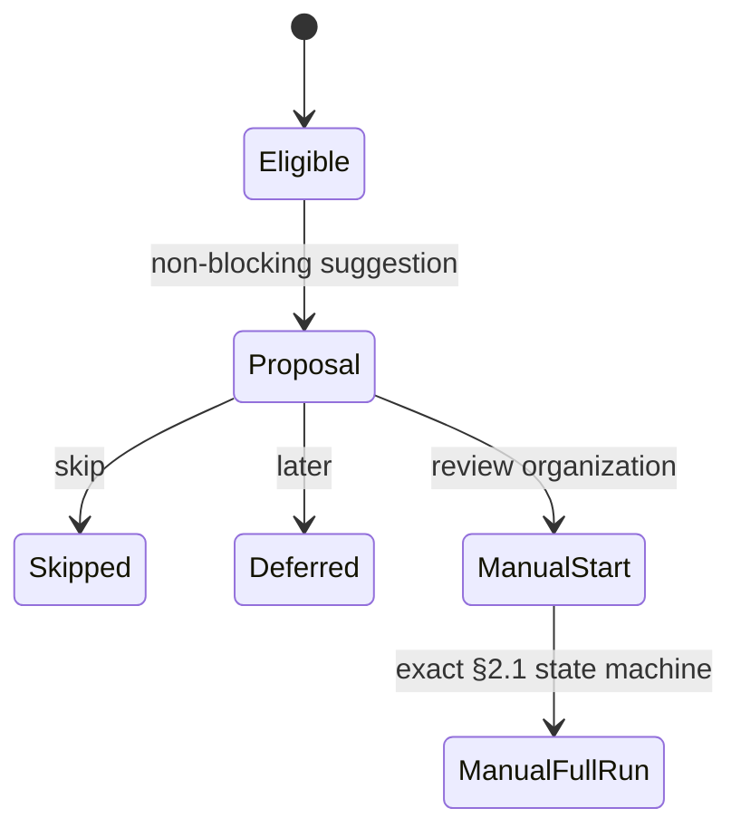
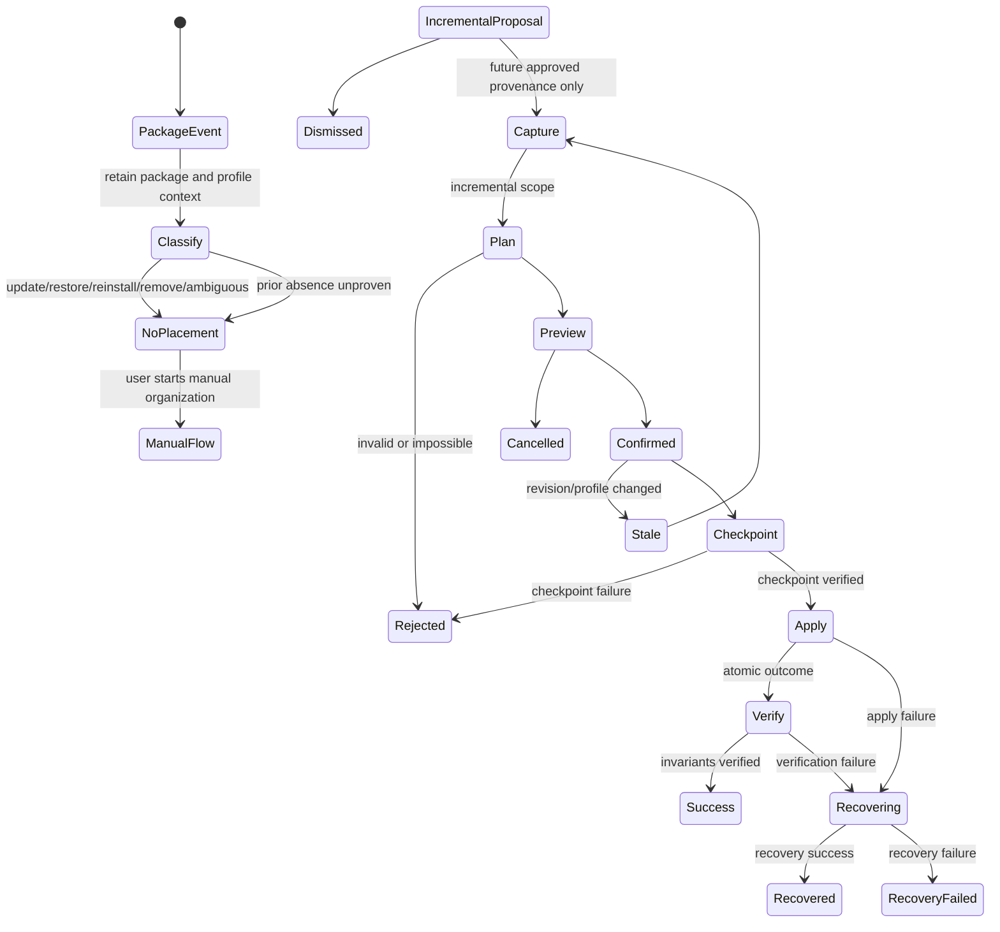

# Organization Run UX Contract

> Status: Implemented for manual/onboarding MVP; package-event incremental placement is Later/deferred
> Reviewed: 2026-08-23
> Baseline: Lawnchair `v15.0.0-beta3.0` / commit `505dbc40e6154c05158b5d0271c45f6a885a411b`
> Requirements: FR-004, FR-006, FR-007, FR-008, FR-009, NFR-001, NFR-009, NFR-011
> Decision gates: D-004 (trigger), D-005 (safe UX)
> Primary scope/dependency record: [Issue #4](https://github.com/nunu1733/NunuLauncher/issues/4); package-event MVP disposition: [Issue #85](https://github.com/nunu1733/NunuLauncher/issues/85) (Option B)

## 1. Purpose and safety boundary

本書は手動全体整理、onboarding 提案、package event 後の増分配置を別々の
user-visible policy として定義する。どの入口も `DESIGN.md` の Organization run
を短絡しない。snapshot、plan、preview/confirmation、stale 判定、recovery point、
atomic apply、post-apply verification の順序を必ず守る。

これは UX の観測可能な約束であり、DB/transaction/recovery metadata の実装、
platform bridge、module/interface/seam を決めない。safe-application contract は
[Issue #13](https://github.com/nunu1733/NunuLauncher/issues/13)、privacy-safe
diagnostic の field/retention は [Issue #16](https://github.com/nunu1733/NunuLauncher/issues/16)
が所有する。

- stale または未検証の plan を確認・適用しない。
- recovery point の作成・検証に失敗したら書き込まない。
- profile identity change は禁止し、plan を reject して書き込まない。deletion、overwrite/
  replacement、lock change は generic confirmation では承認しない。
- cancel で atomic write を途中中断して部分 layout を残さない。
- onboarding/install/update/restore を全体整理への同意とみなさない。

## 2. D-004: trigger policy proposal

**Current MVP policy:** manual full organization、onboarding proposal、package event後の
incremental placement を別 policy とする。MVPではmanual full organizationとonboardingからのreviewだけが
organization runへ進む。package eventは[Issue #85](https://github.com/nunu1733/NunuLauncher/issues/85)のOption Bにより
incremental proposalを開始せず、manual flowのみ利用可能である。auto-incrementalは採用・許可しない。
将来、MVP外のincremental placementを再検討する場合も、proposal + preview + explicit user confirmation、
completeなrun/recovery/result UX、Issue #13のsafe-apply criteriaが必要である。

### 2.1 Manual full organization

手動全体整理は user が明示的に「整理を開始」した時だけ開始する。empty diff は
「変更なし」と表示し、書き込まない。full-layout change は常に preview と
explicit confirmation が必須である。

Confirmed は current revision に対する条件付き同意であり、write の無条件許可
ではない。Preview から cancel、詳細確認、retry、stale recapture を選べる。

### 2.2 Onboarding proposal / skip / retry

Onboarding は non-blocking の提案だけを行う。skip/defer は有効な選択であり、
layout、settings、target set を変更しない。user が「review organization」を
選んだ場合は、§2.1 の**完全に同一の Manual full organization state machine**へ
遷移する。従って reject、stale、checkpoint failure、apply/verify failure、recovery、
cancel、process-death path もすべて §2.1 と §5 を継承する。retry は常に新しい
Capture から始め、古い preview/plan を再利用しない。

### 2.3 Incremental placement after package events

`ModelLauncherCallbacks` converts callbacks to OP_ADD/OP_UPDATE/OP_REMOVE/
OP_UNAVAILABLE etc. Callback 名だけでは genuinely new install を証明しない。

| Event assessment | Required UX behavior |
|---|---|
| 現baselineのpackage event（session reasonがUSER、current targetが一意でも、event前の権威あるinstall履歴がない） | `Ambiguous(PRIOR_ABSENCE_UNPROVEN)`。incremental proposal/placementを開始しない。manual flowは利用可能。 |
| update、replacing、availability return、restore、reinstall、existing target再検出 | 新規配置しない。必要なら既存 item を保持した情報だけを非侵襲的に示す。 |
| package/user/profile未解決、quiet/locked、launcher activityが0件、または一意に解決できない複数activity、duplicate target、event由来が曖昧、presence/provenance/target evidenceがmissing/stale/contradictory/process-deathで失われた | ambiguous と分類し、配置しない。user は後で manual flow を開始できる。 |
| remove/unavailable/suspend | incremental placement を開始しない。既存 layout は preservation policy に従う。 |

MVPではauto-incrementalを許可しない。Issue #54の調査では、現baselineに過去install履歴を
権威的に得るsourceがなく、reinstall除外を証明できないため、package eventによるincremental
eligibility自体を有効化しない。証拠比較は
[package-provenance](../engineering/package-provenance.md)、negative decisionの判断・理由は
[ADR-0005](../adr/0005-fresh-install-presence-evidence.md)のみを正本とする。
[Issue #85](https://github.com/nunu1733/NunuLauncher/issues/85)はOption Bを選択し、FR-008/FR-009の
package-event incremental placementをMVP外のLater/deferred capabilityとした。したがってpackage eventは
proposal/confirmationへ進まず、manual flowだけを利用可能とする。将来の再開には、新しいproduct decisionで
authoritative historyとrace/crash protocolを承認し、accepted specを作成することが必要である。

## 3. D-005: preview, confirmation, and recovery proposal

**Propose to adopt:** recovery は Foundation の必須 capability とする。full-layout
change は preview と explicit confirmation を常に必要とする。Later/deferred capabilityとして
再開されるincremental placementもproposal/confirmationを必要とし、auto-applyの例外はない。

recovery point の作成、検証、retention、容量、expiration、atomic recovery は
Issue #13 の ownership である。UX は次を保証する。

- verified recovery point がなければ apply しない。
- retention 中は result/recovery surface から user が recovery action に到達できる。
- recovery 前に戻る対象と失う可能性のある後続変更を示す。
- export backup は immediate recovery point の代替ではない。
- 保存先や retention 数値を本書で固定しない。

## 4. Preview, confirmation, result, and recovery

### 4.1 Preview contract

| Content | Required behavior |
|---|---|
| scope/trigger | manual/onboarding、full とtarget profile・対象集合を表示する。Later/deferred capabilityとして再開されるincremental placementは、そのtriggerとincremental scopeを明示する。 |
| diff/reasons | move、preserve、explicit deletion、new placement、unchanged、unplaced の count と主要理由を表示する。 |
| warnings | capacity、unsupported item、disabled/locked profile、widget/app pair、legacy/restore、lock、stale risk を影響とともに表示する。 |
| locks/profiles | locked placement/occupied region と profile identity を視覚だけに依存せず区別する。 |
| destructive effects | profile identity change は prohibited/reject と表示する。deletion、overwrite/replacement、lock change は item-level reason/effect と別 confirmation を必要とする。 |
| empty diff | 「変更は適用されない」を示し、confirm を write action に見せない。 |

profile identity change を含む plan は reject であり書き込まない。deletion、
overwrite/replacement、lock change は generic confirmation で承認されない。これらは
accepted owner policy による explicitly eligible plan action、item-level reason/effect
preview、必要な separate confirmation を全て満たす場合だけ可能であり、それ以外は
reject/no write とする。lock persistence は
[ADR-0004](../adr/0004-organizer-lock-persistence.md)、lock authoring/reviewは
[Issue #38](https://github.com/nunu1733/NunuLauncher/issues/38)に従う。
empty-folder deletion の振る舞いは
[spec 24](../../specs/24-empty-folder-policy/spec.md)
（[Issue #24](https://github.com/nunu1733/NunuLauncher/issues/24)）が所有する。
v1 は削除を提案しない。将来の削除を含む surface は本節の destructive-effects 規則と
§6 の accessibility 規則に従う。

reject の場合は confirm を表示せず、原因、retry 可否、何も変更せず終了する選択を
示す。warnings/unplaced は generic confirmation の背後へ隠さない。

### 4.2 Execution and recovery feedback

| Condition | Required observable result |
|---|---|
| confirm | 対象、count、warning、recovery 可否を含む explicit action。 |
| cancel before checkpoint | no write。preview へ戻るか終了する。 |
| cancel after checkpoint/during apply | request を表示するが atomic write は中断しない。commit または rollback/recovery の完了後に final result を示す。 |
| checkpoint failure | 「変更は適用されなかった」、retry/cancel を示す。 |
| apply/verification failure | false success にしない。recovery success/failure を別結果として示す。 |
| stale | 「layout/device/profile changed; recapture required」と示し Capture へ戻す。 |
| success | applied/preserved/unplaced counts、warning、recovery action、trigger を示す。 |
| recovery failure | 現在状態が保証できないこと、追加 write をしないこと、safe diagnostic/support path を示す。 |

## 5. Failure, cancel, and process-death matrix

| Stage | Cancel / process death / failure | Required behavior |
|---|---|---|
| Capture | cancel, read failure, profile/device change | no write; cancelled/rejected reason; retry is new Capture. |
| Planning | cancel, invalid rule/capacity/unsupported item | no write; no hidden fallback mutation. |
| Preview | cancel, process recreation | no write; restore only if revision valid, otherwise recapture. |
| Confirmed before checkpoint | cancel or revision change | no write; cancel or stale recapture. |
| Checkpoint | creation/validation failure or process death | no apply; incomplete checkpoint never authorizes write. |
| Apply | cancel request or process death | do not interrupt atomic write unsafely; complete transaction outcome or rollback/recovery. Restart resumes status/recovery only, never blind writes. |
| Verify | invariant/reload failure or process death | no success; initiate/offer recovery and report verification failure. |
| Success | later recovery request | retention policy truthfully exposes recovery or expiry. |
| Recovering | recovery failure/process death | no mutation beyond recovery protocol; show safe diagnostic/support path. |

Retry never replays an old plan/checkpoint/write. Progress is not a modal trap: it names
current phase and safe cancel semantics.

## 6. Accessibility acceptance criteria

| Area | Acceptance criterion |
|---|---|
| TalkBack | trigger, preview summary, warning, confirm/cancel/retry/recovery expose name, role, state, result; summary includes counts/destructive effects. |
| Focus | opening, details expansion, stale/reject, and recovery result have deterministic meaningful focus restoration. |
| 200% reflow | no clipping, overlap, required horizontal scroll, or unreachable important action at 200% font scaling. |
| Warnings | never color-only; use text, icon/state, and necessary action. |
| Keyboard/switch | logical traversal reaches trigger → details → confirm/cancel/retry/recovery and activates every action. |
| Progress | announce each phase transition once; avoid spam; explain any short non-cancellable atomic interval. |
| Touch/contrast | meet existing platform touch-target/contrast standards; do not introduce lower thresholds. |
| Timeout/recovery | no timeout auto-confirms/cancels. Onboarding defer and recovery action remain reachable during retention. |

## 7. Privacy-safe diagnostic summary

NFR-011 events contain only privacy-safe run ID, trigger, phase transition,
outcome/error category, summary counts, and recovery result. Typed fields,
redaction, local retention, export, and logcat behavior are owned by
[organizer-diagnostics](../engineering/organizer-diagnostics.md)
([Issue #16](https://github.com/nunu1733/NunuLauncher/issues/16)).

| Field | Allowed | Not recorded by default |
|---|---|---|
| correlation | opaque random run ID | package/component/title/raw user-profile serial |
| trigger/phase | manual/onboarding/incremental and phase transition | UI text, layout coordinate, rule contents |
| outcome | success/cancel/reject/stale/checkpoint/apply/verify/recovery category | DB row or recovery-point content |
| counts | moved/preserved/new/unplaced/warning/recovery counts | folder title, screen/cell/span, profile identifier |

External transport is out of scope and default off. Developer diagnostics do not
replace user-facing explanations.

## 8. Coverage for baseline and future UI tests

| Scenario | Acceptance evidence |
|---|---|
| manual full | explicit start → preview → confirm; stale checkpoint does not write; recovery action after success. |
| onboarding | non-blocking; skip/defer mutate nothing; accepted route still previews/confirms. |
| package event — new organizer path (current baseline) | Every package event, including a USER session with a unique current target, produces no **new organizer** incremental proposal or placement; manual organization remains available. |
| package event — legacy Deck | #57 / PR #79 retired the Deck runtime and removed its package-event hook without a replacement. It is not an organizer path and cannot be reused to implement incremental placement. |
| package event (Later/deferred only) | [Issue #85](https://github.com/nunu1733/NunuLauncher/issues/85) selected Option B, so this is not an MVP acceptance condition. Only a later accepted product decision/spec that provides authoritative install history may test proposal → preview → explicit confirmation. |
| launcher activity candidates (current baseline) | package/profile から launchable target が 0 件、または複数で一意に解決できなくても、または一意でもprior absenceが証明できなくても、新organizer経路ではincremental proposal/placementを行わず、manual flowを許可する。 |
| diff/warning/unplaced | counts, reason, and destructive effect visible; empty diff writes nothing. |
| cancel/recreation | no partial state claimed; retry recaptures; atomic interval is safe. |
| failure/recovery | checkpoint/apply/verify/recovery failures have distinct messages and safe next action. |
| profiles/constraints | personal/work/private, lock, widget/app pair prevent unsafe auto policy. |
| accessibility/diagnostics | §6 passes; category/count-only diagnostic has no raw layout or identity data. |

## 9. Baseline evidence and non-reuse

Issue #2 establishes these baseline facts at the fixed commit:

- `HomeLayoutSettings` toggles Deck and invokes `LawndeckManager` through a
  non-dismissible loading dialog (`HomeLayoutPreferences.kt:112-143`).
- `LawndeckManager` immediately queues/adds items, uses fixed
  `postDelayed(..., 800)`, copies raw DB/journal `bk`/`lawndeck` files, then calls
  `RestoreDbTask.performRestore` and `restartLauncher`
  (`LawndeckManager.kt:34-166`).
- `restartLauncher` schedules restart then calls `exitProcess(0)`
  (`LawnchairUtils.kt:85-114`).
- `ModelLauncherCallbacks.onPackageAdded` dispatches
  `PackageUpdatedTask(OP_ADD, user, package)`; Deck immediately calls
  `addNewlyInstalledApp` when enabled
  (`ModelLauncherCallbacks.kt:40-42`, `PackageUpdatedTask.java:456-473`).
- Lawnchair user backup is a ZIP holding launcher DB, preferences, and metadata,
  distinct from immediate recovery (`LawnchairBackup.kt:60-86, 134-140`).

These paths are not reused: raw file copy can fail without blocking continuation,
fixed delay is not completion evidence, and `exitProcess` cannot provide an
in-app atomic recovery result. The accepted safe-apply policy must instead
satisfy §§1–5 and is owned by Issue #13.

- [LawndeckManager.kt](https://github.com/LawnchairLauncher/lawnchair/blob/505dbc40e6154c05158b5d0271c45f6a885a411b/lawnchair/src/app/lawnchair/deck/LawndeckManager.kt)
- [HomeLayoutPreferences.kt](https://github.com/LawnchairLauncher/lawnchair/blob/505dbc40e6154c05158b5d0271c45f6a885a411b/lawnchair/src/app/lawnchair/ui/preferences/components/HomeLayoutPreferences.kt)
- [ModelLauncherCallbacks.kt](https://github.com/LawnchairLauncher/lawnchair/blob/505dbc40e6154c05158b5d0271c45f6a885a411b/src/com/android/launcher3/model/ModelLauncherCallbacks.kt)
- [PackageUpdatedTask.java](https://github.com/LawnchairLauncher/lawnchair/blob/505dbc40e6154c05158b5d0271c45f6a885a411b/src/com/android/launcher3/model/PackageUpdatedTask.java)
- [LawnchairBackup.kt](https://github.com/LawnchairLauncher/lawnchair/blob/505dbc40e6154c05158b5d0271c45f6a885a411b/lawnchair/src/app/lawnchair/backup/LawnchairBackup.kt)
- [RestoreDbTask.java](https://github.com/LawnchairLauncher/lawnchair/blob/505dbc40e6154c05158b5d0271c45f6a885a411b/src/com/android/launcher3/provider/RestoreDbTask.java)
- [LawnchairUtils.kt](https://github.com/LawnchairLauncher/lawnchair/blob/505dbc40e6154c05158b5d0271c45f6a885a411b/lawnchair/src/app/lawnchair/util/LawnchairUtils.kt)
