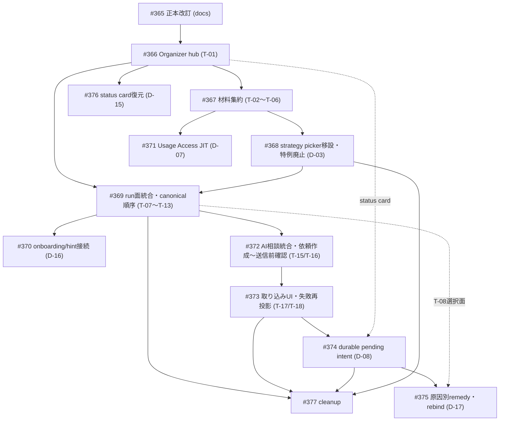

# Organizer Disposition and Migration Plan

> Status: accepted（owner review 2026-09-19。ChatGPT reviewを3回実施し、R1/R2の指摘を解消したうえでR3は指摘なし・Approve相当（[R1](https://github.com/nunu1733/NunuLauncher/pull/378#issuecomment-5733985885) / [R2](https://github.com/nunu1733/NunuLauncher/pull/378#issuecomment-5734075706) / [R3](https://github.com/nunu1733/NunuLauncher/pull/378#issuecomment-5734136034)）。ownerがmergeと#362/#357〜#360のcloseを指示。本書は判断文書であり実装を要求しないため、実装の所有は#365〜#377（依存順は§8）が持つ）
> 2026-09-19追記（[#367 re-review](https://github.com/nunu1733/NunuLauncher/issues/367#issuecomment-5741019899)対応、段階ownershipの明確化）: §2.3/§3.10/§5/§7.2のとおり、#367は材料row（Layout group＋Personalization group）の移動のみを所有し、D-01「設定側は入口rowだけを残す」の最終完成（General groupのmanual organization直行row廃止＋spec 232 AC-3改訂＋hint更新）は#370が所有する。spec 203は常設row配置の改訂（#367）→JIT要求追加（#371）の二段階で改訂する。
> Proposed: 2026-09-19
> Accepted: 2026-09-19
> Parent: [Issue #362](https://github.com/nunu1733/NunuLauncher/issues/362)（Epic [#356](https://github.com/nunu1733/NunuLauncher/issues/356) Phase C）
> Inputs: [Organizer TO-BE UX decision（accepted）](./organizer-to-be-ux.md)（D-01〜D-17）、[Organizer AS-IS UX/data flow audit](../assessment/organizer-as-is-ux-data-flow-audit.md)（audited HEAD `b728ed4d9f30ee797f6e086da110fdc86215da92`、findings F-01〜F-10 / E-1〜E-7 / 監査D-1〜D-9）
> 本書の役割: 既存Issue/spec/実装の処分（Continue / Amend-Supersede / Defer / Retire）の正本、normative doc更新順序、persistence/navigation migration方針、実装backlog（#365〜#377）の依存順。TO-BE方針そのものはorganizer-to-be-ux.mdが正本であり、本書はそれを変更しない。

---

## 1. 適用規則

#362 Rulesおよび#356 authority ruleに従い、次のとおり判定した。

- implemented / acceptedだからContinueとは判定していない。各項目についてTO-BE decision（D-01〜D-17）との整合を個別に照合した。
- supersede（旧decision/ACの置換）を行う場合は、置換される旧規定と新規定の対応を §5 supersession map に明記した。
- Retireした項目は現時点で0件（役割消滅はなく、全てAmendまたはContinueで足りる）。dead codeのうち`Trigger.INCREMENTAL_PROPOSAL`と`LOCAL_FULL` tier UI語彙はDefer（§4.3）。
- persistent data formatを新設する変更（D-08 durable pending intent）は、migration/compat/rollbackを §7 に先に定義した。
- safety/privacy invariant（TO-BE §2の7 property）を変更する項目は0件。scope gate・送信前確認・適用authorityのgate構造は全項目で維持される。
- 旧UXを固定するtest oracleは、削除ではなく「旧oracleがなぜobsoleteか」を各実装IssueのPRへ記録する（#368/#369/#373/#377）。

## 2. Summary disposition matrix

TO-BE relation: 整合 / 一部衝突 / 全体衝突 / 役割消滅。Orderは §8 の実装backlog（WS-x = #365〜#377）を指す。

### 2.1 Minimum impact set（#362掲載の全18 Issue）

| Issue | 現在の所有物 | TO-BE relation | Disposition | Order |
|---|---|---|---|---|
| #4 organization-run UX（closed） | `organization-run-ux.md`（D-004 trigger / D-005 safe UX） | 一部衝突（入口・復元導線のみ。§4/§5安全契約は整合） | **Continue + Amend** | #365 |
| #38 lock authoring（closed） | lock authoring UI・UNKNOWN review（spec 38, ADR-0004） | 整合（経路がT-04へ移動のみ。契約不変） | **Continue** | #367 |
| #52 manual full organization（closed） | manual run縦切り（spec 52） | 一部衝突（MFO-AC-01順序・MFO-18面配置 vs D-05/D-06） | **Amend** | #369 |
| #53 onboarding（closed） | onboarding提案（spec 53） | 整合（D-16継続。接続先表記のみ） | **Continue（表記更新）** | #370 |
| #83 production OrganizationInput sources（closed） | composer入力供給境界（spec 83） | 整合（composition時点・源不変。可視化はD-07が別所有） | **Continue** | — |
| #84 recovery preview seam（closed） | read-only revision-bound復元preview seam | 整合（seamはD-15の新入口から再利用） | **Continue** | #376（参照） |
| #99 category override（closed） | override authoring（spec 99） | 整合（経路がT-02へ移動のみ） | **Continue** | #367 |
| #182 layout strategy catalog（closed） | strategy catalog・選択契約（spec 182, ADR-0012） | 一部衝突（run面picker配置・run中変更特例 vs D-03） | **Amend** | #368 |
| #203 usage signals（closed） | signal snapshot・権限導線（spec 203） | 一部衝突（U-2常設rowのみ vs D-07 JIT追加） | **Amend**（二段階） | #367（U-2配置）→ #371（JIT） |
| #204 context/intent contract（closed） | exchange data契約（spec 204） | 整合（契約不変。LOCAL_FULL UI語彙除外の文言のみ D-14） | **Amend（文言のみ）** | #372 |
| #205 External Agent Exchange（closed） | exchange workflow（spec 205） | 一部衝突（entry導線・失敗表示・pending保持規定 vs D-04/D-08/D-10/D-11） | **Amend（一部supersede）** | #372, #373, #374 |
| #228 missing-app selection（closed） | 未配置app明示選択（spec 228） | 一部衝突（0件でも選択面表示 vs D-06非表示） | **Amend** | #369, #375 |
| #328 import success state（**open**, spec accepted, **実装済み PR #353**） | 取り込み成功状態（spec 328。strategy固有条項は#368が狭く改訂済み） | 一部衝突（process-local規定・freeze規定 vs D-08 durable・再設計） | **Amend-Supersede（strategy固有条項は#368が改訂、残りは#374のrev.2）** | #368（strategy条項）→#373（表示）→#374（spec rev.2） |
| #329 normalizer（closed） | import normalizer（spec 329） | 整合 | **Continue** | — |
| #331 target/scope coupling（closed） | scope結合・fail-closed gate（spec 331） | 一部衝突（単一remedy・生存run attachのみ vs D-17原因別remedy・死後rebind） | **Amend** | #375 |
| #332 import input UI（closed） | clipboard/file-first入力（spec 332） | 整合（構造不変。配置表記のみT-17へ） | **Continue（表記更新）** | #373 |
| #336 user-defined categories（closed） | ユーザー定義カテゴリ（spec 336） | 整合（経路がT-02/T-03へ移動のみ） | **Continue** | #367 |
| #337 AI category/group proposal（**open**, spec accepted） | run-scoped group提案・昇格（spec 337、未実装） | 整合（契約不変。表示面はT-18/AI flowへ） | **Continue** | #373（配置のみ）。実装は受入済みspecどおり |

### 2.2 正本doc / ADR

| 正本 | TO-BE relation | Disposition | Order |
|---|---|---|---|
| `organization-run-ux.md` | 一部衝突（§2.1/§2.2入口、§3復元導線） | **Continue + Amend**（supersedeしない。TO-BE §11の理由を踏襲: D-004/D-005が本体であり置換は追跡性を壊す） | #365 |
| `product-brief.md` | 一部衝突（hub・AI相談の位置づけが未反映） | **Amend** | #365 |
| `requirements.md` | 一部衝突（FR-006/FR-017可視表現） | **Amend**（新FR/NFRは追加しない — §6判断） | #365 |
| `DESIGN.md` | 一部衝突（gate 2参照先・§4.4 UI adapter） | **Amend** | #365 |
| `CONTEXT.md` | 不足（hub/材料/依頼/取り込み済み提案/語彙規約の用語なし） | **Amend**（用語追加） | #365 |
| `organizer-to-be-ux.md` | — | **Continue**（accepted正本。IA/navigationの所有） | — |
| ADR-0003 / 0004 / 0007 / 0012 | 整合（recovery storage・lock・policy sources・strategy catalog契約は不変） | **Continue** | — |

### 2.3 隣接項目（minimum set外だがTO-BE §11・監査が言及）

| 項目 | TO-BE relation | Disposition | Order |
|---|---|---|---|
| spec 271 durable status projection | 一部衝突（Non-goals cold-process restore がD-15と衝突。DS-AC-07表示面がstatus cardへ） | **Amend** | #376 |
| spec 283 strategy picker affordance | 一部衝突（Non-goalsがrun面配置・dismiss+再startを凍結） | **Amend** | #368 |
| spec 232 re-entry hint | 一部衝突（AC-1案内先がhubへ、AC-3入口row位置がD-01完成後のhub入口row 1件構成へ。#367段階ではAC-3を維持しmanual organization直行rowは暫定併存） | **Amend** | #370 |
| spec 327 interview-first | 一部衝突（Decision 4 capability説明の配置前提） | **Amend** | #372 |
| spec 123 UI convergence | 整合（新surfaceへAC-1/AC-2/AC-4/AC-5を適用。Non-goalsのanti-redesignとhubは両立: hubは既存settings visual languageを使う） | **Continue（inventory更新）** | #366 |
| spec 13 / 194 / 195 / 210 / 231 / 330 / 348 | 整合（安全契約・AI-facing契約はTO-BE §2/§7.2が明示維持） | **Continue** | —（#210は#369で表示面注記のみ） |
| #348 AI-facing contract同期（open） | 整合（文書内容の契約は不変。表示面はAI flow） | **Continue** | 実装時#372/#373と整合 |
| #206 managed AI（open） | 整合（将来capability。hub「方法」が受け皿） | **Continue（deferredのまま）** | — |
| `Trigger.INCREMENTAL_PROPOSAL`（未使用enum） | 役割なし（監査D-7） | **Defer**（維持。FR-008再開時のtrigger契約で再評価。#377で判断記録） | — |
| `LOCAL_FULL` tier UI語彙 | UIから除外（D-14。契約値は維持） | **Defer**（将来local LLM #206向け） | #372 |

## 3. 項目別disposition詳細（minimum impact set）

各項目: 現状の所有物 / 衝突点 / 処分と根拠 / doc変更 / runtime migration / compatibility / test migration。

### 3.1 #4 + `organization-run-ux.md` — Continue + Amend

- 現状: D-004 trigger policy（manual/onboardingのみMVP、package eventはOption B defer）とD-005 preview/confirmation/recovery安全契約、§4 preview要件表、§5 failure/cancel/process-death matrix、§6 accessibility受入基準を所有。
- 衝突点: §2.1/§2.2の入口が「Home Screen settings」直参照（hub経由に変わる）。§3 recoveryの再入口が「result/recovery surface」のみ（D-15のstatus card導線が加わる）。いずれも契約の追加・変更ではなく入口と表示面の更新。
- 処分: **Continue + Amend**（supersedeしない）。D-004/D-005と§4/§5/§6はTO-BE §2/§7.2が維持を明示しており、package event（FR-008/009 deferred）の扱いも不変。
- doc変更: #365で§2.1/§2.2入口をhub経由へ、§3へD-15導線を追記、IA/navigationの所有がorganizer-to-be-ux.mdへ移った旨を明記。
- runtime migration: なし（doc）。compatibility: なし。test migration: なし（§8 coverage表は#369/#376実装時に参照更新）。

### 3.2 #38 lock authoring — Continue

- 現状: lock/unlock authoring UI・UNKNOWN一括review（spec 38 implemented）。tri-state永続化はADR-0004、workspace長押しdialog（T-20相当）はflow外入口。
- 衝突点: なし。lock管理画面（V-38）は材料T-04としてhub配下へ移動するが（D-01）、契約・lease・書込み経路は不変。workspace dialogはTO-BE §5.2でsecondary entryとして明示継続。
- 処分: **Continue**。spec 38は入口表記の追記のみ（#367）。
- runtime migration: settings Layout groupのrowがhubへ移動（navigationのみ）。compatibility: なし。test migration: navigation instrumentationのroute更新のみ。

### 3.3 #52 manual full organization — Amend

- 現状: manual run縦切り（spec 52 implemented）。MFO-AC-01（capture→plan→preview→確認→checkpoint/apply→検証/結果の順序）、MFO-18（decision pairをstate heading直下に置く面配置。persistent surfaceを要求しない）、state vocabulary節（coordinatorが公開しうるstate列挙）。
- 衝突点:
  1. MFO-AC-01のpipelineに検出（candidate detection）phaseが無く、D-05のcanonical順序（admission→**検出**→[選択]→capture/plan→確認）と並びが異なる。
  2. 20状態の表示を8ユーザー状態へ統合するD-05に対し、state vocabulary節がrun状態をそのままUI語彙として列挙している（内部契約は不変だが、spec上の表記を「表示統合は契約を変えない」旨とする必要がある）。
  3. preview/確認/結果の面構成がV-16/V-17/V-18・V-20/V-21の個別面規定となっており、T-10/T-12/T-13への統合表示と対応が要る。
- 処分: **Amend**（#369）。MFO-AC-01へ検出phaseを挿入し、D-06（候補0件時選択面非表示）を反映。MFO-18のdecision pair規定はT-10で維持されるため保持。
- doc変更: spec 52改訂（#369のPRで実施。amended内容は上記3点に限定し、safe apply契約は触れない）。
- runtime migration: 表示統合のみ。内部state machine・typed outcome不変。compatibility: process death時のrun喪失は現行どおり（D-08対象外）。test migration: ManualOrganizationRunTestのstate期待値は不変。表示面のinstrumentation（個別失敗面・選択面必須通過を固定するoracle）を更新し、obsolete理由（F-04/V-09の解消）をPRに記録。
- 2026-09-20追記（[#369 re-entry review](https://github.com/nunu1733/NunuLauncher/issues/369#issuecomment-5740051014)対応）: 本項の「内部state machine・typed outcome不変」「ManualOrganizationRunTestのstate期待値は不変」は、D-06の0件時選択面非表示を**表示統合として実装する**ことで成立する（#369 spec RD-3）。coordinatorは0件でも既存どおり`State.Selecting`へ進入した直後にcoordinator内部の専用continuationでcomposed phaseへ継続する（遷移graph・entry条件・journal規則は不変）。UIは選択面を構成せず、更新されるtestは0件経路の継続timing oracleのみである（obsolete理由を実装PRへ記録）。あわせて、#369のT-09中断により検出中cancelがユーザー到達可能になることに伴い、検出完了後の進入判定と`RUN_STARTED`発行を同一lock下でatomic化するgateをcoordinatorに追加する。これは既存のjournal契約（composed phase前のcancelはjournalを空のままにする）の強制であり契約変更ではない（#369 spec RD-6）。

### 3.4 #53 onboarding — Continue（表記更新）

- 現状: fresh install判定・defer/skip outcome・再表示規則（spec 53 implemented）。AC-003「確認は#52 workflowを再利用」。
- 衝突点: なし（D-16で契約継続决定済み）。表記のみ: 「確認」がT-07前置きを省略してrun admissionへ直行、hintの案内先がhub入口。
- 処分: **Continue**。spec 53の接続先表記を#370で更新（§3.2/§5.2〜5.3）。outcome/backup協調（監査D-5を含む）は不変。
- runtime migration / compatibility: なし。test migration: hint・遷移先のtest更新のみ（#370）。

### 3.5 #83 production OrganizationInput sources — Continue

- 現状: fresh manual compositionの入力供給境界（spec 83 implemented）。dynamic cut 4源の2回読み+cut後personalization 1回読み。
- 衝突点: なし。TO-BE §7.2「確定時点の集合自体は変えない。変えるのはユーザー可視性と説明」どおり、composition契約は不変。D-07 JIT要求はcompositionの読み取り時点に文脈UIを足すのみで、源・順序・fail扱い（personalization失敗はNotReadyにしない）はspec 203/83どおり。
- 処分: **Continue**。spec変更なし。
- runtime migration / compatibility / test migration: なし。

### 3.6 #84 recovery preview seam — Continue

- 現状: read-only・revision-boundな復元検査seam（spec 84 implemented）。one-shot確認tokenはprocess-local発行。
- 衝突点: なし。D-15のcold process入口は本seamを再利用し、token発行のみfresh process対応が必要（新spec #376が所有）。
- 処分: **Continue**（seam契約不変）。
- runtime migration / compatibility: #376で入口追加のみ。test migration: #376でcold process経路の新oracle追加。

### 3.7 #99 category override / 3.8 #336 user-defined categories — Continue

- 現状: override authoring（spec 99）、ユーザー定義カテゴリの作成/rename/削除（spec 336）。AUTHORING lease・store契約・override削除protocol実装済み。
- 衝突点: なし。V-36/V-37が材料T-02/T-03へ移動するのみ（D-01）。run中の変更不可（lease）は「中断してから」規則（D-03）で説明されるようになるが、契約自体は現行どおり。
- 処分: **Continue**。入口表記の追記のみ（#367）。
- runtime migration: settings Layout group row → hub材料（navigationのみ）。compatibility / test migration: route回帰のみ。

### 3.9 #182 layout strategy catalog（+ #283） — Amend

- 現状: versioned strategy catalog・選択store（spec 182 implemented, ADR-0012）。§Preview integration「Strategy selection lives on the manual-run surface before planning」、§Selection contract write-authority step 4「on success, the caller starts a fresh compose/plan cycle」。spec 283はNon-goalsで「pickerのrun表面への配置変更」と「選択時のactive runのdismiss + 再計画の挙動変更」を凍結し、AC-1〜AC-6のselected affordance契約を実装済み。
- 衝突点:
  1. run面picker配置（§Preview integration）vs D-03「strategy pickerをrun面から撤去し材料面のみ」。
  2. run中変更のfresh-cycle規定（write-authority step 4・`onStrategySelected`契約）vs D-03「run中変更不可、確認なし破棄+再startの特例廃止」。E-7（予告のない提案破棄）と監査D-3/D-4（arbiter gateの隙間）の解消。
- 処分: **Amend**（#368）。§Preview integrationを「材料面T-05」へ、write-authority step 4を「run不在時のみ書込可・次回compositionで効く」へ改訂。`StrategyWriteArbiter`の`RestartReserved`/`Restarting` restart pathを廃止（書込single-flightは維持）。spec 283はNon-goals凍結を解除しAC-1〜AC-6をT-05へ適用。catalog本体・store・fail-closed（AC-3/AC-7、ADR-0012）は不変。
- doc変更: specs 182/283改訂（#368のPR）。**（2026-09-19境界更新: spec 328のstrategy固有条項の狭い改訂も同じ#368のPRで実施する（§3.14参照）。#374はfreeze再設計・durable契約（rev.2）を継続所有する）**
- runtime migration: なし（`organizer_strategy_selection/selection-v1`不変）。compatibility: なし。test migration: `StrategyWriteArbiterTest`のrestart抑止oracle、`StrategyPickerFreezeInstrumentationTest`のrun面配置oracleを更新・削除し、obsolete理由（E-7解消・arbiter簡素化）を記録。

### 3.10 #203 usage signals — Amend

- 現状: signal snapshot契約・権限導線（spec 203 accepted/実装済み）。U-2「導線はsettingsのOrganizerセクションに常設。manual run内での自動的な再促しは行わない」。
- 衝突点: U-2の常設rowのみ規定 vs D-07「最初にsignalを読む時点でJIT要求+常設row維持」。F-06/E-1（要求タイミングと利用タイミングが最遠）の解消。
- 処分: **Amend**（二段階: 配置改訂は#367、JIT追加は#371）。#367（材料集約）がU-2の常設row配置だけを「settingsのOrganizerセクション」→「hub T-06」へ先行改訂する（no-JIT・fallback・`ON_RESUME`再読取等の他規定は不変。旧settings配置をnormative stateとして残さない）。#371がU-2を「常設row（T-06）＋初回signal読み取り時のJIT要求1回」へ改訂する。「同一runでは再促しない」・拒否時section Unavailable（AC-11/AC-13）・snapshot契約（AC-12/U-4）は不変。
- doc変更: spec 203改訂（配置は#367のPR、JITは#371のPR）。
- runtime migration / compatibility: なし。test migration: #367は配置回帰（settings row不在＋T-06機能）、#371はJIT要求・再促なしの新oracle追加。

### 3.11 #204 context/intent contract — Amend（文言のみ）

- 現状: `PersonalizationContextExportV1`/`PersonalizedIntentV1`契約（spec 204 implemented）。3 tier定義（LOCAL_FULL/EXTERNAL_REDACTED/EXTERNAL_WITH_LABELS）。spec 205側の規定で外部workflowのUIは2 mode固定。
- 衝突点: D-14「`LOCAL_FULL`をUI語彙から外す。契約値は将来のlocal LLM向け余地として維持」。spec 204自体はUI-freeであり、UI語彙の規定はspec 205側——ただしTO-BE §11がspec 204の文言明示を要求。
- 処分: **Amend（文言のみ）**（#372）。tier表へ「UI選択肢は2種（redacted/labels）。`LOCAL_FULL`は内部契約値として維持し外部workflow UIに出さない」を明文化。契約値・schema・validator不変。
- runtime migration / compatibility / test migration: なし（文言）。

### 3.12 #205 External Agent Exchange — Amend（一部supersede）

- 現状: exchange workflow（spec 205 implemented）。§Data and state「exchange導線の提示はmanual run操作非active時に限定する (V1)」、AC-3/AC-12（送信前確認=生成済package全文提示）、AC-5（typed失敗分類をユーザーへ説明）、「validated intentを保持しない」、AC-13（session置換確認）・AC-11（session TTL 24h）。
- 衝突点と処分（項目別）:
  1. **entry導線（V-27 idle entry）**: 単独entry row → T-07方法選択「AIに相談」へ統合（D-04）。旧規定「run操作非active時に限定」は、idle相談がpre-run request flow（admissionなし・authoring可）になったことで前提が変わる → **supersede**（#372）。run-in entry（V-28）は選択面T-08に維持（spec 331どおり）。
  2. **送信前確認の形式**: 全文常時提示 → 要約主面＋全文展開（D-10、E-5）。同意点が送信前確認1点であることは不変。AC-3/AC-12のgate構造は維持し表示形式を改訂 → **Amend**（#372）。
  3. **失敗表示**: typed 20種の直接表示 → 手段別再投影（D-11、F-04/F-07）。AC-5のtyped分類説明義務は「補助情報として残す」形で維持 → **Amend**（#373）。
  4. **pending intent保持**: 「validated intentを保持しない」（process-local）→ durable化（D-08）→ **supersede**（#374。spec 328 rev.2と併せて規定を置換）。
  5. session TTL・単一active・置換確認・interview-first会話・transport契約: 不変（Continue）。
- doc変更: spec 205の分段改訂（#372/#373/#374の各PR）。
- runtime migration: #374でdurable pending intent storeを新規追加（§7）。compatibility: §7。test migration: 20種typed文言oracle→手段別oracle（#373）、entry配置oracle→T-07 oracle（#372）、pending消失oracle→durable保持oracle（#374）。

### 3.13 #228 missing-app selection — Amend

- 現状: 明示選択契約（spec 228 implemented）。§2「検出された候補が0件の場合、その旨を表示して従来flowに戻る（エラーではない）」——選択面が0件でも表示される。AC-2（何も選ばず続行/キャンセル оба有効）・AC-3/D-1（初期値unchecked）・AC-14（Add runはconcrete preview必須）。
- 衝突点:
  1. 0件時の選択面表示 vs D-06「候補0件なら選択面を表示せずcapture/planへ続行」。
  2. D-17の選択復元初期値（前回明示選択を初期値として復元＋明示確認1回）は、D-1のunchecked初期値規則と同じ選択面に載る新規定（復元値は明示確認を経て確定するため明示選択契約を弱めない）。
- 処分: **Amend**（#369で0件規定、#375で復元初期値）。「書込みの前に明示的に選択する」「自動包含禁止」のNon-goals、AC-2/AC-14、候補のprocess-local選択stateは不変。
- doc変更: spec 228改訂（#369/#375のPR）。
- runtime migration / compatibility: なし。test migration: 0件表示oracle→0件非表示oracle（#369、obsolete理由: V-09の解消）、復元初期値の新oracle（#375）。

### 3.14 #328 import success state — Amend-Supersede（実装前に改訂）

- 現状: **open**・spec accepted・**実装済み（PR #353、2026-09-18 merge。本書accepted時点での「未実装」記述は事実誤記だった）**。取り込み成功状態の内容（AC-2/AC-4）、Back/破棄保持（D-2）、CTA single-flight/attempt anchor（AC-3）、freeze規定（AC-5）、Back interception（AC-7）。Issue本体はdevice evidence passが残りOPEN。
- 衝突点:
  1. §Data and state「取り込み成功状態とpending intentはprocess-localのみ」 vs D-08 durable化。
  2. freeze 4箇所（idle start row・strategy picker・Back・discard）の個別実装規定 vs status card＋T-18中心への再設計（F-04解消。strategy pickerは#368でrun面から消えるためfreeze対象も変わる）。
  3. D-2/D-3の語彙・CTA copy vs D-13語彙規約・T-18語彙。
- 処分: **Amend-Supersede**（#374でspec revision 2: process-local規定の削除・durable契約への置換、freeze再設計、語彙更新）。**（2026-09-19境界更新: #368がstrategy固有条項のみの狭い改訂を先に実施 — picker run面撤去・restart廃止により無効化された条項（run内entry picker freeze、idle picker continuation中無効化、commit時gate、exchange側書込開始gate、`RestartReserved`/`Restarting`状態機械、strategy oracle項目）を`AUTHORING` admission token基準へ置換し、正本↔実装の意図的不一致期間を廃止。残る改訂本体（durable化・freeze再設計・語彙）は#374が所有し続ける。#368実装PR時に#374へ同一境界を通知済みとする）**
- doc変更: spec 328 revision 2（#374のspec PR）。
- runtime migration / compatibility: §7（#374と同じ）。test migration: 既存oracleはPR #353実装で存在し、strategy関係分は#368が更新・削除（obsolete理由をPRに記録）、残りは#374のdurable契約起点で再構成する。

### 3.15 #329 normalizer — Continue

- 現状: framing認識の境界層（spec 329 implemented）。fuzzy抽出禁止・typed失敗2種。
- 衝突点: なし。D-11はtyped失敗の**表示**の再投影であり、normalizer契約・typed分類自体は不変。
- 処分: **Continue**。変更なし。

### 3.16 #331 target/scope coupling — Amend

- 現状: 候補subject・scope binding gate（spec 331 implemented）。D-2「再現できない場合は再exportに戻る。fail-closedを優先」、D-4 projection digest gate、§5 run内entryは生存runへのattach（single-shot）。
- 衝突点:
  1. 単一remedy（再export） vs D-17原因別（SET_MISMATCH=選択修正で同一提案継続可 / PROJECTION_MISMATCH=再依頼のみ）。
  2. 生存runへのattachのみ vs process死後のfresh run rebind＋選択復元初期値＋明示確認1回。
  3. §5 idle entry経路の記述が旧導線（`Hub → ImportReview`に集約、D-08前提）。
- 処分: **Amend**（#375）。**完全一致gate・zero-write・fail-closedは不変**（SET_MISMATCH remedyは「依頼時の集合へ選択を戻す」操作であり、gate通過を曖昧にしない）。attach契約（同一run・選択凍結・RUN lease継続）は生存範囲を明確化した上で維持。
- doc変更: spec 331改訂（#375のPR）。
- runtime migration: なし（gate拡張は検証原因の導出）。compatibility: process死後rebindは#374のdurable intent前提。test migration: `SCOPE_MISMATCH`単一oracle→原因別oracle、rebindの新oracle（#375）。

### 3.17 #332 import input UI — Continue（表記更新）

- 現状: clipboard/file-first・手動paste折りたたみ（spec 332 implemented。D-1〜D-4の次元固定を含む）。
- 衝突点: なし。T-17へそのまま対応（V-33）。失敗・成功の結果表示はspec 205/328側。
- 処分: **Continue**。配置表記（T-17）のみ#373で更新。
- test migration: なし（AC-1〜AC-4/AC-10回帰確認のみ）。

### 3.18 #337 AI category/group proposal — Continue

- 現状: **open**・spec accepted・未実装（#336の後続）。export-scoped category ref・run-scoped proposalLabel・明示確認による昇格。
- 衝突点: なし。run-scoped提案・昇格契約はTO-BEが明示維持（§7.2）。表示面（提案グループ件数・昇格UI）はT-18/AI flowの面で提供される。
- 処分: **Continue**。受入済みspecどおり実装（#337へコメント済み）。#373のT-18表示構造と整合して着手するのが自然だが、spec上の依存は#336（実装済み）のみ。
- doc変更: なし（必要なら実装PRで配置注記）。

## 4. Supersession / defer / retire 一覧

### 4.1 Supersession map（旧規定 → 新規定）

| 置換される旧規定 | 旧の所有 | 置換する新規定 | 新の所有 |
|---|---|---|---|
| spec 182 §Preview integration「strategy selection lives on the manual-run surface」+ write-authority step 4 fresh-cycle規定 | #182 | 材料面T-05配置・run不在時のみ書込可（D-03） | #368 |
| spec 283 Non-goals（run面配置の凍結・dismiss+再start挙動維持） | #283 | 凍結解除。T-05配置・特例廃止（D-03） | #368 |
| spec 228 §2 0件時選択面表示規定 | #228 | 候補0件時は選択面非表示（D-06） | #369 |
| spec 205「exchange導線の提示はmanual run操作非active時に限定する (V1)」+ 単独idle entry配置 | #205 | T-07方法選択「AIに相談」（idle=pre-run request flow。D-04/D-17） | #372 |
| spec 205 AC-3/AC-12の全文常時提示形式 | #205 | 要約主面＋全文展開（D-10。同意点1点は不変） | #372 |
| spec 205 AC-5のtyped失敗直接説明 | #205 | 手段別再投影＋typedは補助（D-11） | #373 |
| spec 205「validated intentを保持しない」/ spec 328「pending intentはprocess-localのみ」 | #205/#328 | durable pending intent（D-08。TTL=依頼と同一。**有効性は依頼sessionに従属し、新しい依頼の生成で破棄**） | #374 |
| spec 328 freeze 4箇所個別規定 | #328 | status card＋T-18中心の再設計 | #374 |
| spec 331 D-2単一remedy（再exportのみ） | #331 | SET_MISMATCH/PROJECTION_MISMATCH原因別remedy（D-17。gate不変） | #375 |
| spec 331 §5 idle entry経路（生存run attachのみの継続経路） | #331 | `Hub → ImportReview`1経路＋process死後fresh run rebind（D-08/D-17） | #374/#375 |
| spec 271 Non-goals cold-process restore・表示のみ契約 | #271 | status card復元導線（D-15。新spec） | #376 |
| spec 203 U-2常設rowのみ | #203 | 常設row＋JIT要求（D-07。再促なし規則は維持）。常設row配置のT-06移動は#367が先行改訂 | #371（配置は#367） |
| pre-send cancelの「キャンセル」ラベル | #205実装 | 「破棄」（D-13語彙規約） | #372 |
| spec 205 idle entry（run外idle AI相談の新規作成入口）+ spec 372 T-07方法選択「AIに相談」・idle相談flow入口 | #205/#372 | **Retire（新規作成）**: entry面のexchange hostingはimport-only（既存依頼の状況表示と回答取り込みのみ）。AI依頼の新規作成はscope凍結後の方法選択面へ一本化（D-04/D-17） | #417 |
| spec 331 §5 run内 entry（選択面から発するscoped exchange。spec 367が維持するsecondary entry） | #331/#367 | 方法選択面（scope確定後）からの新規作成へ一般化。選択面上のAI entryは廃止（scope binding gate D-2/D-4/D-5は不変） | #417 |
| spec 369 RD-3・D-06節（0候補時のdisplay層pass-through→capture/plan直行）・20状態→8状態対応表・0候補scenario | #369 | manual runでは検出後にstate層で選択面を介さず方法選択面へ進む。onboardingは現行どおりplanning直行（D-16はContinue・不変） | #417 |
| spec 204 export session契約（entry origin field不在）+ session store `invalidate(exportId): Unit` | #204 | export sessionへdurableなentry origin（`IDLE`/`RUN_IN`）を追加（additive）。storeへfailure-aware invalidation（`invalidateIf(expectedExportId) -> Committed / NoMatch / WriteFailed` 相当）を追加（schema/validator/framing不変） | #417 |
| spec 374 消失原因（破棄・期限切れ・置換のみ）+ same-process取り込み成功CTA | #374 | 消失原因へscope-bound依頼破棄を追加。same-process取り込み成功CTAはlive-owner direct attach時のみ（ownerless RUN_INはImportReview rebind） | #417 |
| spec 375 attach authority（durable provenanceと生存run束縛の未分離）+「同一session再取り込みでentryKindだけflip」scenario/SR-AC-07該当oracle | #375 | RUN_INをdurable provenanceと生存runへのdirect attach authorityの2軸へ分離。scope-bound破棄へ`ExchangeMutationGate`を適用。同scenario/oracleを「再取り込みでentryKind不変」回帰へ置換 | #417 |

### 4.2 Retire — なし

Issue・正本doc・ADRのいずれも役割消滅は無かった。実装・store・navigation・resource・testの削除判断は #377（cleanup）が所有し、削除時は旧oracleのobsolete理由を記録する。

### 4.3 Defer

| 項目 | 内容 | 再開条件 |
|---|---|---|
| `LOCAL_FULL` tier UI語彙 | UIから除外（D-14）。契約値・builder扱いは維持 | #206（local LLM系）のproduct decision |
| `Trigger.INCREMENTAL_PROPOSAL` | 未使用enumを維持（監査D-7。無害） | FR-008/009再開時のtrigger契約改訂時に再評価（#377に判断記録） |
| #206 managed AI | hub「方法」の拡張受け皿はTO-BE §4.2で設計済み | 既存のD-011 gate・privacy/threat model承認が引き続き前提 |

## 5. Normative doc update order

原則: **正本を先に、実装は後**（AGENTS.md）。各改訂は対応する実装Issueのspec/PRで行う。#365は実装Issue群の前に完了させる必須の第1步。

| 順 | 対象 | 変更 | 実施 |
|---|---|---|---|
| 1 | product-brief / requirements / organization-run-ux / DESIGN / CONTEXT | §2.2表のAmend群（supersedeなし） | #365（docs-only PR） |
| 2 | specs 182 / 283 | D-03配置転換・特例廃止 | #368 |
| 3 | specs 52 / 228（+210注記） | canonical順序・D-06・表示統合 | #369 |
| 4 | specs 53 / 232 | D-16表記・hint案内先・spec 232 AC-3改訂（manual organization直行row廃止を含む。D-01「設定側は入口rowだけを残す」の完成。#367段階ではAC-3を維持） | #370 |
| 5 | spec 203 | 配置改訂（常設row → hub T-06）は#367、D-07 JITは#371 | #367 / #371 |
| 6 | specs 205 / 327 / 204文言 | D-04/D-09/D-10/D-14 | #372 |
| 7 | specs 205(AC-5) / 332表記 | D-11・T-17/T-18 | #373 |
| 8 | spec 328 rev.2 + 新spec（durable intent）+ spec 205(pending) | D-08 | #374（実装前にspec受入） |
| 9 | spec 331 | D-17 | #375 |
| 10 | spec 271 + 新spec（復元導線） | D-15 | #376 |
| 11 | requirements FR-017 status表記 / mvp-release-readiness | D-08実装完了時の要件status更新 | #374実装PR |

ADR: 追加・改訂なし（§2.2表のとおり、recovery storage・lock・policy sources・strategy catalogのADR契約は不変。hub導入はIA変更でありADRの3条件「変更が高コスト/理由がコードから分からない/実際の選択肢があった」に該当しない——選択肢比較はTO-BE §4に記録済み）。

## 6. 新FR/NFR判断

**追加しない。** 理由: D-01〜D-17は既存FRの達成経路・可視性・timingの変更であり、新たな観測可能要件を追加するのはD-08（取り込み済み提案の永続化）とD-15（復元導線の拡張）だが、前者はFR-017（exchange workflow）の実装詳細でありspec 328 rev.2/新specが受入条件を所有し、後者はFR-004「失敗時とユーザー操作時に復旧できる」の達成経路拡張である。要件本文の表記更新（FR-006/FR-017のhub経由）のみ#365で行い、この判断をrequirements Decision historyへ記録する。

## 7. Persistence / navigation migration plan

### 7.1 新規persistent state（D-08のみ）

| 項目 | 内容 |
|---|---|
| 対象 | 取り込み済み提案（durable pending intent）store。app-private・**backup除外**（export session/recovery DBと同じclass） |
| TTL | 依頼（export session）と同一の24h。保存・破棄・期限切れ・**新しい依頼の生成による置換**で無効になる |
| **lifetime規則（ownership gap対策。TO-BE §13-2推奨を採用）** | **取り込み済み提案の有効性は、対応する依頼sessionの有効性に従属する**。単一active session契約（spec 204/205: 新しい依頼の生成は承認後に旧sessionを無効化）と同一のlifecycleで扱い、**新しい依頼の生成（session置換の承認）は既存の取り込み済み提案を破棄する**。よって「status card上 有効なのに再開metadata（session内ref対応表）を参照できない」状態は契約上発生しない。置換確認dialog（spec 205 AC-13）の文言は「既存依頼宛回答の無効化」に加え「取り込み済み提案の破棄」を含むよう拡張する（#374で契約化。D-13の「破棄」語彙） |
| **crash consistency（cross-store不変条件の回復規則）** | session置換とpending破棄を単一atomic commitとして実装することは**要求しない**。代わりに**読取時reconcileを正本**とする: pending intentは表示・続行・再開metadata参照の前に必ず `pending.exportId == 現行active sessionのexportId`（およびTTL・破棄mark）を検証し、**不一致はfail-closedに無効化・清掃する**（表示も続行もしない。破棄相当の取り扱い）。起動時とstatus card/ImportReview読取時の両方に適用する。置換処理の書込順序は「新session保存 → 旧pending無効化」に固定し、中途のprocess death / I/O failureで生じる不一致状態を上記reconcileで吸収する。**置換途中のprocess death・write failureを再現するoracleを#374のspec/plan必須項目とする** |
| 内容 | validated intentのinternal表現（`CompletedPersonalIntent`相当）＋再開metadata（依頼sessionの対応表への参照。ref対応表の正本はsession側。上記lifetime規則により、提案が有効な間は参照先sessionも必ず有効） |
| migration | 新規追加のため既存データ移行なし |
| downgrade | 旧版は当該storeを認識しない。残留fileは無害（no-backup領域）。次回upgrade時の宽容読みで再利用 or 期限切れ清掃 |
| rollback | store削除で同機能のみ失われる。favorites/recovery/既存storeへ影響しない。run接続時のscope gateが最終防衛（fail-closed維持） |
| process death | 取り込み済み提案は残る（sessionもdurable 24h）。run/preview/選択は引き続きprocess-local（TO-BE §8.2） |

既存store（category overrides / user categories / strategy selection / export session / recovery DB / launcher-origin counter / onboarding outcome）のformat変更は**今回なし**。

### 7.2 Navigation migration（段階適用。各段で現行flowが壊れない）

TO-BE §13-1の順序を踏襲し、各段を独立PR可能とする。

1. **(a) hub導入**（#366）: hub新設・status card第1段階（durable status表示＋開始CTA＋診断）。既存設定導線・run面はそのまま残る（後方互換）。
2. **(b) 材料集約＋strategy特例廃止**（#367→#368）: 設定Layout group/Personalization groupのorganizer rowsをhubへ移動。材料面T-05へのpicker移設と特例廃止。D-01「設定側は入口rowだけを残す」の最終完成は、(c)の#370がGeneral groupのmanual organization直行row廃止とspec 232 AC-3改訂・hint更新で行う（#367段階ではhub入口rowと直行rowが暫定併存する）。
3. **(c) 表示統合・語彙規約**（#369後、#370と#372は並行可→#373。#371は#367後並行可）: run面統合（T-07〜T-13）→ onboarding表記（#370）とAI相談統合（#372）はいずれも#369のみに依存し並行して着手できる → 取り込み表示（#373は#372後）。Usage Access JIT（#371）は材料面（#367）後なら並行して着手できる。
4. **(d) status card復元**（#376。#366後ならc並行可）: 復元CTA接続。`organizer/application/**`触れるため高リスクpath（独立audit）。
5. **(e) pending intent durable化**（#374→#375）: 新store・status card統合・freeze再設計→原因別remedy・rebind。

### 7.3 Compatibility matrix

| 変更 | upgrade | downgrade | process death | backup/restore |
|---|---|---|---|---|
| hub導入・材料移動・表示統合（a-c） | 影響なし（navigationのみ） | 旧導線へ戻るのみ | 現行契約どおり（run/preview/選択は失われる） | 影響なし |
| JIT要求（D-07） | 初回1回のみ表示 | 従来の常設rowのみ | 要求stateはprocess-local（再訪時は付与状態で判断） | 影響なし |
| durable pending intent（D-08） | 新store作成 | §7.1 | 取り込み済み提案は残存。run/選択は喪失→#375のrebind | backup対象外（端末交換で消える。TO-BE §8.2どおり明示） |
| 復元導線（D-15） | 影響なし（入口追加） | 復元は従来どおり適用直後のみ | 対象はdurable status/recovery DB（既存契約） | recovery DBはbackup除外（現行どおり） |

## 8. Implementation dependency graph

- 直列の核: #365 → #366 → #367 → #368 → #369 → #372 → #373 → #374 → #375（#370は#369後に並行着手可。AC上#369依存）。
- 並行可能: #371（#367後）・#376（#366後。ただし高リスクpathのため単独で审计可能な小PR推奨）。
- **#374/#375の責務分割**: #374はdurable保存・status card表示・**cold processでImportReview（T-18）を開いて内容・残時間・破棄を表示するまで**を所有する。取り込み済み提案からrunへのcontinuation/rebind（fresh run admission・選択復元・「この提案で続ける」の有効化）は**#375が所有**する。同一process内のCTA従来挙動（既存seam）は#374で維持される。
- #377は移行完了後の清掃（#368/#369/#373/#374のmerge後）。
- 全Issueが`status: needs-spec`（#365/#377を除く）で起票済み。各Issueはspec受入後に`status: ready`へ進む。

## 9. Issue treatment（close / defer / change 提案）

| Issue | 現状態 | 提案 | コメント |
|---|---|---|---|
| #328 | open（spec accepted） | **変更**: scopeをT-18表示（#373と整合）へ更新し、実装着手を#374のspec rev.2受入後に整列 | 投稿済み |
| #337 | open（spec accepted） | **継続**: 契約不変。TO-BE表示面（T-18）との整合のみ注記 | 投稿済み |
| #357 / #358 / #359 / #360 | open（Phase A） | **完了提案**: 成果物はAS-IS監査書としてmerge済み（PR #363）。監査§15の報告を踏まえclose | 投稿済み |
| #356 | open（Epic） | **継続**: Phase Cの完了（本書acceptance + 実装Issue起票 + defer/retire確認）でexit criteria評価可能になる | handoffコメント投稿済み |
| #348 / #206 / #352 ほかopen群 | open | 本dispositionの対象外。#348はAI flow表示面とだけ整合（Continue） | なし（本書§2.3に記録） |

## 10. #362 受入条件との対応

| 受入条件 | 根拠 |
|---|---|
| minimum impact setを全件分類した | §2.1（18 Issue全件）+ §2.2/2.3（doc/ADR/隣接） |
| conflictするdecision/ACを具体的に特定した | §3各項の衝突点（MFO-AC-01/MFO-18、spec 228 §2、spec 205 AC-3/AC-5/AC-12・Data and state、spec 328 Data and state/AC-5、spec 331 D-2/§5、spec 182 §Preview integration/write-authority step 4、spec 283 Non-goals、spec 203 U-2、spec 271 Non-goals/DS-AC-07、spec 232 AC-1、spec 327 Decision 4） |
| Continue以外には根拠とmigration方針がある | §3各項 + §4 + §7 |
| obsolete tests/oraclesの扱いが決まった | §3各項のtest migration + #368/#369/#373/#377の「obsolete理由記録」義務 |
| docs/spec/ADRの更新順が決まった | §5 |
| persistent stateへの影響がある変更はmigration/rollbackを定義した | §7.1（D-08新store）・§7.3 compatibility matrix |
| implementation Issueを依存順に起票した | #365〜#377（§8 graph。起票済み） |
| defer/retire対象Issueの扱いをownerが確認できる状態にした | §4.2/4.3 + §9の投稿コメント |
| #356のexit criteriaを満たせるhandoffを作成した | §9の#356 handoffコメント（本書acceptance後にPhase A〜Cの完了が評価可能） |

## 11. 残された未決定事項（分離先を明示）

- D-08のstore実装詳細（file形式・原子性・清掃timing）: #374のspec/planが所有。
- 復元確認tokenのfresh process発行形式・閉域語彙の拡張要否: #376のspecが所有。
- 選択復元初期値の実装位置（refs→candidate identity復元）: #375のplanが所有（TO-BE §13-6の申し送りどおり）。
- reconciliation decision table統合の設計: #377が所有。
- export文書usage重複の解消（schema v5要否）: #377で評価記録、実施はspec 204改訂Issueを要する場合は別起票。
