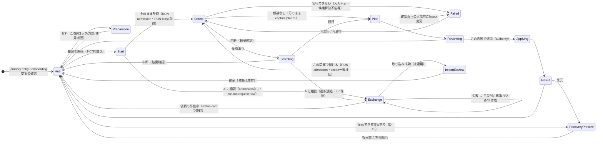

# Organizer TO-BE Information Architecture / UX Decision

> Status: proposed（owner review待ち。owner reviewによりacceptedになった時点で本書がOrganizerの情報設計・遷移・data timingの長期正本となる）
> Proposed: 2026-09-18
> Revision 2: 2026-09-18 — owner review（#361 Changes requested）の指摘5点を反映（run内canonical順序、AI相談とRUN lease境界（D-17新設）、stale表示の契約整合、適用中の中断規則、最近の結果のlifetime）
> Input fact base: [Organizer AS-IS UX/data flow audit](../assessment/organizer-as-is-ux-data-flow-audit.md)（Phase A #357–#360、audited HEAD `b728ed4d9f30ee797f6e086da110fdc86215da92`、audit date 2026-09-18）
> Parent: [Issue #356](https://github.com/nunu1733/NunuLauncher/issues/356)。本書は [Issue #361](https://github.com/nunu1733/NunuLauncher/issues/361) の成果物である。
> 既存正本への処分（Continue / Amend-Supersede / Defer / Retire）の実行と migration 順序は [Issue #362](https://github.com/nunu1733/NunuLauncher/issues/362) が所有する。本書は方針と必要改訂を決定するのみで、spec/実装の改訂を行わない。

---

## 1. 目的と適用範囲

本書は、AS-IS監査（§13の12の設計論点）を入力に、Organizerをユーザーのmental modelから再構成し、**TO-BE information architecture / user journey / navigation / data request timing** をproduct decisionとして確定する。

- 「設定とrunの境界」「primary/secondary entry」「External Agent・category・personalization・lock・recoveryの位置づけ」「data提供・permission・external disclosureのタイミング」「Back/cancel/process-local stateの扱い」を決定する。
- production UIの実装、class/package構造、画面の視覚designは扱わない。既存spec/ADR/実装の処分判断とmigration順序は#362へ引き渡す。
- 現行specとの互換は無条件には優先しない（#356 authority rule）。ただし §2 の安全・privacy propertyは変えない。

## 2. 保存する安全・privacy property（変更しない）

以下はAS-IS監査 §11.1(a) が「守るべきcurrent property」と観察したものであり、本書の全ての決定はこれを弱めない。TO-BEで表示・導線を変えても、これらの性質を支える契約（spec 13/84/194/204/205/210/271/331等）のgate構造は保持される。

1. 外部へ開示する前に、出る情報の種別についてのinformed consentがある。
2. stale（capture時点と現在が一致しない）な提案を無条件にapplyしない。
3. destructive writeの前に明示的なuser authorityを得る（確認は無条件の権限付与ではない）。
4. 適用の失敗・中断・process死の後も、復元可能性を壊さない。
5. export文書から内部identityへの逆算・追跡を可能にしない。
6. 入力が不明確・矛盾する場合に、代わりの値を勝手に代入しない（fail-closed）。
7. diagnosticsは個人情報を含まず、外部出力はuser起動に限る。

## 3. 決定一覧

| ID | 決定 | 解消するAS-IS finding |
|---|---|---|
| D-01 | Organizerを**独立した作業領域（Organizer hub）**として新設する。Home Screen設定のOrganizer群（run入口・strategy・personalization・category系入口・診断）はhubへ集約し、設定側は入口rowだけを残す | F-01, F-02 |
| D-02 | hubのstatus cardを**durable事実と進行中状態の単一閲覧面**とする。durable status（復元可能なら復元CTA付き）・進行中のAI依頼（24h残時間）・取り込み済み未適用の状態を1枚で見せる。**最近のrun結果はprocess内のみの表示**であり、process死後はdurable statusが示す事実（適用済み・復元可否）だけが残る（§8.2） | F-05, F-10 |
| D-03 | **run = hubから開始する1回の試行**。hubとrunの境界はrun admission（RUN lease取得）。run中の恒常authoring（分類・lock・方針・記録toggle）は一律不可とし、「中断してから変更する」を唯一の規則にする。strategy pickerをrun面から撤去し、材料面のみに置く。run面内の「方針変更→確認なしで破棄+再start」の特例を廃止する | F-01, F-08, E-7, D-3/D-4 |
| D-04 | External Agent Exchangeを**独立サブシステムとして見せず、「整理案の作り方」の1つ**として統合する。整理開始の前置き面（T-07）で「そのまま整理 / AIに相談」を選ぶが、**AI相談はrun admission（RUN lease取得）を伴わないpre-run request flow**であり、依頼の作成・待機・取り込み中も恒常authoringは可能である（layout・分類を変更した場合はD-09の期待明示どおり回答が古くなる）。依頼の状況はhub status cardで見せる。内部pipeline（tier→生成→送信前確認→import→検証→run接続）とその同意gateは現行契約のまま維持する | F-07 |
| D-05 | **run内のcanonical順序とユーザー向け8状態**を固定する。順序: 前置き面T-07（方法選択・admissionなし）→「そのまま整理」でrun admission（RUN lease取得）→ **検出（T-09準備中の最初のphase）** → 対象選択（候補あり時のみT-08へ一時遷移）→ capture+plan（T-09）→ 提案の確認（T-10）。検出・capture・planの進行は1つのprogress面に統合し、typed失敗状態と入場前stale（`DETECTED_BEFORE_REVIEW`）は「実行できませんでした（原因+次の手段）」1面へ畳む。内部state machineの契約は変更しない | F-04 |
| D-06 | **missing-app選択面は必須通過でなくする**。検出はrun内の最初のphaseであり、**候補0件なら選択面を表示せずcapture/planへ続行**する（検出前に候補有無を前提化しない）。候補がある場合はscope制御として提示する | 監査§4.4 V-09 |
| D-07 | **Usage Access要求をjust-in-time化する**。最初にsignalを読む時点（初回run composition / 初回AI依頼生成）で文脈付きの任意要求を出し、材料面には常設の管理rowを残す。拒否時は該当sectionがUnavailableになりrunが続行する（現行property） | F-06, E-1 |
| D-08 | **取り込み済み提案（validated intent）をdurable化する**。依頼（export session）と同一の有効期限（24h）を持ち、process死・画面離脱で消えない。期限切れまたは置換/破棄で無効になる | F-05 |
| D-09 | **AI依頼の作成時に期待を明示する**。「この依頼は作成時点のホームで固定されます。会話中にホームや分類を変更すると回答が取り込めなくなります」を生成前と送信前確認の両方に表示する | F-03, E-3 |
| D-10 | **送信前確認は「要約を主たる同意面」に再構成する**。出る情報の種別・件数・上限の要約を主面とし、生成済みpackage全文は展開して確認できる状態を保つ。全文の常時強制提示は廃止する。外部開示の同意点は変わらず送信前確認1点である | E-5 |
| D-11 | **exchange失敗をユーザーの次の行動へ再投影する**。typed失敗分類（20種）をそのまま列挙せず、「もう一度取り込む / 貼り直す / 依頼を作り直す / 中断する / 診断を開く」の手段別に提示し、typed原因は補助情報とする | F-04, F-07, 監査§13-8 |
| D-12 | **stale時のremedy対応表を固定する**（§8.3）。remedyは常に「現在の状態を正として取り直す」であり、古い提案の部分適用は存在しない | F-03 |
| D-13 | **Back/Cancel/破棄の語彙規約**（§9）を全体に適用する。不可逆な破棄（依頼の無効化・取り込み破棄）は「破棄」ラベル+確認、zero-write中断は「中断」、確認不要の中止は「キャンセル」とする。pre-send cancel（未送信依頼の無効化）は「キャンセル」から「破棄」へ改める | F-09 |
| D-14 | **`LOCAL_FULL` tierをUI語彙から外す**。ユーザー向け選択肢は「情報を減らして送る / ラベル付きで送る」の2tierに固定し、契約上の`LOCAL_FULL`値は将来のlocal LLM向け余地として維持する | D-2 |
| D-15 | **durable statusからの復元操作を接続する**。hub status cardの「復元できる提案あり」から検査→復元確認→復元へ進める（cold process起点を許可する）。spec 271がNon-goalsとしたfollow-upの実現であり、新specを要求する | F-10, D-6 |
| D-16 | onboarding提案の契約（fresh install判定・defer/skip outcome・再表示規則）は**継続**とする。「確認」はrun admissionへ直行し（T-07前置きを省略、方法は「そのまま整理」固定）、「後で」の6秒hintはhub入口を案内する | 継続判断 |
| D-17 | **AI相談とrun境界**。AI相談はpre-run request flow（D-04）であり、run admissionは「この提案で続ける」（idle path）または選択面の「続行」以後に発生する。**run-in相談**: run生存中は現行契約どおり選択を凍結保持して同一runへ戻る。process死後はrunと選択が消えるが、取り込み済み提案はdurable（D-08）で残り、**fresh run → 検出 → 選択面で依頼時scopeとの完全一致を検証（fail-closed維持）**し、一致する場合は前回の明示選択を初期値として復元したうえで「続行」の明示確認を1回要求する。不一致時は差分を示して修正を求める。確認なしの完全自動復元は明示選択契約（#228）を弱めるため採らない | F-03, E-4 |

## 4. 採用案と比較

### 4.1 比較対象

- **案A: 現行Settings中心を整理して維持** — 1,751行の画面を複数画面へ分割し、設定階層内に収める。
- **案B: 独立Organizer hub + preparation + run flow** — 作業領域をhubとして独立させ、材料・進行中状態・再発見を集約する。
- **案C: task-first flow + advanced settings分離** — 「整理を開始」から必要情報を段階取得し、詳細設定はSettings側に分離する。
- **案B′（採用）: Bを骨格に、run内部にCのtask-firstを採用** — hubをIA根とし、run内は段階取得・選択自動skip・JIT permission。材料と再発見はhubへ集約。

### 4.2 比較軸ごとの評価

| 軸 | A | B | C | B′（採用）の評価 |
|---|---|---|---|---|
| task completionの短さ | ○ 入口既存。ただし選択面必須・3画面往復が残る | ○ hub経由で+1 hop。run内は現行同等 | ◎ 開始即run。ただし再入場が毎回遠い | ◎ 選択自動skip（D-06）とJIT（D-07）で「普通に整理」を最短化。hubは1 tap |
| information scent / rediscoverability | △ recovery・依頼の再発見が構造的に弱い（F-10） | ◎ status cardに集約 | △ 恒常面がなく「あの機能どこ？」が残る | ◎ status card（D-02）+材料集約（D-01） |
| data提供タイミングの自然さ | △ Usage Accessが目的発生と無関係（F-06） | ○ hub内で文脈提示可 | ◎ 完全JIT | ◎ JIT要求（D-07）+常設管理row。拒否時の継続propertyを維持 |
| state/lifetimeの理解可能性 | △ 6確定時点・hidden lifetime（F-03/F-05） | ◎ 依頼24h・復元期限・未適用をcardで可視化 | △ lifetimeの置き場がなく隠れがち | ◎ status card+依頼時期待明示（D-08/D-09） |
| safety/confirmation boundary | ◎ 契約そのまま | ◎ authority点を移動しない | ○ 段階取得で同意点が分散しやすい | ◎ 同意点（送信前確認・確認=authority・one-shot復元token）は1点のまま表示のみ統合 |
| accessibility | ◎ 既存の節集成 | ○ 新surfaceの設計負担 | ○ | ○ 新surfaceにorganization-run-ux §6の受入基準を適用。hub cardはTalkBackで読み順と状態を明示 |
| implementation complexity | ◎ 既存画面の分割で最小 | ○ 新destination+既存画面の移動 | △ flow全面再構築 | ○〜△ B+JIT+選択skip。統合progress面は表示統合でありstate machine変更は最小 |
| migration / compatibility | ◎ 変更小 | ○ 段階migration可能 | △ | ○ #362が段階（hub導入→材料集約→語彙統一→intent durable化）で実行 |
| 拡張性（managed-AI / incremental等の将来capability） | △ 機能追加がSettingsに畳み続く | ◎ hubの「方法」「結果」が増えるだけで拡張 | ○ | ◎ 方法選択・status cardが将来のcapabilityの受け皿 |

### 4.3 採用理由と却下理由

- **Aを却下**: 監査の構造的finding（F-01 run/設定/AIの3役割、F-02材料分散、F-07サブシステム化、F-10再発見断絶）は画面分割では解消されない。実装負荷が最小という利点のために構造を温存する価値はない。
- **Cを単独採用せず**: task完了の短さは最良だが、恒常面を欠くため再発見（F-10）とlifetime可視化（F-05）を残す。また同意点が段階に分散すると、保存するproperty 1（informed consent）とproperty 3（明示authority）の「1点性」を示すのが難しくなる。
- **B′を採用**: hub（B）が「準備・進行中・結果の恒常的な置き場所」を与え、task-first（C）が「普通に整理したい」旅の最短性を与える。2つは層が異なり矛盾しない。AI相談は方法として統合し（D-04）、strategy特例は廃止して（D-03）run/設定の境界を単純化する。

### 4.4 個別の採否（代替案つき）

| 論点 | 採用 | 却下した代替と理由 |
|---|---|---|
| AI相談の見せ方 | 方法として統合（D-04） | 独立面に維持 → サブシステム感（F-07）と失敗語彙の専門性が残る。capability copyだけでは緩和不足 |
| run中のstrategy変更 | 材料面のみに移し特例廃止（D-03） | 特例維持（dismiss+再start）→ 確認なし破棄（E-7）と第三のrun無効化経路が残る。run中無効化のみ → 変更したくても手がかりがない。「中断してから」へ統一 |
| 取り込み済み提案のlifetime | durable化（D-08） | process-localのまま明示予告のみ → 外部AI会話中のprocess死で回答が失われ、同じ回答textをユーザーが保持していない限り再依頼になる。依頼（24h）だけdurableで提案が揮発する非対称は説明できない |
| 選択面 | 候補0件なら出さない（D-06） | 必須通過維持 → 全件整理のユーザーに無意味な1 tap。選択廃止 → scope制御とrun-in相談の座が失われる |
| 送信前確認 | 要約主面+全文展開（D-10） | 全文常時強制 → 256KiB上限の全文審査は実際上不可能で同意の実質が形式化（E-5）。要約のみ → 「出る情報の種別」のinformed consent根拠が弱まるため全文は展開可能として残す |
| recovery再入場 | hub status cardから復元（D-15） | 表示のみ維持 → F-10が解消されない。適用直後のApplied面だけ → process束縛が残る |
| Usage Access要求 | JIT+常設row（D-07） | 常設のみ → 「なぜ今」が説明できない（E-1）。JITのみ → 後から状態確認・再付与する場所がなくなる |
| 依頼と提案のsnapshot境界 | 依頼作成時に期待明示（D-09） | 失敗時に初めて説明 → `CONTEXT_STALE`の損失が予見できない（E-3） |
| AI相談中のrun/lease境界 | pre-run request flow。run admissionは「この提案で続ける」以後（D-04/D-17） | 相談開始時にRUN lease取得 → 最大24hのauthoring凍結となり、D-09（会話中のホーム・分類変更を前提にした期待明示）と直接衝突するため却下 |
| run-in相談のprocess死後継続 | durable intent + fresh run rebind + 選択復元初期値 + 明示確認1回（D-17） | 生存runへのattachのみ維持 → process死後に継続不能でE-4が残る。確認なしの完全自動復元 → 明示選択契約（#228）とfail-closedの説明を弱めるため却下 |

## 5. TO-BE information structure

### 5.1 表面一覧（TO-BE View inventory）

AS-ISは40 view（監査§4）。TO-BEのユーザー認識面は次の20面へ再編する。内部のstate machine・契約surfaceの数を変えるものではなく、**ユーザーに区別して見せる面**の集合である。

| View ID | 目的 | 内容 | 主CTA | AS-IS対応 |
|---|---|---|---|---|
| T-01 Organizer hub | 整理の恒常作業領域 | status card（durable status+復元CTA/進行中AI依頼24h+残時間/取り込み済み未適用/最近の結果[process内のみ]）、「整理を開始」、材料群、診断 | 整理を開始 | V-03/V-06の恒常部/V-27/V-40を統合 |
| T-02 材料: 分類 | app毎の分類指定と一覧 | override一覧+ユーザー定義カテゴリへの導線 | 各app/一覧 | V-36 |
| T-03 材料: ユーザー定義カテゴリ | 作成/rename/削除 | 割当件数表示付き削除確認 | 作成 | V-37 |
| T-04 材料: 配置ロック | lock一覧とUNKNOWN一括レビュー | 個別/一括 | 各操作 | V-38 |
| T-05 材料: 整理方針 | strategy選択（恒常） | radio+説明 | 選択 | V-26（run面から移動） |
| T-06 材料: 使用状況ヒント | 記録toggle+Usage Access状態管理 | rationale文言維持 | toggle/権限遷移 | V-05 |
| T-07 run: 開始 | 方法選択とscope要約（run前置き。admissionは含まない） | 「そのまま整理 / AIに相談」+対象要約。「そのまま整理」の選択でrun admission（RUN lease取得）が発生する | そのまま整理 | V-06 start+V-29前段を統合 |
| T-08 run: 対象選択 | 未配置候補の明示選択 | **検出後・候補ありのときのみ表示**。検索/全選択/解除、scope凍結AI入口、SCOPE_MISMATCH時の差分強調、接続時は前回の明示選択を初期値として復元（D-17） | 続行 | V-09（0件時は非表示） |
| T-09 run: 準備中 | 検出→（選択）→capture+planの統合progress | 検出は最初のphase。候補あり時はT-08へ一時遷移して戻る。phase行（現在の段）、中断（破棄確認） | — | V-07/V-08/V-10を統合 |
| T-10 run: 提案の確認 | previewと適用権限の付与点 | concrete/count-only/unavailableは本面の変種。decision pair冒頭+件数+group展開。確認面への入場前にlayout変更を検出した場合は本面に到達せず、T-13にstale原因として表示する（現行`DETECTED_BEFORE_REVIEW`契約） | この内容で適用 | V-16/V-17/V-18統合 |
| T-11 run: 適用中 | 適用実行 | checkpoint前のみ中断可 | — | V-19 |
| T-12 run: 結果 | 適用結果（成功/変更なし/適用されなかった[stale等]/部分的失敗） | 完了形件数、復元CTA（成功時）、診断（safe terminal時） | 復元/もう一度整理 | V-20/V-21/V-15統合 |
| T-13 run: 実行できませんでした | 統合失敗面 | 原因+次の手段（再試行/中断/診断） | 次の手段 | V-11/V-12/V-13/V-14統合 |
| T-14 run: 復元の確認 | 復元検査+確認 | 復元効果（閉域語彙）+適用履歴行+revision条件 | 復元を確認 | V-22/V-23統合 |
| T-15 AI: 依頼を作る | tier選択+置換確認 | active依頼の存在と残時間を事前表示、置換は破棄確認 | 依頼を作成 | V-29/V-30/V-31統合 |
| T-16 AI: 送信前確認 | 外部開示の同意点 | 種別・件数・上限の要約+全文展開、期待明示（D-09）、コピー/共有/保存 | コピー等で送出 | V-32 |
| T-17 AI: 取り込み | 回答の持ち帰り | clipboard/file/paste、1MiB gate | 取り込む | V-33 |
| T-18 AI: 取り込み結果 | 成功=未適用状態/失敗=手段別 | 成功: 件数サマリ+「この提案で続ける」+破棄。失敗: D-11の手段別表示 | この提案で続ける/もう一度取り込む | V-34/V-35統合 |
| T-19 onboarding提案+hint | 初回の提案（floating） | 後で/スキップ/確認。hintはhub入口案内 | 整理内容を確認 | V-01/V-02 |
| T-20 lock dialog（workspace） | 長押しpopupからのlock付与 | 現行どおりflow外入口 | dialog確認 | V-39 |

### 5.2 Entry points（primary / secondary）

- **primary entry**: 設定 → Home screen → Organizer（T-01）。整理の開始・材料・再発見・AI依頼はすべてhub起点。
- **secondary entry**:
  1. onboarding floating proposal（T-19）→ 確認でrun admissionへ直行（ONBOARDING trigger、T-07前置き省略）。
  2. workspace長押しpopupのlock付与（T-20）→ lock材料への直接導線（書込みはwriter leaseでrunと排他のまま）。
  3. 対象選択面（T-08）のscope凍結AI相談 → run-in exchange。
  4. safe terminal（T-12の部分的失敗）からの診断 → diagnostics export。

設定側のLayout groupからorganizer系rows（lock/診断/category系）はhubへ移動し、設定には残さない。Home Screen設定のPersonalization groupはT-06へ統合する。

### 5.3 TO-BE遷移図

- **canonical順序**: `Start`（T-07前置き）はadmissionを含まない選択点であり、「そのまま整理」の選択でRUN admission（RUN lease取得）→ `Detect`（検出）→ 候補ありなら`Selecting` → `Plan`（capture+plan）→ `Reviewing`の順に固定する（D-05/D-06）。
- `Detect`と`Plan`は同一のT-09準備中progress面のphaseである。検出はrun内の最初のphaseであり、候補0件なら選択面を経ない。
- 失敗と入場前stale（`DETECTED_BEFORE_REVIEW`）は`Failed`（T-13実行できませんでした）に統合され、remedy（再試行/再取得）で`Detect`へ戻る。適用時stale（`APPLY_BLOCKED`）は`Result`（T-12「適用されませんでした」）の変種である（D-12）。
- Exchange（`Start`→`Exchange`、`Selecting`→`Exchange`）はrun admissionを保持しないpre-run request flowである（D-04/D-17）。依頼の待機中にhubへ戻ってもstatus cardから再開できる。
- run-in相談（`Selecting`→`Exchange`）では、run生存中は選択を凍結保持して同一runへ戻る（現行契約）。process死後はrunが消えるため、取り込み済み提案をfresh runへ接続し、scope一致検証と選択復元初期値で継続する（D-17）。
- Backは常に1つ前の面へ戻り、作業破棄を伴う場合のみ破棄確認（§9）を出す。適用中（checkpoint後）のBackは不受理である（現行契約、§9）。

## 6. User journeys（end-to-end）

### 6.1 初回ユーザー

1. fresh install → launcher resume → floating proposal（T-19）。
2. 「確認」→ run admission（ONBOARDING trigger。T-07前置きは省略され、方法は「そのまま整理」固定）→ T-09準備中で検出 →（候補があればT-08）→ capture+plan → T-10提案の確認 → 「この内容で適用」→ T-11適用中 → T-12結果。
3. T-12成功 → 「復元」が可能。以後の再訪はhub status cardに結果と復元可否が現れる。
4. 「後で」→ 6秒hint（hub入口案内）+ 次cold startで再表示。「スキップ」→ 永続（現行outcome契約）。

### 6.2 普通に手動整理したいユーザー

1. 設定 → Home screen → Organizer（T-01）→ 「整理を開始」（T-07前置き）→ 「そのまま整理」でrun admission。
2. T-09準備中の最初のphaseで検出。候補0件ならT-08を経ずにcapture/planへ続行（D-06）。候補ありならT-08で「続行」（全件整理も1 tap）。
3. T-10提案の確認 → 適用 → T-12結果。Back/中断は適用開始前の任意時点で可能（作業があるときは破棄確認1回）。適用開始後はcheckpoint前のみ中断可、checkpoint後は完了までBack・中断とも不受理（§9）。
4. process死 → run/preview/選択は失われる（現行どおり非永続）。hub status cardはdurableな事実（適用済み・復元可否）だけを示す。

### 6.3 category/lock等を先に調整したいユーザー

1. hub → 材料（T-02〜T-06）で分類・lock・方針・使用状況を編集（恒常storeへ即時保存、現行契約どおり）。
2. hubへ戻り「整理を開始」。新しい材料はrun開始のcompositionに効く（現行と同じfresh composition契約）。
3. run中に材料を変えたくなった → 「中断」（提案があれば破棄確認）→ hub → 材料 → 再開。run中のauthoring拒否lease（`OrganizationRunActive`）は契約どおり維持だが、通常導線では「中断してから」の1規則で説明できる（D-03）。
4. 結果後に別の方針で試したい → T-12「もう一度整理」→ 材料の方針を変えて再開。方針変更が既存runを壊すことはない（run面から方針は消えたため）。

### 6.4 personalization signalsを利用したいユーザー

1. 初めてrunのcompositionまたはAI依頼生成がsignalを読む時点で、Usage Access未付与ならJIT要求（D-07）: 「使用状況のヒントを使うと、より賢い配置ができます（任意）。拒否しても整理は続きます」→ system設定へ遷移。
2. 戻って付与されていればsignal取得を続行、いなければsection Unavailableで続行（failではない現行property）。
3. 記録toggle（launcher-origin記録、default ON）と付与状態の管理はT-06。toggle OFFでカウンタ消去は現行契約どおり。
4. signalはcomposition時に毎回再構成され、保存されない（現行どおり）。exportにはbucket値のみが出る。

### 6.5 external AIへ相談して整理したいユーザー

1. hub → 「整理を開始」→ T-07前置きで「AIに相談」。この時点ではrun admission（RUN lease取得）は発生せず、材料（分類等）の編集も可能である（D-04/D-17）。
2. T-15依頼を作る: active依頼があれば存在と残時間を事前表示し、新規作成は既存依頼宛の回答が使えなくなる破棄確認を経る（置換確認の契約維持、語彙は「破棄」へ統一）。
3. tier選択（情報を減らして送る / ラベル付きで送る）→ 生成 → T-16送信前確認（要約+全文展開+期待明示D-09）→ コピー/共有/保存で外部へ。
4. 外部AIアプリでinterview-first会話（2–4問→方針要約→了承→fenced json 1個。現行契約）。
5. 戻ってT-17取り込み → T-18。成功 → 「取り込み済み・未適用」状態（件数サマリ・提案グループ件数・未適用である旨）。
6. 途中でhubへ戻る/画面を離れる → status cardに「進行中のAI依頼（残23h）」と「取り込み済みの提案」が現れ、そこから再開する（D-02/D-08）。
7. 「この提案で続ける」→ **ここで初めてrun admission（RUN lease取得）**→ fresh run → 検出 → 選択面で依頼時scopeとの完全一致を検証（違えばSCOPE_MISMATCHでT-08が開き差分を強調）。以降は6.2と同じ確認→適用。
8. 取り込みが`CONTEXT_STALE`/`SCOPE_MISMATCH`で失敗 → D-11の手段別表示（「依頼を作り直す」CTA → T-15）。

### 6.6 import後に内容を確認して適用したいユーザー

1. 6.5の5まで完了。この時点で適用は行われていない（現行property）。
2. T-18の件数サマリで判断し、「この提案で続ける」（ここで初めてrun admission）→ fresh run → 検出 → 選択面 → T-10提案の確認で具体的変更一覧を確認（AIの判断は常にpreferenceとしてplanner経由、最終配置決定はplanner——現行契約）。
3. 「この内容で適用」の押下が適用権限の付与点（in-memory authority、現行契約）。
4. 途中で破棄 → 「破棄」確認（依頼は無効化されないため、同じ回答を期限以内に再取り込み可能——現行契約）。
5. 取り込み済み提案は依頼期限（24h）までdurable（D-08）。期限切れ後は再依頼が必要。

### 6.7 stale/retry/recoveryが必要なユーザー

1. **提案の確認面へ入る前にホームが変わった**（capture後・preview materialize時の検出）→ 確認面に到達せず「実行できませんでした（準備中にホームが変更されました）」+「再取得」→ T-09からやり直し。`DETECTED_BEFORE_REVIEW`は「提案が確認面に到達していない段階の検出」という現行契約どおりである。
2. **適用時に変わった**（確認面表示後の変更を含む）→ T-12「適用されませんでした（ホームが変更されました）」+起因の要約+「もう一度整理」→ T-09。zero-writeの保証文言は現行契約（「今回の試行はホームを変更していません」）。確認面表示中のliveな再検知は行わず、適用時のA2 gateが防ぐ（現行契約どおり）。
3. **依頼後・取り込み前にホームや分類が変わった** → 取り込み時`CONTEXT_STALE` → T-18「依頼の内容が古くなりました」+「依頼を作り直す」。
4. **選択scopeの不一致**（run-in相談後）→ T-08が開き「依頼時と対象が一致しません」+ 変化した候補（availability/分類）の強調表示。一致に修正して続行、または依頼を作り直す（E-4のremedy改善）。process死後はrunと選択が消えているため、durable化された取り込み済み提案（D-08）からfresh runを開始し、依頼時scopeとの完全一致検証を経て、一致する場合は前回の明示選択を初期値として復元し「続行」の明示確認を1回要求する（D-17）。
5. **recovery** → T-12成功面の「復元」、または後日hub status cardの「復元できる提案あり（残時間）」→ T-14復元の確認 → 復元実行。cold process起点でも到達できる（D-15、要新spec）。復元pointは検証済み24h・最大3点（現行契約）。期限切れ後は「復元の期限切れ」表示のみ。

## 7. Data request / disclosure timing（決定と既存matrixとの差分）

AS-ISの全dataのtiming matrixは監査§7.1がfact baseである。本節はTO-BEで**変わる行と変わらない規則**を記録する。

### 7.1 変わる行

| data / 権限 | AS-IS | TO-BE | 根拠 |
|---|---|---|---|
| Usage Access（権限要求） | 設定面の常駐rowのみ。要求と利用が最遠 | 最初にsignalを読む時点（初回composition/初回依頼生成）でJIT要求+rationale。材料面に常設管理rowを残す | D-07, F-06 |
| 整理方針（strategy） | run面下部のpickerが常時有効。commitで確認なしにrun破棄+再start | 材料面のみ。run中は読み取り専用表示。変更は次回runで効く | D-03, F-08 |
| 恒常authoring（分類/lock/記録toggle） | run中はlease拒否（通常導線では遭遇しにくい） | run中は材料編集不可。「中断してから変更」をUI語彙として常時明示。**AI相談中（run外）は編集可**だが、layout・分類を変えると回答が古くなる旨を依頼面で明示（D-04/D-09）。lease契約は維持 | D-03, D-17 |
| export文書の有効性 | 失效が不可視。`CONTEXT_STALE`で初めて判明 | 依頼作成時と送信前確認で「作成時点のホームで固定」を明示。依頼カードに残時間表示 | D-09, D-02 |
| 取り込み済み提案（pending intent） | process-local。画面離脱/process死で消失し不可視 | 依頼と同一期限のdurable artifact。status cardに存在と期限を表示。消失の系は「破棄」操作と期限切れのみ | D-08 |
| exchange失敗の表示 | typed分類20種をそのまま表示 | 手段別（再取り込み/貼り直し/再作成/中断/診断）へ再投影。typed原因は補助 | D-11 |
| 復元の再入場 | 同一processのApplied面のみ。durable statusは表示のみ | hub status cardから復元フローへ接続（cold process可） | D-15 |
| 送信前確認の形式 | package全文の常時提示（240dp scroll） | 要約主面（種別・件数・上限）+全文展開。同意点は1点のまま | D-10 |
| 選択scope不一致の説明と継続 | 件数hintのみ。生存runへのattachが唯一の継続経路 | 変化した候補の強調表示（availability/分類）。process死後はdurable提案からfresh runへ再接続し、scope完全一致検証+前回選択の初期値復元+明示確認1回で継続 | D-17, E-4 |

### 7.2 変わらない規則

- 確定時点の集合（恒常設定の保存/export/import/run接続/composition/確認）自体は変えない。変えるのは**それぞれのユーザー可視性と説明**である（監査§13-2の(a)案: composition時の一括確定を維持し「何が確定済みか」を見せる）。
- export scopeのtier選択→送信前確認という外部開示の同意順序、export-scoped random ref、session内対応表、1MiB envelope、interview-first会話は現行契約どおり。
- signalの保存なし・bucketのみ外部送出、権限なしは失敗でない、というpropertyはそのまま。
- run中のscope凍結（選択freeze）、scope binding gateの完全一致（fail-closed）、preview/confirm/apply/recoveryのauthority構造は変更しない。

### 7.3 「なぜ今」の説明基準

すべてのpermission/data要求は、要求面上で次を1文で説明できなければならない: (1) 何のために使うか、(2) なぜこの時点で聞くのか、(3) 断った場合に何ができるか/できなくなるか。JIT要求と常設rowの双方がこの基準を満たす文言を持つ（E-1/E-2/E-3の解消基準）。

## 8. State / lifetimeの扱い

### 8.1 ユーザー向けrun状態（8状態）

| 状態 | 意味 | AS-IS 20状態の対応 |
|---|---|---|
| （hub待機） | run不在。status cardにdurable事実 | Idle/Cancelled |
| 対象選択 | 未配置候補のscope決定。検出後・候補あり時のみ現れる | Selecting |
| 準備中 | 検出→（選択）→capture+planの進行。検出は最初のphase | Capturing/CandidateDetection/Planning |
| 提案の確認 | preview表示と適用権限の付与点。確認面への入場前staleは本面に到達させない（T-13の原因表示） | Preview (3種) |
| 適用中 | checkpoint→write→verifyの実行。checkpoint前のみ中断可 | Applying |
| 結果 | 成功/変更なし/適用されなかった（stale等）/部分的失敗 | Applied(8種)/NoChanges/Stale(APPLY_BLOCKED) |
| 復元の確認 | 復元検査+確認。実行中と復元結果は本面から連続して見せる | InspectingRecovery/Recovering/RecoveryResultState |
| 実行できませんでした | 入力不足/候補解決不能/計画不能/scope違反/入場前stale（`DETECTED_BEFORE_REVIEW`）の統合終端。原因+次の手段 | InputUnavailable/CandidateResolutionFailed/PlanningRejected/ScopeMismatchFailed/Stale(DETECTED_BEFORE_REVIEW) |

内部state machine・typed outcome・journal相関は変更しない。これは表示統合であり、D-05の契約上の根拠である。

### 8.2 lifetimeの可視化基準

「保存されたように見えるが消えるもの」と「見えないが残っているもの」を作らない。すべての状態は、存在する面で (a) 何か、(b) いつまで有効か、(c) 消える条件 を表示する。

- AI依頼: 24h・単一active。status cardに残時間。置換/破棄/TTLで消える。
- 取り込み済み提案: 依頼と同一期限でdurable（D-08）。破棄/TTLで消える。
- run/preview/選択: process-local（非永続）。画面・processを離れると消える旨を中断確認とstatus cardに明示。
- 最近のrun結果: process内のみ（現行`ApplyResult`と同等のscope）。process死後は消え、status cardにはdurable statusが示す事実（適用済み・復元可否）だけが残る。durableな結果projectionの新設は行わない（必要になった場合は新specで検討する）。
- recovery point: 検証済み24h・最大3点。status cardに残時間。
- launcher-origin counter: 記録toggleの説明に保持と消去条件を明記（現行どおり、visibility改善のみ）。

### 8.3 stale remedy対応表（D-12）

| stale原因 | 検出時点 | ユーザーへの提示 | remedy |
|---|---|---|---|
| layout変更 | 確認面への入場時（preview materialize時、`DETECTED_BEFORE_REVIEW`） | 確認面に到達せず「実行できませんでした」の原因表示 | 再取得（T-09から） |
| layout変更 | 適用時（A2 gate） | 結果面「適用されませんでした」+zero-write保証 | もう一度整理（T-09から） |
| layout/lock/分類/availability変更 | 取り込み時（digest不一致） | T-18「依頼の内容が古くなりました」 | 依頼を作り直す（T-15） |
| 候補集合/投影の不一致 | run接続時（scope gate） | T-08+差分強調 | 一致に修正して続行、または依頼を作り直す |
| strategy変更 | —（staleではない） | 特例廃止により発生しない | — |
| 復元pointのrevision不一致 | 復元確認時 | T-14に条件付き表示 | 復元できない旨+（新しい整理の案内） |

## 9. Back / cancel / 破棄の語彙規約（D-13）

| 語 | 意味 | 確認dialog | 適用対象 |
|---|---|---|---|
| 戻る（system Back） | 1つ前の面へ | 作業の破棄を伴うときのみ「破棄しますか？」1回 | 全surface共通 |
| 中断 | runを止めてhubへ戻る（zero-write。選択・提案は失われる） | 提案または選択があるとき1回 | run flowの適用開始前（T-07〜T-10）。適用中はcheckpoint前まで |
| 中断（適用中・checkpoint前） | 適用を中止する（zero-write保証、現行契約） | 1回 | T-11のcheckpoint完了前のみ |
| （適用中・checkpoint後） | Back・中断とも不受理。atomic完了まで、なぜ受け付けないかを文言で表示する | — | T-11 checkpoint後〜検証完了（現行`ApplicationInProgress`契約） |
| 破棄 | 不可逆に捨てる | 必須 | 取り込み済み提案の破棄、依頼の置換、pre-send cancel（未送信依頼の無効化） |
| キャンセル | 何も壊さず中止（zero-write、対象は生存） | 不要 | 方法選択、file picker、依頼作成前のtier選択 |
| 後で / スキップ | onboarding提案のoutcome限定（defer=次cold start再表示 / skip=永続） | 不要 | T-19 |

規則: **破壊的・不可逆な操作だけが「破棄」であり必ず確認を伴う。zero-write中断は「中断/キャンセル」であり、失う作業があるときだけ1回確認する。** 現行の「Cancel」ラベルがzero-write中断と不可逆session無効化の両方を指していた箇所（pre-send cancel）は「破棄」へ改める。適用中の操作可否は3段階に固定する: (1) authority取得前（T-07〜T-10）は中断可、(2) 適用開始後checkpoint完了前は中断可（zero-write）、(3) checkpoint後はBack・中断とも不受理（atomic writeと検証の完了まで）。CTA処理中の不受理規則も現行契約を維持する。

再入場: durableまたは24h期限の状態（依頼・取り込み済み提案・復元可否）はhub status cardに反映される（D-02）。最近のrun結果はprocess内のみであり、status cardにはdurable事実だけが残る（§8.2）。hub Back=設定へ。run flow Back=中断確認→hub（適用中checkpoint後を除く）。

## 10. 用語（user-facing vocabulary）

ユーザー向けには次の語を使い、契約内部語（run、revision、digest、lease、arbiter、session等）を出さない。

| UI語 | 意味 | 避ける表現 |
|---|---|---|
| 整理 | 1回のorganization run | 全体最適化、最適化 |
| 提案 | plan+previewの確認対象（まだ適用されていない） | プラン実行、変更の反映 |
| この内容で適用 | 適用権限の付与 | OK、確定 |
| 中断 / 破棄 | §9の規約どおり | キャンセルの混用 |
| 依頼（AI相談） | export session+送出文書の一組 | エクスポートセッション |
| 取り込み | import。成功=「取り込み済み・未適用」 | 適用、反映 |
| 復元 | recovery pointへの復旧 | アンドゥ、バックアップ |
| 材料 | 分類・ロック・方針・使用状況ヒントの総称 | 設定（runと区別するため） |
| 準備中 | 検出+capture+planの進行 | 解析、スキャン |

失敗語彙はD-11の手段別表現を正とし、typed分類名（`CONTEXT_STALE`等）は補助情報（詳細展開・診断）にのみ出す。organization-run-ux.md §4.2の「false successにしない」等の結果文言契約は維持しつつ、表示面をT-12に統合する。

## 11. 他の正本へ要求する更新（#362で実行）

| 正本 | 要求する更新 | 処分 |
|---|---|---|
| `docs/product/organization-run-ux.md` | §2.1/§2.2の入口をhub経由に改訂。§3（recovery UX）にdurable statusからの復元導線を追加。§4のpreview/confirm/recovery契約と§5 failure matrixは維持。IA/navigationの所有を本書へ移す | **Continue + Amend**（supersedeしない） |
| `docs/product/product-brief.md` | Value proposition / Progressive controlに「Organizerは独立作業領域（hub）、AI相談は整理案の作り方の1つ」を反映 | Amend |
| `docs/product/requirements.md` | FR-006/FR-017のユーザー可視表現がhub経由になる旨の追記。新FR/NFRの起票要否は#362が判断 | Amend（検討） |
| `DESIGN.md` | gate 2の「triggerと確認のUX提案」参照先へ本書を追加（accepted後）。§4.4 UI adapter記述にhubを反映 | Amend（accepted後） |
| spec 271（durable status projection） | Non-goalsのcold process復元を新specとして起票（D-15） | Amend + 新spec |
| spec 52 / 228 | run状態の表示統合とcanonical順序（検出→選択→capture/plan、D-05/D-06）を反映 | Amend |
| spec 182 / 283 | strategy pickerの配置変更とrun面撤去（D-03）を反映 | Amend |
| spec 203 | JIT要求の追加（常設row維持）（D-07） | Amend |
| spec 205 / 328 / 331 / 332 / 337 | 依頼card可視化（D-02）、pending intent durable化（D-08、要migration/compat評価）、送信前確認の要約主面化（D-10）、失敗再投影（D-11）、差分強調（E-4）、run-in attach契約の拡張（process死後のfresh run rebind + 選択復元初期値、D-17） | Amend（影響評価後） |
| spec 204 | `LOCAL_FULL`のUI語彙除外（D-14、契約値維持） | Amend（文言のみ） |
| spec 53 | onboarding接続先の表記更新（run admissionへ直行、T-07省略。D-16、契約変更なし） | Continue（表記のみ） |

`organization-run-ux.md`をsupersedeしない理由: 同書の本体はtrigger policy（D-004）とpreview/confirmation/recoveryの安全契約（D-005）であり、本書が変えるのは入口と表示面のみ。DESIGN.md gate 2が同書を参照しており、置換は契約の追跡性を壊す。

## 12. Issue #361 受入条件との対応

| 受入条件 | 本書の根拠 |
|---|---|
| AS-IS調査結果を参照してTO-BEを設計した | §1 input fact base、各決定にfinding番号を付記 |
| 「設定」と「run」の境界が明示された | D-01/D-03、§5.2 |
| primary/secondary entryが定義された | §5.2 |
| External Agent / category / personalization / lock / recoveryの位置づけが決まった | D-04/D-01(§5.2)/D-07/D-02/D-15、§5.1 |
| data提供・permission・external disclosureのタイミングが決まった | §7 |
| normal / onboarding / AI / stale / recovery journeyがend-to-endで定義された | §6.1–§6.7 |
| Back/cancel/process-local stateの扱いが定義された | §9、§8.2 |
| 少なくとも複数案を比較し、採否理由が残っている | §4 |
| owner reviewでaccepted decisionになった | 本書Status: proposed → owner review後にacceptedへ更新 |
| #356へaccepted方針をhandoffした | owner review受入時に#356へコメント（本書link+決定要約） |

## 13. #362への申し送り

1. **migration順序の推奨**: (a) hub導入と入口集約 → (b) 材料移動とstrategy特例廃止 → (c) 表示統合・語彙規約 → (d) status card復元（新spec）→ (e) pending intent durable化。各段は独立PRに分割可能で、(a)のみでも現行flowは壊れない構成にする。
2. **durable pending intent（D-08）の影響評価項目**: spec 328のattempt anchor/single-flight契約、UI freeze規則（idle start row・picker・Back・discardの4箇所）の再設計、backup除外classへの格納、TTL置換規則（新しい依頼が古い取り込みを無効化するか=する、が推奨）。
3. **status card復元（D-15）の新spec項目**: cold processでのrecovery point選択規則（最新検証済み1点）、RECOVERY lease取得、復元確認tokenのfresh process発行、durable status閉域語彙の拡張要否。
4. **監査§11.2 accidental complexityのうち本書で構造的に解消されるもの**: strategy dismiss+再start経路（D-03）、import attempt freezeの4箇所個別実装（§8.1統合とstatus cardで整理対象）、`LOCAL_FULL` UI語彙（D-14）。reconciliation decision table三重実装等の残りは#362の実装backlogへ。
5. **accessibility**: 新surface（hub/status card/統合progress/統合失敗面）はorganization-run-ux §6の受入基準を最初から適用する。status cardのTalkBack読み順は「状態→残期限→操作」の順に固定する。
6. **run-in attach契約の再構成（D-17）の影響評価項目**: 同一runId attach（spec 331 single-shot）の生存範囲の明確化、process死後のfresh run rebindにおけるscope snapshot→検出結果の一致検証seam、前回明示選択の初期値復元の実装位置（refs→candidate identityの復元はexport session内の対応表で可能）、および「続行」明示確認1回を#228の明示選択契約と整合させる方法。
