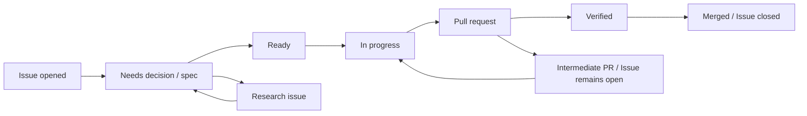

# GitHub Issue / Spec / Pull Request Workflow

> Status: Proposed
> Updated: 2026-09-08（spec/plan PRによるIssue早期close防止、Worker/Review handoff契約、Issue #251）

## Principle

GitHub Issueはすべての開発の入口であり、状態とcoordinationの正本である。長期的な仕様はrepository内のspec、設計、ADRへ置く。Issueだけ、または文書だけで実装を開始しない。

## Work item types

- **feature**: ユーザーまたはsystemの観測可能な振る舞いを追加・変更する。承認済みspec必須。
- **bug**: 期待と実際の振る舞いの差を直す。再現条件とregression test必須。
- **research**: 未知の技術・製品判断を証拠で解消する。コードを出すことではなく、問いへの回答が成果。
- **upstream**: Lawnchair同期、基準更新、上流差分の再評価。
- **maintenance**: 振る舞いを変えない文書・tooling・dependency保守作業。

大きな成果はEpic Issueで追跡し、各sub-Issueを独立にmerge可能な縦切りにする。1 Issueへ複数の独立成果を詰め込まない。

## Repository target and upstream boundary

このworkflowのGitHub操作対象はfork `nunu1733/NunuLauncher`である。checkoutの既定repositoryは上流を指すことがあるため、Issue/PR操作を始める前に次のread-only確認を行う。

```bash
gh repo view -R nunu1733/NunuLauncher --json nameWithOwner,defaultBranchRef
```

出力が `nameWithOwner: nunu1733/NunuLauncher`、default branchが `main` であることを確認する。以降の `gh issue`、`gh pr` は必ず `-R nunu1733/NunuLauncher` を付け、GitHub APIでは `repos/nunu1733/NunuLauncher/...` を使う。PRのbaseも `main` とする。ユーザー全体のgh設定やcheckoutの既定値を変更してこの確認を省略しない。

Lawnchair上流への同期・報告は、forkのIssue/PRとは別の意図的な操作である。上流への報告は[上流Issue chooser](https://github.com/LawnchairLauncher/lawnchair/issues/new/choose)へ直接送る。NunuLauncherのIssue chooserには上流由来のフォームを複製せず、fork固有のフォームと、この外部導線だけを置く。

## Lifecycle



### 1. Issue intake

Issueに次が必要である。

- 解決する問題と期待する成果。
- scopeとnon-goals。
- 関連要件ID。
- acceptance/exit criteria。
- dependencyとrisk。
- spec pathまたは「spec不要」の理由。

### 2. Specification

機能Issueでは `specs/<issue-number>-<short-slug>/spec.md` を作る。Issue番号のzero paddingはしない。例: `specs/42-safe-layout-apply/spec.md`。

specには通常系だけでなく、permission拒否、容量不足、unsupported item、stale state、部分失敗、recoveryを含める。`status: accepted` になるまではimplementation-readyではない。

### 3. Ready判定

以下を満たしたIssueに `status: ready` を付ける。

- specまたは明確なbug oracleが承認済み。
- 未決定の製品判断がない。
- dependencyが完了またはstub可能。
- migration、privacy、data safety、upstream conflictのriskが評価済み。
- 検証方法が実行可能。

### 4. Implementation plan

同じspec directoryの `plan.md` に、現在codeの根拠、変更module、interface/seam、migration、rollback、testを記載する。Issueのtask listを複製せず、実装上の判断だけを残す。

## Execution and approval contract

この契約は、Workerが作業を開始し、別のReview sessionが検証し、ownerが最終判断してmergeするまでの共有実行境界である。モデル名は作業のrouting前提であり、モデル性能の比較実験やAstraの必須条件ではない。

### Roles and model premise

| Role | Required responsibility | Not sufficient by itself |
|---|---|---|
| Worker | Issue/全コメント、正本revision、実装または文書差分、exact command/result、未確認範囲をpacketへ記録し、次の1手を明示する。 | 自分の実装報告だけでfinal approvalとすること。 |
| Review | packetの同じbase/headとdiffを読み、Issue/spec/plan/bug oracleへの適合、証拠、未確認事項、リスクを判定し、`Approve` または条件付きの `Request changes` を現在のheadへ紐付ける。部分的または貼り付けられたdiffしか確認できない場合は、確認したpath/rangeを記録し、それ以外を未確認として扱う。 | タイトル、会話要約、異なるモデル名だけを独立証拠とすること。部分diffから変更全体を承認すること。 |
| Owner | 製品判断、Issueの終了条件、Reviewが明示した条件解除の確認、最終的なmerge可否を決定し、decision linkを残す。 | Review recommendationをownerの承認と取り違えること。 |
| Merge operator | ownerの決定、Reviewの現在head確認、required checks、branch protection、高リスクaudit gateを確認してmergeを実行する。 | green CIだけで未解決の条件や未確認範囲を無視すること。 |

通常のモデル前提は次のとおりである。

- Worker: **GLM-5.3-flash (Zcode)** または **GPT-5.6-Luna (Codex/xhigh)**。
- Review: **GPT-5.6-Sol (ChatGPT/High)**。
- Astraを通常作業の必須モデルにしない。モデルが異なることだけでは、独立session・独立context・独立evidenceの条件を満たさない。
- solo保守で同じ人が複数roleを担う場合も、Workerの報告、Reviewのrecommendation、Ownerのfinal decision、Merge operatorの実行を別の記録として残す。branch protectionのrequired approving review count `0` は、この文書上の責任記録を省略する理由にならない。
- `risk: layout-data`、`risk: migration`、または高リスクpathのPRは、ここでの一般Reviewに加えて [高リスク独立エビデンス契約](#高リスクprへの独立エビデンス要求) を満たす。一般Reviewでauditを代替しない。

### Start gate and approval lifecycle

Workerは次のpacketを作成してから実装またはレビュー依頼へ進む。

- **feature**: `status: accepted` のspecと、そのaccepted内容を含むcommit SHA、plan revision。
- **bug**: accepted spec、または正本としてrepositoryに追跡されたbug oracleのpathと、そのoracleを含むexact commit SHA。Issue/commentに固定されたoracleを使う場合は、Issue/comment permalink、取得時刻 (UTC)、ownerのacceptance linkを記録し、Issueだけに存在するoracleへrepository commit SHAを付けない。oracleが曖昧なら実装を開始せずresearch/decision Issueへ分離する。
- **research/decision**: Issueが求める成果物、未決定事項、判断基準を固定する。成果物自体が終了条件である場合だけfinal PRでcloseする。
- **maintenance/docs-only**: spec/planが不要な理由、変更scope、exit criteriaを明記する。`N/A` は理由なしの省略ではない。

`Approve` は、そのreviewが確認した **現在のhead SHA** に対するrecommendationである。条件が付いた `Approve` 相当の記録はfinal approvalではなく、Workerが条件ごとのevidenceを追加し、Reviewが同じheadまたは新headを再確認して条件解除を明示するまで未承認として扱う。

次のいずれかが発生したら、以前の承認は失効する。

1. source、test、workflow、spec、plan、acceptance、dependency、riskの実質変更を含む新commitをpushした。
2. Issueのexit criteria、owner decision、関連Issueの依存関係が変わった。
3. Reviewの条件を修正したが、条件ごとのevidenceと再確認linkがpacketへ追加されていない。

失効後は新headのdiffを再取得し、Review recommendationを更新する。単なるtypo等の非実質的docs変更を再review不要とする場合も、Reviewがその判断をlink付きで明記する。OwnerはReview recommendationと条件解除を確認してfinal decisionを記録し、Merge operatorはそのdecisionと現在headの一致を確認してからmergeする。

### Review / handoff packet

PR本文またはIssueコメントに、次の欄を一つのpacketとして残す。chat logだけをpacketの代わりにしない。

```text
Review / handoff packet
- Issue and all comments: <Issue URL>; retrieved at <UTC timestamp>; state/labels <...>
- Scope type: feature | bug | research/decision | maintenance/docs-only
- Accepted spec + commit: <path or N/A with reason>; <40-character SHA>
- Bug oracle: <repository-tracked path>; <40-character SHA> **or** <Issue/comment permalink>; retrieved at <UTC timestamp>; owner acceptance <link> **or** N/A with reason
- Plan + revision: <path or N/A with reason>; <40-character SHA or revision>
- Base SHA: <40-character SHA>
- Head SHA: <40-character SHA>
- Diff: <compare URL> and `git diff --stat <base>..<head>` result
- Diff boundary: full diff inspected **or** partial/pasted diff; if partial, list every verified path/range and mark all other scope unverified. A partial view cannot support whole-scope final approval.
- Executed evidence: <exact command> -> <result>; environment <...>
- CI evidence: <run/check URL>; source event and head <...>
- Unverified / runtime constraints: <what was not run or cannot be accessed>
- Review recommendation: <link>; current head checked <SHA>; conditions <none or list>
- Owner decision / conditional approval closure: <link>; final decision <...>
- Merge operator check: <link or record>; next step <...>
```

#### Packet example (historical, exact revision; not a runtime claim)

The following is a compact example based on the #230 handoff. It demonstrates the fields a different Review session needs; it does not claim that this Codex session executed the Zcode or ChatGPT runtime.

```text
Issue and all comments: https://github.com/nunu1733/NunuLauncher/issues/230; retrieved at 2026-09-08T09:58:36Z; state=closed; labels=type: bug, status: needs-spec
Scope type: bug
Accepted spec + commit: specs/230-restore-confirmation-target/spec.md @ 436f2a7a54d2ae1346806772ce0fbd3e7827ef76
Plan + revision: specs/230-restore-confirmation-target/plan.md @ f69251ad55493c1acc60ffd687e4c18268ae3eaa (PR #245 plan-review fix; the earlier 0f3d1d3a8f2562be5f21ea23f3b4d2ccc53cd463 revision is superseded)
Base SHA: d36b109e989d49fd218bc13f3eb7c0e053a16709
Head SHA: 73173d2e829438447e3a0230b4af0959c18e9661
Diff: https://github.com/nunu1733/NunuLauncher/compare/d36b109e989d49fd218bc13f3eb7c0e053a16709...73173d2e829438447e3a0230b4af0959c18e9661
Diff stat: `17 files changed, 297 insertions(+), 14 deletions(-)` (including 9 emulator evidence images)
Executed evidence: `./gradlew spotlessCheck` -> PASS; organizer unit/instrumentation/E2E commands -> PASS; emulator evidence recorded in PR #246
CI evidence: https://github.com/nunu1733/NunuLauncher/actions/runs/34189752934 (head 73173d2e829438447e3a0230b4af0959c18e9661)
Unverified / runtime constraints: Zcode and ChatGPT runtime were not invoked by this Codex session; do not describe them as execution evidence.
Review recommendation: https://github.com/nunu1733/NunuLauncher/pull/246#pullrequestreview-5137097642; conditions were resolved by head 73173d2e829438447e3a0230b4af0959c18e9661
Owner decision: https://github.com/nunu1733/NunuLauncher/issues/230#issuecomment-5579746821; final implementation and AC-1..AC-7 recorded
Merge operator check: PR #246 merge and required checks recorded in the PR
Next step: if any substantive change is added, rebuild this packet and request re-review
```

The example explicitly marks runtime non-execution as unverified. This repository session has not performed a cross-runtime handoff; that limitation is evidence to review, not evidence that each listed model has been tested.

### 5. Pull request

PRは次を含む。

- Issue関係。Issueの終了条件をこのPRで満たす最終PRは `Closes #<issue>`、中間のspec/plan/research/調査・証跡PRは `Refs #<issue>` とする。
- specへのlinkと要件ID。
- 変更した振る舞いの要約。
- data/upstream/privacy risk。
- 実行したcommandと結果。
- 未実施の検証と理由。
- screenshot/video（UI変更時）。

reviewはspec適合、安全invariant、上流patch surface、test evidenceを優先する。

#### Issue relationship and closing keywords

GitHubのclosing keywordはPRがmergeされた時点で対象Issueを自動closeする。したがって、Issueの終了条件を満たしていない中間PRに `Closes`、`Fixes`、`Resolves`（各活用形を含む）と `#<issue>` の組を置いてはならない。`Closes #<issue> (実装 PR 完了後)` のような括弧書きは自動closeを遅延させない。

- **中間PR**: accepted spec、plan、research、調査、証跡、レビュー修正など、後続の実装または別の終了条件が残るPRは `Refs #<issue>` とし、未完Issue用のclosing keywordを本文に置かない。
- **最終PR**: Issueの全終了条件をこのPRで満たす実装・意思決定・調査成果物・証跡PRだけが `Closes #<issue>`（または同等のclosing keyword）を使う。PR本文の受入条件表とIssueの終了条件を対応付ける。
- **複数Issue**: それぞれを個別に判定し、完了したIssueだけをclosing keywordにし、残りは `Refs #<issue>` にする。PRのタイトル、branch名、親Issueへの言及だけで最終性を推測しない。
- **レビュー項目**: reviewer/workerはPR本文を検索し、すべての `close`/`fix`/`resolve` 系キーワードとIssue番号について、今回のscopeがIssueの終了条件を満たすか、後続作業が残っていないかを確認する。closing keywordがあれば、括弧書きの留保を理由に許可してはならない。

### main branch protection (Issue #249)

`main` はGitHub側のbranch protectionで、Pull Request経由とrequired status checkを強制する。設定はrepository内のファイルではなくGitHubのremote stateなので、変更前後の値をAPIで読み戻して確認する。

現在の設定（2026-09-08、[Issue #249](https://github.com/nunu1733/NunuLauncher/issues/249)）は次のとおりである。

- Pull Request必須。required approving review countは `0` とし、solo保守で実現不能な別GitHubユーザー承認を要求しない。
- required status checksは `final-status` と `high-risk-evidence`。どちらもChecks APIでGitHub Actions app id `15368`（`github-actions`）と照合済みである。
- strict status checksは有効。PR branchがbase branchから遅れている場合は更新してからmergeする。
- admin enforcement、conversation resolutionは有効。force-push、branch deletion、linear historyは許可しない/要求しない。
- actor/user/teamのpush restrictionやbypass actorは設定しない。adminもprotected ruleの対象であり、required checkを迂回する運用を前提にしない。

設定確認は対象forkを明示して行う。

```bash
gh api repos/nunu1733/NunuLauncher/branches/main/protection
gh api repos/nunu1733/NunuLauncher/rulesets
```

復旧が必要な場合は、変更前の状態（branch protectionは404、rulesetは空）へ戻すため、管理者が明示的に次を実行し、直後にAPIで404/空配列を再確認する。これは通常のmerge手順ではなく、設定障害時だけに使う。

```bash
gh api --method DELETE repos/nunu1733/NunuLauncher/branches/main/protection
```

設定前後のAPI応答、検証URL、復旧手順は [Issue #249 assessment](../assessment/issue-249-main-merge-gate.md) に保存する。

### 6. Close

最終PRのmerge後にIssueを閉じる。中間PRのmergeではIssueを開いたままにし、次のspec/plan/実装/検証PRへ引き渡す。最終PRではspecを `implemented` にし、必要な要件、DESIGN、CONTEXT、ADRを更新する。残課題は新しいIssueへ移し、元Issueを曖昧なTODO置場にしない。

## 高リスクPRへの独立エビデンス要求

Issue #43。永続化されたホームレイアウト、recovery状態、schema migrationを変えうるPRは、実装したagent自身のPR概要とローカル実行報告だけではmergeしない。独立に実行された証拠をworkflowが機械検証する。全PRに人間reviewを要求するものではなく、高リスク境界にだけ適用する。

### 適用条件

PRが次のいずれかに当たる場合に適用する。`high-risk-gate` workflow が各push・label変更時に判定する。

1. PRに `risk: layout-data` または `risk: migration` labelが付いている。label指定が正本である。Issue側に付いたrisk labelは、それを閉じるPRへも付与する。
2. PRが次の高リスクpathを変更している（label付け漏れの保険。根拠はIssue #44のruntime writer inventory）。
   - `lawnchair/src/app/lawnchair/organizer/application/**` （layout適用・recovery・store）
   - `src/com/android/launcher3/LauncherProvider.java`
   - `src/com/android/launcher3/LauncherBackupAgent.java` （backup restore時のDB rename/migration）
   - `src/com/android/launcher3/AutoInstallsLayout.java` （初期layout書込み）
   - `src/com/android/launcher3/provider/**` （restore・DB生成）
   - `src/com/android/launcher3/model/LayoutWriteCoordinator.java`
   - `src/com/android/launcher3/model/ModelWriter.java`
   - `src/com/android/launcher3/model/ModelDbController.java`
   - `src/com/android/launcher3/model/DatabaseHelper.java` （`onUpgrade` を持つschema upgrader）
   - `src/com/android/launcher3/model/GridSizeMigrationUtil.java`
   - `lawnchair/src/app/lawnchair/LawnchairApp.kt` （runtime DB rename/migration）
   - `lawnchair/src/app/lawnchair/backup/**`
   - `lawnchair/src/app/lawnchair/deck/**`

`risk: privacy` 等の近隣riskも、label指定により同じ手順を適用してよい。純粋な計画module（`organizer/planning`）やtestのみの変更、docs-only PRはこの要件の対象外である。

### 必要な証拠

適用PRは、merge前に次の両方を揃える。

1. **独立実行CI証拠**: 検証対象commit上で、このPRの `pull_request` eventによるCI merge gate（`CI / final-status`。Issue #41のorganizer unit test gateを含むsource job）が実際に成功していること。agentの報告ではなく、GitHub Actionsの実行結果そのものを指す。source jobをskipしたdocs-only runは証拠にならない。
2. **独立audit記録**: `docs/assessment/pr-<PR番号>-<slug>.md` を、形式は `docs/assessment/_template.md` に従って追加する。機械検証対象の必須fieldは次の通り。
   - `Auditor`: 実装を行っていない作業主体。solo保守では独立sessionである旨を明記する。
   - `Audit date`: 実施日。
   - `Head SHA`: auditが対象とする40桁commit。
   - `CI run`: そのcommit上で成功したCI workflow runへのlink。
   - `Criteria`: 対象spec (`specs/<n>-<slug>/spec.md`) またはADR (`docs/adr/*.md`) の受入条件への参照と要件ID。
   - 本文に、対象diffのscope、受入条件ごとの確認結果、実行したtest表面（正確なcommand）、findingsを残す。これらのsectionはgateが存在・非空・commandの存在を機械検証する。

### gateの機械検証と非バイパス性

`.github/workflows/high-risk-gate.yml` が `tools/repo-contract/validate_high_risk_evidence.py` を使って次を検証する。1つでも満たさない場合、`High-risk gate / high-risk-evidence` checkが赤くなる。

- PRが高リスクでない場合は即座にpassする（低リスクPRへの追加負担は数秒のjobのみ）。
- audit記録が `docs/assessment/pr-<PR番号>-<slug>.md` に存在し、同名の競合記録がなく、必須field（Auditor、Audit date、Head SHA、CI run、Criteria）を満たすこと。
- Criteriaが `Criteria:` 行に、spec (`specs/<n>-<slug>/spec.md`) またはADR (`docs/adr/*.md`) への参照と要件ID（FR-x / NFR-x / AC-x / ADR-xxxx、および CW-AC-01 のようなハイフン付きfamilyのID）の組で記載されていること。機械検証は `Criteria:` 行だけを対象とし、行内で各要件IDは直前の文書参照に紐付く。参照先がrepository内に実在し、statusが `accepted`（または `implemented`）であり、IDがその文書に定義されていることを検証する。存在しないfile、draft/proposed/superseded、実在しないID、文書とIDの取り違え、Scope等の本文だけに書いた参照は拒否される。
- 必須section（Scope、Criteria check、Executed test surface、Findings）が存在し、空でないこと。Executed test surfaceには具体的なcommand（`./gradlew`、`python3` 等）を含むこと。「test通過」だけの記載では通らない。
- `Head SHA` がPR履歴内に存在すること。PR headと一致するか、それ以降の変更が `docs/` 配下のみであること。audit確定後にコードを変えた場合は再auditが必要になる。
- 参照されたCI runがGitHub APIで照合され、GitHub自身がこのPRに関連付けている（runの `pull_requests` に当該PR番号を含む）`pull_request` eventによる `ci.yml` runであり、検証対象commit・head branchが一致し、`final-status` が成功、かつsource job（`organizer-unit-tests`、`check-style`、`build-debug-apk`）がskipなしに成功実行されていること。pushやworkflow_dispatchによるrun、別PRのrun、docs-only差分でsource jobをskipしたrunは証拠にならない。

高リスクpath一覧は本節の適用条件と `validate_high_risk_evidence.py` とで一致させる。同一覧の整合性はself-test（`DocConsistencyTests`）が検証するため、片方だけを更新するとCIがfailする。

よって、PR本文に「test通過・review済み」と記載を追加するだけではこのgateを満たせない。実装PR本体をどう編集しても、成功したCI runという外部記録と、形式を満たしたaudit fileの両方が必要である。

### 運用

- branch protectionが使える場合は、`CI / final-status` と `High-risk gate / high-risk-evidence` を必須checkにする。使えない場合は、赤いgateのままmergeしないことが本節の規則として効力を持つ。
- auditの形式の先例は [Issue #44のaudit](../assessment/issue-44-shared-writer-audit.md) である。実装sessionとは別のsession/agentが、最終コードcommitに対して実施する。
- auditで問題が見つかった場合は、実装PRへ修正をpushし、新しいhead SHAに対してauditをやり直す。

### 既存の高リスクIssueへの適用

- #38、#52、#55、#57 はいずれもrisk label（`risk: layout-data`、#57は `risk: migration` も）を持つ。実装PRはこのgateを通る。auditの `Criteria` には各Issueのaccepted spec・ADRの受入条件を要件ID（FR-x / NFR-x / ADR-xxxx）付きで参照する。#55 は `risk: privacy` も併せて明記する。
- このgateは #41 のorganizer CI gateの上に作られている。test seamを増やさず、CI runの実行結果そのものを証拠として再利用する。

### 動作実証（Issue #43受入、2026-08-14）

- 低リスク経路: [PR #63](https://github.com/nunu1733/NunuLauncher/pull/63)（docs/toolingのみ）はauditなしで [gateがpass](https://github.com/nunu1733/NunuLauncher/actions/runs/31801071856)。
- 高リスク経路: 検証専用の [PR #64](https://github.com/nunu1733/NunuLauncher/pull/64)（close済み・非merge）に `risk: layout-data` labelを付与すると [gateがfail](https://github.com/nunu1733/NunuLauncher/actions/runs/31801210644)（audit記録欠如）し、`docs/assessment/pr-64-gate-demo.md` の追加（Head SHA・docs-only delta・[成功CI run参照](https://github.com/nunu1733/NunuLauncher/actions/runs/31801159754)）で [pass](https://github.com/nunu1733/NunuLauncher/actions/runs/31801306031) した。
- post-protection経路: [PR #256](https://github.com/nunu1733/NunuLauncher/pull/256)（2026-09-08のbranch protection設定後）に `risk: layout-data` labelを付け、audit記録を欠落させると [high-risk-evidenceがfail](https://github.com/nunu1733/NunuLauncher/actions/runs/34198208520)し、Pulls APIの `mergeable_state` が `blocked` になった。検証PRはclose済み・非mergeである。

## Fork label vocabulary

以下はNunuLauncher forkで使用するlabelである。Issue formはこの一覧にないlabelを自動付与してはならない。状態はProject boardと二重管理せず、どちらを正本にするかrepository設定時に決める。

```text
type: feature
type: bug
type: research
type: upstream
type: maintenance
status: needs-spec
status: ready
status: in-progress
status: blocked
status: review
risk: layout-data
risk: migration
risk: privacy
phase: foundation
phase: mvp
phase: later
```

## Branch and commit convention

- branch: `issue-<number>-<short-slug>`
- commit: imperativeな要約。Issue番号はPR linkで追跡できるため必須にしない。
- 1 PRは原則1 primary Issueを閉じる。
- 自動生成やformatだけの差分は機能差分と分離する。

## Agent handoff

AI Agentが途中でhandoffする場合は、上記の [Review / handoff packet](#review--handoff-packet) をIssueまたはPRへ残す。少なくとも、完了した受入条件、現在の差分と未完箇所、exact revision、実行したtestと最後の結果、仮定、blocker、未確認範囲、次の具体的な1手を含める。chat logだけをhandoff情報にしない。

## Parallel work

複数のIssueやAgentを並行させる場合も、共有interfaceとmigrationを暗黙に調整しない。

- Epicでdependency graphを明示し、共有interface/specを先行Issueで確定する。
- 各Issueのplanに主な変更pathと共有seamを記載し、同じplatform bridge・schema migration・domain型を同時編集しない。
- 後続Issueは先行interfaceのmerge commitを基準にする。未merge branch間のcopyで契約を複製しない。
- 独立作業にできない変更は直列化するか、1つのIssue/PRへまとめる。
- integration担当は各branchのchat説明ではなく、accepted spec、test、commitを根拠に統合する。
- conflict解消でbehaviorが変わる場合は、片方を推測で採用せずspec/Issueを更新する。
