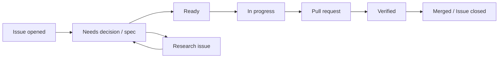

# GitHub Issue / Spec / Pull Request Workflow

> Status: Proposed
> Updated: 2026-08-14（高リスクPRへの独立エビデンス要求を追加、Issue #43）

## Principle

GitHub Issueはすべての開発の入口であり、状態とcoordinationの正本である。長期的な仕様はrepository内のspec、設計、ADRへ置く。Issueだけ、または文書だけで実装を開始しない。

## Work item types

- **feature**: ユーザーまたはsystemの観測可能な振る舞いを追加・変更する。承認済みspec必須。
- **bug**: 期待と実際の振る舞いの差を直す。再現条件とregression test必須。
- **research**: 未知の技術・製品判断を証拠で解消する。コードを出すことではなく、問いへの回答が成果。
- **upstream**: Lawnchair同期、基準更新、上流差分の再評価。
- **maintenance**: 振る舞いを変えない文書・tooling・dependency保守作業。

大きな成果はEpic Issueで追跡し、各sub-Issueを独立にmerge可能な縦切りにする。1 Issueへ複数の独立成果を詰め込まない。

## Lifecycle



### 1. Issue intake

Issueに次が必要である。

- 解決する問題と期待する成果。
- scopeとnon-goals。
- 関連要件ID。
- acceptance/exit criteria。
- dependencyとrisk。
- spec pathまたは「spec不要」の理由。

### 2. Specification

機能Issueでは `specs/<issue-number>-<short-slug>/spec.md` を作る。Issue番号のzero paddingはしない。例: `specs/42-safe-layout-apply/spec.md`。

specには通常系だけでなく、permission拒否、容量不足、unsupported item、stale state、部分失敗、recoveryを含める。`status: accepted` になるまではimplementation-readyではない。

### 3. Ready判定

以下を満たしたIssueに `status: ready` を付ける。

- specまたは明確なbug oracleが承認済み。
- 未決定の製品判断がない。
- dependencyが完了またはstub可能。
- migration、privacy、data safety、upstream conflictのriskが評価済み。
- 検証方法が実行可能。

### 4. Implementation plan

同じspec directoryの `plan.md` に、現在codeの根拠、変更module、interface/seam、migration、rollback、testを記載する。Issueのtask listを複製せず、実装上の判断だけを残す。

### 5. Pull request

PRは次を含む。

- `Closes #<issue>`。
- specへのlinkと要件ID。
- 変更した振る舞いの要約。
- data/upstream/privacy risk。
- 実行したcommandと結果。
- 未実施の検証と理由。
- screenshot/video（UI変更時）。

reviewはspec適合、安全invariant、上流patch surface、test evidenceを優先する。

### 6. Close

merge後にIssueを閉じる。specを `implemented` にし、必要な要件、DESIGN、CONTEXT、ADRを更新する。残課題は新しいIssueへ移し、元Issueを曖昧なTODO置場にしない。

## 高リスクPRへの独立エビデンス要求

Issue #43。永続化されたホームレイアウト、recovery状態、schema migrationを変えうるPRは、実装したagent自身のPR概要とローカル実行報告だけではmergeしない。独立に実行された証拠をworkflowが機械検証する。全PRに人間reviewを要求するものではなく、高リスク境界にだけ適用する。

### 適用条件

PRが次のいずれかに当たる場合に適用する。`high-risk-gate` workflow が各push・label変更時に判定する。

1. PRに `risk: layout-data` または `risk: migration` labelが付いている。label指定が正本である。Issue側に付いたrisk labelは、それを閉じるPRへも付与する。
2. PRが次の高リスクpathを変更している（label付け漏れの保険。根拠はIssue #44のruntime writer inventory）。
   - `lawnchair/src/app/lawnchair/organizer/application/**` （layout適用・recovery・store）
   - `src/com/android/launcher3/LauncherProvider.java`
   - `src/com/android/launcher3/provider/**` （restore・DB生成）
   - `src/com/android/launcher3/model/LayoutWriteCoordinator.java`
   - `src/com/android/launcher3/model/ModelWriter.java`
   - `src/com/android/launcher3/model/ModelDbController.java`
   - `src/com/android/launcher3/model/DatabaseHelper.java` （`onUpgrade` を持つschema upgrader）
   - `src/com/android/launcher3/model/GridSizeMigrationUtil.java`
   - `lawnchair/src/app/lawnchair/backup/**`
   - `lawnchair/src/app/lawnchair/deck/**`

`risk: privacy` 等の近隣riskも、label指定により同じ手順を適用してよい。純粋な計画module（`organizer/planning`）やtestのみの変更、docs-only PRはこの要件の対象外である。

### 必要な証拠

適用PRは、merge前に次の両方を揃える。

1. **独立実行CI証拠**: 検証対象commit上で、このPRの `pull_request` eventによるCI merge gate（`CI / final-status`。Issue #41のorganizer unit test gateを含むsource job）が実際に成功していること。agentの報告ではなく、GitHub Actionsの実行結果そのものを指す。source jobをskipしたdocs-only runは証拠にならない。
2. **独立audit記録**: `docs/assessment/pr-<PR番号>-<slug>.md` を、形式は `docs/assessment/_template.md` に従って追加する。機械検証対象の必須fieldは次の通り。
   - `Auditor`: 実装を行っていない作業主体。solo保守では独立sessionである旨を明記する。
   - `Audit date`: 実施日。
   - `Head SHA`: auditが対象とする40桁commit。
   - `CI run`: そのcommit上で成功したCI workflow runへのlink。
   - `Criteria`: 対象spec (`specs/<n>-<slug>/spec.md`) またはADR (`docs/adr/*.md`) の受入条件への参照と要件ID。
   - 本文に、対象diffのscope、受入条件ごとの確認結果、実行したtest表面（正確なcommand）、findingsを残す。これらのsectionはgateが存在・非空・commandの存在を機械検証する。

### gateの機械検証と非バイパス性

`.github/workflows/high-risk-gate.yml` が `tools/repo-contract/validate_high_risk_evidence.py` を使って次を検証する。1つでも満たさない場合、`High-risk gate / high-risk-evidence` checkが赤くなる。

- PRが高リスクでない場合は即座にpassする（低リスクPRへの追加負担は数秒のjobのみ）。
- audit記録が `docs/assessment/pr-<PR番号>-<slug>.md` に存在し、同名の競合記録がなく、必須field（Auditor、Audit date、Head SHA、CI run、Criteria）を満たすこと。
- Criteriaが `Criteria:` 行に、spec (`specs/<n>-<slug>/spec.md`) またはADR (`docs/adr/*.md`) への参照と要件ID（FR-x / NFR-x / AC-x / ADR-xxxx）の組で記載されていること。機械検証は `Criteria:` 行だけを対象とし、行内で各要件IDは直前の文書参照に紐付く。参照先がrepository内に実在し、statusが `accepted`（または `implemented`）であり、IDがその文書に定義されていることを検証する。存在しないfile、draft/proposed/superseded、実在しないID、文書とIDの取り違え、Scope等の本文だけに書いた参照は拒否される。
- 必須section（Scope、Criteria check、Executed test surface、Findings）が存在し、空でないこと。Executed test surfaceには具体的なcommand（`./gradlew`、`python3` 等）を含むこと。「test通過」だけの記載では通らない。
- `Head SHA` がPR履歴内に存在すること。PR headと一致するか、それ以降の変更が `docs/` 配下のみであること。audit確定後にコードを変えた場合は再auditが必要になる。
- 参照されたCI runがGitHub APIで照合され、GitHub自身がこのPRに関連付けている（runの `pull_requests` に当該PR番号を含む）`pull_request` eventによる `ci.yml` runであり、検証対象commit・head branchが一致し、`final-status` が成功、かつsource job（`organizer-unit-tests`、`check-style`、`build-debug-apk`）がskipなしに成功実行されていること。pushやworkflow_dispatchによるrun、別PRのrun、docs-only差分でsource jobをskipしたrunは証拠にならない。

高リスクpath一覧は本節の適用条件と `validate_high_risk_evidence.py` とで一致させる。同一覧の整合性はself-test（`DocConsistencyTests`）が検証するため、片方だけを更新するとCIがfailする。

よって、PR本文に「test通過・review済み」と記載を追加するだけではこのgateを満たせない。実装PR本体をどう編集しても、成功したCI runという外部記録と、形式を満たしたaudit fileの両方が必要である。

### 運用

- branch protectionが使える場合は、`CI / final-status` と `High-risk gate / high-risk-evidence` を必須checkにする。使えない場合は、赤いgateのままmergeしないことが本節の規則として効力を持つ。
- auditの形式の先例は [Issue #44のaudit](../assessment/issue-44-shared-writer-audit.md) である。実装sessionとは別のsession/agentが、最終コードcommitに対して実施する。
- auditで問題が見つかった場合は、実装PRへ修正をpushし、新しいhead SHAに対してauditをやり直す。

### 既存の高リスクIssueへの適用

- #38、#52、#55、#57 はいずれもrisk label（`risk: layout-data`、#57は `risk: migration` も）を持つ。実装PRはこのgateを通る。auditの `Criteria` には各Issueのaccepted spec・ADRの受入条件を要件ID（FR-x / NFR-x / ADR-xxxx）付きで参照する。#55 は `risk: privacy` も併せて明記する。
- このgateは #41 のorganizer CI gateの上に作られている。test seamを増やさず、CI runの実行結果そのものを証拠として再利用する。

### 動作実証（Issue #43受入、2026-08-14）

- 低リスク経路: [PR #63](https://github.com/nunu1733/NunuLauncher/pull/63)（docs/toolingのみ）はauditなしで [gateがpass](https://github.com/nunu1733/NunuLauncher/actions/runs/31801071856)。
- 高リスク経路: 検証専用の [PR #64](https://github.com/nunu1733/NunuLauncher/pull/64)（close済み・非merge）に `risk: layout-data` labelを付与すると [gateがfail](https://github.com/nunu1733/NunuLauncher/actions/runs/31801210644)（audit記録欠如）し、`docs/assessment/pr-64-gate-demo.md` の追加（Head SHA・docs-only delta・[成功CI run参照](https://github.com/nunu1733/NunuLauncher/actions/runs/31801159754)）で [pass](https://github.com/nunu1733/NunuLauncher/actions/runs/31801306031) した。

## Recommended labels

GitHub repository作成後に以下を登録する。状態はProject boardと二重管理せず、どちらを正本にするかrepository設定時に決める。

```text
type: feature
type: bug
type: research
type: upstream
type: maintenance
status: needs-spec
status: ready
status: in-progress
status: blocked
status: review
risk: layout-data
risk: migration
risk: privacy
phase: foundation
phase: mvp
phase: later
```

## Branch and commit convention

- branch: `issue-<number>-<short-slug>`
- commit: imperativeな要約。Issue番号はPR linkで追跡できるため必須にしない。
- 1 PRは原則1 primary Issueを閉じる。
- 自動生成やformatだけの差分は機能差分と分離する。

## Agent handoff

AI Agentが途中でhandoffする場合は、IssueまたはPRへ以下を残す。

- 完了した受入条件。
- 現在の差分と未完箇所。
- 実行したtestと最後の結果。
- 仮定、blocker、次の具体的な1手。

chat logだけをhandoff情報にしない。

## Parallel work

複数のIssueやAgentを並行させる場合も、共有interfaceとmigrationを暗黙に調整しない。

- Epicでdependency graphを明示し、共有interface/specを先行Issueで確定する。
- 各Issueのplanに主な変更pathと共有seamを記載し、同じplatform bridge・schema migration・domain型を同時編集しない。
- 後続Issueは先行interfaceのmerge commitを基準にする。未merge branch間のcopyで契約を複製しない。
- 独立作業にできない変更は直列化するか、1つのIssue/PRへまとめる。
- integration担当は各branchのchat説明ではなく、accepted spec、test、commitを根拠に統合する。
- conflict解消でbehaviorが変わる場合は、片方を推測で採用せずspec/Issueを更新する。
