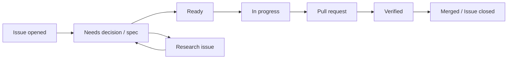

# GitHub Issue / Spec / Pull Request Workflow

> Status: Proposed
> Updated: 2026-08-09

## Principle

GitHub Issueはすべての開発の入口であり、状態とcoordinationの正本である。長期的な仕様はrepository内のspec、設計、ADRへ置く。Issueだけ、または文書だけで実装を開始しない。

## Work item types

- **feature**: ユーザーまたはsystemの観測可能な振る舞いを追加・変更する。承認済みspec必須。
- **bug**: 期待と実際の振る舞いの差を直す。再現条件とregression test必須。
- **research**: 未知の技術・製品判断を証拠で解消する。コードを出すことではなく、問いへの回答が成果。
- **upstream**: Lawnchair同期、基準更新、上流差分の再評価。
- **maintenance**: 振る舞いを変えない文書・tooling・dependency保守作業。

大きな成果はEpic Issueで追跡し、各sub-Issueを独立にmerge可能な縦切りにする。1 Issueへ複数の独立成果を詰め込まない。

## Lifecycle



### 1. Issue intake

Issueに次が必要である。

- 解決する問題と期待する成果。
- scopeとnon-goals。
- 関連要件ID。
- acceptance/exit criteria。
- dependencyとrisk。
- spec pathまたは「spec不要」の理由。

### 2. Specification

機能Issueでは `specs/<issue-number>-<short-slug>/spec.md` を作る。Issue番号のzero paddingはしない。例: `specs/42-safe-layout-apply/spec.md`。

specには通常系だけでなく、permission拒否、容量不足、unsupported item、stale state、部分失敗、recoveryを含める。`status: accepted` になるまではimplementation-readyではない。

### 3. Ready判定

以下を満たしたIssueに `status: ready` を付ける。

- specまたは明確なbug oracleが承認済み。
- 未決定の製品判断がない。
- dependencyが完了またはstub可能。
- migration、privacy、data safety、upstream conflictのriskが評価済み。
- 検証方法が実行可能。

### 4. Implementation plan

同じspec directoryの `plan.md` に、現在codeの根拠、変更module、interface/seam、migration、rollback、testを記載する。Issueのtask listを複製せず、実装上の判断だけを残す。

### 5. Pull request

PRは次を含む。

- `Closes #<issue>`。
- specへのlinkと要件ID。
- 変更した振る舞いの要約。
- data/upstream/privacy risk。
- 実行したcommandと結果。
- 未実施の検証と理由。
- screenshot/video（UI変更時）。

reviewはspec適合、安全invariant、上流patch surface、test evidenceを優先する。

### 6. Close

merge後にIssueを閉じる。specを `implemented` にし、必要な要件、DESIGN、CONTEXT、ADRを更新する。残課題は新しいIssueへ移し、元Issueを曖昧なTODO置場にしない。

## Recommended labels

GitHub repository作成後に以下を登録する。状態はProject boardと二重管理せず、どちらを正本にするかrepository設定時に決める。

```text
type: feature
type: bug
type: research
type: upstream
type: maintenance
status: needs-spec
status: ready
status: in-progress
status: blocked
status: review
risk: layout-data
risk: migration
risk: privacy
phase: foundation
phase: mvp
phase: later
```

## Branch and commit convention

- branch: `issue-<number>-<short-slug>`
- commit: imperativeな要約。Issue番号はPR linkで追跡できるため必須にしない。
- 1 PRは原則1 primary Issueを閉じる。
- 自動生成やformatだけの差分は機能差分と分離する。

## Agent handoff

AI Agentが途中でhandoffする場合は、IssueまたはPRへ以下を残す。

- 完了した受入条件。
- 現在の差分と未完箇所。
- 実行したtestと最後の結果。
- 仮定、blocker、次の具体的な1手。

chat logだけをhandoff情報にしない。

## Parallel work

複数のIssueやAgentを並行させる場合も、共有interfaceとmigrationを暗黙に調整しない。

- Epicでdependency graphを明示し、共有interface/specを先行Issueで確定する。
- 各Issueのplanに主な変更pathと共有seamを記載し、同じplatform bridge・schema migration・domain型を同時編集しない。
- 後続Issueは先行interfaceのmerge commitを基準にする。未merge branch間のcopyで契約を複製しない。
- 独立作業にできない変更は直列化するか、1つのIssue/PRへまとめる。
- integration担当は各branchのchat説明ではなく、accepted spec、test、commitを根拠に統合する。
- conflict解消でbehaviorが変わる場合は、片方を推測で採用せずspec/Issueを更新する。
