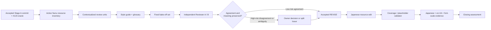

# Implementation Plan: Nunu 固有 UI の日本語コピー LQA と再利用可能なレビュー手順

> Issue: [#161][1]
> Spec: [spec.md](./spec.md)
> Status: **proposed — Stage A.** Issue #161 による spec / plan 承認後にのみ Stage B を開始する。Stage B は本計画にないオーガナイザーの behavior、safety semantics、navigation、layout data を変更しない。

## Current evidence

Stage A は `main` の `c68abcce628de9d01efaf29280193defe4aff540` を確認基準とした。#123 は実装済みであり、Nunu 固有の active / user-visible / translatable resource を final name set で扱う被覆 oracle、placeholder 一致、Japanese / `en-XA` / font scale の代表画面証拠を提供している。実行記録では required 223 名の日本語被覆と placeholder 不一致 0 件が報告されているが、その一回限りの集計 command は現在の tree に専用 tool として存在しない。[2] [3]

| 確認済み事項 | 根拠 | Stage B への含意 |
|---|---|---|
| Issue #123 は日本語 resource、疑似ロケール、font-scale 表示の構造的 localization 契約を実装済みとする。 | #123 spec と UI mapping evidence。[2] [3] | 言語品質レビューはこの構造保証の代替ではなく、その上位に重ねる。 |
| Nunu 固有 surface は manual organization、placement lock、onboarding、category override、diagnostics/export、Home Screen entries に分かれる。 | #123 surface mapping。[3] | inventory は strings.xml の孤立値ではなく surface / role / 隣接コピーに結びつける。 |
| resource root は `lawnchair/res` と root `res` の 2 系統で、各々に `values` / `values-ja` がある。 | #123 spec / plan。[2] [4] | review・被覆・placeholder 検証は両 root を必ず対象にする。 |
| repository-local Skill directory または agent workflow directory の既存規約は確認できない。 | Stage A tree inventory（2026-08-28）。 | portable な workflow の正本を `docs/localization/ja-review-workflow.md` に置く。新たな Skill convention は本 Issue で発明しない。 |
| recovery point は export backup と異なる verified state であり、recovery protocol は layout application の既存契約に属する。 | CONTEXT と ADR-0003。[5] [6] | recovery 文言は平易化できても、復旧可能性・保証・失敗意味を再定義してはならない。 |

### Stage B の source precedence

レビュー・修正の優先順位を以下のとおり固定する。下位の自然さや reviewer の好みは、上位の受諾済み behavior / safety meaning を覆してはならない。

| 優先度 | 正本 | 用途 |
|---|---|---|
| 1 | accepted feature spec、関連 ADR、既存 safety contract | 実際の action、warning、failure、recovery が意味する結果を固定する。 |
| 2 | `docs/localization/ja-style-guide.md` | surface class ごとの UI 文体と安全意味の維持規則を適用する。 |
| 3 | `docs/localization/ja-glossary.tsv` | 反復する UI 用語の一貫性を判断する。 |
| 4 | 互換な AOSP / Lawnchair の既存日本語 | 同じ概念に対する established wording を参照する。 |
| 5 | default resource と実装上の surrounding context | 原文・resource 契約・表示位置を確認する。 |
| 6 | reviewer の文体選好 | 上位と矛盾しない場合だけ適用する。 |

## Design

### Modules and interfaces

本作業は app runtime module を追加しない。Stage B の interface は、reviewer が読み書きする repository 文書、review table、検証 tool の入出力である。通常利用者 UI では実装語より user concept を優先し、diagnostic/support surface では必要な技術精度を残す。用語集は辞書置換器ではなく、surface と文法を踏まえた判断の補助資料とする。[1]

| 成果物 | 入力 | 出力 / 安定契約 |
|---|---|---|
| `ja-style-guide.md` | Issue #161、accepted behavior/safety source、既存 Lawnchair/AOSP 用語 | 5 surface class、CTA / title / description / dialog / toast / a11y の規約、技術語、安全意味、Android resource compatibility。 |
| `ja-glossary.tsv` | style guide、反復 domain term、既存参照 | `term`、`preferred_ja`、`avoid`、`surface_exceptions`、`rationale_reference` の reviewable TSV。空欄は「常に置換」ではなく文脈依存を表す。 |
| `ja-review-workflow.md` | style guide、glossary、resource / UI context | review unit schema、disposition、severity、初回 full-pass の全件 Reviewer A/B 手順と独立性記録、owner escalation、blind bake-off / adjudication contract、review-table schema。 |
| `verify_nunu_ja_resources.py` | baseline、2 resource root の default / Japanese XML、active resource classification | required name set、missing Japanese name、placeholder / plural / formatting mismatch を machine-readable に報告し、不一致で non-zero を返す。 |
| `issue-161-ja-lqa.md` | inventory、A/B review、owner decision、validator / UI evidence | exact base SHA、reviewer role / model / family-or-provider / session-or-context identity、A/B result、blind bake-off score、owner adjudication から closing evidence までを追跡可能にする assessment。 |

review unit は少なくとも `resource_name`、`default_text`、`current_ja`、`surface`、`ui_role`、`user_class`、`neighboring_copy`、`placeholder_contract`、`example_rendered_value`、`behavior_or_spec_context`、`aosp_or_lawnchair_reference`、`screenshot_or_rendered_context` を持つ。context が不足し、特に safety-sensitive な文言の製品意図を導けない場合は、推測して `REVISE` を作らず `PRODUCT_DECISION` にする。[1]

各 review row は `OK`、`REVISE`、`PRODUCT_DECISION`、`TECHNICAL_ONLY` のいずれか 1 つを持つ。`REVISE` は proposed Japanese、severity、reason、style-guide/glossary rule、meaning preserved、layout risk を必須とする。severity `high` は primary CTA、warning / failure / recovery、破壊的・不可逆な結果、a11y 意味誤り、accepted behavior との矛盾を含む。**初回 full pass では全 row に A/B 両方の結果を残す。** Reviewer B は Reviewer A の理由を出発点にせず、current/source/proposal を同じ context で独立評価する。各実行について role、model identifier、family/provider、session または independent-context identifier を記録し、異なる family/provider を使えない場合は理由を残す。[1]

### Data flow

Stage B は次の一方向の証拠連鎖で実施する。いずれの段階でも、language review を理由に organiser behavior または persistence を変更しない。

1. **Inventory and contextualization.** #123 の final-name-set 定義を起点に、両 resource root の active / user-visible / translatable Nunu resource を再収集する。dead resource、runtime data、`translatable="false"` technical identifier は required set とレビューの対象理由を区別して記録する。
2. **Policy materialization.** 固定した source precedence を style guide、glossary、workflow に実装する。workflow は proprietary tool を前提にせず、fresh agent が同じ unit を処理できる入力・出力形式を持つ。
3. **Blind bake-off.** CTA/title 5、onboarding/progress/status 4、failure/safety/recovery 5、settings/category/lock 4、a11y 3、diagnostic/technical 3 以上を含む 20〜40 件の固定 unit で candidate reviewer を比較する。candidate は同一の context から output を生成するが、**candidate 自身の自己採点を禁止する**。candidate 名を伏せた output を project owner が唯一の final adjudication authority として blind に採点する。owner は各 item の 7 軸（Accuracy、Fluency、Terminology、UI style / concision、Context fit、Safety preservation、resource correctness）を 0–2 点で採点し、candidate ごとに軸別合計、総得点、理論満点に対する割合を記録する。Safety または meaning preservation の重大欠陥が 1 件でもある candidate は、平均点・総得点にかかわらず hard failure として不採用にする。候補名は adjudication 完了後に scorecard へ対応付け、同点または rubric で決まらない採択は owner が理由を evidence に記録して裁定する。[1]
4. **Initial independent LQA.** 初回 full pass では、Reviewer A と B が全 inventory unit を同じ style guide、glossary、context で、別 session または互いの reasoning を渡さない独立 context から実行する。各実行の role、model identifier、family/provider、session-or-context identifier を review evidence に残し、異なる family/provider が practical でなかったときは理由を残す。low / medium severity の合意は review table に理由を記録して owner の個別承認なしに採用できる。high-severity disagreement、meaning ambiguity、source defect は owner decision または split Issue へ送る。
5. **Resource application and proof.** owner が解決し、meaning-preserved と確認された `REVISE`、または初回 full pass で low / medium severity の A/B 合意を得た `REVISE` のみを values-ja に反映する。machine validator が name / placeholder/resource contract を確認後、代表画面で Japanese、`en-XA`、通常 / 拡大 font scale の表示と a11y 意味を確認する。

### Alternatives rejected

| 代替 | 不採用理由 |
|---|---|
| runtime 機械翻訳または hosted translation API | offline launcher に network / privacy / availability dependency を追加し、Issue #161 の non-goal に反する。 |
| 特定 vendor / model を repository の恒久 requirement とする | model availability が変化し、workflow の可搬性を損なう。model identifier は execution evidence にのみ残す。[1] |
| repository-local `SKILL.md` を新規 convention として導入する | 現在の tree に採用済み convention がない。Issue comment のとおり、対応 tooling を確認せず新しい Skill path を発明しない。[1] |
| XML 値だけを機械的に査読する | surface、role、隣接コピー、placeholder、action / safety context を失い、CTA・warning・a11y の品質を判断できない。 |
| Reviewer A の自己承認だけで修正する | 初回 full pass は全 row の独立 Reviewer B 結果を必要とする。low / medium agreement は個別 owner approval を不要とする一方、high-severity disagreement または meaning ambiguity は owner escalation を必要とする。 |
| 上流 Lawnchair/AOSP 日本語を一括して書き換える | Nunu 固有 scope を超え、継承不具合は根拠付きの別 Issue に分離する。[1] |

### Stage B stop conditions

次のいずれかを検出した場合、resource を変更する前に Stage B を停止し、Issue #161 または新しい owning Issue で判断する。

| 停止条件 | 必要な扱い |
|---|---|
| より自然な日本語が action、navigation、情報階層、automatic/manual、または domain concept 自体の意味を変える | `PRODUCT_DECISION`。owner の受諾済み仕様がない限り書き換えない。 |
| warning / recovery / failure が安全制約、失敗時の扱い、復旧可能性、成功保証を増減させる | accepted feature spec / ADR へ戻る。表現だけで新保証を作らない。 |
| Reviewer A / B が high-severity row で実質的に不一致 | owner resolution を記録するか、必要なら split Issue を作る。 |
| resource required set、placeholder、plural、`translatable` の意味を安全に分類できない | validator / inventory definition を先に補正し、被覆を未検証のまま翻訳を進めない。 |
| 必要な変更が上流翻訳、全 locale 管理、恒久 hosted service、または新規 agent/Skill convention を要求する | #161 から分離し、専用 Issue / spec で扱う。 |

## Change set

| Area | Intended change | Why here |
|---|---|---|
| `specs/161-japanese-ui-copy-lqa/spec.md` | Stage A 承認後に `accepted`、Stage B 完了後に `implemented` へ status / history を更新する。 | Stage B の拘束契約と実施状態を同じ spec directory に保持する。 |
| `specs/161-japanese-ui-copy-lqa/plan.md` | owner 決定、実証済み command、実装発見により必要な実行記録を更新する。 | 実装順、検証、stop condition の正本を保つ。 |
| `docs/localization/ja-style-guide.md` | 5 surface class と UI-copy rules を追加する。 | style judgment を一回限りの好みから repository-owned policy にする。 |
| `docs/localization/ja-glossary.tsv` | 小さく reviewable な Nunu/domain terminology glossary を追加する。 | recurring terms の不必要な揺れを防ぎつつ、文脈依存性を残す。 |
| `docs/localization/ja-review-workflow.md` | contextual unit schema、4 disposition、severity、初回 full-pass の全件 A/B review と実行独立性、blind bake-off / project-owner adjudication、escalation、review-table schema を追加する。 | existing tree に Skill convention がないため、human / coding agent の双方が実行できる portable workflow を置く。 |
| `tools/localization/verify_nunu_ja_resources.py` | #123 の required-name / Japanese coverage / placeholder oracle を再現可能な checked-in command として追加する。 | evidence にのみ記録された一回限りの集計を、Stage B 以後も再実行可能な structural guard にする。 |
| `tools/localization/test_verify_nunu_ja_resources.py` | missing ja、placeholder type/order/count、plural、`translatable="false"`、root 混同、empty / duplicate resource を synthetic XML fixture で検証する。 | LQA 変更が structural localization guarantees を弱めないことを tool 自身で証明する。 |
| `docs/assessment/evidence/issue-161-ja-lqa.md` | exact base SHA、inventory、candidate 名を伏せた fixed bake-off set / per-item score / aggregate / hard-failure / owner adjudication、全件 A/B review と reviewer execution identity、resolution、before/after、validator、rendered evidence、split Issue を記録する。 | Issue #161 の completion evidence の正本にする。 |
| `lawnchair/res/values-ja/strings.xml` | owner-resolved `REVISE` のみを編集する。 | Nunu organizer の Lawnchair resource root にある Japanese UI text を更新する。 |
| `res/values-ja/strings.xml` | owner-resolved `REVISE` のみを編集する。 | category/override 等を含む root resource の Japanese UI text を更新する。 |
| `lawnchair/res/values/strings.xml`、`res/values/strings.xml` | **原則変更しない。** context / placeholder 名を確認するのみとし、source English の defect は別 Issue に分離する。 | language-quality task が product/source semantics 変更へ拡張することを防ぐ。 |
| `lawnchair/src/app/lawnchair/organizer/**`、Launcher DB / recovery path | **変更しない。** | LQA は resource と evidence の maintenance であり、organizer behavior / layout data contract を変更しない。 |

## Migration and recovery

schema、preference、rule、Launcher DB、recovery DB、backup/restore format の migration はない。Stage B の runtime diff は承認済み Japanese resource のみであり、layout application や recovery protocol には接触しない。失敗時は resource / documentation / tool commit を revert し、既存 APK または old resource に戻す。language review artifact は repository version control でのみ管理し、ユーザーの端末データ・個人情報・hidden model reasoning は保存しない。

`verify_nunu_ja_resources.py` の導入は build/runtime dependency を増やさない開発時 tool に限る。tool が Android resource semantics を完全に解釈できない場合は、未対応構文を pass-through にせず明示的な non-zero failure として報告し、Android build と既存 localization evidence を補助証拠に残す。

## Verification

| Acceptance criterion | Automated/manual evidence | Command or environment |
|---|---|---|
| AC-161-01 | Issue #161 の Stage A approval、spec / plan front matter、change history。 | GitHub Issue review。 |
| AC-161-02 | 5 surface class、CTA、safety、resource compatibility の section checklist。 | Markdown review + `python3 tools/repo-contract/validate_repo_contract.py`。 |
| AC-161-03 | TSV header / rows の schema review。preferred / avoid / exception / rationale が欠けない representative rows を確認する。 | `python3 tools/repo-contract/validate_repo_contract.py` と manual review。 |
| AC-161-04 | fixed evaluation set から dry-run review table を生成し、全 unit が 4 disposition の 1 つと required fields を持つことを確認する。 | `docs/localization/ja-review-workflow.md` の手順で Reviewer A / B を実行。 |
| AC-161-05 | 20〜40 contextualized unit、匿名化した candidate output、project owner の blind per-item 7-axis score、candidate ごとの axis sum / total / percentage、hard-failure 判定、candidate identity の事後対応付け、final adjudication を evidence に記録する。 | `docs/assessment/evidence/issue-161-ja-lqa.md` の bake-off scorecard review。 |
| AC-161-06 | 両 resource root の active / user-visible / translatable Nunu resource に 1 row 1 disposition、かつ初回 full pass の**全 row**に independent Reviewer A / B result があることを確認する。role / model identifier / family-or-provider / session-or-context identifier / family-provider exception reason を確認する。 | inventory / review table と `verify_nunu_ja_resources.py --baseline 505dbc40e6154c05158b5d0271c45f6a885a411b`。 |
| AC-161-07 | low / medium severity row の A/B agreement と、high severity disagreement / ambiguity の owner resolution または split Issue を確認する。 | assessment evidence review。 |
| AC-161-08 | required set の Japanese coverage、placeholder / plural / formatting contract、behavior source path 非変更を確認する。 | `python3 tools/localization/test_verify_nunu_ja_resources.py`、`python3 tools/localization/verify_nunu_ja_resources.py --baseline 505dbc40e6154c05158b5d0271c45f6a885a411b`、targeted `git diff --check`。 |
| AC-161-09 | Japanese primary surface を normal / 200% font scale で capture し、`en-XA` で raw fallback がないこと、a11y wording が自然なことを確認する。 | #123 evidence の API 36 emulator 手順（per-app locale、`cmd uimode`、`font_scale 2.0`、screencap / uiautomator）。[3] |
| AC-161-08 / AC-161-09 | resource diff の Android build、format、既存 organizer behavior / accessibility regression を確認する。 | `./gradlew spotlessCheck`、`./gradlew testLawnWithQuickstepGithubDebugUnitTest --tests 'app.lawnchair.organizer.*'`、`./gradlew assembleLawnWithQuickstepGithubDebug`、PR の `CI / final-status`。 |
| AC-161-10 | closing assessment に base SHA、review / bake-off、before/after、command 結果、未解決事項を記録する。 | `docs/assessment/evidence/issue-161-ja-lqa.md` review と PR evidence。 |

validator の CLI 引数と fixture の最終形は Stage B で tool を実装する前に `--help` と unit test で確定し、実行済み command を assessment と PR に正確に記録する。ここに示す baseline 引数は検証集合の出自を明示する設計意図であり、未実装 tool の実行成功を主張するものではない。

## Documentation updates

- [ ] `spec.md` — Stage A 承認時に `accepted`、Stage B 完了時に `implemented` と change history を更新する。
- [ ] `plan.md` — Stage B の実施済み inventory、command、evidence、残存 stop condition を更新する。
- [ ] `docs/localization/ja-style-guide.md` — 新規。
- [ ] `docs/localization/ja-glossary.tsv` — 新規。
- [ ] `docs/localization/ja-review-workflow.md` — 新規。
- [ ] `docs/assessment/evidence/issue-161-ja-lqa.md` — 新規。
- [ ] `CONTEXT.md` — domain 定義を変更しないため原則更新不要。用語集が domain definition を変更すると判明した場合は停止して owner decision を求める。
- [ ] `DESIGN.md` — runtime module / interface / seam を変更しないため更新不要。
- [ ] `docs/adr/` — 高コストで可逆でない設計判断が新たに生じた場合のみ追加する。model choice や文言の好みだけでは ADR を作らない。
- [ ] `AGENTS.md` / building guide — 新しい必須 build command を確立しないため更新不要。新 command を required にするなら clean checkout / CI で成功後に別途更新する。

## Execution checklist

- [x] Issue #161、全コメント、#123 spec / plan / evidence、AGENTS、CONTEXT、DESIGN、quality strategy、GitHub workflow を確認した。
- [x] `main` `c68abcce628de9d01efaf29280193defe4aff540` で Stage A の current evidence を固定した。
- [x] Stage A の `proposed` spec と plan を作成した。
- [ ] Issue #161 で Stage A の spec / plan 承認を受け、両文書を `accepted` にする。
- [ ] accepted Stage A commit から active resource inventory と contextual review units を再構成する。
- [ ] style guide、glossary、portable workflow、reproducible structural validator と tool tests を実装する。
- [ ] candidate 自己採点なし・匿名 output・project-owner blind adjudication・per-item / aggregate / hard-failure scorecard を備えた fixed evaluation set で bake-off を実施し、current reviewer pair を execution evidence として記録する。
- [ ] 初回 full pass の**全 inventory unit**を Reviewer A / B が別 session または独立 context で実行し、reviewer identity と family/provider の例外理由を記録する。low / medium agreement は確定し、high-severity disagreement と product decision を owner resolution / split Issue へ送る。
- [ ] owner-resolved `REVISE` のみを 2 つの Japanese resource root へ反映する。
- [ ] resource oracle、format、build、existing behavior / a11y regression、Japanese / `en-XA` / font-scale 表示を検証する。
- [ ] closing assessment、PR evidence、未解決/分離 Issue を記録し、spec / plan を `implemented` に更新する。

## Change history

- 2026-08-28: Issue #161 の Stage A review（P1: 初回 full-pass 二重レビュー、P1: bake-off adjudication、P2: reviewer 実行独立性、Minor: verification AC 対応）に対応。全 inventory unit の独立 A/B 結果、low/medium agreement と high-severity disagreement の分離、candidate 自己採点禁止・匿名 output・project-owner blind scoring・per-item/aggregate/hard-failure contract、reviewer role/model/family-or-provider/session-or-context evidence を追加し、Gradle/CI 行を AC-161-08 / AC-161-09 に整理した。

## References

[1]: https://github.com/nunu1733/NunuLauncher/issues/161 "Issue #161: Japanese UI copy LQA and reusable review workflow"
[2]: https://github.com/nunu1733/NunuLauncher/blob/main/specs/123-organizer-ui-convergence/spec.md "Issue #123 specification"
[3]: https://github.com/nunu1733/NunuLauncher/blob/main/docs/assessment/evidence/issue-123-ui-mapping.md "Issue #123 UI mapping and visual evidence"
[4]: https://github.com/nunu1733/NunuLauncher/blob/main/specs/123-organizer-ui-convergence/plan.md "Issue #123 implementation plan"
[5]: https://github.com/nunu1733/NunuLauncher/blob/main/CONTEXT.md "NunuLauncher domain language"
[6]: https://github.com/nunu1733/NunuLauncher/blob/main/docs/adr/0003-organizer-recovery-point-storage.md "ADR-0003: Organizer recovery point storage"
