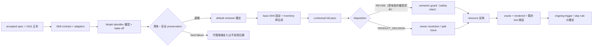

# Implementation Plan: Product Language Reviewer subagent による Nunu 固有 UI 文言の再監査

> Issue: [#324][1]
> Spec: [spec.md](./spec.md)
> Status: **proposed** — 本 plan は spec 準備 task が作成した計画であり、owner による spec 承認前は実装を開始しない。承認後も、full pass 開始時に inventory と runtime 状態を再確認してから着手する。

## Current evidence

本 plan は `main` `c5a7840b88`（2026-09-28 re-entry 時点の `origin/main`、PR #475 merge）を確認基準とした。初回作成時の確認基準は `0cf82bc1e61c1874b280a7120dff9594be4fef71`、以降の re-entry は `aab0d293d1a98bf59f5b164693f54ee1a63e3f0b`、`703afe3f4c1f5387f768832ea422c7b681c3775a`、`3076bdae7ebf8dbb086f251203968c06e9986258`。確認済みの事実と実装への含意は次のとおり。

| 確認済み事項 | 根拠（2026-09-19 re-entry 時点の tree） | 実装への含意 |
|---|---|---|
| #161 の言語資産が implemented として存在する。 | `docs/localization/ja-style-guide.md`、`ja-glossary.tsv`、`ja-review-workflow.md`（いずれも Status: implemented for Issue #161）。[2] | Skill / adapter はこれらを参照して使い、規約を複製しない。優先順位は `ja-review-workflow.md` §2 を拡張する。 |
| 初回 LQA 監査は 2026-08-28 に完了（223 unit、`REVISE` 82件、blind bake-off 24件、PR #163）。 | `docs/assessment/evidence/issue-161-ja-lqa.md`、`issue-161-ja-lqa-bakeoff-context.md`。[2] | bake-off 方法（匿名出力、owner blind adjudication、7軸0–2点、hard failure）はこの evidence の方法を準用する。bake-off context は evaluation set の種として再利用できる。 |
| #161 以降に新しい Nunu 固有 user-visible surface が追加されている。 | strings 変更履歴（git log）: strategy selection / preview（#182/#218/#235/#283）、missing-app selection（#228）、restore 確認と履歴（#230/#231）、re-entry hint（#232）、backup preview page summary（#233）、GLOBAL_COMPACT_V2（#237）、durable status（#271）、diagnostics export filename（#288）、personalization signal（#203）、外部エージェント交換（#205: entry / privacy / 送信前確認 / session 置換確認 / generate / transport / import / typed failure 分類、#331: scoped entry / 選択freeze / `SCOPE_MISMATCH`）等。 | 初回監査の 223 unit 集合を再利用せず、full pass 開始時に inventory を再生成する。exchange の送信前確認・置換確認・failure copy は safety class として semantic guard 対象にする。 |
| #205/#331/#329/#330/#332 の実装 merge により exchange 系 UI copy と domain 用語が追加・改訂された。 | [spec 205](../../specs/205-external-agent-exchange/spec.md) は implemented（PR #325、merge `3df9c7af`）。[spec 331](../../specs/331-exchange-target-scope-coupling/spec.md) は implemented（PR #333/#334、merge `addb25d8181`）。[spec 329](../../specs/329-import-normalizer/spec.md) / [spec 330](../../specs/330-partial-intent-authoring/spec.md) / [spec 332](../../specs/332-exchange-import-input-ui/spec.md) は implemented（PR #338/#340/#344）。`exchange_*` はこの時点で 80 entry（`lawnchair/res` root のみ。root `res` は不変。現行の件数は後述の #443 row 参照）。#332 で import 入力 UI の 15 string（`exchange_import_from_clipboard` / `exchange_import_fallback_toggle` / `exchange_status_clipboard_empty` / `exchange_recognized_version` 等）と normalization failure 2 string が追加され、`exchange_failure_incomplete_coverage` は #330 の validator 意味変更（full coverage → disjointness）に追従して両言語で文言改訂された（commit `90763d40fa`）。`ExchangeFlowUi.kt` は `stringResource` 経由のみで hardcoded UI text を含まない。CONTEXT.md に交換パッケージ・送信前確認・持ち帰りIntent取り込み・インポート正規化・交換フレーミング（v3 / normalizer 更新版）等の exchange domain 用語（日本語名）がある。`ja-glossary.tsv` は exchange 系用語を含まない（22 term）。 | 再監査の terminology 評価は CONTEXT.md の domain 語彙との整合で行い、未登録の user-facing 用語は glossary 追加提案として扱う（spec Domain language）。accepted terminology は `ja-glossary.tsv` へ記録する。#332 の import 入力 UI copy（clipboard / file failure の recovery 案内、認識形式 labels。ja 例「認識version」の mixed script）と意味変更後の `exchange_failure_incomplete_coverage` は full pass と evaluation set（D3）の候補になる。 |
| #336 の実装 merge により custom category の user-visible copy が root `res` に追加された。 | [spec 336](../../specs/336-user-defined-categories/spec.md) は implemented（PR #341、merge `45711f53dd`）。root `res/values/strings.xml` と `res/values-ja/strings.xml` に `organizer_category_override_custom_*` 3件 + `organizer_custom_category_*` 23件 + plurals 2件の計 28 entry を両言語で追加。新 UI file `UserDefinedCategoryAuthoring.kt` / `CustomCategoryPreferences.kt` は `stringResource` 経由のみ。CONTEXT.md にカテゴリidentity・ユーザー定義カテゴリ・アクティブカテゴリカタログの用語追加、requirements FR-010 更新、DESIGN.md gate 5 更新済み。200% font を含む device evidence が `docs/assessment/assets-336-device-evidence/` に存在。 | custom category copy は初回監査時に存在しなかった最大の新規 surface（28 entry）であり、8 分類の「placement lock / category override / settings」と「warning / confirmation / failure / stale / recovery」（`partial_delete` / `capacity` / `conflict` / `unavailable` / `failed`）の両方にまたがる。inventory は両 root を対象に full pass 開始時に再生成する（既存方針どおり）。 |
| #348/#327/#328/#337 の実装 merge により exchange 系 UI copy がさらに追加・改訂され、`exchange_import_accepted` は削除された。 | [spec 348](../../specs/348-exchange-ai-facing-contract/spec.md)（PR #349、merge `8fd05a40d5`）/[spec 327](../../specs/327-agent-exchange-interview-first/spec.md) は implemented（PR #350、merge `a9ec3c2cf9`）/[spec 328](../../specs/328-exchange-import-success-state/spec.md)・[spec 337](../../specs/337-exchange-category-group-proposals/spec.md) の実装は main に merge 済み（PR #353 merge `34ba8ff447`、PR #355 merge `b728ed4d9f`）。#327 で capability 説明 7 string（`exchange_capability_*`）、transport success / framing hint の interview-first 文言改訂（marker lines → ```json code block）、`exchange_privacy_labels` の「app and category names」化、disclosure 2 string のカテゴリ言及化、`exchange_import_accepted` 削除。#328 で取り込み成功状態・破棄確認・summary plurals・strategy busy / frozen 案内を追加。#337 で `exchange_failure_unknown_category_ref` を追加。`ExchangeFlowUi.kt` は `stringResource` 経由のみ。`ExchangeCapabilityCopyTest`（`tests/unit/app/lawnchair/organizer/ui/exchange/`）が capability copy の構造と両 locale key 存在を pin する。 | capability 説明・transport success・framing hint・取り込み成功状態・破棄確認・summary plurals・カテゴリ参照失敗は safety class（warning / failure / recovery / stale）として semantic guard 対象かつ evaluation set（D3）候補。copy 改訂が `ExchangeCapabilityCopyTest` 等 pin 済み test の対象に触れる場合は同一変更 set で test を整合させる。 |
| TO-BE migration series（#366〜#377、#398、#417）が実装 merge され、#362 は完了して closed した。現行 main は post-migration surface である。 | [spec 366](../../specs/366-organizer-hub-shell/spec.md)（organizer hub、implemented）、#367 materials 再配置、#368 strategy picker 再配置、#369 run 表示統合、#370 onboarding hub 接続、#371 usage access JIT、[spec 372](../../specs/372-ai-consultation-request-flow/spec.md)（AI相談 request flow、implemented）、#373 手段別失敗投影、#374 durable imported intent、#375 scope remedy rebind、#376 durable status recovery entry、#377 post-migration cleanup、[spec 398](../../specs/398-strategy-intent-first-bottom-region/spec.md)、#417 はいずれも main に merge 済み（PR #388〜#434 の系列）。#362 は closed。新規 copy: `organizer_hub_*`（title / summary / request_open / proposal_row / proposal_open / materials_heading / label）、`organizer_usage_access_jit_*` 5 string、`organizer_personalization_usage_access_*` 2 string、`organizer_strategy_*` 4 string、`organizer_diagnostics_recent_import_failure`、`organization_strategy_bottom_*` 4 string、`manual_organization_start`、`manual_organization_recovery_remaining_under_one_hour` + plurals `manual_organization_recovery_remaining_hours` 等。CONTEXT.md に Organizer hub・材料・AI相談の依頼・手段別失敗投影・原因別remedy・rebind・選択復元初期値・下部優先領域の用語が追加された。 | re-audit は migration の完了を待つ必要がなく、base SHA 時点（post-migration）の現行 surface を直接対象にする。hub / 材料 / 依頼系 copy は 8 分類の「onboarding / entry guidance」「progress / result / empty state」等にまたがり evaluation set（D3）候補。usage access JIT・recovery 案内は safety class として semantic guard 対象。CONTEXT.md 新用語と glossary（22 term のまま）の乖離は terminology 評価の主要対象。 |
| #447/#448 の edit actions が実装 merge され、新規 Nunu 固有 `homeedit_` prefix 20 entry が両言語で追加された。ADR-0013/0014/0015 が accepted。 | [spec 448](../../specs/448-edit-actions-per-item/spec.md)（PR #472、merge `f35ff4494f`、implemented）。`lawnchair/res` に `homeedit_menu_move_to_page` / `homeedit_menu_add_to_folder` / `homeedit_menu_remove_from_home` 等 CTA 3 + dialog title 3 + list / label 5 + lock note 2 + `homeedit_error_*` failure copy 7 の計 20 entry（両言語、name set 一致 2026-09-28 検証）。`homeedit_` は baseline `505dbc40e6154` 時点で 0 件の新規 prefix。ADR-0013（直接編集の書込み契約）、[ADR-0014](../../docs/adr/0014-edit-surface.md)（edit surface）、ADR-0015（新規app配置先ポリシー）は accepted。 | `homeedit_` は `NUNU_PREFIXES`（`organizer_`、`manual_organization_`、`organization_onboarding_`）に含まれず required set 対象外。required set 拡張は `exchange_` に加え `homeedit_` も必要（spec AC-324-12 (a)）。CTA 3 + lock note 2 + error 7 は safety class として semantic guard 対象かつ evaluation set（D3）の有力候補（高頻度・高影響の新 CTA）。 |
| #443（PR #467）が AI相談の凍結適用 toggle を default のみに追加した。 | `lawnchair/res/values/strings.xml` のみに `exchange_ai_consultation_toggle_label` / `exchange_ai_consultation_toggle_description`（commit `ea8d57d068`）。ja 側に存在せず、`translatable="false"` 等の意図的な非翻訳宣言もない（2026-09-28 検証、default 164 / ja 162 の差分）。`exchange_` が required set 対象外のため oracle は検出していない。 | required set を `exchange_` へ拡張すれば新規 2 finding として可視化される（spec D6 (iv)）。訳出欠落クラスであり、resource 修正（ja 追加）が素直な解候補だが判断は D6 の owner decision に従う。 |
| #444（PR #468）により Risk tiers（階層H/M/L）が workflow に導入された。 | `docs/project/github-workflow.md` に Risk tiers 節（2026-09-27 更新）、AGENTS.md の正本分担表・手順4・手順8の階層条件付き化、`specs/_template/spec-lite.md` の新設。階層M は軽量spec accepted + 実装PR + **実機**スクリーンショット/録画による owner 確認（emulator は補助証跡のみ）で plan.md 不要。階層M の feature spec は編集負担 benchmark（B1〜B7、NFR-014）を要求するが、純粋な導線・文言修正は理由の記載で免除。#444 の実装には CONTEXT.md から owning spec / DESIGN.md への実装語彙移動も含まれる（commit `f2f14d43ed`）。 | 本 Issue の resource 反映 PR は階層M、それ以外は階層L（spec Risk tier 節）。owner 確認は実機で行う（AC-324-13）。文言修正であるため benchmark は免除理由を PR へ記録する。 |
| AGENTS.md のテスト規約が test-audit skill 適用と CI portfolio 更新を要求するようになった。 | AGENTS.md テスト規約に「test の新規作成・変更・review・監査、または CI test routing の変更では [test-audit skill](../../.agents/skills/test-audit/SKILL.md) を適用」および「新規 test/CI lane 追加は … CI portfolio の監査表（`docs/engineering/ci-test-portfolio.md`）と lane↔surface map（`tools/repo-contract/ci_portfolio_map.yml`）を同じ PR で更新」（#456/#422 由来）が追加された。`.agents/skills/test-audit/` が存在する。 | 本 Issue の変更 set のうち oracle 自身（`tools/localization/verify_nunu_ja_resources.py` と self-test）の変更は test/tooling 変更に当たるため、変更 PR では test-audit skill を適用する。ただし CI lane の新規追加や routing 変更は本 Issue の scope 外（oracle の CI 組込みは split）。 |
| #361 の TO-BE UX decision が accepted であり、#362 管理の migration は完了した。#442 は closed し、upstream rebase は専用 Epic + ADR での計画が結論となった。 | `docs/product/organizer-to-be-ux.md`（Status: accepted、owner review 2026-09-18〜2026-09-19、PR #364、merge `3076bdae7e`）。`docs/assessment/organizer-as-is-ux-data-flow-audit.md`（Status: draft、audited HEAD `b728ed4d9f`、PR #363、merge `ce848f3486`）。#362 は closed（migration series #366〜#377/#398/#417 の merge 完了）。#442 は最終結論C（PR #474）で closed — Android 16/17 upstream 同期 rebase は専用 Epic と ADR で計画する。2026-09-28 時点で当該 Epic Issue は未作成。 | TO-BE decision は優先順位 tier 1 の accepted product decision 文書であり、用語・語彙の統一方針（Back / 破棄語彙の統一、AS-IS audit §10 の vocabulary 不整合観察を含む）を behavior context として読む。migration は完了しているため base SHA は post-migration の現行 main から選ぶ。full pass 開始前に upstream rebase Epic が立っていないか確認し、rebase が先行した場合は base SHA を取り直して差分を再 review する。AS-IS audit は inventory の surface mapping と隣接 copy 特定の参考入力に使える（fact base は draft であり正本ではない）。 |
| #161 resource oracle が現行 main で失敗しており、finding は 15 → 16 件に増加した。 | `python tools/localization/verify_nunu_ja_resources.py --baseline 505dbc40e6154c05158b5d0271c45f6a885a411b` が 16 件の finding で FAIL、self-test の `test_real_repository_passes` も失敗（2026-09-28 再実行、worktree tree = merge `b959300bda` ≒ main `c5a7840b88`）。内訳: (1) `manual_organization_*` 13 件（#161 監査後の PR #195/#228 等 12 件は不変 + #376（PR #403、commit `520032492d`）由来の `manual_organization_recovery_remaining_hours` 1 件が新増。default が `one`（空）+`other` の plural、ja が `other` のみ）、(2) `manual_organization_rejection_invalid_category_provenance` の missing Japanese 1 件（不変。#336 が `lawnchair/res/values/strings.xml` の default にのみ追加。ja 側不変。`ManualOrganizationPreferences.kt` の rejection code 表示で使用）、(3) `organizer_custom_category_entry_count` / `organizer_custom_category_delete_text` の only-other plural 契約 2 件（不変。ja の正しい複数形 class と oracle の厳格等価比較の食い違いで、(1) と同クラス）。`NUNU_PREFIXES`（`organizer_`、`manual_organization_`、`organization_onboarding_`）に `exchange_` / `homeedit_` が含まれず、これらの strings は required set 対象外。#443 由来の `exchange_ai_consultation_toggle_*` 2 entry の日本語未提供は現行 oracle 上に現れない（拡張すれば 2 件増）。oracle は `.github/workflows/` から参照されていないため回帰が未検知。 | AC-324-12 は「新規 finding ゼロ + 既存 16 finding（と required set 拡張で可視化される 2 finding）の明示的 disposition + required set の post-#161 prefix 被覆」を条件とする。required set 拡張が必要なのは `exchange_` と `homeedit_`（custom category は既被覆）。(2) と `exchange_ai_consultation_toggle_*` は訳出欠落クラスであり、D6 で resource 修正 / split の owner 判断を要する。oracle の CI 組込みは本 Issue の初版 scope 外とし、必要なら split Issue とする。 |
| CI の構成が #422 の impact-based portfolio へ再編された。 | 2026-09-28 時点の `.github/workflows/ci.yml` は #332 由来の独立 job を `organizer-instrumentation-exchange-import-ui-tests`（`ExchangeImportSurfaceInstrumentationTest`）として維持し、method-choice / onboarding-proposal 等 surface 別 lane（`organizer-instrumentation-*` 9 lane + `organizer-unit-tests`）を持ち、`final-status` が集計する。lane↔surface の正本は `tools/repo-contract/ci_portfolio_map.yml`（`validate_ci_portfolio.py` が ci.yml と突合。localization oracle の組込みは still なし）。 | AC-324-13 の「既存 test の維持」判定は現行 portfolio lane 構成に対して行う。実装開始時に lane 構成を再取得する。oracle の CI 非組込みは D6 の背景事実として維持。 |
| review unit schema、4 disposition、severity、stop condition、bake-off contract が workflow として確立している。 | `docs/localization/ja-review-workflow.md` §3–§8。 | 本 plan は schema / disposition / stop condition を新造せず、同文書への参照と追記（ongoing pass）で構成する。 |
| #199 の portable Skill + thin adapter pattern が accepted で実在する。 | `.agents/skills/ux-visual-review/`（SKILL.md + references + agents）、`.codex/agents/ux-observer.toml`、`ux-critic.toml`（`sandbox_mode = "read-only"`、instructions は SKILL.md を読ませるのみ）。[3] | contract 本体を `.agents/skills/product-language-review/` に置き、Codex adapter は同一パターンの thin TOML にする。 |
| ZCode は repository Skill を直接 discovery する（runtime 検証済み）。ただし isolated な名前付き subagent 呼出し・分離保証は #199 時点で runtime gate として残存。 | `docs/assessment/issue-199-zcode-agent-skills-runtime-portability.md`、`docs/assessment/issue-199-codex-runtime-support.md`、spec 199 change history。[3] | ZCode 向けに speculative な adapter file を作らない。実装時に現在の runtime で呼出し方法を primary-source 確認し、記録する（spec D2）。 |
| resource 構造 oracle が checked-in tool として存在する。ただし現行 main で失敗状態（上記 row）。 | `tools/localization/verify_nunu_ja_resources.py`、`test_verify_nunu_ja_resources.py`（baseline `505dbc40e6154c05158b5d0271c45f6a885a411b` に対する required set 再構成）。tool は #161 完成 commit `92a490a2f8` 以降未変更。 | resource 反映の structural 検証はこの tool を正本にする。反映 PR では finding が増えないことを確認し、既存 16 finding は D6 に従って disposition する。 |
| Nunu 固有 strings は 2 root 系統。 | `lawnchair/res/values/strings.xml` + `lawnchair/res/values-ja/strings.xml`、`res/values/strings.xml` + `res/values-ja/strings.xml`。 | inventory・review・反映・oracle は常に両 root を対象にする。 |

## Design

### Reviewer identity

Product Language Reviewer は、coding worker でも functional reviewer でも、#199 の Observer/Critic でもない独立 role である。#199 Observer は perception 分離のため behavior context を読まないが、本 reviewer は意味保存のため behavior context を**読む**点が本質的に異なる。両者の役割分担は AC-324-14 として両 contract から参照可能な位置に明文化する。

### Modules and interfaces

| 成果物 | 内容 | 契約 |
|---|---|---|
| `.agents/skills/product-language-review/SKILL.md` | mode 選択、workflow、boundary（visual review / functional review / language review の分界、untrusted evidence の扱い）。 | 規約本文は `docs/localization/` 正本への参照に限り、複製しない（AC-324-01）。 |
| `.agents/skills/product-language-review/references/review-rubric.md` | 評価軸（naturalness、brevity、CTA predictability、terminology、leakage、consistency、a11y 読み上げ）、severity 目安、4 disposition と必須出力。 | `ja-review-workflow.md` §4–§5 と矛盾させない。 |
| `.agents/skills/product-language-review/references/input-schema.md` | review unit input schema（`ja-review-workflow.md` §3 を準用）。必須 context 不明時は `PRODUCT_DECISION`。 | 孤立 XML 値のみの review を禁止。 |
| `.agents/skills/product-language-review/references/output-schema.md` | unit ごとの disposition 出力、`REVISE` の必須 field、review table 形式。 | evidence の機械可読性を確保する。 |
| `.codex/agents/product-language-reviewer.toml` | thin adapter。`sandbox_mode = "read-only"`、developer_instructions は SKILL.md と mode 指定 references を読ませ、contract を複製しない。 | ux-observer / ux-critic と同一パターン。 |
| ZCode 呼出し方法の記録 | 実装時の primary-source 確認結果（Skill discovery、isolated subagent の可否、限界）。 | spec D2。adapter file は確認結果が要求する場合のみ作る。 |
| `docs/localization/ja-review-workflow.md` 追記 | 「ongoing review pass」節: trigger（user-visible copy の materially changed surface）、skip rule（reviewer unavailable 時の fallback と explicit skip reason）、#199 との分界、初版は CI hard gate にしない旨。 | 継続運用規則の正本はこの節とする（spec D4、owner 承認を前提）。 |
| `docs/assessment/evidence/issue-324-product-language-review.md`（名前は実装時に確定） | bake-off scorecard、re-audit inventory と review table、semantic guard 記録、実行記録。 | #161 evidence の schema を準用。 |

### Data flow


```mermaid
flowchart LR
    A[accepted spec + #161 正本] --> B[Skill contract + adapters]
    B --> C[Model identifier 確認 + bake-off]
    C --> D{意味・安全 preservation}
    D -- 適格 --> E[default reviewer 確定]
    D -- hard failure --> F[代替候補または不採用記録]
    E --> G[base SHA 固定 + inventory 再生成]
    G --> H[contextual full pass]
    H --> I{disposition}
    I -- REVISE（意味保存確認済み） --> J[semantic guard（safety class）]
    I -- PRODUCT_DECISION --> K[owner resolution / split Issue]
    J --> L[resource 反映]
    K --> L
    L --> M[oracle + rendered + 既存 test 検証]
    M --> N[ongoing trigger / skip rule の確定]
```

1. **Contract 実装。** 上表の成果物を作る。この時点では review の実行を行わない。
2. **Model identifier 確認と bake-off。** 下記の手順で実行 runtime の候補を確認し、fixed evaluation set（#161 bake-off context 24件を種に、#161 以降の新 surface — exchange の送信前確認・置換確認・typed failure 分類、#327 の capability 説明 / transport success / framing hint、#328 の取り込み成功状態・破棄確認・summary plurals、#337 のカテゴリ参照失敗・disclosure copy、#366〜#377 の organizer hub / 材料 / AI相談の依頼・usage access JIT・手段別失敗投影、#448 の `homeedit_menu_*` CTA・lock note・`homeedit_error_*` — から 8 分類を横断して 20〜40件に再構成）で比較する。本計画の作成時点では hosted LLM 評価を実行していない。実装は spec 承認後に行う。
3. **Inventory 再生成。** full pass 開始時の base SHA を記録し、`verify_nunu_ja_resources.py` と同等の required set 定義（active かつ user-visible かつ `translatable != false`、両 root）で対象を確定する。required set は #161 監査後に追加された Nunu 固有 prefix（少なくとも `exchange_` と `homeedit_`。custom category は既存 `organizer_` prefix で被覆済み）を含むように構成し、oracle 側の被覆拡張（`NUNU_PREFIXES` 追加または同等の再構成）を反映 PR と同じ変更 set で行う（spec D6）。実装開始時に [#442](https://github.com/nunu1733/NunuLauncher/issues/442) 最終結論C が計画する upstream rebase 用 Epic（2026-09-28 時点で未作成）が立っていないか、また [#439](https://github.com/nunu1733/NunuLauncher/issues/439) 再焦点化 Epic の open な feature Issue（#449〜#453 等、user-visible copy を追加し得るもの）が base SHA 固定前に merge されていないかを確認し、先行する変更が入った場合は base SHA を取り直して差分を再 review する。
4. **Contextual full pass。** 専任 reviewer が 8 分類（spec AC-324-09）ごとに review unit を処理する。warning / failure / recovery / 破壊的・高影響 copy は、language review 後に accepted behavior との semantic guard（意味保存の明示確認）を必須とする。high-severity `PRODUCT_DECISION` は owner resolution または split Issue とする。
5. **反映と検証。** 確定済み `REVISE` のみを values-ja（および承認された default English）に反映し、oracle・rendered・既存 test を実行する。
6. **継続運用の確定。** workflow 追記節を確定し、以後の copy 変更 PR から参照できるようにする。

### Model identifier 確認手順（実装時）

1. 実装時点で利用する coding runtime（Codex、ZCode）を列挙し、各 runtime が実際に起動する model の identifier を runtime 自身の出力・設定・provenance 記録から確認する。Issue 本文の `Gemini-3.8-flash` は候補名であり、identifier の存在保証ではない。
2. 確認した identifier・provider・（露出される場合の）protocol・session / context identifier・実施日を bake-off evidence に記録する。protocol が露出しない場合は `unknown` と記録する（#199 provenance 形式を準用）。
3. 初期候補が現行 runtime で利用できない場合、spec D1 に従い、利用可能な候補で bake-off を実行して記録する。availability を推測で主張しない。
4. bake-off は candidate の自己採点を禁止し、candidate 名を伏せた出力を owner が blind adjudication する（#161 方法を準用）。meaning / safety preservation の重大欠陥 1 件で hard failure とする。

### 責務分界

| 観点 | coding worker | functional reviewer | Product Language Reviewer | Vision UX review (#199) |
|---|---|---|---|---|
| 振る舞い・安全性の正しさ | 実装する | block できる | 決めない | 決めない |
| 言語の自然さ・簡潔さ・用語一貫性 | 提案を反映する | stylistic preference では差し戻せない | 専任で判断する | 対象外（見た目・第一印象） |
| behavior context を読む | 読む | 読む | 読む（意味保存のため） | Observer は読まない |
| resource 編集 | 行う | 行わない | 原則行わない（review/proposal 専任） | 行わない |

### Stop conditions（`ja-review-workflow.md` §8 を継承）

- 文言変更が action、navigation、情報階層、domain concept の意味を変える → `PRODUCT_DECISION`。
- warning / failure / recovery が安全制約・復旧可能性・成功保証を変える → accepted spec / ADR へ戻る。
- safety class で意味保存を確認できない → 反映しない。
- required set、placeholder、plural、`translatable` の分類ができない → inventory 定義を先に補正する。
- 上流翻訳の全面書換、恒久 hosted service、CI hard gate 化が要求される → split Issue。

## Change set

| Path | Intended change | 備考 |
|---|---|---|
| `.agents/skills/product-language-review/SKILL.md` + `references/` | 新規。shared review contract。 | docs/tooling のみ。 |
| `.codex/agents/product-language-reviewer.toml` | 新規。thin adapter。 | ux-\*.toml と同一パターン。 |
| `docs/localization/ja-review-workflow.md` | ongoing trigger / skip rule 節の追記、優先順位節への専任 reviewer 位置づけ追記。 | 正本の拡張であり、置換ではない。 |
| `docs/localization/ja-glossary.tsv` | re-audit で受け入れられた terminology 追加・修正（#161 以降の surface、exchange 系を含む）の記録。 | 正本は glossary のままであり、Skill / adapter へ複製しない。 |
| `tools/localization/verify_nunu_ja_resources.py`（必要に応じて self-test 側も） | required set への post-#161 Nunu 固有 prefix（少なくとも `exchange_` と `homeedit_`）の追加。custom category は `organizer_` prefix で既被覆のため追加不要。既存 16 finding の扱いは spec D6 の決定に従い、oracle 契約を修正する場合は evidence に根拠を残す。変更 PR では test-audit skill を適用する（AGENTS.md テスト規約）。 | #123/#161 asset の最小拡張。CI 組込みは本 Issue 初版の scope 外。 |
| `docs/assessment/evidence/issue-324-product-language-review.md` | bake-off、re-audit、semantic guard、実行記録の evidence。 | 実装時に確定。 |
| `lawnchair/res/values-ja/strings.xml`、`res/values-ja/strings.xml` | accepted `REVISE` の反映（`lawnchair/res` の exchange 系と、root `res` の custom category 系の双方を含む）。D6 で resource 修正と決定された場合は `manual_organization_rejection_invalid_category_provenance` と `exchange_ai_consultation_toggle_label` / `exchange_ai_consultation_toggle_description` の ja 追加もこの変更 set に含まれ得る。 | 最終 PR（`Closes #324`）で行う。階層M。 |
| `lawnchair/res/values/strings.xml`、`res/values/strings.xml` | re-audit で必要と判明した Nunu 固有 default English の修正のみ（custom category / exchange / homeedit の双方 root を対象に評価）。 | 上流一般文言は対象外。 |
| `AGENTS.md` / `docs/engineering/quality-strategy.md` | 原則変更しない。 | 継続 trigger の AGENTS.md 追記は owner 明示承認が前提（spec D4）。 |
| organizer runtime / planning / application / DB path | 変更しない。 | 本 Issue は behavior を変更しない。 |

中間 PR（contract、bake-off evidence、re-audit evidence）は `Refs #324`、受入条件を満たす最終 resource 反映 PR のみ `Closes #324` とする。

## Migration and recovery

schema、preference、Launcher DB、recovery、backup/restore format の migration はない。resource・文書・Skill 差分は PR 単位で revert 可能であり、失敗時は revert して元の文言へ戻す。evidence に端末の個人データ、credential、model の hidden reasoning を保存しない。

## Verification

| Acceptance criterion | Evidence | Command / method |
|---|---|---|
| AC-324-01, 02, 05–08 | Skill / adapter / workflow 追記の diff review（正本複製の不在、rubric・schema・責務・優先順位の記載）。 | `python3 tools/repo-contract/validate_repo_contract.py`、manual checklist。 |
| AC-324-03 | Codex adapter の内容、ZCode 呼出しの primary-source 確認記録。 | 実行 runtime での呼出し記録（provenance 付き）。 |
| AC-324-04 | evaluation set、匿名出力、owner blind score、hard-failure 判定、model identifier / provider / 実施日。 | evidence file の review。実行は spec 承認後。 |
| AC-324-09, 10 | base SHA 付き inventory、8 分類 mapping、全 unit disposition。 | inventory 再現手順の記録と `verify_nunu_ja_resources.py` による集合確認。 |
| AC-324-11 | safety class の意味保存確認記録、`PRODUCT_DECISION` の owner resolution / split Issue link。 | evidence review。 |
| AC-324-12 | required set 被覆（post-#161 prefix を含む。custom category は `organizer_` で既被覆、拡張要は `exchange_` と `homeedit_`）、placeholder / plural / translatable 契約、既存 16 finding の disposition 記録（解決・oracle 修正・split の別。13 件の placeholder/plural 契約 + 1 件の ja 未提供 + 2 件の only-other plural 契約）と required set 拡張で可視化される `exchange_ai_consultation_toggle_*` 2 件の disposition。 | `python3 tools/localization/test_verify_nunu_ja_resources.py`、`python3 tools/localization/verify_nunu_ja_resources.py --baseline 505dbc40e6154c05158b5d0271c45f6a885a411b`（disposition 完了後に pass すること）。 |
| AC-324-13 | 代表画面 capture（normal + enlarged font scale）、a11y 確認、build / test。owner 確認は実機のスクリーンショット / 録画で行う（階層M evidence 規則。emulator capture は補助証跡）。 | #123 evidence の emulator 手順（per-app locale、font scale 2.0、screencap / uiautomator）を補助証跡として使用し、実機確認を owner と行う。`./gradlew spotlessCheck`、`./gradlew testLawnWithQuickstepGithubDebugUnitTest --tests 'app.lawnchair.organizer.*'`（`ExchangeCapabilityCopyTest` 等 copy 構造を pin する test を含む）、`./gradlew assembleLawnWithQuickstepGithubDebug`、PR `CI / final-status`（現行 CI portfolio lane 構成に対して判定。実装開始時に再取得）。 |
| AC-324-14 | workflow 追記節、skip reason 記録様式、#199 境界の明文化。 | docs review。 |

resource を変更しない中間 PR では、Gradle gate は変更 path filter に従い、docs 検証（repository contract validator、`git diff --check`）を evidence とする。

## Documentation updates

- [ ] `specs/324-product-language-reviewer/spec.md` — owner 承認時に `accepted`、完了時に `implemented` へ更新する。
- [ ] `specs/324-product-language-reviewer/plan.md` — 実装発見・実行記録を反映して更新する。
- [ ] `.agents/skills/product-language-review/` — 新規。
- [ ] `.codex/agents/product-language-reviewer.toml` — 新規。
- [ ] `docs/localization/ja-review-workflow.md` — ongoing pass 節を追記。
- [ ] `docs/localization/ja-glossary.tsv` — accepted terminology の追加・修正を記録（#161 以降の surface、exchange 系を含む）。
- [ ] `tools/localization/verify_nunu_ja_resources.py` — required set の post-#161 prefix 被覆拡張（spec D6 の決定に従う）。
- [ ] `docs/assessment/evidence/issue-324-product-language-review.md` — 新規（実装時に確定）。
- [ ] `CONTEXT.md` / `DESIGN.md` — domain 語彙・module 構造を変更しないため原則更新不要。変更が必要と判明した場合は停止して owner decision を求める。
- [ ] `docs/adr/` — model 選定や文言判断では ADR を作らない。恒久的な process 構造の高コスト判断が生じた場合のみ検討する。

## Execution checklist

- [ ] owner による spec / plan の承認を Issue #324 で受領する（承認前は実装しない）。
- [ ] 着手時に `origin/main` と Issue comments を再取得し、本 plan の current evidence を再検証する。
- [ ] #442 最終結論C の upstream rebase 用 Epic と #439 再焦点化 Epic（open な #449〜#453 等）の進行を確認し、full pass の base SHA 選定と必要な再 review 規則の適用を記録する（#362 migration は完了済みのため対象外）。
- [ ] spec D6（既存 16 oracle finding — placeholder/plural 契約 13 件、ja 未提供 1 件、only-other plural 契約 2 件 — および required set 拡張で可視化される `exchange_ai_consultation_toggle_*` 2 件の解決経路、`exchange_` / `homeedit_` prefix 被覆の実装方法）について owner 判断を確認する。
- [ ] Skill contract と Codex adapter を実装し、正本複製がないことを diff review する。
- [ ] ZCode 呼出し方法を primary-source で確認し、記録する（spec D2）。
- [ ] model identifier を確認し、fixed evaluation set で bake-off を実行して evidence に記録する（spec D1、D3）。
- [ ] base SHA を記録して inventory を再生成し（post-#161 prefix 被覆を含む）、contextual full pass を実行する。
- [ ] semantic guard、owner resolution、split Issue を処理する。
- [ ] accepted `REVISE` を resource へ、accepted terminology を glossary へ反映し、oracle / rendered / 既存 test を実行する。
- [ ] ongoing trigger / skip rule を workflow へ確定し、closing evidence と PR packet を残す。

## Change history

- 2026-09-16: Issue #324 の spec 準備 task として `proposed` plan を作成。確認基準は `main` `0cf82bc1e61c1874b280a7120dff9594be4fef71`。hosted LLM 評価は本 task では実行していない。
- 2026-09-16 (re-entry): baseline を `main` `aab0d293d1a98bf59f5b164693f54ee1a63e3f0b` へ再錨定（merge re-anchor）。#205（PR #325）と #331（PR #333/#334）の実装 merge を current evidence へ反映: exchange user-visible copy（string/plurals 63 entry、両言語、`lawnchair/res` root のみ）、CONTEXT.md の exchange domain 用語追加、`ja-glossary.tsv` の exchange 用語不在、`ExchangeFlowUi.kt` が `stringResource` 経由のみであること。あわせて #161 oracle の現行失敗（12 finding、self-test `test_real_repository_passes` FAIL、CI 非組込み、`exchange_` prefix 対象外）を current evidence へ追加し、AC-324-12 の verification、change set（glossary / oracle 拡張）、execution checklist を更新。hosted LLM 評価は本 re-entry task でも未実行。
- 2026-09-17 (re-entry): baseline を `main` `703afe3f4c1f5387f768832ea422c7b681c3775a` へ再錨定（merge re-anchor、merge commit `81efe4c44f`）。#329（PR #338）/ #330（PR #340）/ #332（PR #344）/ #336（PR #341）の実装 merge を current evidence へ反映: exchange entry の 63 → 80 増加（#332 import 入力 UI 15 string + normalization failure 2 string）、#330 の disjointness 意味変更に追従した `exchange_failure_incomplete_coverage` 文言改訂（commit `90763d40fa`）、root `res` への custom category 28 entry 追加、CONTEXT.md 用語追加（インポート正規化・カテゴリidentity・ユーザー定義カテゴリ・アクティブカテゴリカタログ）、新 UI file の `stringResource` のみ使用。oracle finding の 12 → 15 増加（`manual_organization_rejection_invalid_category_provenance` の ja 未提供 1 件、`organizer_custom_category_*` plurals の only-other 契約 2 件。custom category は `organizer_` prefix で既被覆）を evidence・AC-324-12 verification・change set・execution checklist へ反映し、#332 instrumentation CI lane を AC-324-13 の判定対象に追加。hosted LLM 評価は本 re-entry task でも未実行。
- 2026-09-19 (re-entry): baseline を `main` `3076bdae7e` へ再錨定（merge re-anchor、merge commit `5c1591bbcb`）。#348（PR #349）/ #327（PR #350）/ #328（PR #353）/ #337（PR #355）の実装 merge を current evidence へ反映: exchange entry の 80 → 114 増加（両言語、name set 一致）、#327 の capability 説明 7 string・transport success / framing hint の文言改訂・`exchange_privacy_labels` / disclosure のカテゴリ言及化・`exchange_import_accepted` 削除、#328 の取り込み成功状態・破棄確認・summary plurals・strategy busy / frozen 案内、#337 の `exchange_failure_unknown_category_ref`、`ExchangeCapabilityCopyTest` による copy 構造 pin、CI issue52 lane への #328 instrumentation test 追加。#361 の TO-BE UX decision（accepted、PR #364）と #356 の AS-IS audit（draft、PR #363）を evidence へ追加し、execution checklist に #362 進行状況確認を追加。oracle は 2026-09-19 再実行で 15 finding・同一内訳・self-test 失敗を再確認（新規 exchange copy は required set 対象外）。AC-324-13 verification へ pin 済み copy test と新 instrumentation を追記。hosted LLM 評価は本 re-entry task でも未実行。
- 2026-09-28 (re-entry): baseline を `main` `c5a7840b88` へ再錨定（merge re-anchor、merge commit `b959300bda`）。(1) TO-BE migration series（#366〜#377、#398、#417）の merge と #362 closed を反映し、base SHA は post-migration の現行 main から選ぶよう data flow / checklist を改訂。(2) #447/#448 edit actions の `homeedit_` prefix 20 entry（両言語）と ADR-0013/0014/0015 accepted を evidence へ追加、required set 拡張対象を `exchange_` + `homeedit_` へ拡大。(3) #443 の `exchange_ai_consultation_toggle_*` 2 entry の ja 未提供（default 164 / ja 162）を evidence / D6 / AC-324-12 へ反映。(4) oracle は 2026-09-28 再実行で 16 finding（#376 由来 `manual_organization_recovery_remaining_hours` が新増）・self-test 失敗を確認。(5) #444 の Risk tiers 導入を evidence へ追加し、resource 反映 PR の階層M 位置づけ・実機 owner 確認・benchmark 免除理由の記録を verification へ反映。(6) #422 由来の CI portfolio 再編（`ci_portfolio_map.yml` 正本）と AGENTS.md の test-audit skill 規約（oracle 変更 PR への適用）を evidence / change set へ反映。(7) #442 closed（最終結論C: upstream rebase は専用 Epic + ADR）を反映し、execution checklist を #439 再焦点化 Epic と rebase Epic の確認へ更新。hosted LLM 評価は本 re-entry task でも未実行。

## References

[1]: https://github.com/nunu1733/NunuLauncher/issues/324 "Issue #324: Product Language Reviewer subagent の導入と UI 文言再監査"
[2]: https://github.com/nunu1733/NunuLauncher/blob/main/specs/161-japanese-ui-copy-lqa/spec.md "Issue #161 specification (implemented)"
[3]: https://github.com/nunu1733/NunuLauncher/blob/main/specs/199-ux-visual-review/spec.md "Issue #199 specification (accepted)"
