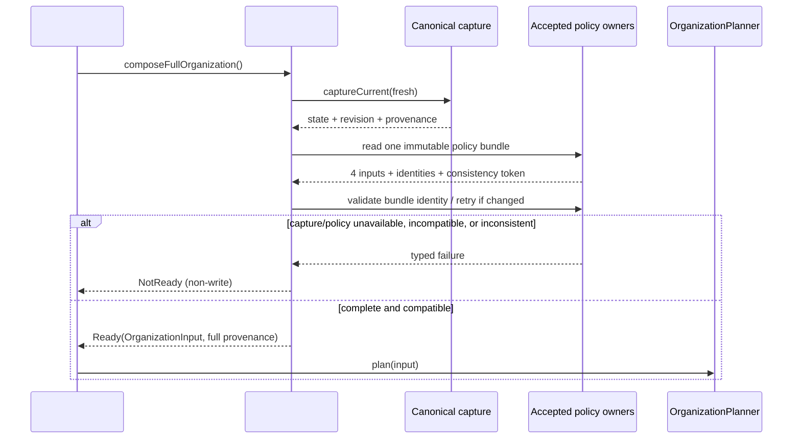

# Stage A Plan Review: Production OrganizationInput供給境界

> Issue: [#83](https://github.com/nunu1733/NunuLauncher/issues/83)
> Related spec: [spec.md](./spec.md)
> Status: **superseded — historical Stage A review record**
> Superseded by: [accepted spec.md](./spec.md), [proposed canonical plan.md](./plan.md), and [ADR-0007](../../docs/adr/0007-authoritative-organization-policy-sources.md)
> Review baseline: `main` observed 2026-08-19

> **Historical record:** Decision #86 was accepted and ADR-0007 merged on `main` after this review was written. The previous blockers are resolved in the accepted `spec.md`; the current approval gate is the review/acceptance of canonical `plan.md`. This document is retained only to preserve Stage A evidence and review history. It is not an implementation plan and must not override the current spec, plan, or ADR.[1] [3]

## Current evidence

### Confirmed facts

既存のapplication seamは、`LayoutWriterPort.captureCurrent`を通じて`LayoutState`、manifest、`RevisionId`、digestを含む`CapturedSnapshot`を返す。productionの`LauncherLayoutAdapter`は、desktop page、profile availability、device capabilities、row manifestをcaptureし、revisionを算出している。このため#83はUIが`favorites`を読む代わりに、このcaptureをread-onlyで消費できる。[4] [5]

canonical `LayoutState`はpage、profile、device capability、全itemを持ち、各itemにprofile、availability、placement、lock state、structureを含む。lock stateは`UNKNOWN`、`UNLOCKED`、`LOCKED`を区別し、ADR-0004はunknown/corrupt/unreadableをfail-closedにする。従って、#83が独自のsnapshotやlock readerを作る必要はない。[5] [6]

Planner側はすでに`OrganizationInput`と`RuleSemantics`、`TaxonomyContract`、`ClassificationSignals`、`TargetSet`を公開し、inputのcanonicalization・validation・`FullOrganization`の`additions`禁止を定めている。ただし、これらpolicy inputsのproduction sourceを提供するmoduleは現行Organizer配下に存在しない。[2] [7]

### Confirmed gaps

| Gap | Evidence | Consequence |
|---|---|---|
| Rule Management source | 設計書はRule Managementの責務を記すが、format/versioningはIssueで決めるとする | rule versionやmigrationをinventできない |
| Taxonomy owner | taxonomy v1は`Proposed`で、runtime `TaxonomyVersion` ownerがない | allowed categories/fallback/version bindingを固定できない |
| Signal owner | S1–S6のproposalはあるが、override persistence・S3/S4・read failureのaccepted contractがない | empty signal listを安全なsource欠落と区別できない |
| Target policy owner | item preservation policyは`Proposed`で、full-run membershipのaccepted ownerがない | complete target partitionを実装できない |
| Policy identity / consistency cut | 4 sourceのimmutable identity、content digest、atomic bundle/generation/fence/retryの正本がない | 同一versionでもcontent差替え、またはread中更新によるmixed snapshotを防げない |
| Existing Flowerpot | asset-based legacy runtime helperで、organizer型・profile/version互換性を所有しない | convenience defaultとして採用できない |

> **Review conclusion:** G1を満たさずにcomposerを実装すると、Issue #83の「一つのowner/source」「implicit fallback禁止」「missing/incompatible sourceはtyped non-write」という受入条件に違反する。[3] [8]

## Proposed architecture after G1–G3

### Modules and interfaces

| Area | 予定する責務 | 依存方向 | 禁止事項 |
|---|---|---|---|
| `organizer/application` | canonical capture、revision、transactional application/recoveryの既存owner | composerがread-onlyで依存 | UI or composerからraw DBへ到達させない |
| `organizer/rules` またはDecisionで選ばれたowner | rule/taxonomy/signal/override sourceをimmutable identity付きで読取・validateし、一貫したpolicy cutを提供する | composerがtyped portに依存 | plannerにfile/asset/Android型を漏らさない |
| `organizer/integration` | canonical captureとpolicy portを合成し、`OrganizationInputComposition`を返す | #52がplanner-input policyについてこのseamに依存 | second planner/snapshot/writerを作らない |
| `organizer/planning` | 既存`OrganizationPlanner.plan(OrganizationInput)` | composerが`Ready.input`を渡し、#52が既存planner seamをorchestrationする | public algorithm/typeを便利のため変更しない |
| Issue #52 UI/coordinator | `Ready`を既存plannerへ渡し、`NotReady`をsafe UI resultへ投影 | planner-input policyについてcomposerのみに依存。planner/application/diagnosticsは既存のaccepted seamを使用 | UI-local policy/DB/recovery store accessを追加しない |

Decisionを要するpolicy ownerの具体的なpackage/pathを先に固定しない。受諾したownerが既存Flowerpotにadapterを置くのか、organizer rules moduleを新設するのか、既存設定基盤を使うのかで、最小のproduction pathが変わるからである。この選択を#83のimplementationで暗黙に行うことはない。[1] [3]

### Target data flow

`NotReady`はplanner実行以前のfailureであり、Issue #10の`Rejected.Invalid`/`Rejected.Impossible`と混同しない。前者はinput sourceが安全に構成できないこと、後者は構成済みinputに対するplanner判定である。いずれも#52がapplication writeへ進むことを許可しない。[2] [7]

## Candidate implementation change set — **not authorized yet**

この表はG3でcanonical planに移す候補であり、現在の変更宣言ではない。Decisionの結果でpathは最小化する。

| Area | Intended change after acceptance | Why here | Precondition |
|---|---|---|---|
| `lawnchair/src/app/lawnchair/organizer/integration/`（new, exact path pending） | `OrganizationInputComposer`、capture→planner model mapper、typed readiness result | platform/application captureとpure plannerを接続する一箇所に閉じ込める | G1でpolicy ownerが決定済み |
| accepted policy-owner module | versioned rule/taxonomy/signal/target read portsとproduction adapter | policyの読み方・migration・compatibilityをownerに保つ | source format/metadata/rollbackが受諾済み |
| `lawnchair/.../organizer/application/` | 原則変更なし。必要ならcapture portをread-onlyで公開 | canonical captureを再利用する | duplicate capture sourceを回避できること |
| `tests/unit/.../organizer/integration/`（new） | composition contract fixtures/fakes | planner公開seamを通す同じ入力を検証する | readiness resultのstable codesが受諾済み |
| `tests/organizer-instrumentation/.../organizer/integration/`（new/targeted） | real adapter capture→composition evidence | page/profile/lock/device/availability mappingを確認する | production adapterが存在する |
| `specs/83-production-organization-input-sources/` | `spec.md` accepted、`plan.md` accepted、必要なtraceability | Issue acceptanceとPR evidenceの正本 | G1–G2完了 |
| `docs/adr/` | 条件を満たす場合のみDecision ADR | 高コスト・コードから不明・現実的選択肢がある判断を記録 | G1でADRが必要と判断 |

## Planned execution sequence after acceptance

1. **Freeze accepted owner contracts.** Decision Issue [#86](https://github.com/nunu1733/NunuLauncher/issues/86) を受諾し、rule、taxonomy、signal、target sourceに対するsingle owner、immutable identity/version or generation/content digest、atomic bundle/fence/retry、read error、migration/rollback、profile/availability semanticsを確定する。ここで`spec.md`のopen questionsをすべて閉じる。
2. **Create canonical plan.** `spec.md`を`accepted`へ更新後、リポジトリtemplateに沿った`plan.md`を作る。変更path、production/test adapters、migration、failure injection、high-risk evidenceをその時点のaccepted ownerに合わせて確定する。[1]
3. **Test first.** fake capture/policy ownersを使うcomposition unit/contract testsを追加する。`Ready`、source unavailable/unreadable/unsupported/incompatible/contradictory、policy read中のidentity/token変更、unknown lock、unrepresentable row、complete partition、profile/quiet/private/device/target membership、同一immutable policy bundleでのdeterministic equalityを先に失敗として表現する。
4. **Implement minimal composition.** existing canonical application captureをread-onlyで取得し、accepted policy portsを合成する。production mapperはAndroid/SQLite/UI typeをplanner surfaceへ漏らさない。
5. **Add real-adapter evidence.** real Launcher DB instrumentationでpage ordering、revision binding、profile/lock/availability、non-write failureを確認する。UI DB accessやsecond snapshot/writerが追加されていないことをshape/integration testで検証する。
6. **Verify and audit.** repository contract、format、focused organizer JVM tests、debug build、relevant instrumentation、CI `final-status`を実施する。`risk: layout-data`のPRでは別session/agentによるindependent auditを`docs/assessment/pr-<PR>-<slug>.md`に記録する。[9] [10]
7. **Handoff to #52.** exact composer API、version/failure semantics、accepted source owners、test commands/CI links、#52がresumption可能になる条件をIssue/PRへ記録する。

## Migration, recovery, and rollback

#83はlayout dataをmigrationしない。composerが`NotReady`を返す場合、Launcher DB、policy store、recovery storeに書込みを行わない。composerが`Ready`を返した後のplan application、checkpoint、transaction、rollback、recoveryは既存Issue #14 application seamの責務であり、#83がそのwriter/recovery implementationを複製しない。[4] [5]

policy sourceがmigrationを要する場合、G1で決めたownerがmigration version、downgrade/rollback、backup/restore behaviorを所有する。source migrationが完了しない、immutable identity/content digestを検証できない、bundle整合性を確立できない、または互換性を証明できない場合、composerは`NotReady(UnsupportedVersion | IncompatiblePolicyBundle | InconsistentPolicyRead)`を返す。旧versionを便利なdefaultで読み替えず、異なるpolicy cutを混在させない。

## Verification matrix

| Acceptance criterion | Automated / manual evidence | Command or environment after G3 |
|---|---|---|
| AC-1 owner/source/identity | 4 owner-port contract test、identity/content-digest provenance、Decision/spec traceability review | focused JVM test + spec review |
| AC-2 consistent policy cut | atomic bundle/shared fence又はread-after-validate-retry test。read中更新でretry/rejectしmixed snapshotを返さないこと | focused organizer JVM tests |
| AC-3 canonical capture reuse | composition integration test、static seam shape inspection | `./gradlew testLawnWithQuickstepGithubDebugUnitTest --tests 'app.lawnchair.organizer.*'` plus targeted instrumentation |
| AC-4 complete membership | fixture/property test: captured inventory partition、preserved occupancy | focused organizer JVM tests |
| AC-5 typed non-write | unavailable/read error/unsupported/contradictory/identity mismatch/consistency mismatch/unknown-lock fakes; planner/writer invocations = 0 | focused organizer JVM tests |
| AC-6 profile/lock/device | real-DB instrumentation: personal/work/private, quiet/unavailable, lock, grid/device context | targeted organizer instrumentation environment |
| AC-7 determinism | reordered equal captureと同一immutable bundle identity → equal result。同一version/generationでcontentが変化すればretry/reject | focused organizer JVM tests |
| AC-8 repository quality | format, contract, build, CI gate, independent audit | `./gradlew spotlessCheck`; `python3 tools/repo-contract/validate_repo_contract.py`; `python3 tools/repo-contract/test_validate_repo_contract.py`; `./gradlew assembleLawnWithQuickstepGithubDebug` |

実装PRがhigh-risk pathまたは`risk: layout-data`を含む場合、単にPR本文へ結果を記すだけでは不十分である。対象head SHA、spec/ADR受入条件、test surface、successful CI run linkを含む独立auditが必要であり、実装sessionとは別sessionで再実行・再確認する。[1] [9]

## Documentation updates after G3

| Document | Planned action | Condition |
|---|---|---|
| `specs/83-production-organization-input-sources/spec.md` | `proposed`から`accepted`、実装後は`implemented`へ更新 | Decision acceptance / completion |
| `specs/83-production-organization-input-sources/plan.md` | G2後に新規作成し、実際のmodule/port/test pathを確定 | spec accepted |
| `CONTEXT.md` | 原則変更なし | 新domain termが受諾された場合のみ |
| `DESIGN.md` | owner/module構造がproject-wide contractを追加する場合に更新 | Decisionがarchitecture boundaryを変える場合 |
| `docs/adr/` | 3条件を満たす選択だけを記録 | source format/ownerの選択が変更困難な場合 |
| `docs/assessment/pr-<PR>-<slug>.md` | independent auditを記録 | high-risk production PRの場合 |

## Owning Decision Issue — posted

レビューのstop conditionに従い、Decision Issue [#86: Define authoritative versioned policy sources for OrganizationInput](https://github.com/nunu1733/NunuLauncher/issues/86) を起票した。Issue #86は、4 policy inputそれぞれのsingle owner、immutable identity/version or generation/content digest、cross-source consistency方式、profile/availability/target membership、migration/rollback、read failureを受諾対象としている。

> **Exit criterion:** #86が`accepted`になり、#83のspecがopen questionなしで`accepted`になった後に限り、canonical `plan.md`を作成できる。#83はその時点まで`blocked`であり、production implementationを開始しない。

## Re-review request

前回レビューの5指摘に対応した。再レビューでは、特に以下を確認してほしい。

1. 4 policy inputすべてのimmutable identity/content digestと、同一整合断面を示すbundle identityがprovenance/readiness/test oracleへ反映されていること。
2. atomic policy bundle、shared generation/fence、read-after-validate-retryのいずれかをDecision #86で受諾し、mixed snapshotをfail-closedにする要件が十分であること。
3. #52の依存方向を「planner-input policyはcomposerのみから得る」と限定し、既存planner/application/diagnostics seamのorchestrationを妨げないこと。
4. actual stop actionとしてDecision Issue #86を起票済みであり、#83が`blocked`のままDecision → accepted spec → canonical `plan.md` → production implementationの順序を守ること。

## References

[1]: https://github.com/nunu1733/NunuLauncher/blob/main/AGENTS.md "AGENTS.md — Required spec/plan sequence"
[2]: https://github.com/nunu1733/NunuLauncher/blob/main/specs/10-pure-organization-planning/spec.md "Spec #10 — Planner input contract"
[3]: https://github.com/nunu1733/NunuLauncher/issues/83 "Issue #83 — Required decisions and stop condition"
[4]: https://github.com/nunu1733/NunuLauncher/blob/main/lawnchair/src/app/lawnchair/organizer/application/protocol/Ports.kt "Issue #14 application capture port"
[5]: https://github.com/nunu1733/NunuLauncher/blob/main/lawnchair/src/app/lawnchair/organizer/application/adapter/LauncherLayoutAdapter.kt "Production canonical capture adapter"
[6]: https://github.com/nunu1733/NunuLauncher/blob/main/docs/adr/0004-organizer-lock-persistence.md "ADR-0004 — Lock authority and fail-closed semantics"
[7]: https://github.com/nunu1733/NunuLauncher/blob/main/DESIGN.md "DESIGN.md — Rule management and ownership gaps"
[8]: https://github.com/nunu1733/NunuLauncher/blob/main/docs/product/category-taxonomy-v1.md "Category taxonomy v1 — Proposed status and open points"
[9]: https://github.com/nunu1733/NunuLauncher/blob/main/docs/engineering/quality-strategy.md "Quality strategy — Test and high-risk evidence requirements"
[10]: https://github.com/nunu1733/NunuLauncher/blob/main/docs/project/github-workflow.md "GitHub workflow — Independent evidence record"
