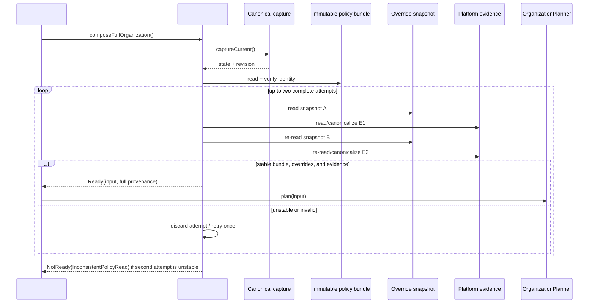

# Implementation Plan: Production OrganizationInput composition for manual Full Organization v1

> Issue: [#83](https://github.com/nunu1733/NunuLauncher/issues/83)
> Spec: [spec.md](./spec.md)
> Decision: [ADR-0007](../../docs/adr/0007-authoritative-organization-policy-sources.md)
> Status: **proposed — implementation is not authorized until this plan is reviewed and accepted**
> Baseline: `bc60ee52e28bb3cb92a649c459e94b009a0ed25b` (`main`, 2026-08-19)

## Current evidence

`OrganizationPlanner` already accepts a pure `OrganizationInput` containing `RuleSemantics`、`TaxonomyContract`、`ClassificationSignals`、`TargetSet`、`LayoutSnapshot`、device capabilities and `RunMode`; it deliberately owns neither policy I/O nor platform/DB access. The existing application boundary captures canonical layout state, revision, profiles, availability, lock state, device capability, and row manifest through `LayoutWriterPort.captureCurrent` / `LauncherLayoutAdapter`.[1] [2]

ADR-0007 is merged on `main` through PR #87 and resolves the policy-source Decision. For manual `FullOrganization` v1, Rule Management owns a single immutable built-in `OrganizerPolicyBundle` under `app.lawnchair.organizer.rules`; `ClassificationSignals` additionally materializes a profile-scoped Rule Management override snapshot and stable platform evidence. The #83 integration boundary is the adapter and is not a second policy owner.[3] [4]

The current source tree contains the planning and application modules but no production `organizer/rules` or `organizer/integration` implementation. Existing `Flowerpot` is explicitly excluded as a v1 source. Therefore the implementation must add the smallest typed Rule Management and integration seams without changing planner public types, UI code, Launcher DB writes, recovery logic, or Flowerpot.[3] [5]

| Confirmed current seam | Implementation consequence |
|---|---|
| `lawnchair/.../organizer/planning/OrganizationInput.kt` | Consume its existing public model; do not add provenance to planner types. |
| `lawnchair/.../organizer/application/protocol/Ports.kt` and `adapter/LauncherLayoutAdapter.kt` | Reuse the existing fresh canonical capture source; do not create a second snapshot/SQLite reader. |
| `lawnchair/.../organizer/locks/adapter/LockStateDbAdapter.kt` | Preserve the existing tri-state lock policy; `UNKNOWN` remains a fail-closed capture failure. |
| `lawnchair/.../flowerpot/` | Do not import or read it for S3; v1 S3/S4 tables are explicit immutable empty bundle content. |

## Design

### Modules and interfaces

The plan deliberately separates the **one policy authority** from the **one composition adapter**. Rule Management owns the immutable bundle and the app-private override snapshot. Integration reads those typed values plus the existing canonical capture and platform evidence, then emits either a fully formed planner input with provenance or a typed non-write result. The planner remains a pure consumer of the current `OrganizationInput` public contract.[1] [3]

| Module / path | New or changed responsibility | Public/internal seam | Complexity kept out of the caller and planner |
|---|---|---|---|
| `organizer/rules` | Declare and validate immutable `OrganizerPolicyBundle` v1; expose the active bundle read-only. | Internal `OrganizerPolicyBundleSource` | 34-category taxonomy, fixed rule semantics, S1–S6 policy order, explicit empty S3/S4 tables, version/binding/digest validation. |
| `organizer/rules` | Read the local-only profile-scoped `CategoryOverrideStore` snapshot and return typed identity/failure. | Internal `CategoryOverrideSnapshotSource` | Store format, schema/generation/digest, defined empty generation-0, corruption/unsupported failure, migration behavior. |
| `organizer/integration` | Capture and compose `OrganizationInput` for `FullOrganization`. | Internal `OrganizationInputComposer` → `OrganizationInputComposition` | Canonical mapping, policy bundle verification, dynamic-read stability, provenance, typed readiness and diagnostic redaction. |
| `organizer/integration` | Materialize platform classification evidence and full target membership. | Internal `ClassificationSignalSnapshotSource`, `FullTargetSetMaterializer` | Profile isolation, S2/S5 evidence semantics, S6 absence distinction, exactly-once target partition. |
| `organizer/planning` | No production-code change intended. | Existing `OrganizationPlanner.plan(OrganizationInput)` | Planner remains free of Android/platform/storage/provenance types. |
| `organizer/application` | No write/recovery behavior change intended. | Existing canonical capture port | Snapshot/revision/lock/profile authority remains application-owned. |

The concrete source names may be adjusted to follow local Kotlin naming conventions during implementation, but the ownership and dependency direction above are fixed. No UI or coordinator may construct rules, taxonomy, signals, targets, fallback values, or a policy identity directly.[3] [4]

### Data flow

1. `OrganizationInputComposer.composeFullOrganization()` obtains exactly one fresh canonical capture from the existing application read port. Any unrepresentable item, invalid structure, unavailable context, or `UNKNOWN` lock returns `NotReady` before policy materialization.
2. The composer reads and validates the immutable active `OrganizerPolicyBundle`. Its `PolicyBundleIdentity` carries source kind, `organization-policy-v1`, and SHA-256 digest. The direct rule and taxonomy projections must be exactly `RuleVersion("v1")` and `TaxonomyVersion("v1")` bound by the bundle.[3]
3. For one dynamic-read attempt, the composer reads override snapshot **A**, reads/canonicalizes all required S2/S5 platform evidence into digest **E1**, re-reads override snapshot **B**, then re-reads the same evidence into **E2**.
4. The attempt is stable only when `A.identity == B.identity`, `E1 == E2`, and the immutable bundle identity is unchanged. It then materializes `ClassificationSignals` and a complete `TargetSet`, attaching identities for rules, taxonomy, signals, targets, and the shared bundle/cut to `InputProvenance`.
5. If the dynamic cut changed, the composer discards the complete attempt and repeats the whole dynamic read once. A second unstable attempt returns `NotReady(InconsistentPolicyRead)`; it must not construct a mixed input, invoke the planner, create recovery state, or write Launcher data.
6. `FullTargetSetMaterializer` sets `additions` to an explicit empty list and partitions every captured item exactly once. Locked, unavailable/quiet/private, Dock, structural folder/app-pair members, widgets, app pairs, and legacy shortcuts are `Preserved`; only available, unlocked, top-level workspace `APPLICATION`、`DEEP_SHORTCUT`、`FOLDER` items are `Movable`. Invalid kinds/containers/references/context are `NotReady`, not implicit preservation.[3]

### Failure model

| Condition | Composer result | Explicitly prohibited follow-on action |
|---|---|---|
| Bundle missing/corrupt/digest mismatch, unsupported version, invalid rule/taxonomy binding | `NotReady(SourceUnavailable | SourceUnreadable | UnsupportedVersion | IncompatiblePolicyBundle)` | default bundle selection, empty rules/taxonomy, planner invocation |
| Override corruption/I/O/schema failure or unexpected platform read failure | `NotReady(SourceUnreadable)` | treating the failure as no S1/S2/S5 observation or falling through to S6 |
| Contradictory signal/category outside taxonomy, duplicate/incomplete target partition | `NotReady(ContradictorySource)` | partial input or silently omitted item |
| Dynamic consistency remains unstable after the single retry | `NotReady(InconsistentPolicyRead)` | mixed snapshot, planner, recovery point, writer, override mutation |
| Unknown lock or unrepresentable capture/profile/structure | `NotReady(InvalidCanonicalCapture)` | converting to unlocked, dropping item, or local policy fallback |

### Alternatives rejected

| Alternative | Reason rejected |
|---|---|
| Read Flowerpot as v1 S3 authority | Flowerpot lacks typed organizer taxonomy/version/profile/identity/failure/migration semantics and ADR-0007 expressly excludes it. |
| Persist four independently mutable policy files | The mutable-source and mixed-cut risk is unnecessary for the manual MVP; the accepted authority is one immutable built-in bundle. |
| Compare version strings after four independent reads | A version can be reused for changed content, and it cannot prove a stable dynamic read. The accepted design requires digest-backed identity and bounded validation. |
| Put provenance into `OrganizationInput` or planner public types | The pure planner contract must stay free of composition I/O/provenance concerns; provenance belongs to #83 readiness/composition. |
| Implement #52 UI/coordinator as part of #83 | #52 consumes this seam but retains its orchestration/UI responsibility; combining them violates the Issue boundary. |

## Change set

| Area | Intended change | Why here |
|---|---|---|
| `lawnchair/src/app/lawnchair/organizer/rules/OrganizerPolicyBundle.kt` and companion typed models | Add immutable v1 bundle, direct typed projections, category mapping, explicit S3/S4 empty tables, validation, and digest-backed identity. | ADR-0007 places policy authority in Rule Management. |
| `lawnchair/src/app/lawnchair/organizer/rules/OrganizerPolicyBundleSource.kt` | Add read-only active-bundle port plus production built-in source. | Allows composition/tests to use the same policy seam without exposing implementation details. |
| `lawnchair/src/app/lawnchair/organizer/rules/CategoryOverrideStore.kt` and `CategoryOverrideSnapshotSource.kt` | Add typed local-only read snapshot with schema v1, generation, digest, defined empty generation-0, redacted typed failures. | S1 is an accepted Rule Management source; the composer must not know its persistence format. |
| `lawnchair/src/app/lawnchair/organizer/rules/CategoryOverrideMigration.kt` | Add atomic forward migration guard and downgrade/unsupported-schema fail-closed behavior. | ADR-0007 requires migration safety without touching home-layout data. |
| `lawnchair/src/app/lawnchair/organizer/integration/OrganizationInputComposer.kt` and readiness/provenance models | Add the single production composition seam, canonical capture mapper, typed `Ready`/`NotReady`, and privacy-safe diagnostics parameters. | Connects application capture and Rule Management to the existing planner without new UI/DB access. |
| `lawnchair/src/app/lawnchair/organizer/integration/ClassificationSignalSnapshotSource.kt` | Add S2/S5 evidence reader/canonicalizer, profile isolation, `no observation` versus read-failure distinction, and bounded A/E1/B/E2 validation support. | Implements the accepted dynamic consistency protocol. |
| `lawnchair/src/app/lawnchair/organizer/integration/FullTargetSetMaterializer.kt` | Add the fixed v1 precedence table, explicit no additions, exact partition and canonical membership digest. | Enforces conservation and makes accepted target policy executable at one seam. |
| `tests/unit/app/lawnchair/organizer/rules/` | Add bundle, taxonomy, identity/digest, override snapshot, migration/downgrade, redaction, and contract fixtures. | Tests Rule Management through the same typed ports used in production. |
| `tests/unit/app/lawnchair/organizer/integration/` | Add composer, stability/retry, target partition, profile/lock/availability, no-write, deterministic-equivalence, and planner-seam tests. | Verifies all #83 behavior before any application or UI integration. |
| `tests/organizer-instrumentation/app/lawnchair/organizer/integration/` | Add targeted real-adapter capture/evidence tests, including work/quiet/private profiles and unavailable targets. | Confirms production mapping without leaking Android types to planning. |
| `specs/83-production-organization-input-sources/{spec.md,plan.md}` | Update status/history/traceability and record executed evidence after implementation. | Keeps Issue/spec/plan as the production work’s source of truth. |

No change is planned for `OrganizationInput`、`OrganizationPlanner`、`DeterministicOrganizationPlanner`、`LauncherLayoutAdapter` write paths、recovery storage、Flowerpot、#52 UI, or the Launcher DB schema unless an implementation-discovered contradiction requires a new documented decision.

## Migration and recovery

The built-in bundle is an immutable binary artifact. It has no in-place migration; rule/taxonomy/classification/target changes publish a new semantic version and SHA-256 digest. If the installed composer/planner does not support the active bundle, organization is unavailable and fail-closed rather than selecting an older policy.[3]

The v1 override store is app-private, local-only, and excluded from device/cloud backup. Its only supported migration is atomic forward migration: read old without mutation, validate/convert, atomically publish a new schema/generation/digest, and retain old data if conversion or publication fails. A downgrade never rewrites a newer store. An older binary that cannot read the schema returns a typed non-write result; normal Launcher behavior and current home layout remain unchanged.[3]

#83 itself does not write layout data, create a recovery point, or alter application rollback. Every `NotReady` path must be verified to leave the Launcher DB, application recovery store, and override store untouched. Layout application/recovery remains the existing Issue #14 responsibility.[2] [3]

## Verification

| Acceptance criterion | Automated/manual evidence | Command or environment |
|---|---|---|
| AC-1 — authority and identity | Unit/contract fixture proves the only active authority is `OrganizerPolicyBundle`; checks four input identities, bundle identity, `v1` bindings, 34 categories, fallback `OTHER`, and digest mismatch rejection. | Focused rules/composition JVM tests. |
| AC-2 — stable policy cut | Unit test drives A/E1/B/E2 equality, one whole-attempt retry, second-attempt `InconsistentPolicyRead`, and no mixed input. | Focused integration JVM tests with deterministic fake ports. |
| AC-3 — canonical capture reuse | Shape test confirms composer uses existing capture port and planner model only; targeted instrumentation maps page/device/profile/item/availability/lock without UI DB access. | Focused JVM tests and organizer instrumentation. |
| AC-4 — complete target membership | Property/fixture matrix verifies exactly-once partition, explicit empty additions, preservation precedence, folder/app-pair structure, widgets, Dock, legacy, work/quiet/private/unavailable cases. | Focused integration JVM tests. |
| AC-5 — fail closed/no write | Failure injection for bundle, override, platform evidence, identity/binding, target partition, unknown lock and unrepresentable capture; planner/writer/recovery/override mutation invocations remain zero. | Focused JVM tests plus production seam instrumentation. |
| AC-6 — profile and lock safety | Instrumented scenarios preserve profile identity and availability; locks or unavailable items are never made movable; `UNKNOWN` rejects. | Targeted organizer instrumentation. |
| AC-7 — determinism | Equal capture plus identical rule/taxonomy/signal/target/bundle identities produces value-equal result; changed digest or dynamic evidence retries/rejects. | Focused integration JVM tests. |
| AC-8 — repository quality | Formatting, repository-contract, focused unit tests, targeted instrumentation, and debug build recorded with exact outcomes. | `./gradlew spotlessCheck`; `python3 tools/repo-contract/validate_repo_contract.py`; `python3 tools/repo-contract/test_validate_repo_contract.py`; `./gradlew assembleLawnWithQuickstepGithubDebug` |

The implementation is read-only with respect to layout and recovery data. If the eventual PR is nevertheless labeled `risk: layout-data` or `risk: migration`, it must follow the high-risk gate: a successful `final-status` CI run and an independent audit at `docs/assessment/pr-<PR>-<slug>.md` with the tested head SHA and ADR/spec traceability.[6]

## Documentation updates

- [x] `spec.md` status/history updated to reflect ADR-0007 acceptance.
- [ ] `spec.md` updated to `implemented` only after all #83 acceptance criteria and evidence are complete.
- [x] `CONTEXT.md` unchanged; the accepted design uses existing domain language.
- [ ] `DESIGN.md` updated only if production interface structure differs materially from its accepted module boundaries.
- [x] ADR-0007 is the accepted high-cost decision; no new ADR is planned by this implementation.
- [ ] `AGENTS.md` unchanged unless a new verified mandatory command is discovered.
- [ ] `plan.md` updated with actual test commands/results and remaining risks in the implementation PR.

## Execution checklist

- [x] Current behavior and accepted policy Decision reviewed against `main` commit `bc60ee52e28bb3cb92a649c459e94b009a0ed25b`.
- [ ] This canonical plan is reviewed and accepted.
- [ ] Tests fail for the missing Rule Management/composition behavior.
- [ ] Minimal production implementation completed through the existing planner/application seams.
- [ ] Override migration/downgrade and all non-write failure paths verified.
- [ ] Full relevant verification completed.
- [ ] PR evidence, CI result, and any remaining risks recorded.

## References

[1]: https://github.com/nunu1733/NunuLauncher/blob/main/specs/10-pure-organization-planning/spec.md "Spec #10 — Pure planner contract"
[2]: https://github.com/nunu1733/NunuLauncher/blob/main/lawnchair/src/app/lawnchair/organizer/application/protocol/Ports.kt "Issue #14 application capture port"
[3]: https://github.com/nunu1733/NunuLauncher/blob/main/docs/adr/0007-authoritative-organization-policy-sources.md "ADR-0007 — Authoritative organization policy sources"
[4]: https://github.com/nunu1733/NunuLauncher/pull/87 "PR #87 — ADR-0007 implementation"
[5]: https://github.com/nunu1733/NunuLauncher/blob/main/lawnchair/src/app/lawnchair/flowerpot/Flowerpot.kt "Flowerpot — Excluded legacy source"
[6]: https://github.com/nunu1733/NunuLauncher/blob/main/AGENTS.md "AGENTS.md — High-risk gate and implementation order"
