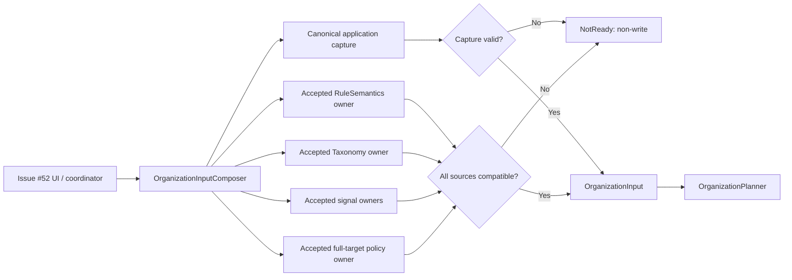

# 手動全体整理向けProduction OrganizationInput供給境界

> **Stage A判定:** `proposed / blocked`。本仕様は、Issue #83が要求するproduction input-composition境界を定義するためのレビュー稿である。既存の正本を調査した結果、`RuleSemantics`、`TaxonomyContract`、`ClassificationSignals`、および全体整理時の`TargetSet`について、受諾済みの単一production owner、immutable identity/version、cross-source consistency契約が揃っていない。そのため本稿は**実装着手を許可しない**。この未決定事項を解消するDecision Issue [#86](https://github.com/nunu1733/NunuLauncher/issues/86) を起票済みであり、その受諾後にここで定義する境界を`accepted`に変更する。[1] [2]

## Problem

Issue #52の手動全体整理は、既存の純粋な`OrganizationPlanner`へ、fresh canonical captureとversion付きの`RuleSemantics`、`TaxonomyContract`、`ClassificationSignals`、`TargetSet`を渡さなければならない。しかし、planner契約はこれらを**入力として消費する**だけであり、productionでの所有者、読み取り、互換性確認、失敗時の非書込み結果を定めない。[3] [4]

現在のapplication境界は、Launcher DBを権威として、revision、完全なlayout state、profile状態、device capability、row manifestを一つのcanonical captureとして取得できる。一方で、プロジェクト設計書は整理ルールとcategory overrideのownership/migrationを別途定義すると明記しており、Rule Managementは構想上のmoduleにとどまる。[5] [6]

この不足をUIやcoordinatorが補うと、UI-local policy、二つ目のsnapshot、暗黙のfallback、またはprofile/lockの不整合を生む。したがって、Issue #83はpolicyそのものを発明せず、受諾済みのpolicy sourceを検証してplanner入力に合成する唯一のproduction seamを提供しなければならない。[1] [2]

## Outcome

前提Decisionが受諾された後、手動全体整理の呼出側はUI DBへ直接アクセスせず、production composition seamにfresh canonical captureを要求する。その結果は、完全かつ互換な`OrganizationInput`を返す`Ready`、または原因を識別できるtyped non-write resultのいずれかである。`Ready`に含まれる`OrganizationInput`は、既存の`OrganizationPlanner`の公開型を変更せずに使用でき、入力のrevision、rule version、taxonomy version、target membership、profile/device/lock状態を同一captureに束縛する。[3] [5] [7]

> **安全原則:** 必須sourceが存在しない、読めない、unsupported、incompatible、または相互に矛盾する場合、composition seamはplannerを呼ばず、書込みを開始せず、空のrule・taxonomy・signal・target setを代入しない。これはplannerの「入力を勝手に補正しない」という契約およびlayout safety規約に従う。[2] [4]

## Scope

| 対象 | 本仕様で定義すること | 実装前提 |
|---|---|---|
| Canonical capture | 既存application captureからplanner用snapshotを組み立てる責務とprovenance | `LauncherLayoutAdapter`由来のcaptureを再利用すること |
| Policy composition | rule、taxonomy、classification signal、target membershipをowner portから取得し、互換性を検証する順序 | 各owner/sourceがDecisionで受諾されていること |
| Failure handoff | #52がUI-local fallbackなしで扱えるtyped non-write result | user-facing文言と診断情報を分離すること |
| Context safety | profile、quiet/private/unavailable、lock、device、page、revisionをcapture内で保存すること | current layoutの正本はLauncher DBのままとすること |
| Verification design | composition unit/contract/integrationのtest oracleと高リスク証拠 | spec受諾後にcanonical `plan.md`で実行順を確定すること |

## Non-goals

本Issueはplanner algorithm、planner公開型、layout application/recovery mutation、UI、onboarding、package-event incremental placementを変更しない。また、Launcher DBの`favorites`を直接書き込まず、recovery pointを作成せず、rule format、taxonomy内容、package/intent rule、override persistence、network/LLM/usage signalを新規に選定しない。[1] [3] [7]

既存Flowerpotは、asset rulesをUI/runtime app listへ適用するlegacy分類実装である。現状ではorganizerの`CategoryId`、`TaxonomyVersion`、`SignalSource`、profile単位のoverride、planner互換性を所有しないため、本仕様でauthoritative sourceとして採用しない。採用の可否はDecisionで明示的に決める。[7] [8]

## Domain language

新しいdomain語は追加しない。ここで使用する**composition**は、既存の`OrganizationInput`を構成するために、canonical captureとversion付きpolicy sourceを検証して束ねる内部責務を指す。承認時も`CONTEXT.md`の用語を変更する必要はない。

## Authority and owner matrix

次表は調査結果と、`accepted`にするために必要なownerを区別する。`confirmed`は既存の受諾済み契約またはproduction codeがあることを意味し、`proposed`および`unresolved`は実装の根拠にならない。

| Planner input / context | 現在確認できるsource | 現在の状態 | 受諾後に必要なproduction owner | Stage A判定 |
|---|---|---|---|---|
| `LayoutSnapshot`、revision、pages、device、items | Issue #14 application capture。`LayoutWriterPort.captureCurrent`と`LauncherLayoutAdapter` | **confirmed**。canonical `LayoutState`、manifest、revisionを一括取得する | application capture adapter。compositionはread-only consumer | 利用可能 |
| lock state | canonical itemの`OrganizerLockState`、ADR-0004の`favorites.organizerLockState` | **confirmed**。`UNKNOWN`/unreadableはfail-closed | application capture adapter。別のlock sourceを追加しない | 利用可能 |
| profile / item availability | canonical itemとprofile state | **confirmed**。profileはcapture時の値であり、availabilityを保持する | application capture adapter | 利用可能 |
| `RuleSemantics` | Rule Managementは設計上の責務のみ。file format/version ownerは正本なし | **unresolved** | accepted Rule Management owner、immutable identity（source/version or generation/content digest）、migration/read failure契約 | **Blocker** |
| `TaxonomyContract` | taxonomy v1文書は`Proposed`。versionのruntime ownerなし | **unresolved** | accepted taxonomy owner、immutable category集合、fallback、identity/version、ruleとのbinding | **Blocker** |
| `ClassificationSignals` | S1–S6はproposal。override persistence、S3/S4 source、profile lookupのproduction契約なし | **unresolved** | accepted signal-source owner群、profile scope、immutable identity/version、failure契約 | **Blocker** |
| `TargetSet` | #3の既存layout-only policyとmove/preserve表は`Proposed`。full-run membership owner未受諾 | **unresolved** | accepted membership policy owner、complete partition、immutable identity/version | **Blocker** |
| 4 policy inputの整合断面 | 個別sourceを読むatomicity/generation/fence/retryの正本なし | **unresolved** | atomic policy bundle、shared generation/fence token、またはread-after-validate-retryの受諾済み方式 | **Blocker** |

`LayoutSnapshot`等のconfirmed contextは、application/recoveryが既にcanonical stateを取得してrevisionへ束縛する設計と一致する。一方、`DESIGN.md`はrule/category overrideのownershipを未定義とし、taxonomy文書自体も`Proposed`である。この差異をimplementationで都合よく解釈してはならない。[5] [6] [7]

## Proposed composition contract

前提Decisionが受諾された後、`organizer/integration`内に次のinternal seamを置く。これはStage Aの設計契約であり、現時点で新規production APIを作成しない。

```kotlin
internal interface OrganizationInputComposer {
    fun composeFullOrganization(): OrganizationInputComposition
}

internal sealed interface OrganizationInputComposition {
    data class Ready(
        val input: OrganizationInput,
        val provenance: InputProvenance,
    ) : OrganizationInputComposition

    data class NotReady(
        val reason: InputReadinessReason,
        val diagnostic: CompositionDiagnostic,
    ) : OrganizationInputComposition
}

internal data class InputProvenance(
    val revision: RevisionId,
    val rules: PolicyInputIdentity,
    val taxonomy: PolicyInputIdentity,
    val signals: PolicyInputIdentity,
    val targets: PolicyInputIdentity,
    val policyBundle: PolicyBundleIdentity,
)

/** Proposed identity shape; the accepted owner defines its exact value objects. */
internal data class PolicyInputIdentity(
    val source: PolicySource,
    val semanticVersionOrGeneration: String,
    val contentDigest: String,
)

/** Proves that all four policy inputs came from one immutable consistency cut. */
internal data class PolicyBundleIdentity(
    val consistencyToken: String,
    val contentDigest: String,
)

internal sealed interface InputReadinessReason {
    data class SourceUnavailable(val source: PolicySource) : InputReadinessReason
    data class SourceUnreadable(val source: PolicySource) : InputReadinessReason
    data class UnsupportedVersion(val source: PolicySource, val actual: PolicyInputIdentity?) : InputReadinessReason
    data class IncompatiblePolicyBundle(
        val rules: PolicyInputIdentity,
        val taxonomy: PolicyInputIdentity,
        val signals: PolicyInputIdentity,
        val targets: PolicyInputIdentity,
        val policyBundle: PolicyBundleIdentity,
    ) : InputReadinessReason
    data class InconsistentPolicyRead(
        val expected: PolicyBundleIdentity,
        val observed: PolicyBundleIdentity,
    ) : InputReadinessReason
    data class ContradictorySource(val source: PolicySource) : InputReadinessReason
    data class InvalidCanonicalCapture(val category: CaptureFailureCategory) : InputReadinessReason
}
```

型名は実装時に既存命名との整合を確認するが、次の性質は固定する。`Ready`だけがplanner呼出しを許可し、`NotReady`は**non-write**である。`InputProvenance`はrule、taxonomy、signals、targetsの**全4入力**についてimmutable identityと、同一整合断面を示すbundle identityを保持する。identityは同じversion/generationが異なるcontentを指すことを許さず、content digestを含む。`NotReady`の診断は安定したcodeとopaque parameterだけを保持し、#52はこのresultからuser-facing reasonを組み立てる。journalやraw DB/model typeをUI reasonのsourceにしてはならない。[1] [3] [9]

### Required ports and dependency direction

CompositionはUIからDBへ到達してはならない。UI/coordinatorは`OrganizationInputComposer`だけに依存し、composerは以下のread-only portを通じて情報を得る。platform/DB typeはportの内部に閉じ込め、plannerには既存のdomain型だけを渡す。[3] [5]

| Port responsibility | Input / output | Required guarantee |
|---|---|---|
| `CanonicalCapturePort` | fresh capture → canonical state + revision | 同一capture内のpage、device、profile、item、lock、availabilityを返す。DB/UI型を公開しない |
| `RuleSemanticsSource` | accepted rule contract → `RuleSemantics` + compatibility metadata | sourceのabsence/read error/version incompatibilityを値で返す。default ruleを生成しない |
| `TaxonomySource` | accepted taxonomy contract → `TaxonomyContract` + compatibility metadata | category集合・fallback・versionをimmutableに供給する。rule versionから推測しない |
| `ClassificationSignalSource` | capture context + accepted policy → `ClassificationSignals` | profile scopeを保持し、未利用sourceを捏造しない。signalなしはplannerのS6規則に委ねる |
| `FullTargetSetSource` | canonical captured inventory + accepted policy → complete `TargetSet` | 全captured itemを一度だけpartitionし、out-of-scope itemを削除・脱落させない |

`ClassificationSignals`にentryがないことは、受諾済みのtaxonomy/ruleが存在する場合にはplannerのS6 fallbackとして扱える。しかし、taxonomyまたはsignal sourceそのものがunavailableであることは、空集合を渡す根拠にならない。この区別をcomposition層で強制する。[3] [4]

## Data flow and safety conditions

1. Composerはapplication capture portからfresh canonical captureを一度だけ取得する。captureが失敗、構造不正、lock `UNKNOWN`、profile/contextが読めない場合は`NotReady`を返す。
2. Composerはaccepted ownerが定義した**一つの整合断面**からrule、taxonomy、signal、target policyを読む。各入力はsource、immutable version/generation、content digestを返し、4入力は共通のbundle consistency tokenを共有する。
3. Composerはread後にbundle identityを再検証する。ownerがatomic policy bundleを提供しない場合は、accepted Decisionで定めるread-after-validate-retryを実行する。bounded retry後もtoken/digestが変化する場合は`NotReady(InconsistentPolicyRead)`を返し、mixed snapshotを使用しない。
4. Composerはrule/taxonomy/signal/target policyのbindingを検証する。sourceのread failure、unsupported version、互換性不一致、矛盾、または未定義のownershipを検出したら`NotReady`を返す。
5. Composerはcaptureを`LayoutSnapshot`へlosslessに射影し、full-run `TargetSet`でcapture内の全itemを完全partitionする。captured itemがtarget集合から抜けることは不正である。
6. Composerは`OrganizationInput(..., runMode = FullOrganization)`を構成して`Ready`を返す。planner呼出し後、#52はechoされたrevisionをapplication apply seamへ渡し、適用側が再検証する。



### Capture mapping requirements

| Canonical capture field | Planner projection | Required behavior |
|---|---|---|
| revision | `LayoutSnapshot.revision` | planner結果へechoされる。stalenessはplanner外で比較する |
| persistent pages | `Page(id, order)` | committed desktop row由来の安定順序。UI-only pageを補完しない |
| device capabilities | planner `DeviceCapabilities` | capture後に変化した場合、apply前にstaleとして再captureする |
| item identity / profile / target / placement / structure | `CapturedItem` | raw rowをplanner public surfaceに漏らさず、全rowを表現またはfail-closedする |
| item/profile availability | `Availability` | quiet/private/unavailableをavailable扱いに変換しない |
| lock state | `CapturedItem.locked` | `LOCKED`だけをtrueへ写像する。`UNKNOWN`はunlockedに丸めず`NotReady` |

canonical captureが`favorites`を現在layoutの正本として扱い、row、profile、device、lockをrevisionに含める既存契約は再利用する。layout application/recoveryのcaptureを二重化せず、UI DB accessも追加しない。[5] [6] [10]

### Target membership requirements

full organizationでは、target policyはcapture済みhome-layout itemだけを対象にするか、別のaccepted policyにより明示されなければならない。いずれの場合も`TargetSet.existing`は全captured itemをちょうど一度だけ`Movable`または`Preserved`に分類する。`Preserved`は削除や無視を意味せず、occupied-spaceとconservationのconstraintである。[3] [4] [11]

profile、quiet mode、private space、disabled/unavailable target、lock、widget、Dock、app pair、legacy shortcut、structurally opaque itemの扱いは、既存のaccepted policyとplanner validationに従う。compositionは分類結果を便利なdefaultで置換してはならない。特に、private/quiet profileを対象から脱落させたり、unknown lockを`false`として扱ったりしてはならない。[4] [10] [11]

## Behavior scenarios

### Scenario: 完全かつ互換なsourceから全体整理入力を構成する

**Given** fresh canonical capture、accepted rule/taxonomy/signal/target policyが同じsupported bindingで読める。
**When** #52が`composeFullOrganization()`を呼ぶ。
**Then** `Ready`は`FullOrganization`の`OrganizationInput`を一つ返す。
**And** inputはcapture revision、device、page、profile、lock、availability、全item、rule version、taxonomy versionを保持する。
**And** plannerは同じpublic seamで呼ばれ、UIはDBへ直接アクセスしない。

### Scenario: ruleまたはtaxonomy sourceが欠落・未読・unsupportedである

**Given** mandatory rule/taxonomy sourceが存在しない、読み取れない、またはsupported version外である。
**When** composerがinputを構成する。
**Then** `NotReady(SourceUnavailable | SourceUnreadable | UnsupportedVersion)`を返す。
**And** planner、application write、recovery point作成は実行されない。
**And** empty rule、empty taxonomy、推測したversionを代入しない。

### Scenario: canonical captureがunknown lockまたは表現不能なitemを含む

**Given** canonical captureが`UNKNOWN` lock state、unknown item kind、欠損profile、または構造不正を示す。
**When** composerがsnapshotを射影する。
**Then** `NotReady(InvalidCanonicalCapture(...))`を返す。
**And** lockをunlockedへ丸めず、itemをtarget集合から落とさず、永続変更を行わない。

### Scenario: quiet/private/unavailable itemを含む

**Given** captured itemまたはprofileがquiet/private/unavailableであり、placementと参照は構造的に有効である。
**When** accepted target policyがinputを構成する。
**Then** itemのprofile identityとavailabilityを保持する。
**And** accepted preservation policyが`Preserved`を要求する場合、itemはoccupancy constraintとして`TargetSet`に残る。
**And** profile間でtargetまたはsignalを混同しない。

### Scenario: policy source間のbindingが矛盾する

**Given** taxonomyがruleが要求するcategoryを含まない、またはsignal ownerのmetadataがrule/taxonomy bindingと矛盾する。
**When** composerが互換性を検証する。
**Then** `NotReady(IncompatiblePolicyBundle | ContradictorySource)`を返す。
**And** 4入力のidentityとbundle identityを診断可能なprovenanceとして残し、plannerにpartial inputを渡さず、writerを開始しない。

### Scenario: policy sourceが読み取り途中に更新される

**Given** composerがrule/taxonomy/signals/targetsを読む間にpolicy bundleのgenerationまたはcontent digestが変化する。
**When** composerがcross-source consistencyを再検証する。
**Then** accepted owner contractに従って一貫したbundleを再読する、または`NotReady(InconsistentPolicyRead)`を返す。
**And** 異なるbundleから得たinputを混在させず、planner、writer、recovery point作成を開始しない。

## Data and state

Composerはread-onlyであり、Planner inputまたはpolicy dataを永続化しない。current home layout、lock state、revisionの正本は既存どおりLauncher DBであり、recovery storageはIssue #14のapplication moduleが所有する。Composerはcaptureのrevisionをprovenanceとして保持するが、別snapshot、別cache、別DB、または別recovery recordを正本にしない。[5] [6] [10]

ルール、taxonomy、override、package/intent ruleの永続化・migration・backup/restoreは、前提Decisionで決めるownerが所有する。本Issueのacceptance後にそのownerがread-only portを公開するまで、composerはsourceを仮実装しない。profile serialのrestore remappingはorganization run外の既存責務であり、composerはcapture済み`ProfileId`を再割当しない。[5] [7] [11]

## Permissions, privacy, and security

**None（Stage A）。** 本仕様はpermission、network、telemetry、外部分類、usage data collectionを追加しない。production実装もaccepted sourceがlocal-onlyであることを前提とし、raw package name、profile serial、row IDをuser-facing messageへ露出しない。診断は既存のprivacy-safe diagnostics契約に従う。[7] [9]

## Accessibility and localization

Composer自体はUIを持たない。#52は`NotReady`を利用して、ユーザーが理解可能なsafe failure/retry guidanceを表示し、developer diagnosticと分離する。reason codeからの文字列化、TalkBack、focus、font scaling、translationは#52のUI specが所有する。Composerはlocalized textを返さない。[1] [9]

## Acceptance criteria

- [ ] **AC-1 — authoritative ownership and identity:** accepted spec/planが`RuleSemantics`、`TaxonomyContract`、`ClassificationSignals`、full-run `TargetSet`の各々について、一つのproduction owner/source、immutable identity（source/version or generation/content digest）、compatibility rule、read failureを明記する。
- [ ] **AC-2 — consistent policy cut:** accepted owner contractが4 policy inputを読むatomic policy bundle、shared generation/fence token、又はread-after-validate-retryを定義する。composerはmixed snapshotを`Ready`にできない。
- [ ] **AC-3 — one canonical capture:** accepted implementationは既存application capture seamからfresh inputを構成し、UI DB access、second planner、second snapshot sourceを持たない。
- [ ] **AC-4 — complete conservation input:** full-run target membershipは全captured itemを一度だけpartitionし、out-of-scope/quiet/private/unavailable/locked itemを無説明に脱落させない。
- [ ] **AC-5 — fail closed:** mandatory policy/capture sourceのmissing、unreadable、unsupported、incompatible、contradictory、policy read中のconsistency mismatch、unknown lock、unrepresentable itemはtyped non-write resultとなり、planner/write/recovery pointを開始しない。
- [ ] **AC-6 — profile and lock safety:** profile identity、availability、device context、lockをcanonical captureから保持し、unknown lockやunavailable profileをimplicit defaultに変換しない。
- [ ] **AC-7 — deterministic composition:** value-equivalent captureと**同一immutable policy bundle identity**はvalue-equivalent `OrganizationInput`又は同じtyped rejectionを返す。同一version/generationが異なるcontentを指してはならない。
- [ ] **AC-8 — evidence:** focused unit/contract/integration tests、repository-contract、format、relevant organizer unit tests、debug buildの結果を記録する。layout-dataリスクのPRではindependent auditとsuccessful CI merge gateを揃える。[2] [12]

## Test oracle

| AC | 実装後のevidence |
|---|---|
| AC-1 | 4 ownerのcontract test。各source identity（source/version or generation/content digest）をprovenance/diagnosticから追跡できること、およびaccepted Decision/ADR/specリンク |
| AC-2 | atomic bundle/shared fence又はread-after-validate-retryのcontract test。read中のgeneration/digest変更ではretry又は`InconsistentPolicyRead`となり、mixed inputを返さないこと |
| AC-3 | production adapter instrumentationで`captureCurrent`経由のfresh captureを確認。UI/SQLite型がcomposer public surfaceにない静的shape test |
| AC-4 | target partition fixture: normal、Dock、widget、folder、app pair、legacy、lock、quiet/private/unavailable、same package across profiles |
| AC-5 | source failure/identity mismatch matrix unit test。各`NotReady`でplanner/writer invocation countが0であること |
| AC-6 | canonical capture→planner input mapping testとreal DB instrumentation。unknown lock/read failureはno-write |
| AC-7 | reordered equal fixtureと**同一immutable bundle identity**のrepeat composeがvalue-equalであること。同一version/generationでcontentが変化するfixtureはreject/retryとなること |
| AC-8 | `spotlessCheck`、organizer JVM tests、debug build、repository-contract、CI `final-status`、independent audit record |

## Open questions / blocking decision

以下は`accepted`時点で空でなければならないblocking questionである。どれかを実装中に決めてはならない。

| ID | 未決定事項 | なぜIssue #83で選べないか | 必要なDecision output |
|---|---|---|---|
| D-83-01 | Rule Managementのproduction owner、file/asset source、supported `RuleVersion`、migrationとread failure | 設計書は責務だけを示し、format/versioningは正本なし | owner module、source format/identity、version compatibility、migration/rollback、offline/privacy |
| D-83-02 | Taxonomy v1のaccepted status、`TaxonomyVersion`のowner、ruleとのbinding | taxonomy文書は`Proposed`で、runtime ownerがない | immutable category contract、version、binding rule、unsupported behavior |
| D-83-03 | S1–S5 signalのowner、override persistence、S3/S4 source、profile lookup/read failure | taxonomy文書はproposalであり、Flowerpotはtyped organizer sourceではない | source precedence、profile isolation、availability、diagnostic/redaction、immutable identity/version binding |
| D-83-04 | full organizationの`TargetSet` membership owner | #3のfull-layout-only/move-preserve policyはproposalで、未受諾 | complete partition table、out-of-scope preservation、unknown/invalid handling、lock/availability precedence、immutable identity |
| D-83-05 | 4 policy inputを読む同一整合断面 | source間のatomicity、generation/fence、read中更新時の扱いが未定義 | atomic policy bundle、shared consistency token、又はread-after-validate-retry、bounded retry/reject semantics |

**Required stop action:** このレビューで上記が未解消であることを確認したため、Issue #83のproduction implementationは開始しない。stop conditionに従い、owner Decision Issue [#86](https://github.com/nunu1733/NunuLauncher/issues/86) を起票済みである。当該Decisionが`accepted`になるまで#83を`status: blocked`として維持し、その後にspecを`accepted`化してから正本`plan.md`を作成する。[1] [2] [13]

## Change history

- 2026-08-19: Issue #83のStage Aレビュー用`proposed`仕様を作成。既存application captureは再利用可能だが、policy source ownership/versioningが未受諾であるためproduction implementationをblockした。
- 2026-08-19: レビュー指摘を反映。4 policy inputのimmutable identity/content digest、cross-source consistency cut、read中更新時のretry/reject、deterministic test oracleを追加し、owning Decision Issue #86を起票した。

## References

[1]: https://github.com/nunu1733/NunuLauncher/issues/83 "Issue #83 — Establish production OrganizationInput sources"
[2]: https://github.com/nunu1733/NunuLauncher/blob/main/AGENTS.md "AGENTS.md — Issue/spec driven workflow and layout safety"
[3]: https://github.com/nunu1733/NunuLauncher/blob/main/specs/10-pure-organization-planning/spec.md "Spec #10 — Pure organization planning interface"
[4]: https://github.com/nunu1733/NunuLauncher/blob/main/specs/12-deterministic-full-layout-planner-v1/spec.md "Spec #12 — Deterministic full layout planner v1"
[5]: https://github.com/nunu1733/NunuLauncher/blob/main/DESIGN.md "DESIGN.md — Module boundaries and data ownership"
[6]: https://github.com/nunu1733/NunuLauncher/blob/main/lawnchair/src/app/lawnchair/organizer/application/adapter/LauncherLayoutAdapter.kt "LauncherLayoutAdapter — Canonical production capture"
[7]: https://github.com/nunu1733/NunuLauncher/blob/main/docs/product/category-taxonomy-v1.md "Category Taxonomy v1 — Proposed product research"
[8]: https://github.com/nunu1733/NunuLauncher/blob/main/lawnchair/src/app/lawnchair/flowerpot/Flowerpot.kt "Flowerpot — Existing legacy asset categorization"
[9]: https://github.com/nunu1733/NunuLauncher/blob/main/docs/engineering/organizer-diagnostics.md "Organizer diagnostics contract"
[10]: https://github.com/nunu1733/NunuLauncher/blob/main/docs/adr/0004-organizer-lock-persistence.md "ADR-0004 — Organizer lock persistence"
[11]: https://github.com/nunu1733/NunuLauncher/blob/main/docs/product/item-preservation-policy.md "Item preservation policy — Proposed research"
[12]: https://github.com/nunu1733/NunuLauncher/blob/main/docs/engineering/quality-strategy.md "Quality strategy — High-risk independent evidence"
[13]: https://github.com/nunu1733/NunuLauncher/issues/86 "Issue #86 — Authoritative versioned policy sources decision"
